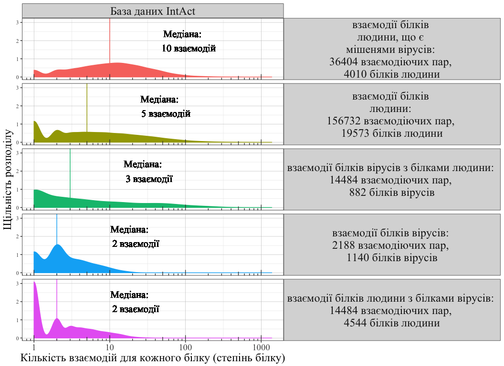
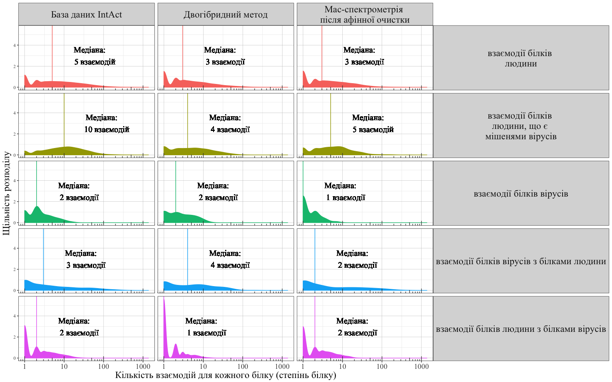
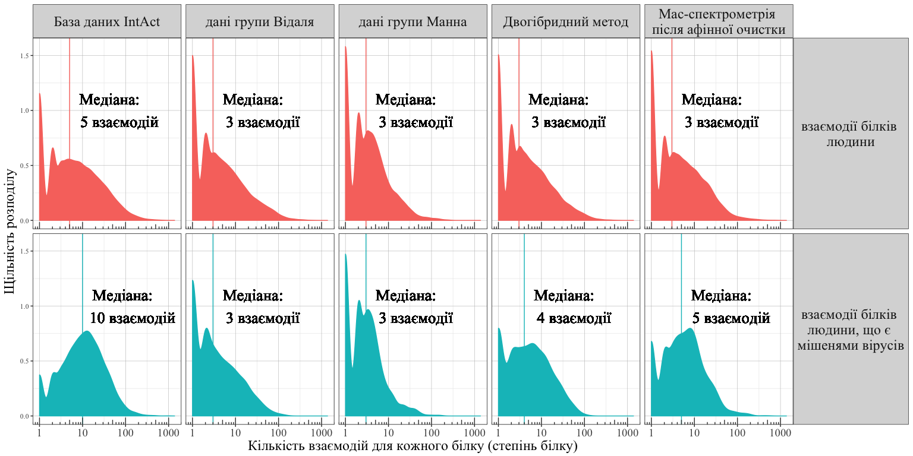
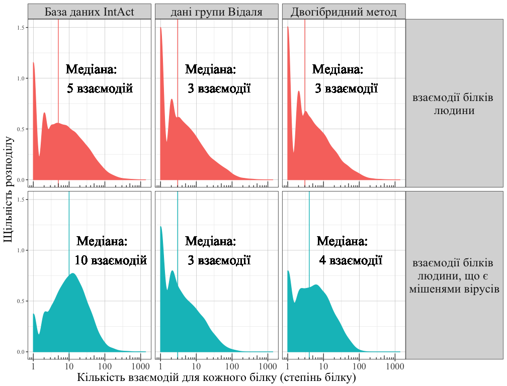
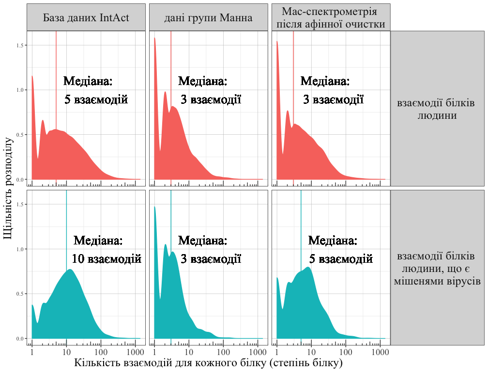

### Load PPI data and show degree distribution


```r
# Load data.
RData_file = paste0("./data_files/HumanViralPPI", "2017Nov13", ".RData")
if(file.exists(RData_file)) load(RData_file) else {
    HumanViralPPI = loadHumanViralPPI(directory = "./data_files/",
                                  loadIntActFTP_dir = "./data_files/IntActRelease_2017Nov13/",
                                  release = "2017Nov13")
    save(HumanViralPPI, file = RData_file)
}

plotHumanViralDegree = function(degree_distributions, y_text = 2, median_text_size = 5.5, flip_grid = F, theme_std = theme_light, family_std = "Times New Roman"){
    plot = ggplot(degree_distributions, aes(x = N, fill = legend, color = legend)) + geom_density() 
    if(flip_grid) plot = plot + facet_grid(data_name ~ legend) else plot = plot + facet_grid(legend ~ data_name) 
    plot = plot + theme_std() +
        theme(strip.text.y = element_text(size = 18,angle = 0,family=family_std),
              strip.text.x = element_text(size = 18,angle = 0,family=family_std),
              plot.title=element_text(family=family_std),
              panel.grid.major =  element_line(color = 'grey', size = 0.2, linetype = 'solid'),
              panel.background = element_rect(fill = '#FFFFFF', colour = 'grey'),
              legend.position = "none",
              axis.title = element_text(size = 18, family=family_std),
              axis.text.x = element_text(size = 14, family=family_std),
              axis.text.y = element_text(family=family_std)) +
        scale_x_log10(breaks = c(1, 10, 100, 1000),
                      labels = c(1, 10, 100, 1000)) +
        xlab("Кількість взаємодій для кожного білку (степінь білку)") + ylab("Щільність розподілу")+
        geom_vline(aes(xintercept = medianN, color = legend)) + 
        geom_text(aes(x = medianN*9.5,label = medianN_lab, y = y_text), color = "black", size = median_text_size, family=family_std)+
        annotation_logticks(sides = "b", color = "#444444", family=family_std)
    plot
}

degree_distributions_all = humanViralDegree(data = HumanViralPPI,
  directory = "./data_files/", data_name = "Full IntAct")
```

```
## loading local copy of MI ontology
## loading local copy of MI ontology
## loading local copy of MI ontology
```

```r
# translate to Ukraininan
toUkrainian = function(degree_distributions) {
    degree_distributions = copy(degree_distributions)
    # legend
    degree_distributions[,legend := gsub("full human-human", "взаємодії білків \nлюдини", legend)]
    degree_distributions[,legend := gsub("viral-viral \\(human host\\)", "взаємодії білків вірусів", legend)]
    degree_distributions[,legend := gsub("viral-human", "взаємодії білків вірусів з білками людини", legend)]
    degree_distributions[,legend := gsub("human-viral", "взаємодії білків людини з білками вірусів", legend)]
    degree_distributions[,legend := gsub("viral-interacting proteins, human-human", "взаємодії білків \nлюдини, що є \nмішенями вірусів", legend)]
    degree_distributions[,legend := gsub("viral-interacting proteins,\\\nhuman-human", "взаємодії білків \nлюдини, що є \nмішенями вірусів", legend)]
    degree_distributions[,legend := gsub("interacting pairs", "взаємодіючих пар", legend)]
    degree_distributions[,legend := gsub("human proteins", "білків людини", legend)]
    degree_distributions[,legend := gsub("viral proteins", "білків вірусів", legend)]
    # data_name Full IntAct
    degree_distributions[,data_name := gsub("Full IntAct", "База даних IntAct", data_name)]
    degree_distributions[,data_name := gsub("two-hybrid data", "Двогібридний метод", data_name)]
    degree_distributions[,data_name := gsub("AP-MS data", "Мас-спектрометрія \nпісля афінної очистки", data_name)]
    degree_distributions[,data_name := gsub("Vidal's data \\nincluding unpublished", "дані групи Відаля", data_name)]
    degree_distributions[,data_name := gsub("Mann's \\n2015 paper", "дані групи Манна", data_name)]
    # medianN_lab median + interacting partners
    degree_distributions[medianN > 4, medianN_lab := gsub("interacting partners", "взаємодій", medianN_lab)]
    degree_distributions[medianN <= 4, medianN_lab := gsub("interacting partners", "взаємодії", medianN_lab)]
    degree_distributions[,medianN_lab := gsub("median", "Медіана", medianN_lab)]
    degree_distributions
}
plotHumanViralDegree(toUkrainian(degree_distributions_all), theme_std = theme_bw)
```

```
## Warning: Ignoring unknown parameters: family
```

<!-- -->

#### Degree distribution based on all data, two-hybrid or affinity purification - mass spectrometry


```r
degree_distributions_two = humanViralDegree(data = HumanViralPPI,
  directory = "./data_files/", Interaction_detection_methods = "MI:0018",
  data_name = "two-hybrid data")
```

```
## loading local copy of MI ontology
## loading local copy of MI ontology
## loading local copy of MI ontology
```

```r
#plotHumanViralDegree(toUkrainian(degree_distributions_two), theme_std = theme_bw)
degree_distributionsAPMS = humanViralDegree(data = HumanViralPPI,
  directory = "./data_files/", Interaction_detection_methods = "MI:0004",
  Identification_method = "MI:0433", PMIDs = NULL, inverse_filter = F,
  data_name = "AP-MS data")
```

```
## loading local copy of MI ontology
## loading local copy of MI ontology
## loading local copy of MI ontology
```

```r
#plotHumanViralDegree(toUkrainian(degree_distributionsAPMS), theme_std = theme_bw)
degree_distributions = rbind(degree_distributions_all,degree_distributions_two,degree_distributionsAPMS)
degree_distributions[, legend := gsub(":.+$","",legend)]

plotHumanViralDegree(toUkrainian(degree_distributions), y_text = 3, theme_std = theme_bw)
```

```
## Warning: Ignoring unknown parameters: family
```

<!-- -->

#### Degree distribution within human network based on specific datasets (Vidal's and Mann's)


```r
degree_distributionsVidal = humanViralDegree(data = HumanViralPPI,
  directory = "./data_files/", PMIDs = c("25416956", "unassigned1304"),
  data_name = "Vidal's data \nincluding unpublished")
```

```
## loading local copy of MI ontology
## loading local copy of MI ontology
## loading local copy of MI ontology
```

```r
#plotHumanViralDegree(toUkrainian(degree_distributionsVidal), theme_std = theme_bw)

degree_distributionsMann = humanViralDegree(data = HumanViralPPI,
  directory = "./data_files/", PMIDs = "26496610",
  data_name = "Mann's \n2015 paper")
```

```
## loading local copy of MI ontology
## loading local copy of MI ontology
## loading local copy of MI ontology
```

```r
#plotHumanViralDegree(toUkrainian(degree_distributionsMann), theme_std = theme_bw)
```


```r
degree_distributions = rbind(degree_distributions,degree_distributionsVidal,degree_distributionsMann)
degree_distributions[, legend := gsub(":.+$","",legend)]
degree_distributions = degree_distributions[legend %in% c("full human-human", "viral-interacting proteins, human-human"),]
#degree_distributions[legend == "viral-interacting proteins, human-human",
#                     legend := "viral-interacting proteins,\nhuman-human"]
plotHumanViralDegree(toUkrainian(degree_distributions), y_text = 1, median_text_size = 7, theme_std = theme_bw)
```

```
## Warning: Ignoring unknown parameters: family
```

<!-- -->


```r
two_h = degree_distributions[data_name %in% c("Full IntAct","two-hybrid data", "Vidal's data \nincluding unpublished")]
two_h[, data_name := factor(data_name, levels = c("Full IntAct","two-hybrid data", "Vidal's data \nincluding unpublished", ordered = T))]
plotHumanViralDegree(toUkrainian(two_h),
                     y_text = 1, median_text_size = 7, theme_std = theme_bw)
```

```
## Warning: Ignoring unknown parameters: family
```

<!-- -->


```r
ap_ms = degree_distributions[data_name %in% c("Full IntAct", "AP-MS data", "Mann's \n2015 paper")]
ap_ms[, data_name := factor(data_name, levels = c("Full IntAct", "AP-MS data", "Mann's \n2015 paper"), ordered = T)]
plotHumanViralDegree(toUkrainian(ap_ms),
                     y_text = 1, median_text_size = 7, theme_std = theme_bw)
```

```
## Warning: Ignoring unknown parameters: family
```

<!-- -->


```r
Sys.Date. = Sys.Date()
Sys.Date.
```

```
## [1] "2018-06-03"
```

```r
session_info. = devtools::session_info()
session_info.
```

```
## Session info -------------------------------------------------------------
```

```
##  setting  value                       
##  version  R version 3.4.3 (2017-11-30)
##  system   x86_64, darwin15.6.0        
##  ui       X11                         
##  language (EN)                        
##  collate  en_GB.UTF-8                 
##  tz       Europe/Kiev                 
##  date     2018-06-03
```

```
## Packages -----------------------------------------------------------------
```

```
##  package              * version   date       source                  
##  AnnotationDbi          1.40.0    2017-10-31 Bioconductor            
##  assertthat             0.2.0     2017-04-11 CRAN (R 3.4.0)          
##  backports              1.1.2     2017-12-13 CRAN (R 3.4.3)          
##  base                 * 3.4.3     2017-12-07 local                   
##  Biobase                2.38.0    2017-10-31 Bioconductor            
##  BiocGenerics         * 0.24.0    2017-10-31 Bioconductor            
##  BiocParallel           1.12.0    2017-10-31 Bioconductor            
##  biomaRt              * 2.34.2    2018-01-20 Bioconductor            
##  Biostrings           * 2.46.0    2017-10-31 Bioconductor            
##  bit                    1.1-12    2014-04-09 CRAN (R 3.4.0)          
##  bit64                  0.9-7     2017-05-08 CRAN (R 3.4.0)          
##  bitops                 1.0-6     2013-08-17 CRAN (R 3.4.0)          
##  blob                   1.1.1     2018-03-25 CRAN (R 3.4.3)          
##  caTools                1.17.1    2014-09-10 CRAN (R 3.4.0)          
##  colorspace             1.3-2     2016-12-14 CRAN (R 3.4.0)          
##  compiler               3.4.3     2017-12-07 local                   
##  curl                   3.1       2017-12-12 CRAN (R 3.4.3)          
##  data.table           * 1.10.4-3  2017-10-27 cran (@1.10.4-)         
##  datasets             * 3.4.3     2017-12-07 local                   
##  DBI                    0.8       2018-03-02 CRAN (R 3.4.3)          
##  DelayedArray           0.4.1     2017-11-07 Bioconductor            
##  devtools               1.13.5    2018-02-18 CRAN (R 3.4.3)          
##  digest                 0.6.15    2018-01-28 CRAN (R 3.4.3)          
##  downloader             0.4       2015-07-09 CRAN (R 3.4.0)          
##  DT                     0.4       2018-01-30 cran (@0.4)             
##  evaluate               0.10.1    2017-06-24 CRAN (R 3.4.1)          
##  gdata                  2.18.0    2017-06-06 cran (@2.18.0)          
##  GenomeInfoDb         * 1.14.0    2017-10-31 Bioconductor            
##  GenomeInfoDbData       1.0.0     2018-02-27 Bioconductor            
##  GenomicAlignments      1.14.1    2017-11-18 Bioconductor            
##  GenomicRanges        * 1.30.3    2018-02-26 Bioconductor            
##  GGally               * 1.3.2     2017-08-02 CRAN (R 3.4.1)          
##  ggplot2              * 2.2.1     2016-12-30 CRAN (R 3.4.0)          
##  gplots                 3.0.1     2016-03-30 cran (@3.0.1)           
##  graphics             * 3.4.3     2017-12-07 local                   
##  grDevices            * 3.4.3     2017-12-07 local                   
##  grid                   3.4.3     2017-12-07 local                   
##  gsubfn                 0.7       2018-03-16 cran (@0.7)             
##  gtable                 0.2.0     2016-02-26 CRAN (R 3.4.0)          
##  gtools                 3.5.0     2015-05-29 cran (@3.5.0)           
##  htmltools              0.3.6     2017-04-28 CRAN (R 3.4.0)          
##  htmlwidgets            1.0       2018-01-20 cran (@1.0)             
##  httr                 * 1.3.1     2017-08-20 CRAN (R 3.4.1)          
##  IRanges              * 2.12.0    2017-10-31 Bioconductor            
##  jsonlite               1.5       2017-06-01 CRAN (R 3.4.0)          
##  KernSmooth             2.23-15   2015-06-29 CRAN (R 3.4.0)          
##  knitr                  1.20      2018-02-20 CRAN (R 3.4.3)          
##  labeling               0.3       2014-08-23 CRAN (R 3.4.0)          
##  lattice                0.20-35   2017-03-25 CRAN (R 3.4.0)          
##  lazyeval               0.2.1     2017-10-29 CRAN (R 3.4.2)          
##  magrittr               1.5       2014-11-22 CRAN (R 3.4.0)          
##  Matrix                 1.2-12    2017-11-15 CRAN (R 3.4.2)          
##  matrixStats            0.53.1    2018-02-11 CRAN (R 3.4.3)          
##  memoise                1.1.0     2017-04-21 CRAN (R 3.4.0)          
##  methods              * 3.4.3     2017-12-07 local                   
##  MItools              * 0.1.36    2018-05-10 local (vitkl/MItools@NA)
##  munsell                0.4.3     2016-02-13 CRAN (R 3.4.0)          
##  ontologyIndex        * 2.4       2017-02-06 CRAN (R 3.4.0)          
##  parallel             * 3.4.3     2017-12-07 local                   
##  pillar                 1.2.1     2018-02-27 CRAN (R 3.4.3)          
##  plyr                 * 1.8.4     2016-06-08 CRAN (R 3.4.0)          
##  prettyunits            1.0.2     2015-07-13 CRAN (R 3.4.0)          
##  progress               1.1.2     2016-12-14 CRAN (R 3.4.0)          
##  proto                  1.0.0     2016-10-29 cran (@1.0.0)           
##  PSICQUIC             * 1.16.4    2018-01-17 Bioconductor            
##  qvalue                 2.10.0    2017-10-31 Bioconductor            
##  R.methodsS3            1.7.1     2016-02-16 CRAN (R 3.4.0)          
##  R.oo                   1.21.0    2016-11-01 CRAN (R 3.4.0)          
##  R.utils                2.6.0     2017-11-05 CRAN (R 3.4.2)          
##  R6                     2.2.2     2017-06-17 CRAN (R 3.4.0)          
##  RColorBrewer         * 1.1-2     2014-12-07 CRAN (R 3.4.0)          
##  Rcpp                   0.12.16   2018-03-13 CRAN (R 3.4.4)          
##  RCurl                  1.95-4.10 2018-01-04 CRAN (R 3.4.3)          
##  reshape                0.8.7     2017-08-06 CRAN (R 3.4.1)          
##  reshape2               1.4.3     2017-12-11 CRAN (R 3.4.3)          
##  rlang                  0.2.0     2018-02-20 CRAN (R 3.4.3)          
##  rmarkdown            * 1.9       2018-03-01 CRAN (R 3.4.3)          
##  ROCR                   1.0-7     2015-03-26 cran (@1.0-7)           
##  rprojroot              1.3-2     2018-01-03 CRAN (R 3.4.3)          
##  Rsamtools              1.30.0    2017-10-31 Bioconductor            
##  RSQLite                2.0       2017-06-19 CRAN (R 3.4.1)          
##  rtracklayer          * 1.38.3    2018-01-23 Bioconductor            
##  S4Vectors            * 0.16.0    2017-10-31 Bioconductor            
##  scales               * 0.5.0     2017-08-24 CRAN (R 3.4.1)          
##  splines                3.4.3     2017-12-07 local                   
##  stats                * 3.4.3     2017-12-07 local                   
##  stats4               * 3.4.3     2017-12-07 local                   
##  stringi                1.1.7     2018-03-12 CRAN (R 3.4.3)          
##  stringr                1.3.0     2018-02-19 CRAN (R 3.4.3)          
##  SummarizedExperiment   1.8.1     2017-12-19 Bioconductor            
##  tibble                 1.4.2     2018-01-22 CRAN (R 3.4.3)          
##  tools                  3.4.3     2017-12-07 local                   
##  utils                * 3.4.3     2017-12-07 local                   
##  withr                  2.1.2     2018-03-15 CRAN (R 3.4.4)          
##  XML                    3.98-1.10 2018-02-19 CRAN (R 3.4.3)          
##  XVector              * 0.18.0    2017-10-31 Bioconductor            
##  yaml                   2.1.18    2018-03-08 CRAN (R 3.4.4)          
##  zlibbioc               1.24.0    2017-10-31 Bioconductor
```
