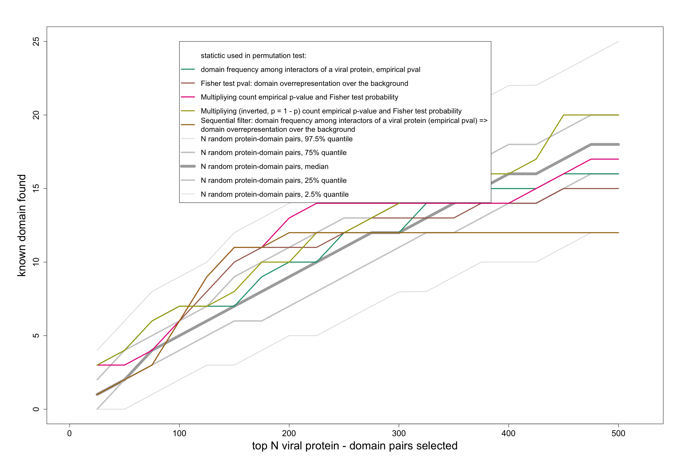
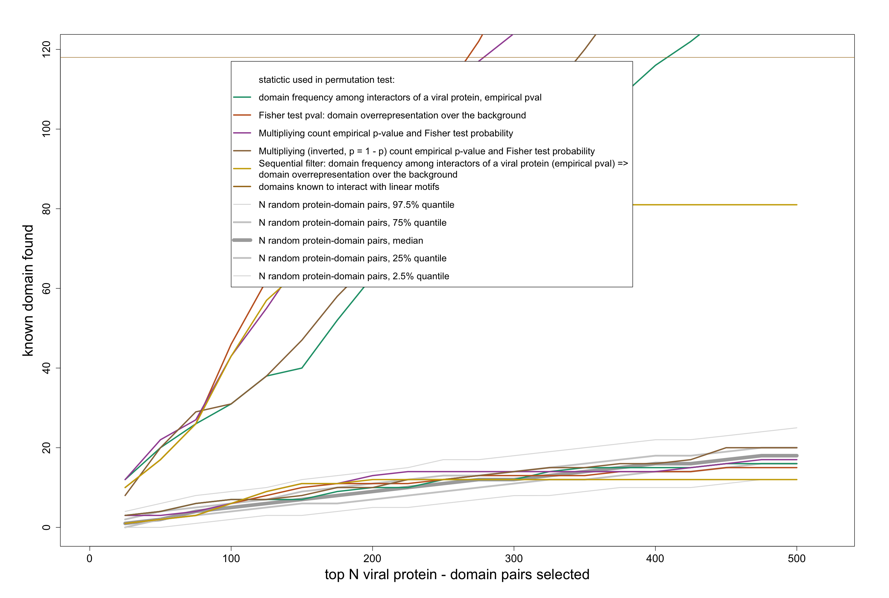
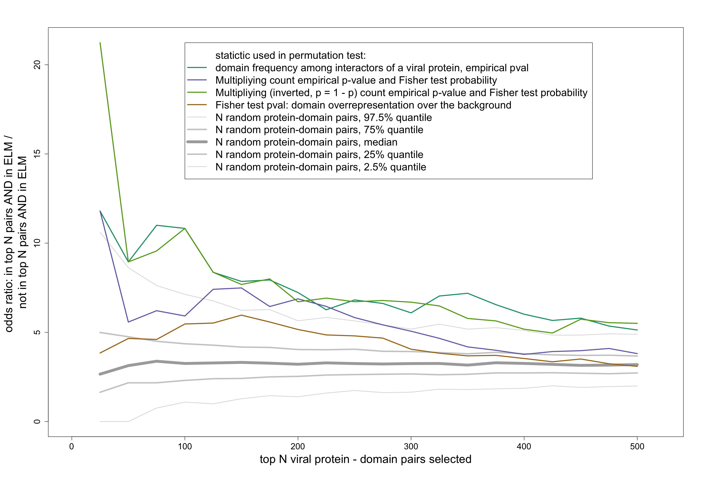
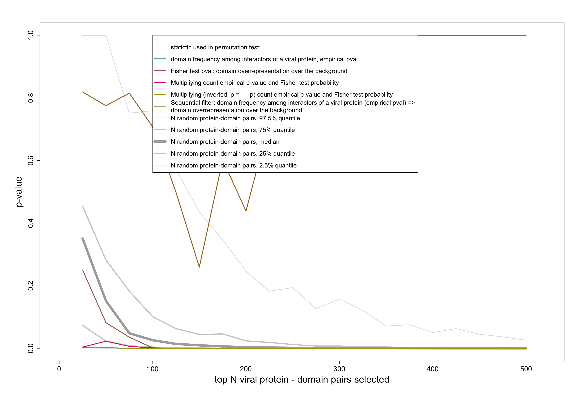

```{r setup, include=FALSE}
knitr::opts_chunk$set(echo = TRUE)
packages = c("MItools", "rtracklayer", "ggplot2", "GGally", "RColorBrewer", "R.utils")
if(mean(packages %in% names(installed.packages()[,"Package"])) != 1){
    packages_to_install = packages[!packages %in% names(installed.packages()[,"Package"])]
    # specifying mirror is necessary for some Linux systems
    install.packages(packages_to_install, dependencies = T, repos = "http://mirrors.ebi.ac.uk/CRAN/")
    packages_to_install = packages[!packages %in% names(installed.packages()[,"Package"])]
    source("https://bioconductor.org/biocLite.R")
    biocLite(packages_to_install)
    devtools::install_github("vitkl/MItools")
}

suppressPackageStartupMessages({
    library(MItools)
    library(rtracklayer)
    library(ggplot2)
    library(GGally)
    library(RColorBrewer)
    library(DT)
})

printTable = function(res, N = 5000, doman_viral_pairs = F, motifs = F){
    res$data_with_pval[, human_domain := paste0("<a href='https://www.ebi.ac.uk/interpro/entry/",IDs_domain_human,"'>",IDs_domain_human,"</a>")]
    res$data_with_pval[, human_interactor := paste0("<a href='http://www.uniprot.org/uniprot/",IDs_interactor_human,"'>",IDs_interactor_human,"</a>")]
    res$data_with_pval[, viral_interactor := paste0("<a href='http://www.uniprot.org/uniprot/",IDs_interactor_viral,"'>",IDs_interactor_viral,"</a>")]
    
    entry.list = unique(getInterProEntryTypes("./data_files/entry.list")[,.(IDs_domain_human = ENTRY_AC, domain_name = ENTRY_NAME)])
    res$data_with_pval = res$data_with_pval[entry.list, on = "IDs_domain_human", allow.cartesian=TRUE]
    
    if(motifs){
        occurence_Vidal = fread("./SLIMFinder_Vidal/result/occurence.txt")
        occurence_Vidal[, IDs_interactor_viral := gsub("_UNK__.+$","",Seq)]
        occurence_Vidal = unique(occurence_Vidal[,.(IDs_interactor_viral, 
                                                    Motif_Pattern = Pattern,
                                                    Motif_pval = Sig,
                                                    Motif_Match = Match)])
        res$data_with_pval = occurence_Vidal[res$data_with_pval, on = "IDs_interactor_viral", allow.cartesian=TRUE]
        res$data_with_pval = res$data_with_pval[, .(human_domain = human_domain,
                                                    domain_name = domain_name,
                                                    viral_interactor = viral_interactor,
                                                    human_interactor = human_interactor,
                                                    p.value, observed_statistic,
                                                    domain_count_per_viral_interactor = domain_count_per_IDs_interactor_viral,
                                                    viral_interactor_degree = IDs_interactor_viral_degree, 
                                                    total_domain_count = domain_count,
                                                    human_interactor_degree = IDs_interactor_human_degree,
                                                    total_background_proteins = N_prot_w_interactors,
                                                    Motif_Pattern, Motif_pval, Motif_Match)]
    } else {
        res$data_with_pval = res$data_with_pval[, .(human_domain = human_domain,
                                                    domain_name = domain_name,
                                                    viral_interactor = viral_interactor,
                                                    human_interactor = human_interactor,
                                                    p.value, observed_statistic,
                                                    domain_count_per_viral_interactor = domain_count_per_IDs_interactor_viral,
                                                    viral_interactor_degree = IDs_interactor_viral_degree, 
                                                    total_domain_count = domain_count,
                                                    human_interactor_degree = IDs_interactor_human_degree,
                                                    total_background_proteins = N_prot_w_interactors)]
    }
    
    res$data_with_pval = unique(res$data_with_pval)
    
    if(doman_viral_pairs){
        res$data_with_pval[, c("human_interactor", "human_interactor_degree") := NULL]
        res$data_with_pval = unique(res$data_with_pval)
    }
    DT::datatable(res$data_with_pval[order(p.value, decreasing = F)[1:N]], escape = FALSE)
}

writeTable = function(res, destfile){
    fwrite(res_count$data_with_pval[order(p.value, decreasing = F)], destfile, sep = "\t")
}
```

# Load results

```{r load}
load("./processed_data_files/what_we_find_VS_ELM_clust20171019.RData")
doman_viral_pairs = T # if false - add human proteins containing domains
motifs = F # based on Vidal's data
```

## Empirical p-value for seing a domain a number of times
#### What is the chance of randomly seeing any domain the observed number of times among all proteins that interact with a specific viral protein

```{r res_count}
printTable(res_count, doman_viral_pairs = doman_viral_pairs, motifs = motifs)
writeTable(res_count, "./results/domains_empirical_p_value.tsv")
plot(res_count)
```

## Fisher test for co-occurence of binding viral protein and containing a domain

```{r resJustFISHER}
printTable(resJustFISHER, doman_viral_pairs = doman_viral_pairs, motifs = motifs)
writeTable(resJustFISHER, "./results/domains_fisher_test.tsv")
plot(resJustFISHER,IDs_interactor_viral + IDs_domain_human ~ p.value , xlab = "Fisher's Exact Test pvalue", breaks = seq(-0.01, 
                                                                                                                         1.01, 0.01))
```

## Combining the p-value for seing a domain a number of times and the p-value for co-occurence of binding viral protein and containing a domain

### Multiplying p-values

```{r resPmult}
printTable(resPmult, doman_viral_pairs = doman_viral_pairs, motifs = motifs)
writeTable(resJustFISHER, "./results/domains_empirical_p_value_X_fisher_test.tsv")
plot(resPmult,IDs_interactor_viral + IDs_domain_human ~ p.value , xlab = "Fisher's Exact Test pvalue * \nempirical P value for observing domain in N proteins", breaks = seq(-0.01, 
                                                                                                                                                                             1.01, 0.01))
```

### Multiplying the inverse of p-values

The idea is that low p-values mean higher chances of detecting a signal. I am not sure this is statistically correct, but it allows to remove p = 1.0 domains (because of multiplying Fisher p value by 0, the inverse of empirical pvalue for the frequency).

```{r resPmultInv}
printTable(resPmultInv, doman_viral_pairs = doman_viral_pairs, motifs = motifs)
writeTable(resJustFISHER, "./results/domains_inv_empirical_p_value_X_inv_fisher_test.tsv")
plot(resPmultInv,IDs_interactor_viral + IDs_domain_human ~ p.value , xlab = "Inverse of Fisher's Exact Test pvalue * \ninverse of empirical P value for observing domain in N proteins", breaks = seq(-0.01, 
                                                                                                                                                                                                      1.01, 0.01))
```

### 2-step filtering, ranking by Fisher test p-value

```{r sequential_filter}
printTable(sequential_filter, doman_viral_pairs = doman_viral_pairs, motifs = motifs)
plot(sequential_filter, IDs_interactor_viral + IDs_domain_human ~ p.value, xlab = "Fisher's Exact Test pvalue", breaks = seq(-0.01, 
                                                                                                                             1.01, 0.01))
PermutResult2D(res = sequential_filter, N = 500, value.cols = c("p.value", "Emp.p.value")) +
    ggtitle("2D-bin plots of 250 top-scoring viral protein - human domain pairs, \n statistic: count of a domain among interacting partners of a viral protein")
writeTable(sequential_filter, "./results/domains_sequential_filter.tsv")
```

## How all these methods perform at finding ELM domains?

### The absolute numbers



#### compared the total number of domains found / the total in ELM


### The enrichment in ELM domains over the background



### P-value for the enrichment in ELM domains over the background


