# Comprehensive benchmarking of motif instances (all types)
Vitalii Kleshchevnikov  
18/10/2017  


```r
knitr::opts_chunk$set(echo = FALSE, fig.width = 10, fig.height = 10, warning = FALSE, message = FALSE)

packages = c("MItools", "RColorBrewer", "devtools")
if(mean(packages %in% names(installed.packages()[,"Package"])) != 1){
    packages_to_install = packages[!packages %in% names(installed.packages()[,"Package"])]
    # specifying mirror is necessary for some Linux systems
    install.packages(packages_to_install, dependencies = T, repos = "http://mirrors.ebi.ac.uk/CRAN/")
    packages_to_install = packages[!packages %in% names(installed.packages()[,"Package"])]
    source("https://bioconductor.org/biocLite.R")
    biocLite(packages_to_install)
    devtools::install_github("vitkl/MItools", dependencies = T)
}
suppressPackageStartupMessages({
    library(MItools)
})
```

```
## Warning: replacing previous import 'GenomicRanges::shift' by
## 'data.table::shift' when loading 'MItools'
```

```r
colors = RColorBrewer::brewer.pal(2, "Dark2")
```

```
## Warning in RColorBrewer::brewer.pal(2, "Dark2"): minimal value for n is 3, returning requested palette with 3 different levels
```

```r
N_negative_sets = 200
motif_types = c("MOD", "LIG")
```

## human network searched for motifs present in viral proteins

All interaction of viral proteins present in IntAct are used for analysis. All viral proteins are used as a query (QSLIMFinder identifies motifs only if they are present in a query sequence).

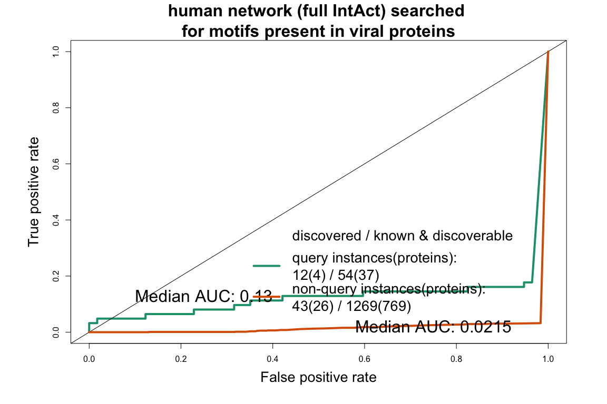<!-- -->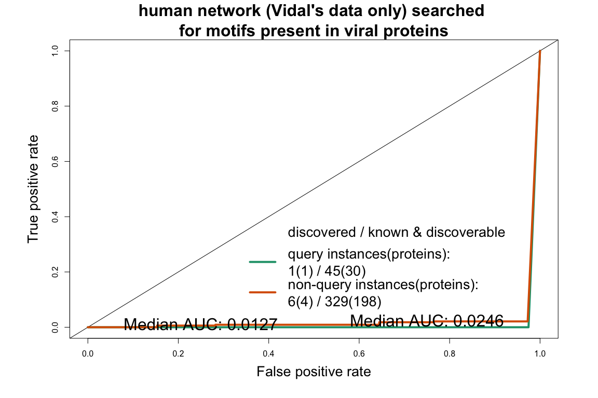<!-- -->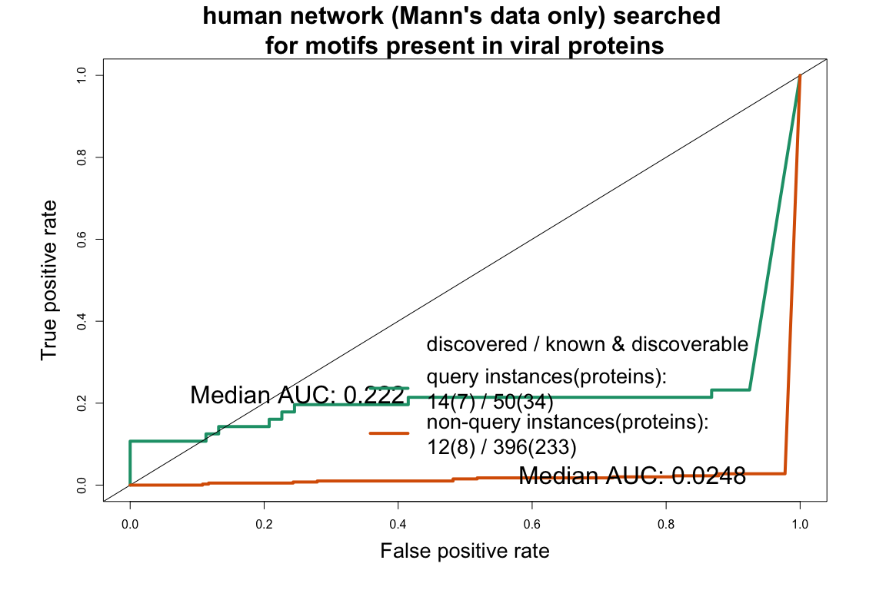<!-- -->

```
## $full_Intact
## NULL
## 
## $Vidal
## NULL
## 
## $Mann
## NULL
```

## human network searched for motifs present in kinases

All interaction of kinases present in IntAct are used and sequences of these proteins are used as a query except for withinVidal, withinMann datasets.  

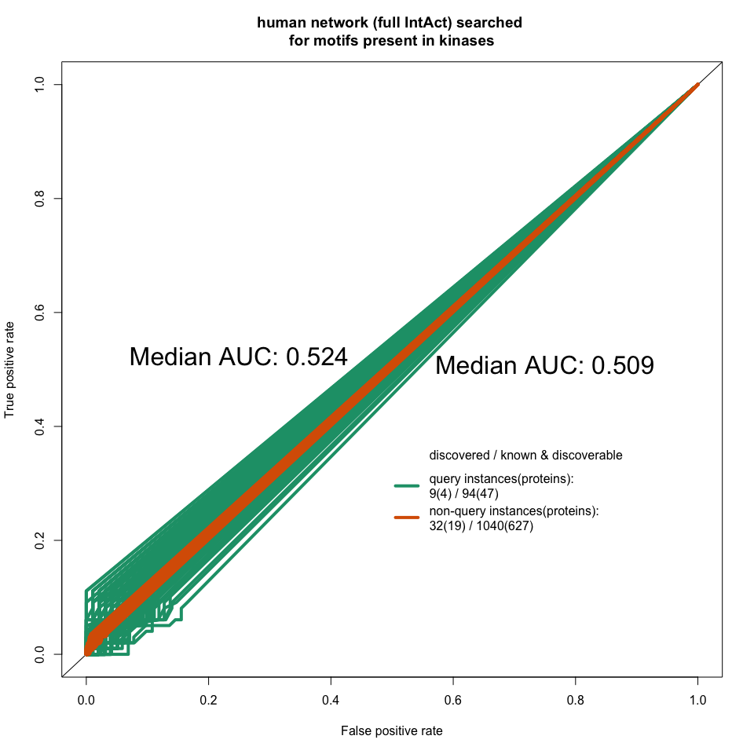<!-- -->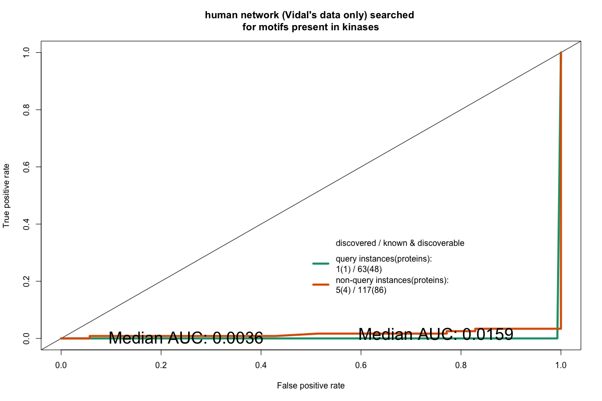<!-- -->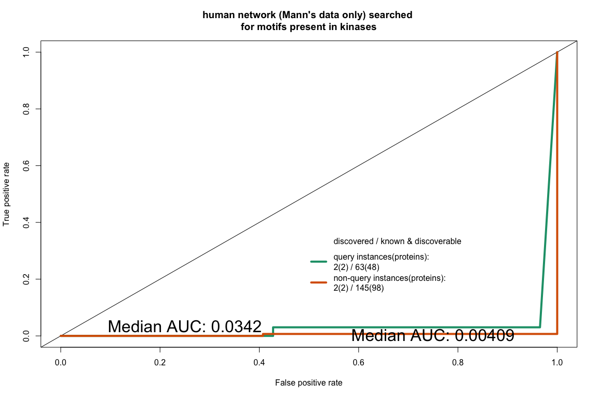<!-- -->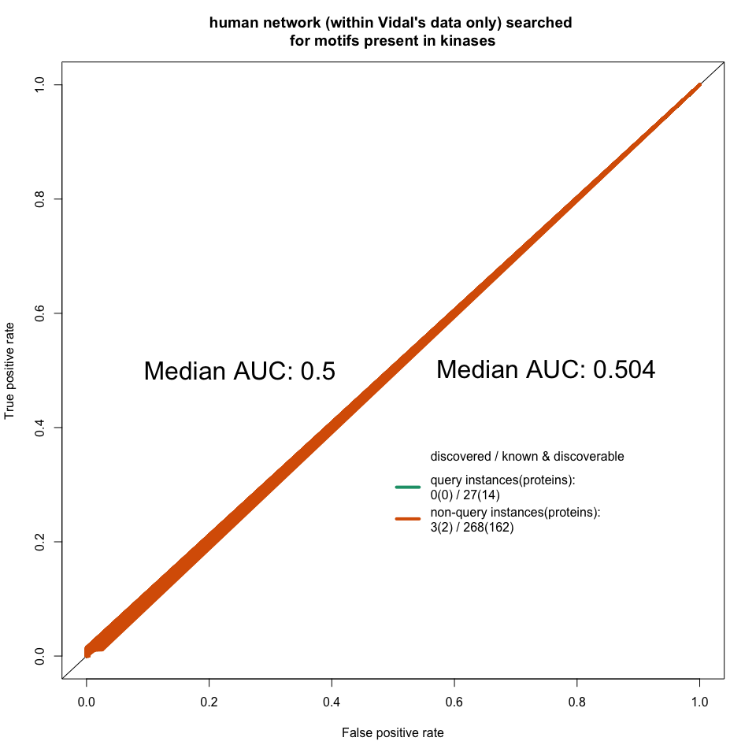<!-- -->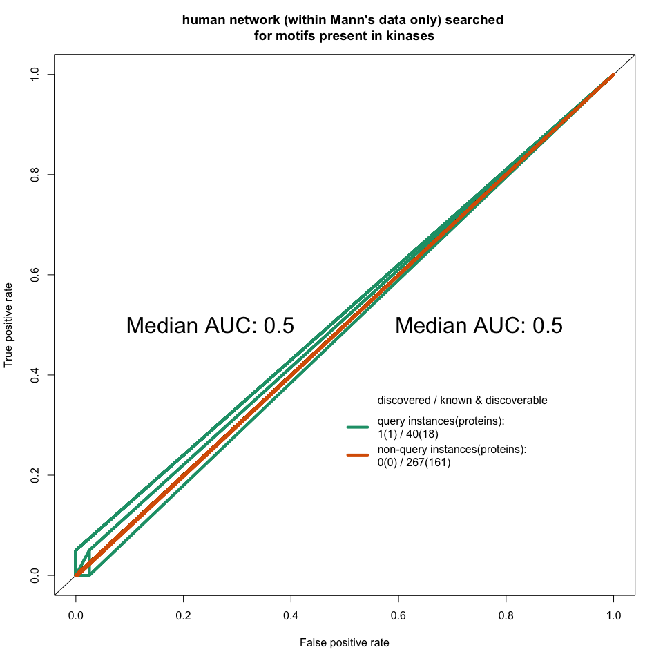<!-- -->

```
## $full_Intact
## NULL
## 
## $Vidal
## NULL
## 
## $Mann
## NULL
## 
## $withinVidal
## NULL
## 
## $withinMann
## NULL
```

## human network searched for motifs present in zinc-finger proteins

All interaction of zinc-finger proteins present in IntAct are used and sequences of these proteins are used as a query except for withinVidal, withinMann datasets.  

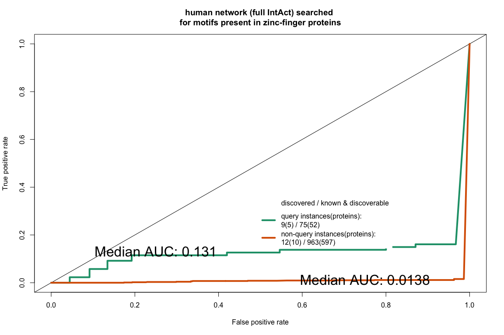<!-- -->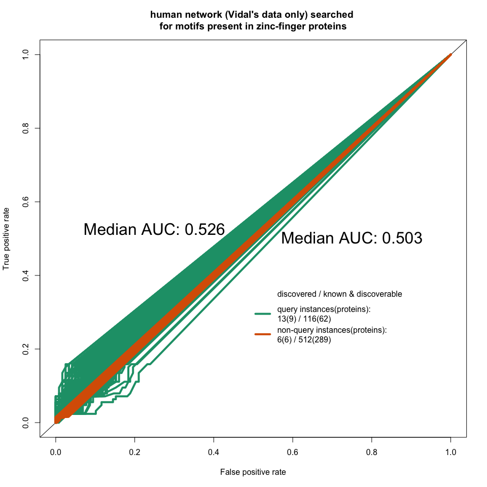<!-- -->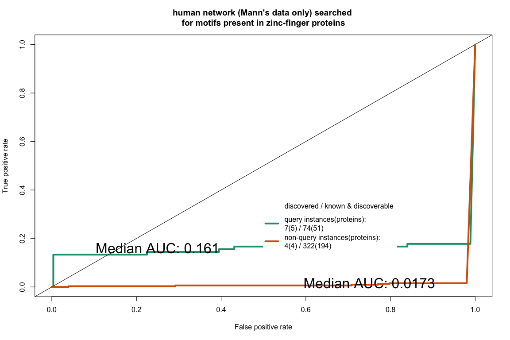<!-- -->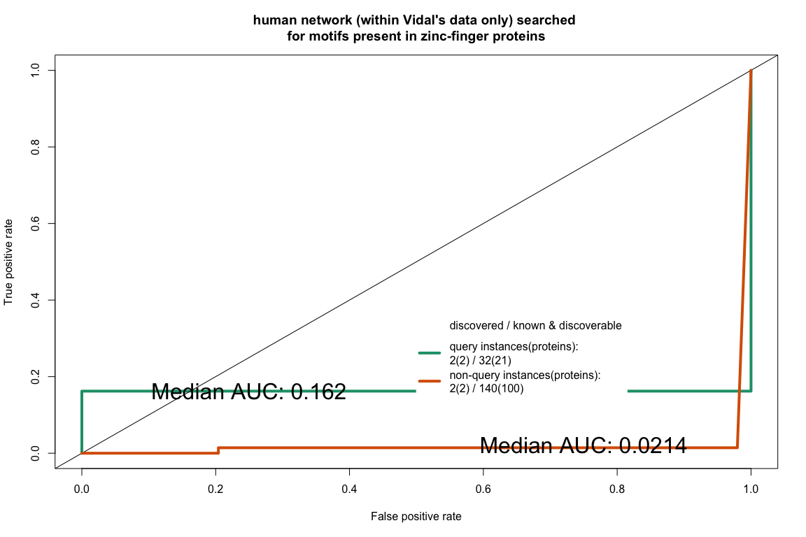<!-- -->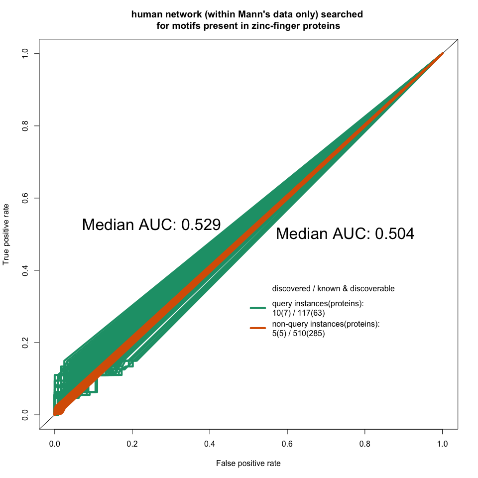<!-- -->

```
## $full_Intact
## NULL
## 
## $Vidal
## NULL
## 
## $Mann
## NULL
## 
## $withinVidal
## NULL
## 
## $withinMann
## NULL
```


```
## [1] "2017-11-07"
```

```
##  setting  value                       
##  version  R version 3.4.2 (2017-09-28)
##  system   x86_64, darwin15.6.0        
##  ui       X11                         
##  language (EN)                        
##  collate  en_GB.UTF-8                 
##  tz       Europe/London               
##  date     2017-11-07                  
## 
##  package              * version  date       source                        
##  AnnotationDbi          1.38.2   2017-07-27 Bioconductor                  
##  backports              1.1.1    2017-09-25 CRAN (R 3.4.2)                
##  base                 * 3.4.2    2017-10-04 local                         
##  Biobase                2.36.2   2017-05-04 Bioconductor                  
##  BiocGenerics         * 0.22.1   2017-10-07 Bioconductor                  
##  BiocParallel           1.10.1   2017-05-03 Bioconductor                  
##  biomaRt              * 2.32.1   2017-06-09 Bioconductor                  
##  Biostrings           * 2.44.2   2017-07-21 Bioconductor                  
##  bit                    1.1-12   2014-04-09 CRAN (R 3.4.0)                
##  bit64                  0.9-7    2017-05-08 CRAN (R 3.4.0)                
##  bitops                 1.0-6    2013-08-17 CRAN (R 3.4.0)                
##  blob                   1.1.0    2017-06-17 CRAN (R 3.4.0)                
##  caTools                1.17.1   2014-09-10 CRAN (R 3.4.0)                
##  colorspace             1.3-2    2016-12-14 CRAN (R 3.4.0)                
##  compiler               3.4.2    2017-10-04 local                         
##  data.table           * 1.10.4-3 2017-10-27 cran (@1.10.4-)               
##  datasets             * 3.4.2    2017-10-04 local                         
##  DBI                    0.7      2017-06-18 CRAN (R 3.4.0)                
##  DelayedArray           0.2.7    2017-06-03 Bioconductor                  
##  devtools               1.13.3   2017-08-02 CRAN (R 3.4.1)                
##  digest                 0.6.12   2017-01-27 CRAN (R 3.4.0)                
##  downloader             0.4      2015-07-09 CRAN (R 3.4.0)                
##  DT                     0.2      2016-08-09 CRAN (R 3.4.0)                
##  evaluate               0.10.1   2017-06-24 CRAN (R 3.4.1)                
##  gdata                  2.18.0   2017-06-06 CRAN (R 3.4.0)                
##  GenomeInfoDb           1.12.3   2017-10-05 Bioconductor                  
##  GenomeInfoDbData       0.99.0   2017-10-21 Bioconductor                  
##  GenomicAlignments      1.12.2   2017-08-19 Bioconductor                  
##  GenomicRanges          1.28.6   2017-10-04 Bioconductor                  
##  GGally                 1.3.2    2017-08-02 CRAN (R 3.4.1)                
##  ggplot2                2.2.1    2016-12-30 CRAN (R 3.4.0)                
##  gplots                 3.0.1    2016-03-30 CRAN (R 3.4.0)                
##  graphics             * 3.4.2    2017-10-04 local                         
##  grDevices            * 3.4.2    2017-10-04 local                         
##  grid                   3.4.2    2017-10-04 local                         
##  gsubfn                 0.6-6    2014-08-27 CRAN (R 3.4.0)                
##  gtable                 0.2.0    2016-02-26 CRAN (R 3.4.0)                
##  gtools                 3.5.0    2015-05-29 CRAN (R 3.4.0)                
##  htmltools              0.3.6    2017-04-28 CRAN (R 3.4.0)                
##  htmlwidgets            0.9      2017-07-10 CRAN (R 3.4.1)                
##  httr                 * 1.3.1    2017-08-20 CRAN (R 3.4.1)                
##  IRanges              * 2.10.5   2017-10-08 Bioconductor                  
##  jsonlite               1.5      2017-06-01 CRAN (R 3.4.0)                
##  KernSmooth             2.23-15  2015-06-29 CRAN (R 3.4.2)                
##  knitr                  1.17     2017-08-10 CRAN (R 3.4.1)                
##  lattice                0.20-35  2017-03-25 CRAN (R 3.4.2)                
##  lazyeval               0.2.0    2016-06-12 CRAN (R 3.4.0)                
##  magrittr               1.5      2014-11-22 CRAN (R 3.4.0)                
##  Matrix                 1.2-11   2017-08-21 CRAN (R 3.4.2)                
##  matrixStats            0.52.2   2017-04-14 CRAN (R 3.4.0)                
##  memoise                1.1.0    2017-04-21 CRAN (R 3.4.0)                
##  methods              * 3.4.2    2017-10-04 local                         
##  MItools              * 0.1.32   2017-11-07 Github (vitkl/MItools@b983625)
##  munsell                0.4.3    2016-02-13 CRAN (R 3.4.0)                
##  ontologyIndex          2.4      2017-02-06 CRAN (R 3.4.0)                
##  parallel             * 3.4.2    2017-10-04 local                         
##  plyr                 * 1.8.4    2016-06-08 CRAN (R 3.4.0)                
##  proto                  1.0.0    2016-10-29 CRAN (R 3.4.0)                
##  PSICQUIC             * 1.14.0   2017-04-25 Bioconductor                  
##  qvalue                 2.8.0    2017-04-25 Bioconductor                  
##  R.methodsS3            1.7.1    2016-02-16 CRAN (R 3.4.0)                
##  R.oo                   1.21.0   2016-11-01 CRAN (R 3.4.0)                
##  R.utils                2.5.0    2016-11-07 CRAN (R 3.4.0)                
##  R6                     2.2.2    2017-06-17 CRAN (R 3.4.0)                
##  RColorBrewer           1.1-2    2014-12-07 CRAN (R 3.4.0)                
##  Rcpp                   0.12.13  2017-09-28 CRAN (R 3.4.2)                
##  RCurl                  1.95-4.8 2016-03-01 CRAN (R 3.4.0)                
##  reshape                0.8.7    2017-08-06 CRAN (R 3.4.1)                
##  reshape2               1.4.2    2016-10-22 CRAN (R 3.4.0)                
##  rlang                  0.1.2    2017-08-09 CRAN (R 3.4.1)                
##  rmarkdown              1.6      2017-06-15 CRAN (R 3.4.0)                
##  ROCR                   1.0-7    2015-03-26 CRAN (R 3.4.0)                
##  rprojroot              1.2      2017-01-16 CRAN (R 3.4.0)                
##  Rsamtools              1.28.0   2017-04-25 Bioconductor                  
##  RSQLite                2.0      2017-06-19 CRAN (R 3.4.1)                
##  rtracklayer            1.36.6   2017-10-12 Bioconductor                  
##  S4Vectors            * 0.14.7   2017-10-08 Bioconductor                  
##  scales                 0.5.0    2017-08-24 CRAN (R 3.4.1)                
##  splines                3.4.2    2017-10-04 local                         
##  stats                * 3.4.2    2017-10-04 local                         
##  stats4               * 3.4.2    2017-10-04 local                         
##  stringi                1.1.5    2017-04-07 CRAN (R 3.4.0)                
##  stringr                1.2.0    2017-02-18 CRAN (R 3.4.0)                
##  SummarizedExperiment   1.6.5    2017-09-29 Bioconductor                  
##  tibble                 1.3.4    2017-08-22 CRAN (R 3.4.1)                
##  tools                  3.4.2    2017-10-04 local                         
##  utils                * 3.4.2    2017-10-04 local                         
##  withr                  2.0.0    2017-07-28 CRAN (R 3.4.1)                
##  XML                    3.98-1.9 2017-06-19 CRAN (R 3.4.1)                
##  XVector              * 0.16.0   2017-04-25 Bioconductor                  
##  yaml                   2.1.14   2016-11-12 CRAN (R 3.4.0)                
##  zlibbioc               1.22.0   2017-04-25 Bioconductor
```
