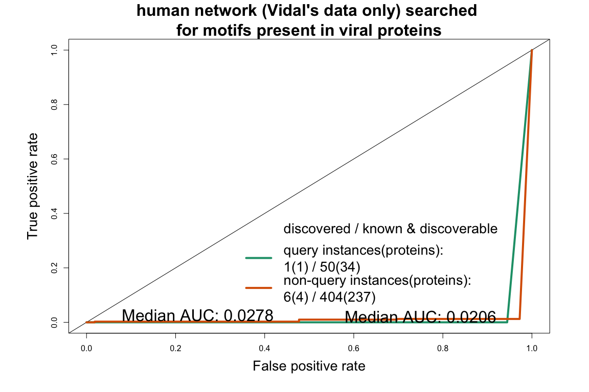
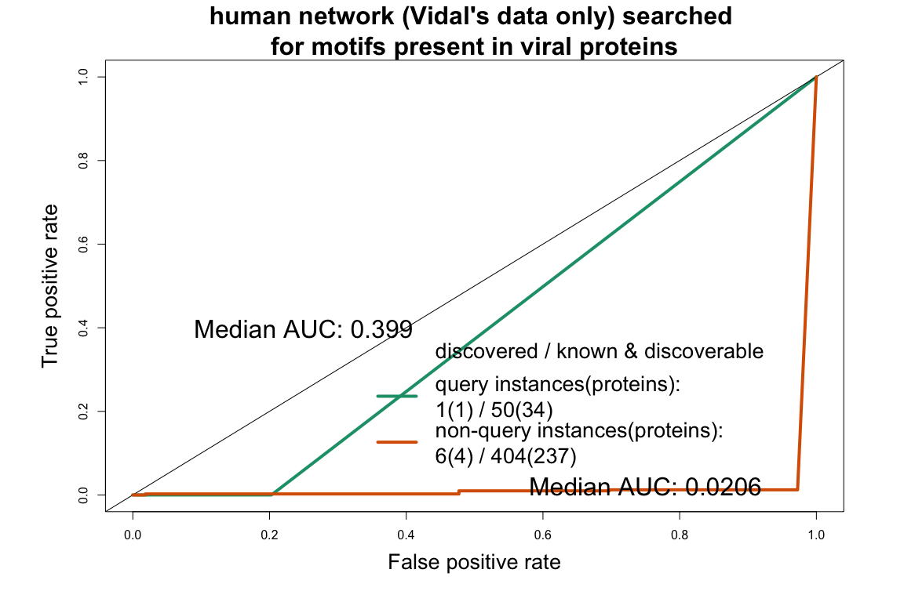
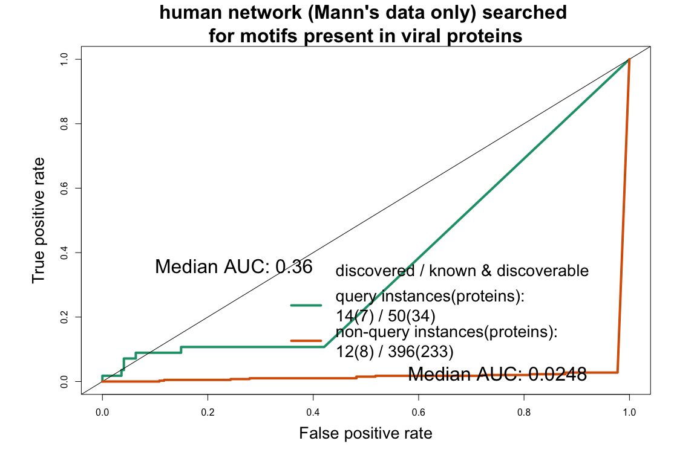
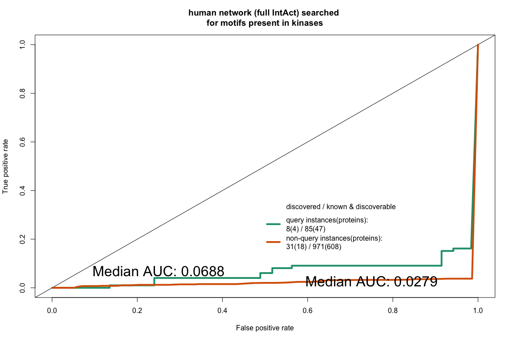
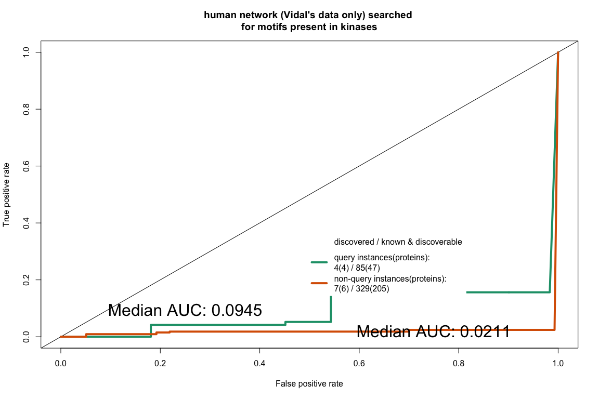
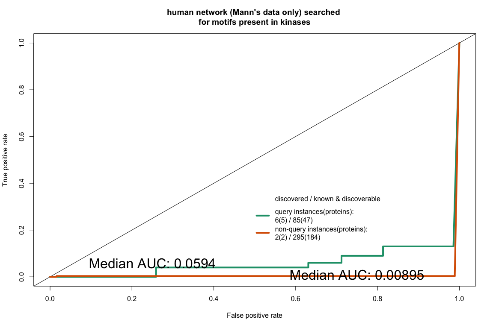
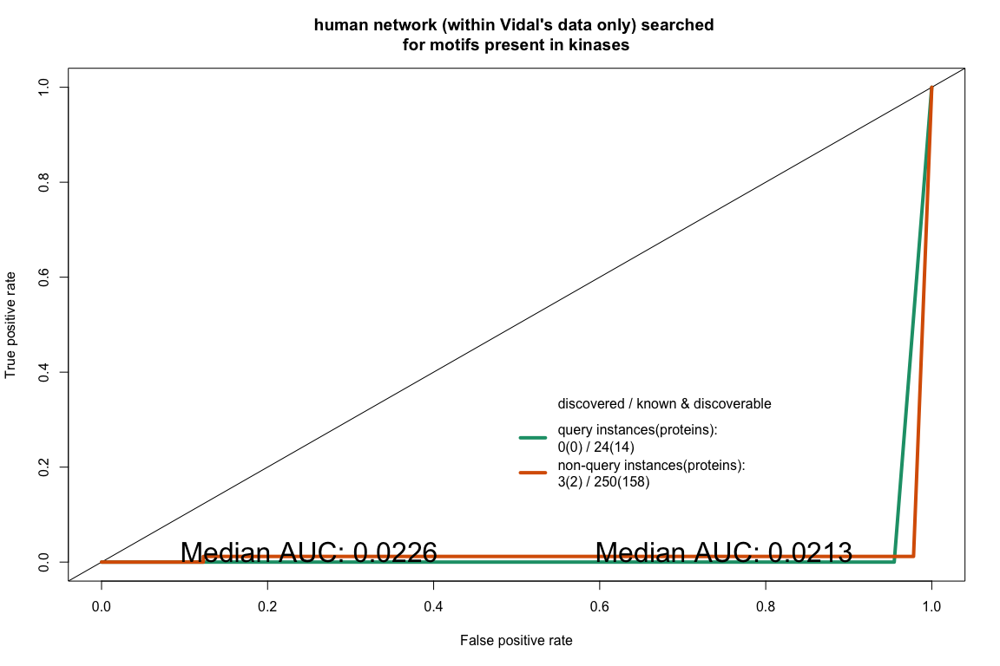
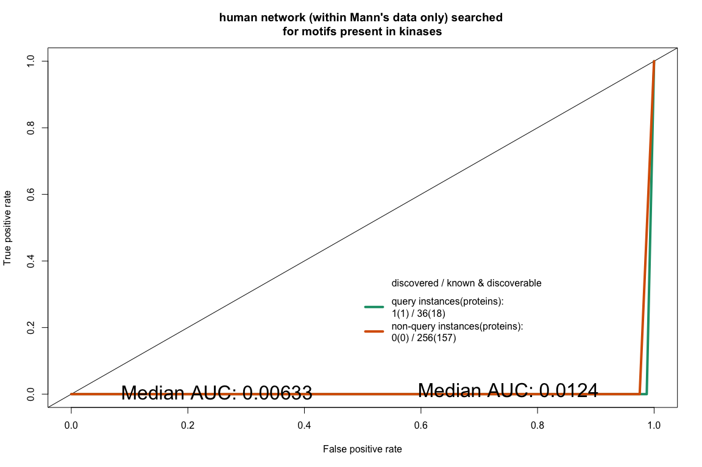
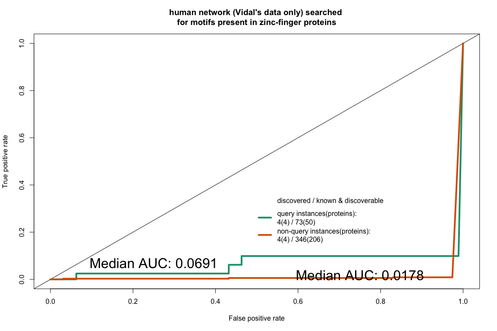
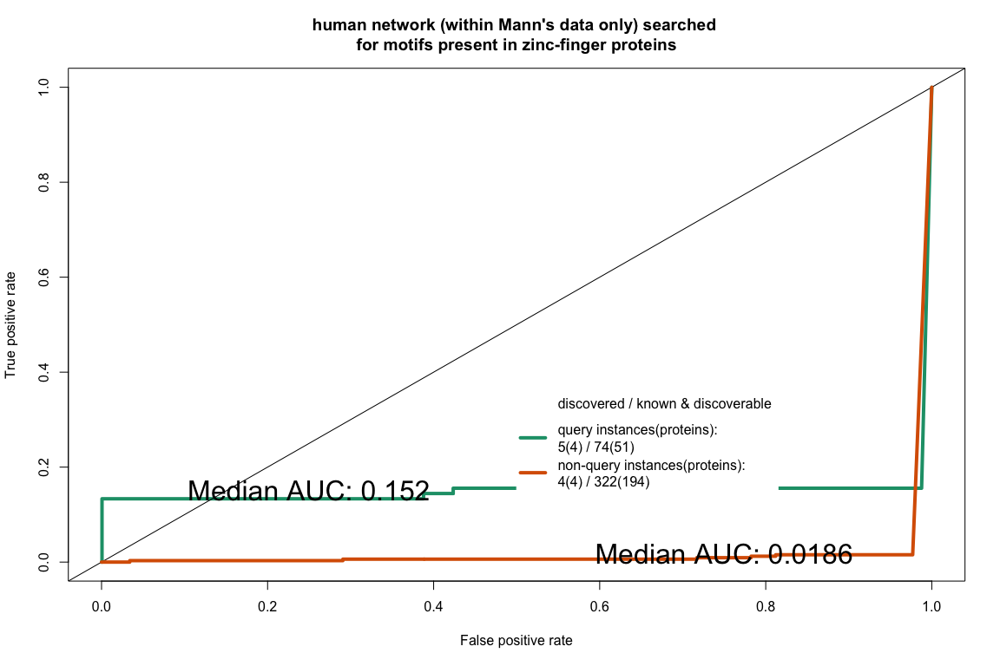

# Comprehensive benchmarking of motif instances (all types)
Vitalii Kleshchevnikov  
18/10/2017  


```r
knitr::opts_chunk$set(echo = FALSE, fig.width = 12, fig.height = 8, warning = FALSE, message = FALSE)

packages = c("MItools", "RColorBrewer", "devtools")
if(mean(packages %in% names(installed.packages()[,"Package"])) != 1){
    packages_to_install = packages[!packages %in% names(installed.packages()[,"Package"])]
    # specifying mirror is necessary for some Linux systems
    install.packages(packages_to_install, dependencies = T, repos = "http://mirrors.ebi.ac.uk/CRAN/")
    packages_to_install = packages[!packages %in% names(installed.packages()[,"Package"])]
    source("https://bioconductor.org/biocLite.R")
    biocLite(packages_to_install)
    devtools::install_github("vitkl/MItools", dependencies = T)
}
suppressPackageStartupMessages({
    library(MItools)
})
```

```
## Warning: replacing previous import 'GenomicRanges::shift' by
## 'data.table::shift' when loading 'MItools'
```

```r
colors = RColorBrewer::brewer.pal(2, "Dark2")
```

```
## Warning in RColorBrewer::brewer.pal(2, "Dark2"): minimal value for n is 3, returning requested palette with 3 different levels
```

```r
N_negative_sets = 200
motif_types = c("MOD", "LIG") # "MOD", "LIG" / "DOC", "DEG", "CLV", "TRG"
neg_set = c("all_proteins") # "all_instances", "all_proteins", "random"
query_predictor_col = "Sig" # "Sig" or "p.value" or "domain_motif_pval"
filter_by_domain_data = NULL # "p.value < 0.05" or "fdr_pval < 0.05 & domain_count_per_IDs_interactor_viral > 1" or NULL
#ROC:
measure1 = "tpr" # "tpr" or "prec"
measure2 = "fpr" # "fpr" or "rec"
```

## human network searched for motifs present in viral proteins

All interaction of viral proteins present in IntAct are used for analysis. All viral proteins are used as a query (QSLIMFinder identifies motifs only if they are present in a query sequence).

### without domain information

<!-- --><!-- --><!-- -->

```
## $full_Intact
## NULL
## 
## $Vidal
## NULL
## 
## $Mann
## NULL
```

What is the minimal set size that returns motif with Sig < 0.05?  
3  

### with domain information

Looks like proteins with many domains tend to interact with known motifs.

<!-- --><!-- --><!-- -->

```
## $full_Intact
## NULL
## 
## $Vidal
## NULL
## 
## $Mann
## NULL
```

```
## GRanges object with 7 ranges and 55 metadata columns:
##       seqnames    ranges strand |       query interacts_with
##          <Rle> <IRanges>  <Rle> | <character>    <character>
##   [1]   O56264  [75, 78]      * |      O56264         P62280
##   [2]   O56264  [68, 75]      * |      O56264         P62280
##   [3]   O56264  [57, 63]      * |      O56264         P62280
##   [4]   P04487  [65, 73]      * |      P04487         P62280
##   [5]   Q00335  [94, 98]      * |      Q00335         P62280
##   [6]   Q0HD54  [75, 78]      * |      Q0HD54         P62280
##   [7]   Q0HD54  [68, 75]      * |      Q0HD54         P62280
##                            Dataset      Rank     Pattern       Sig
##                        <character> <integer> <character> <numeric>
##   [1] interactors_of.P62280.O56264         1        E.LK 0.1833333
##   [2] interactors_of.P62280.O56264         2    I..E.S.E 0.6000000
##   [3] interactors_of.P62280.O56264         3     A.R.G.H 0.8666667
##   [4] interactors_of.P62280.P04487         1   R..A..T.S 0.4000000
##   [5] interactors_of.P62280.Q00335         1       IP.NV 0.1700000
##   [6] interactors_of.P62280.Q0HD54         1        E.LK 0.1933333
##   [7] interactors_of.P62280.Q0HD54         2    I..E.S.E 0.6333333
##        Prot_Len       Match     Variant  MisMatch      Desc      PepSeq
##       <integer> <character> <character> <integer> <logical> <character>
##   [1]       230        EALK        E.LK         0      <NA>        EALK
##   [2]       230    ILEEESDE    I..E.S.E         0      <NA>    ILEEESDE
##   [3]       230     ATREGKH     A.R.G.H         0      <NA>     ATREGKH
##   [4]       161   RVGADTTIS   R..A..T.S         0      <NA>   RVGADTTIS
##   [5]       736       IPDNV       IP.NV         0      <NA>       IPDNV
##   [6]       237        EALK        E.LK         0      <NA>        EALK
##   [7]       237    ILKEESDE    I..E.S.E         0      <NA>    ILKEESDE
##         PepDesign         Masking       Build      Chance    SeqNum
##       <character>     <character> <character> <character> <integer>
##   [1]          OK FreqDisComp-5-8   Ql5w2o3a3        QSig        66
##   [2]          OK FreqDisComp-5-8   Ql5w2o3a3        QSig        66
##   [3]          OK FreqDisComp-5-8   Ql5w2o3a3        QSig        66
##   [4]          OK FreqDisComp-5-8   Ql5w2o3a3        QSig        66
##   [5]          OK FreqDisComp-5-8   Ql5w2o3a3        QSig        66
##   [6]          OK FreqDisComp-5-8   Ql5w2o3a3        QSig        66
##   [7]          OK FreqDisComp-5-8   Ql5w2o3a3        QSig        66
##           UPNum     AANum    MotNum        IC       Occ   Support
##       <integer> <integer> <integer> <numeric> <integer> <integer>
##   [1]        50     15871         3         3        21        18
##   [2]        50     15871         3         4         6         6
##   [3]        50     15871         3         4         4         4
##   [4]        50     15871         1         4         5         5
##   [5]        50     15871         1         4         4         4
##   [6]        50     15871         2         3        21        18
##   [7]        50     15871         2         4         6         6
##              UP     ExpUP      Prob     Cloud  CloudSeq   CloudUP
##       <integer> <numeric> <numeric> <integer> <integer> <integer>
##   [1]        15     4.250  4.88e-05         1        18        15
##   [2]         5     0.210  6.19e-05         2         6         5
##   [3]         4     0.085  9.02e-05         3         4         4
##   [4]         5     0.190  4.03e-05         1         5         5
##   [5]         4     0.053  2.20e-05         1         4         4
##   [6]        15     4.250  4.88e-05         1        18        15
##   [7]         5     0.210  6.19e-05         2         6         5
##         Sig_FDR Sig_not_normalised IDs_domain_human observed_statistic
##       <numeric>          <numeric>      <character>          <integer>
##   [1]       0.3              0.055        IPR032440                  1
##   [2]       0.3              0.180        IPR032440                  1
##   [3]       0.3              0.260        IPR032440                  1
##   [4]       0.3              0.120        IPR032440                  1
##   [5]       0.3              0.051        IPR032440                  1
##   [6]       0.3              0.058        IPR032440                  1
##   [7]       0.3              0.190        IPR032440                  1
##       YmissingZ_perX higher_counts not_missing   p.value all_IDs_domain
##            <integer>     <numeric>   <numeric> <numeric>    <character>
##   [1]              3     107600436   107600436         1        PF16205
##   [2]              3     107600436   107600436         1        PF16205
##   [3]              3     107600436   107600436         1        PF16205
##   [4]             20     136054826   136054826         1        PF16205
##   [5]              0      18875494    18875494         1        PF16205
##   [6]             13      75221354    75221354         1        PF16205
##   [7]             13      75221354    75221354         1        PF16205
##       domain_type N_prot_w_interactors domain_count domain_frequency
##       <character>            <integer>    <integer>        <numeric>
##   [1]      Domain                15940            1     6.273526e-05
##   [2]      Domain                15940            1     6.273526e-05
##   [3]      Domain                15940            1     6.273526e-05
##   [4]      Domain                15940            1     6.273526e-05
##   [5]      Domain                15940            1     6.273526e-05
##   [6]      Domain                15940            1     6.273526e-05
##   [7]      Domain                15940            1     6.273526e-05
##       Taxid_interactor_human Taxid_interactor_viral
##                    <integer>              <integer>
##   [1]                   9606                 130763
##   [2]                   9606                 130763
##   [3]                   9606                 130763
##   [4]                   9606                  10299
##   [5]                   9606                  10884
##   [6]                   9606                 383543
##   [7]                   9606                 383543
##       IDs_interactor_viral_degree IDs_interactor_human_degree
##                         <integer>                   <integer>
##   [1]                         108                           4
##   [2]                         108                           4
##   [3]                         108                           4
##   [4]                         145                           4
##   [5]                          15                           4
##   [6]                          70                           4
##   [7]                          70                           4
##       IDs_domain_human_per_IDs_interactor_viral
##                                       <integer>
##   [1]                                       147
##   [2]                                       147
##   [3]                                       147
##   [4]                                       176
##   [5]                                        29
##   [6]                                        73
##   [7]                                        73
##       IDs_interactor_viral_per_IDs_domain_human
##                                       <integer>
##   [1]                                         4
##   [2]                                         4
##   [3]                                         4
##   [4]                                         4
##   [5]                                         4
##   [6]                                         4
##   [7]                                         4
##       domain_count_per_IDs_interactor_viral
##                                   <integer>
##   [1]                                     1
##   [2]                                     1
##   [3]                                     1
##   [4]                                     1
##   [5]                                     1
##   [6]                                     1
##   [7]                                     1
##       domain_frequency_per_IDs_interactor_viral fold_enrichment  fdr_pval
##                                       <numeric>       <numeric> <numeric>
##   [1]                               0.009259259        147.5926         1
##   [2]                               0.009259259        147.5926         1
##   [3]                               0.009259259        147.5926         1
##   [4]                               0.006896552        109.9310         1
##   [5]                               0.066666667       1062.6667         1
##   [6]                               0.014285714        227.7143         1
##   [7]                               0.014285714        227.7143         1
##       motif_occ_per_domain normalised_motif_occ_per_domain
##                  <integer>                       <numeric>
##   [1]                    7                               7
##   [2]                    7                               7
##   [3]                    7                               7
##   [4]                    7                               7
##   [5]                    7                               7
##   [6]                    7                               7
##   [7]                    7                               7
##       domain_motif_pval
##               <numeric>
##   [1]                 1
##   [2]                 1
##   [3]                 1
##   [4]                 1
##   [5]                 1
##   [6]                 1
##   [7]                 1
##   -------
##   seqinfo: 235 sequences from an unspecified genome
```

## human network searched for motifs present in kinases

All interaction of kinases present in IntAct are used and sequences of these proteins are used as a query except for withinVidal, withinMann datasets.  

<!-- --><!-- --><!-- --><!-- --><!-- -->

```
## $full_Intact
## NULL
## 
## $Vidal
## NULL
## 
## $Mann
## NULL
## 
## $withinVidal
## NULL
## 
## $withinMann
## NULL
```

## human network searched for motifs present in zinc-finger proteins

All interaction of zinc-finger proteins present in IntAct are used and sequences of these proteins are used as a query except for withinVidal, withinMann datasets.  

<!-- --><!-- --><!-- --><!-- --><!-- -->

```
## $full_Intact
## NULL
## 
## $Vidal
## NULL
## 
## $Mann
## NULL
## 
## $withinVidal
## NULL
## 
## $withinMann
## NULL
```


```
## [1] "2017-11-30"
```

```
##  setting  value                       
##  version  R version 3.4.2 (2017-09-28)
##  system   x86_64, darwin15.6.0        
##  ui       X11                         
##  language (EN)                        
##  collate  en_GB.UTF-8                 
##  tz       Europe/London               
##  date     2017-11-30                  
## 
##  package              * version  date       source                  
##  AnnotationDbi          1.38.2   2017-07-27 Bioconductor            
##  backports              1.1.1    2017-09-25 CRAN (R 3.4.2)          
##  base                 * 3.4.2    2017-10-04 local                   
##  Biobase                2.36.2   2017-05-04 Bioconductor            
##  BiocGenerics         * 0.22.1   2017-10-07 Bioconductor            
##  BiocParallel           1.10.1   2017-05-03 Bioconductor            
##  biomaRt              * 2.32.1   2017-06-09 Bioconductor            
##  Biostrings           * 2.44.2   2017-07-21 Bioconductor            
##  bit                    1.1-12   2014-04-09 CRAN (R 3.4.0)          
##  bit64                  0.9-7    2017-05-08 CRAN (R 3.4.0)          
##  bitops                 1.0-6    2013-08-17 CRAN (R 3.4.0)          
##  blob                   1.1.0    2017-06-17 CRAN (R 3.4.0)          
##  caTools                1.17.1   2014-09-10 CRAN (R 3.4.0)          
##  colorspace             1.3-2    2016-12-14 CRAN (R 3.4.0)          
##  compiler               3.4.2    2017-10-04 local                   
##  data.table           * 1.10.4-3 2017-10-27 cran (@1.10.4-)         
##  datasets             * 3.4.2    2017-10-04 local                   
##  DBI                    0.7      2017-06-18 CRAN (R 3.4.0)          
##  DelayedArray           0.2.7    2017-06-03 Bioconductor            
##  devtools               1.13.4   2017-11-09 CRAN (R 3.4.2)          
##  digest                 0.6.12   2017-01-27 CRAN (R 3.4.0)          
##  downloader             0.4      2015-07-09 CRAN (R 3.4.0)          
##  DT                     0.2      2016-08-09 CRAN (R 3.4.0)          
##  evaluate               0.10.1   2017-06-24 CRAN (R 3.4.1)          
##  gdata                  2.18.0   2017-06-06 CRAN (R 3.4.0)          
##  GenomeInfoDb           1.12.3   2017-10-05 Bioconductor            
##  GenomeInfoDbData       0.99.0   2017-10-21 Bioconductor            
##  GenomicAlignments      1.12.2   2017-08-19 Bioconductor            
##  GenomicRanges          1.28.6   2017-10-04 Bioconductor            
##  GGally                 1.3.2    2017-08-02 CRAN (R 3.4.1)          
##  ggplot2                2.2.1    2016-12-30 CRAN (R 3.4.0)          
##  gplots                 3.0.1    2016-03-30 CRAN (R 3.4.0)          
##  graphics             * 3.4.2    2017-10-04 local                   
##  grDevices            * 3.4.2    2017-10-04 local                   
##  grid                   3.4.2    2017-10-04 local                   
##  gsubfn                 0.6-6    2014-08-27 CRAN (R 3.4.0)          
##  gtable                 0.2.0    2016-02-26 CRAN (R 3.4.0)          
##  gtools                 3.5.0    2015-05-29 CRAN (R 3.4.0)          
##  htmltools              0.3.6    2017-04-28 CRAN (R 3.4.0)          
##  htmlwidgets            0.9      2017-07-10 CRAN (R 3.4.1)          
##  httr                 * 1.3.1    2017-08-20 CRAN (R 3.4.1)          
##  igraph                 1.1.2    2017-07-21 CRAN (R 3.4.1)          
##  IRanges              * 2.10.5   2017-10-08 Bioconductor            
##  jsonlite               1.5      2017-06-01 CRAN (R 3.4.0)          
##  KernSmooth             2.23-15  2015-06-29 CRAN (R 3.4.2)          
##  knitr                  1.17     2017-08-10 CRAN (R 3.4.1)          
##  lattice                0.20-35  2017-03-25 CRAN (R 3.4.2)          
##  lazyeval               0.2.1    2017-10-29 CRAN (R 3.4.2)          
##  magrittr               1.5      2014-11-22 CRAN (R 3.4.0)          
##  Matrix                 1.2-11   2017-08-21 CRAN (R 3.4.2)          
##  matrixStats            0.52.2   2017-04-14 CRAN (R 3.4.0)          
##  memoise                1.1.0    2017-04-21 CRAN (R 3.4.0)          
##  methods              * 3.4.2    2017-10-04 local                   
##  MItools              * 0.1.34   2017-11-30 local (vitkl/MItools@NA)
##  munsell                0.4.3    2016-02-13 CRAN (R 3.4.0)          
##  ontologyIndex          2.4      2017-02-06 CRAN (R 3.4.0)          
##  parallel             * 3.4.2    2017-10-04 local                   
##  pkgconfig              2.0.1    2017-03-21 CRAN (R 3.4.0)          
##  plyr                 * 1.8.4    2016-06-08 CRAN (R 3.4.0)          
##  proto                  1.0.0    2016-10-29 CRAN (R 3.4.0)          
##  PSICQUIC             * 1.14.0   2017-04-25 Bioconductor            
##  qvalue                 2.8.0    2017-04-25 Bioconductor            
##  R.methodsS3            1.7.1    2016-02-16 CRAN (R 3.4.0)          
##  R.oo                   1.21.0   2016-11-01 CRAN (R 3.4.0)          
##  R.utils                2.6.0    2017-11-05 CRAN (R 3.4.2)          
##  R6                     2.2.2    2017-06-17 CRAN (R 3.4.0)          
##  RColorBrewer           1.1-2    2014-12-07 CRAN (R 3.4.0)          
##  Rcpp                   0.12.13  2017-09-28 CRAN (R 3.4.2)          
##  RCurl                  1.95-4.8 2016-03-01 CRAN (R 3.4.0)          
##  reshape                0.8.7    2017-08-06 CRAN (R 3.4.1)          
##  reshape2               1.4.2    2016-10-22 CRAN (R 3.4.0)          
##  rlang                  0.1.4    2017-11-05 CRAN (R 3.4.2)          
##  rmarkdown              1.6      2017-06-15 CRAN (R 3.4.0)          
##  ROCR                   1.0-7    2015-03-26 CRAN (R 3.4.0)          
##  rprojroot              1.2      2017-01-16 CRAN (R 3.4.0)          
##  Rsamtools              1.28.0   2017-04-25 Bioconductor            
##  RSQLite                2.0      2017-06-19 CRAN (R 3.4.1)          
##  rtracklayer            1.36.6   2017-10-12 Bioconductor            
##  S4Vectors            * 0.14.7   2017-10-08 Bioconductor            
##  scales                 0.5.0    2017-08-24 CRAN (R 3.4.1)          
##  splines                3.4.2    2017-10-04 local                   
##  stats                * 3.4.2    2017-10-04 local                   
##  stats4               * 3.4.2    2017-10-04 local                   
##  stringi                1.1.5    2017-04-07 CRAN (R 3.4.0)          
##  stringr                1.2.0    2017-02-18 CRAN (R 3.4.0)          
##  SummarizedExperiment   1.6.5    2017-09-29 Bioconductor            
##  tibble                 1.3.4    2017-08-22 CRAN (R 3.4.1)          
##  tools                  3.4.2    2017-10-04 local                   
##  utils                * 3.4.2    2017-10-04 local                   
##  withr                  2.1.0    2017-11-01 CRAN (R 3.4.2)          
##  XML                    3.98-1.9 2017-06-19 CRAN (R 3.4.1)          
##  XVector              * 0.16.0   2017-04-25 Bioconductor            
##  yaml                   2.1.14   2016-11-12 CRAN (R 3.4.0)          
##  zlibbioc               1.22.0   2017-04-25 Bioconductor
```
