```r
knitr::opts_chunk$set(echo = FALSE, fig.width = 12, fig.height = 8, warning = FALSE, message = FALSE)

packages = c("MItools", "RColorBrewer", "devtools", "grid","gridExtra", "ggplot2", "VennDiagram", "svglite")
if(mean(packages %in% names(installed.packages()[,"Package"])) != 1){
    packages_to_install = packages[!packages %in% names(installed.packages()[,"Package"])]
    # specifying mirror is necessary for some Linux systems
    install.packages(packages_to_install, dependencies = T, repos = "http://mirrors.ebi.ac.uk/CRAN/")
    packages_to_install = packages[!packages %in% names(installed.packages()[,"Package"])]
    source("https://bioconductor.org/biocLite.R")
    biocLite(packages_to_install)
    devtools::install_github("vitkl/MItools", dependencies = T)
}
suppressPackageStartupMessages({
    library(MItools)
    library(grid)
    library(gridExtra)
    library(ggplot2)
})
```

```
## Warning: replacing previous import 'IRanges::desc' by 'plyr::desc' when
## loading 'PSICQUIC'
```

```
## Warning: replacing previous import 'GenomicRanges::shift' by
## 'data.table::shift' when loading 'MItools'
```

```r
colors = RColorBrewer::brewer.pal(2, "Dark2")
```

```
## Warning in RColorBrewer::brewer.pal(2, "Dark2"): minimal value for n is 3, returning requested palette with 3 different levels
```

```r
motif_types = c("MOD", "LIG", "DOC") # "MOD", "LIG", "DOC" / "DEG", "CLV", "TRG"
normalise = F # if normalised Sig threshold of 0.3 becomes 1 (but this equalises Sig == 0.3 to true 1 - that is when motif was not found)
#ROC:
measure1 = "prec" # "tpr" or "prec"
measure2 = "rec" # "fpr" or "rec"
both_metrics_vs_cutoff = T
single_metric = c("auc","prbe")[1]
single_metric_name = c("Median AUC", "Prec-rec break-even")[1]

datasets = c("qslimfinder.Full_IntAct3.FALSE",
             "qslimfinder.Vidal3.FALSE",
             "qslimfinder.all_viral_interaction3.FALSE")
descriptions = c("human network (full IntAct) searched \nfor motifs present in viral proteins",
                 "human network (Vidal's data only) searched \nfor motifs present in viral proteins",
                 "human network (human-viral data only) searched \nfor motifs present in viral proteins")
motif_setup_month = c("201802",
                      "201802",
                      "201802")
```

## Overview

### 
1. filter_by_domain_data: NULL or "p.value < 0.5"
2. neg_set: "all_instances", "all_proteins"
3. motif_pval_cutoff: 1, precision == recall, precision > 0.5


```
## gTree[venn]
```

```
## TableGrob (6 x 1) "arrange": 2 grobs
##   z     cells    name               grob
## 1 1 (1-1,1-1) arrange text[GRID.text.29]
## 2 2 (2-6,1-1) arrange        gTree[venn]
```

<!-- -->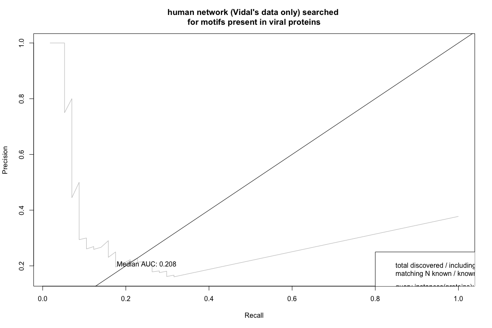<!-- --><!-- --><!-- -->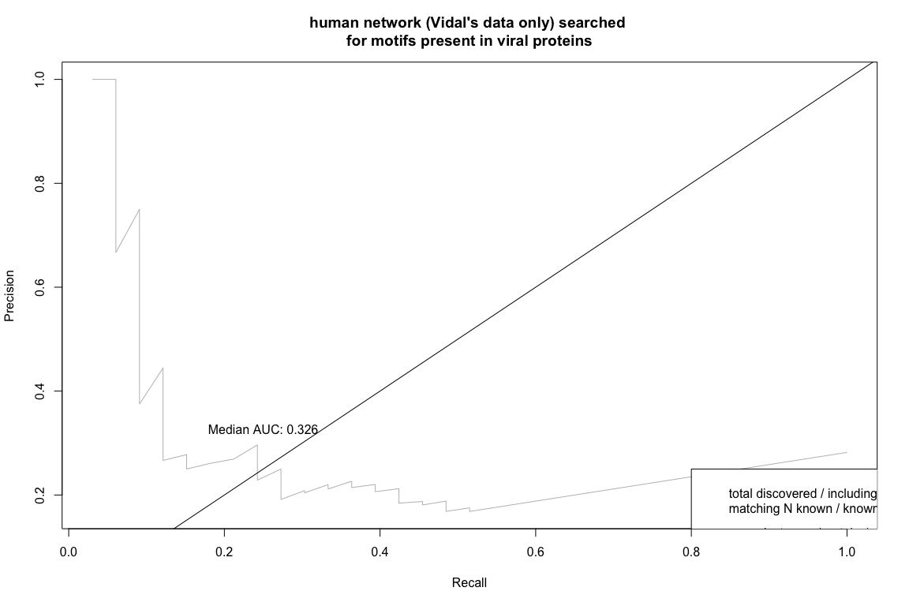<!-- -->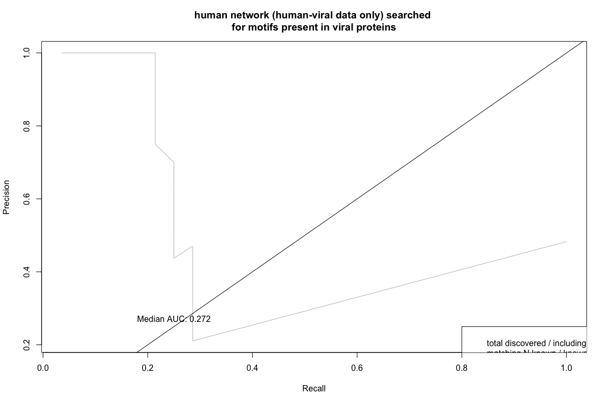<!-- -->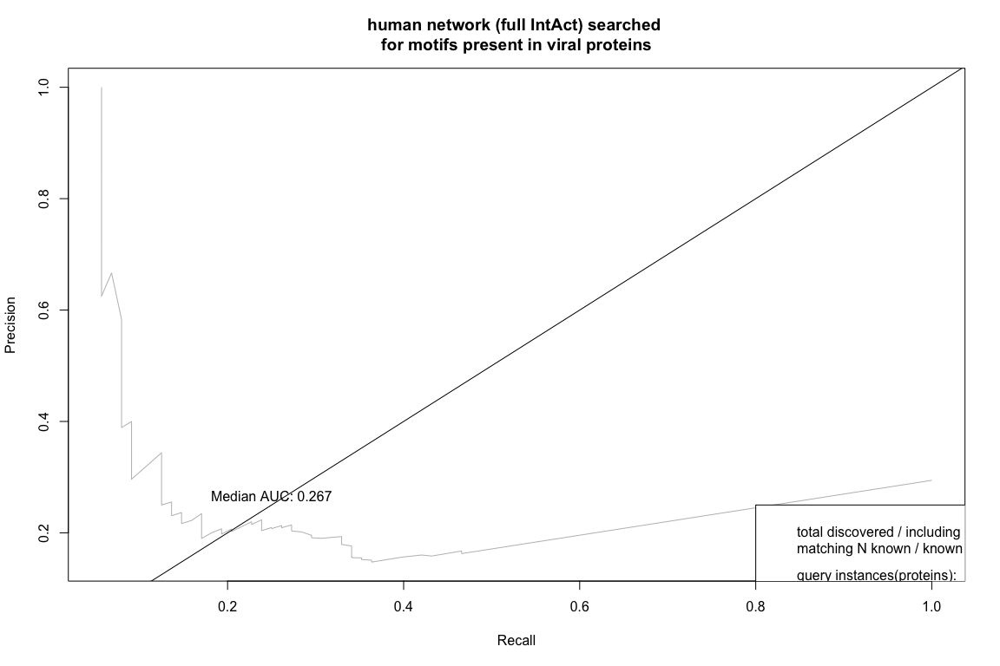<!-- -->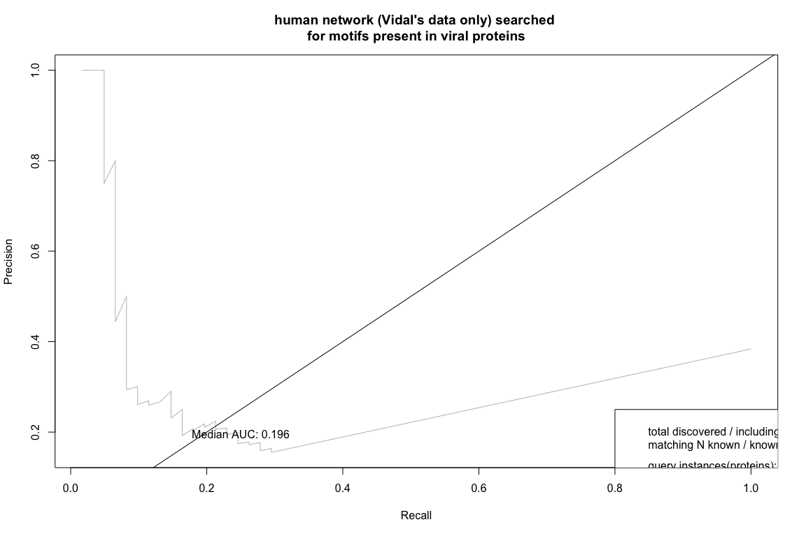<!-- -->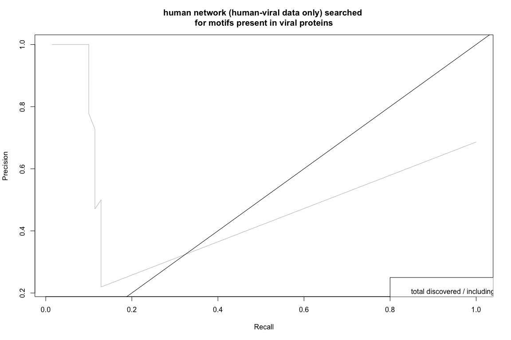<!-- -->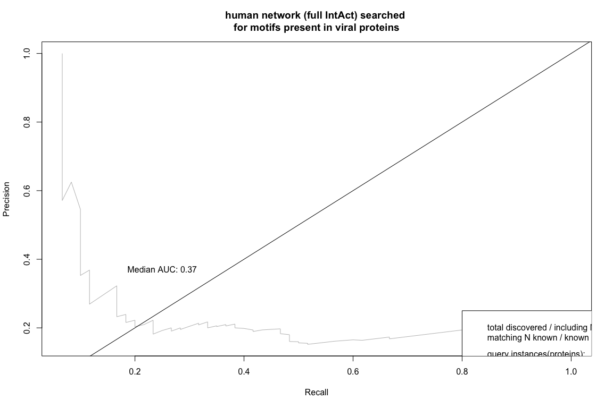<!-- -->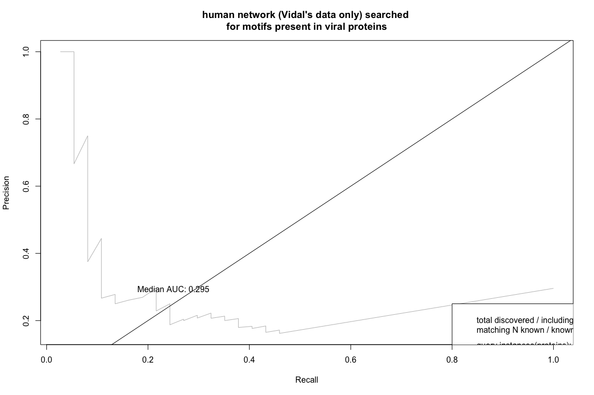<!-- -->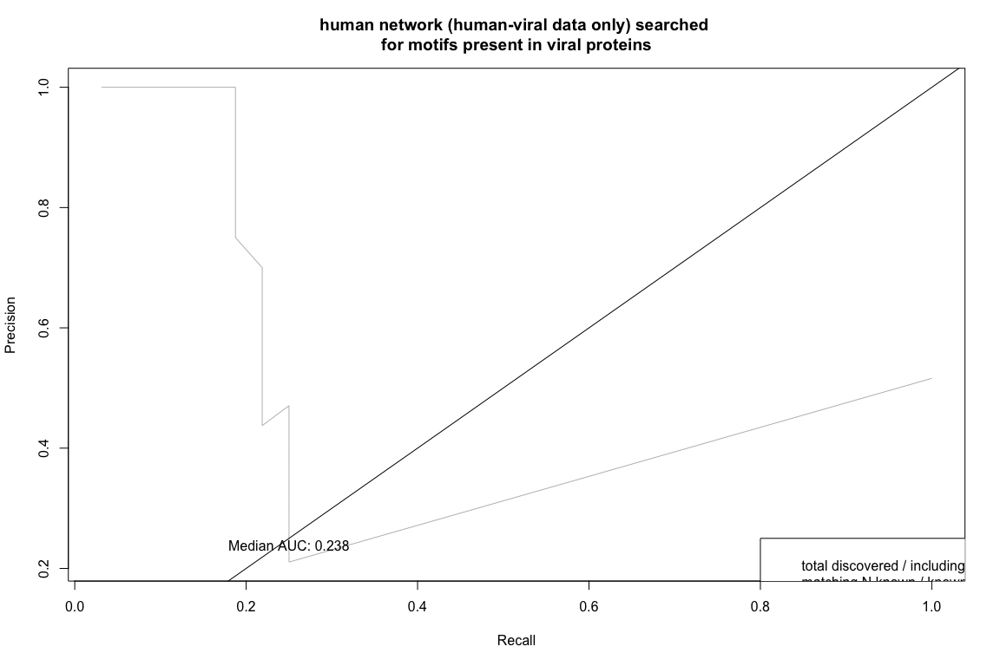<!-- -->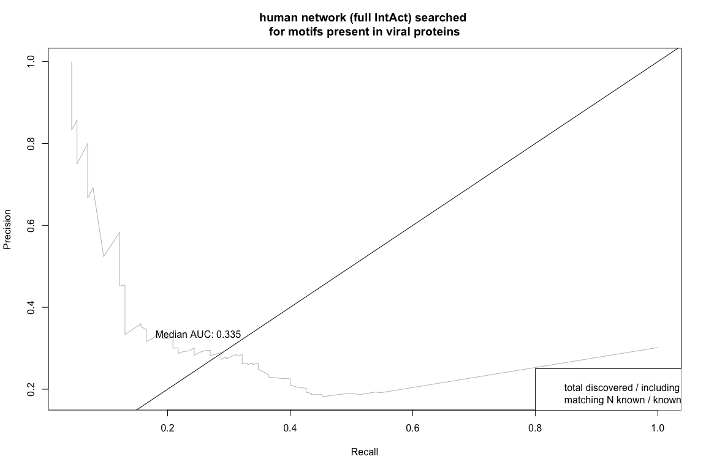<!-- -->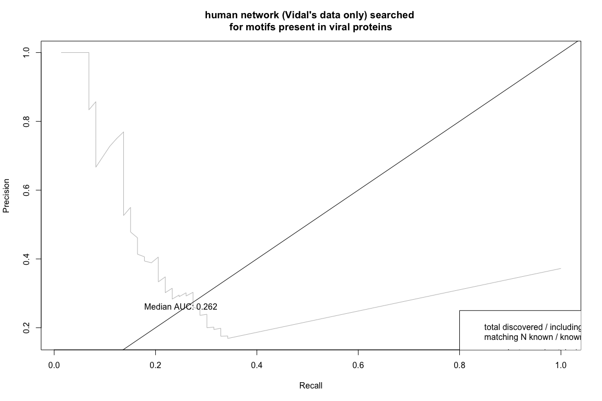<!-- -->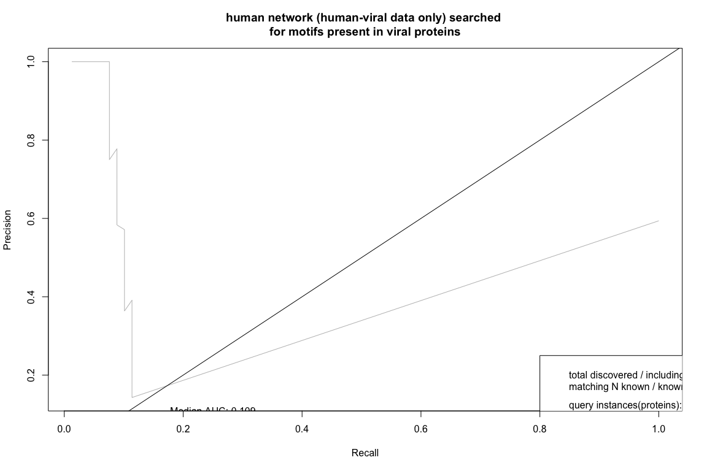<!-- --><!-- -->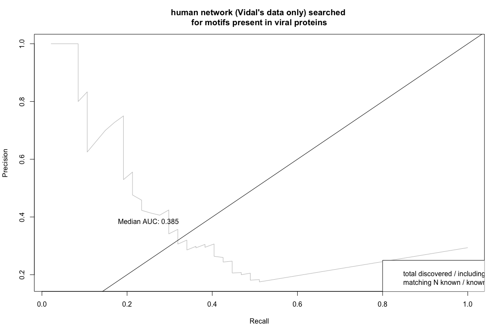<!-- -->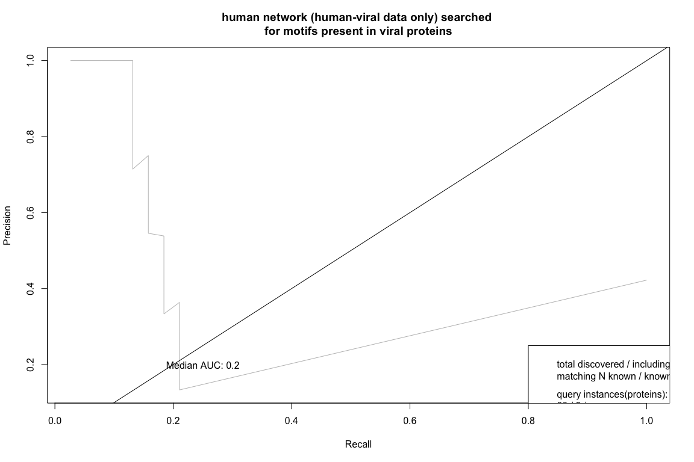<!-- -->

# protein-domain-motif-protein network


```
## [1] "2018-04-21"
```

```
##  setting  value                       
##  version  R version 3.4.3 (2017-11-30)
##  system   x86_64, darwin15.6.0        
##  ui       X11                         
##  language (EN)                        
##  collate  en_GB.UTF-8                 
##  tz       Europe/London               
##  date     2018-04-21                  
## 
##  package              * version   date       source                  
##  AnnotationDbi          1.40.0    2017-10-31 Bioconductor            
##  assertthat             0.2.0     2017-04-11 CRAN (R 3.4.0)          
##  backports              1.1.2     2017-12-13 CRAN (R 3.4.3)          
##  base                 * 3.4.3     2017-12-07 local                   
##  Biobase                2.38.0    2017-10-31 Bioconductor            
##  BiocGenerics         * 0.24.0    2017-10-31 Bioconductor            
##  BiocParallel           1.12.0    2017-10-31 Bioconductor            
##  biomaRt              * 2.34.2    2018-01-20 Bioconductor            
##  Biostrings           * 2.46.0    2017-10-31 Bioconductor            
##  bit                    1.1-12    2014-04-09 CRAN (R 3.4.0)          
##  bit64                  0.9-7     2017-05-08 CRAN (R 3.4.0)          
##  bitops                 1.0-6     2013-08-17 CRAN (R 3.4.0)          
##  blob                   1.1.1     2018-03-25 CRAN (R 3.4.3)          
##  caTools                1.17.1    2014-09-10 CRAN (R 3.4.0)          
##  colorspace             1.3-2     2016-12-14 CRAN (R 3.4.0)          
##  compiler               3.4.3     2017-12-07 local                   
##  data.table           * 1.10.4-3  2017-10-27 cran (@1.10.4-)         
##  datasets             * 3.4.3     2017-12-07 local                   
##  DBI                    0.8       2018-03-02 CRAN (R 3.4.3)          
##  DelayedArray           0.4.1     2017-11-07 Bioconductor            
##  devtools               1.13.5    2018-02-18 CRAN (R 3.4.3)          
##  digest                 0.6.15    2018-01-28 CRAN (R 3.4.3)          
##  downloader             0.4       2015-07-09 CRAN (R 3.4.0)          
##  DT                     0.4       2018-01-30 cran (@0.4)             
##  evaluate               0.10.1    2017-06-24 CRAN (R 3.4.1)          
##  futile.logger          1.4.3     2016-07-10 CRAN (R 3.4.0)          
##  futile.options         1.0.0     2010-04-06 CRAN (R 3.4.0)          
##  gdata                  2.18.0    2017-06-06 cran (@2.18.0)          
##  gdtools              * 0.1.7     2018-02-27 CRAN (R 3.4.3)          
##  GenomeInfoDb           1.14.0    2017-10-31 Bioconductor            
##  GenomeInfoDbData       1.0.0     2018-02-27 Bioconductor            
##  GenomicAlignments      1.14.1    2017-11-18 Bioconductor            
##  GenomicRanges          1.30.3    2018-02-26 Bioconductor            
##  GGally                 1.3.2     2017-08-02 CRAN (R 3.4.1)          
##  ggplot2              * 2.2.1     2016-12-30 CRAN (R 3.4.0)          
##  gplots                 3.0.1     2016-03-30 cran (@3.0.1)           
##  graphics             * 3.4.3     2017-12-07 local                   
##  grDevices            * 3.4.3     2017-12-07 local                   
##  grid                 * 3.4.3     2017-12-07 local                   
##  gridExtra            * 2.3       2017-09-09 CRAN (R 3.4.1)          
##  gsubfn                 0.7       2018-03-16 cran (@0.7)             
##  gtable                 0.2.0     2016-02-26 CRAN (R 3.4.0)          
##  gtools                 3.5.0     2015-05-29 cran (@3.5.0)           
##  htmltools              0.3.6     2017-04-28 CRAN (R 3.4.0)          
##  htmlwidgets            1.0       2018-01-20 cran (@1.0)             
##  httr                 * 1.3.1     2017-08-20 CRAN (R 3.4.1)          
##  igraph                 1.2.1     2018-03-10 CRAN (R 3.4.4)          
##  IRanges              * 2.12.0    2017-10-31 Bioconductor            
##  jsonlite               1.5       2017-06-01 CRAN (R 3.4.0)          
##  KernSmooth             2.23-15   2015-06-29 CRAN (R 3.4.0)          
##  knitr                  1.20      2018-02-20 CRAN (R 3.4.3)          
##  lambda.r               1.2       2017-09-16 CRAN (R 3.4.1)          
##  lattice                0.20-35   2017-03-25 CRAN (R 3.4.0)          
##  lazyeval               0.2.1     2017-10-29 CRAN (R 3.4.2)          
##  magrittr               1.5       2014-11-22 CRAN (R 3.4.0)          
##  Matrix                 1.2-12    2017-11-15 CRAN (R 3.4.2)          
##  matrixStats            0.53.1    2018-02-11 CRAN (R 3.4.3)          
##  memoise                1.1.0     2017-04-21 CRAN (R 3.4.0)          
##  methods              * 3.4.3     2017-12-07 local                   
##  MItools              * 0.1.36    2018-04-17 local (vitkl/MItools@NA)
##  munsell                0.4.3     2016-02-13 CRAN (R 3.4.0)          
##  ontologyIndex          2.4       2017-02-06 CRAN (R 3.4.0)          
##  parallel             * 3.4.3     2017-12-07 local                   
##  pillar                 1.2.1     2018-02-27 CRAN (R 3.4.3)          
##  pkgconfig              2.0.1     2017-03-21 CRAN (R 3.4.0)          
##  plyr                 * 1.8.4     2016-06-08 CRAN (R 3.4.0)          
##  prettyunits            1.0.2     2015-07-13 CRAN (R 3.4.0)          
##  progress               1.1.2     2016-12-14 CRAN (R 3.4.0)          
##  proto                  1.0.0     2016-10-29 cran (@1.0.0)           
##  PSICQUIC             * 1.16.4    2018-01-17 Bioconductor            
##  qvalue                 2.10.0    2017-10-31 Bioconductor            
##  R.methodsS3            1.7.1     2016-02-16 CRAN (R 3.4.0)          
##  R.oo                   1.21.0    2016-11-01 CRAN (R 3.4.0)          
##  R.utils                2.6.0     2017-11-05 CRAN (R 3.4.2)          
##  R6                     2.2.2     2017-06-17 CRAN (R 3.4.0)          
##  RColorBrewer           1.1-2     2014-12-07 CRAN (R 3.4.0)          
##  Rcpp                   0.12.16   2018-03-13 CRAN (R 3.4.4)          
##  RCurl                  1.95-4.10 2018-01-04 CRAN (R 3.4.3)          
##  reshape                0.8.7     2017-08-06 CRAN (R 3.4.1)          
##  reshape2               1.4.3     2017-12-11 CRAN (R 3.4.3)          
##  rlang                  0.2.0     2018-02-20 CRAN (R 3.4.3)          
##  rmarkdown              1.9       2018-03-01 CRAN (R 3.4.3)          
##  ROCR                   1.0-7     2015-03-26 cran (@1.0-7)           
##  rprojroot              1.3-2     2018-01-03 CRAN (R 3.4.3)          
##  Rsamtools              1.30.0    2017-10-31 Bioconductor            
##  RSQLite                2.0       2017-06-19 CRAN (R 3.4.1)          
##  rtracklayer            1.38.3    2018-01-23 Bioconductor            
##  S4Vectors            * 0.16.0    2017-10-31 Bioconductor            
##  scales                 0.5.0     2017-08-24 CRAN (R 3.4.1)          
##  splines                3.4.3     2017-12-07 local                   
##  stats                * 3.4.3     2017-12-07 local                   
##  stats4               * 3.4.3     2017-12-07 local                   
##  stringi                1.1.7     2018-03-12 CRAN (R 3.4.3)          
##  stringr                1.3.0     2018-02-19 CRAN (R 3.4.3)          
##  SummarizedExperiment   1.8.1     2017-12-19 Bioconductor            
##  svglite                1.2.1     2017-09-11 CRAN (R 3.4.1)          
##  tibble                 1.4.2     2018-01-22 CRAN (R 3.4.3)          
##  tools                  3.4.3     2017-12-07 local                   
##  utils                * 3.4.3     2017-12-07 local                   
##  VennDiagram            1.6.20    2018-03-28 CRAN (R 3.4.4)          
##  withr                  2.1.2     2018-03-15 CRAN (R 3.4.4)          
##  XML                    3.98-1.10 2018-02-19 CRAN (R 3.4.3)          
##  XVector              * 0.18.0    2017-10-31 Bioconductor            
##  yaml                   2.1.18    2018-03-08 CRAN (R 3.4.4)          
##  zlibbioc               1.24.0    2017-10-31 Bioconductor
```
