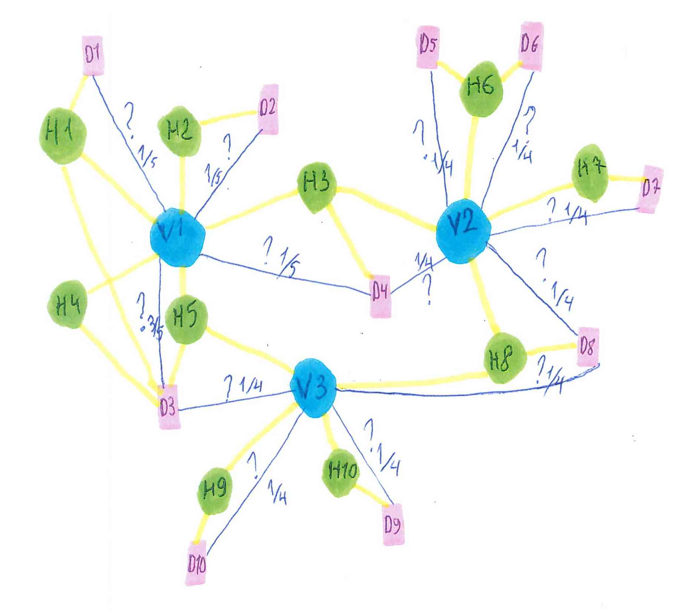
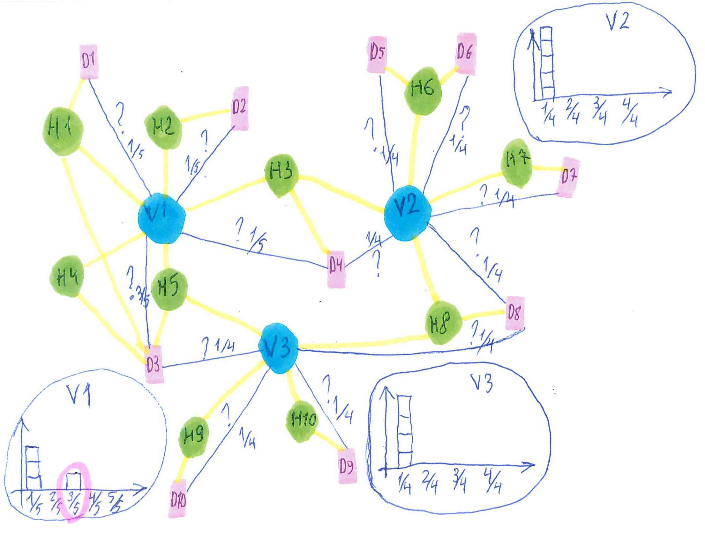
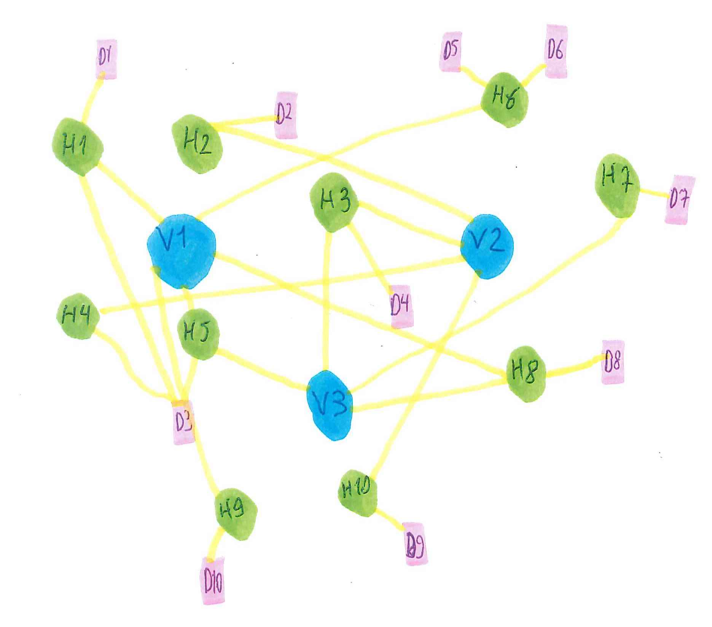
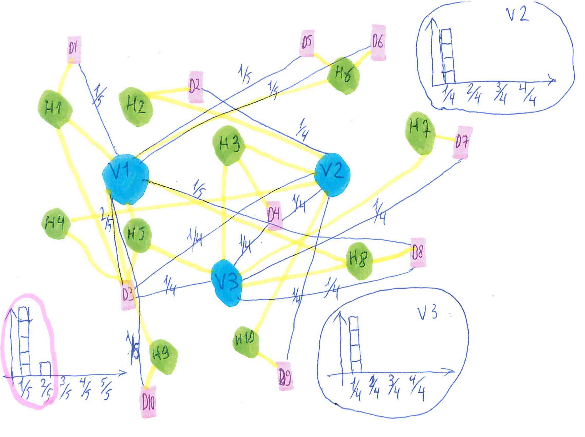
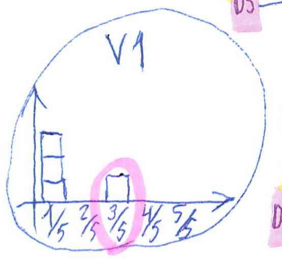
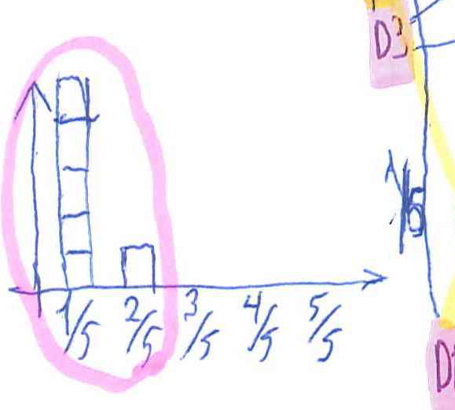

```{r setup, include=FALSE}
knitr::opts_chunk$set(echo = TRUE)

packages = c("data.table","R.utils", "ggplot2", "MItools", "GGally", "DT")
if(mean(packages %in% names(installed.packages()[,"Package"])) != 1){
      packages_to_install = packages[!packages %in% names(installed.packages()[,"Package"])]
      install.packages(packages_to_install)
      packages_to_install = packages[!packages %in% names(installed.packages()[,"Package"])]
      source("https://bioconductor.org/biocLite.R")
      biocLite(packages_to_install)
      devtools::install_github("vitkl/MItools")
}

suppressPackageStartupMessages({
    library(data.table)
    library(R.utils)
    library(ggplot2)
    library(MItools)
    library(GGally)
    library(DT)
})
```

## Null hypothesis description

## How often do we observe specific fold enrichment value among interactors of a viral protein

#### Probability distribution under the NULL hypothesis: How often specific domain fold enrichment among interactors of a specific viral protein (attribute of a pair viral_protein-human_domain) is observed as compared to any domain fold enrichment among interactors of that viral protein (attribute of a viral_protein, distribution), the latter is derived from permutation mimicking as if viral protein was binding to a different set of human proteins  
Using fold enrichent as a statistic accounts for domain frequency in the background distribution.


One of the ways to describe the problem of finding domains that are likely to mediate interaction of human proteins with viral proteins is by drawing a network which has 3 types of elements: viral proteins (V1, V2, V3), human proteins (H1-10) and human domains (D1-10).
```{r, out.width = "500px"}
knitr::include_graphics("./images/net_start.jpg")
```


First, we compute the fraction of human interacting partners of V2 that contain domain D6. Then, we compute the fold enrichment by dividing this fraction by the domain frequency among all proteins in the network.
```{r, out.width = "500px"}

```

Next, we can calculate the frequency of the fraction of human interacting partners of V2 that contain domain D6 (for every viral protein and every human domain).
```{r, out.width = "500px"}

```

Next, we permute which human proteins interact with V1, V2 and V3, keeping the number of interaction per both viral and human proteins as well as number of edges (interactions) constant
```{r, out.width = "500px"}

```

and compute the fraction of new random human interacting partners of V2 that contain any domain
```{r, out.width = "500px"}

```

Finally, we compare each real fold enrichment value to the distribution of fold enrichment of randomly associated domains. For each human domain-viral protein value we calculate the fraction of the (random) distribution that is as high or higher than the real value. We repeat this procedure 100 000 times averaging out the fraction which gives us the probability of specific human domain - specific viral protein co-occurence if the domain and the protein were unrelated.  
```{r, out.width = "200px"}

```
```{r, out.width = "200px"}

```


## Load network 

```{r}
viral_human_net_w_domains = fread("./processed_data_files/viral_human_net_w_domains", sep = "\t", stringsAsFactors = F)

# generate minimal information tables
viral_human_net = unique(viral_human_net_w_domains[,.(IDs_interactor_viral, IDs_interactor_human, IDs_interactor_viral_degree)])
datatable(viral_human_net)
domains_proteins = unique(viral_human_net_w_domains[,.(IDs_interactor_human, IDs_domain_human, domain_frequency)])
datatable(domains_proteins)
viral_human_net_w_domains = unique(viral_human_net_w_domains[,.(IDs_interactor_viral, IDs_interactor_human, IDs_domain_human, fold_enrichment)])
datatable(viral_human_net_w_domains)
```

```{r}

```