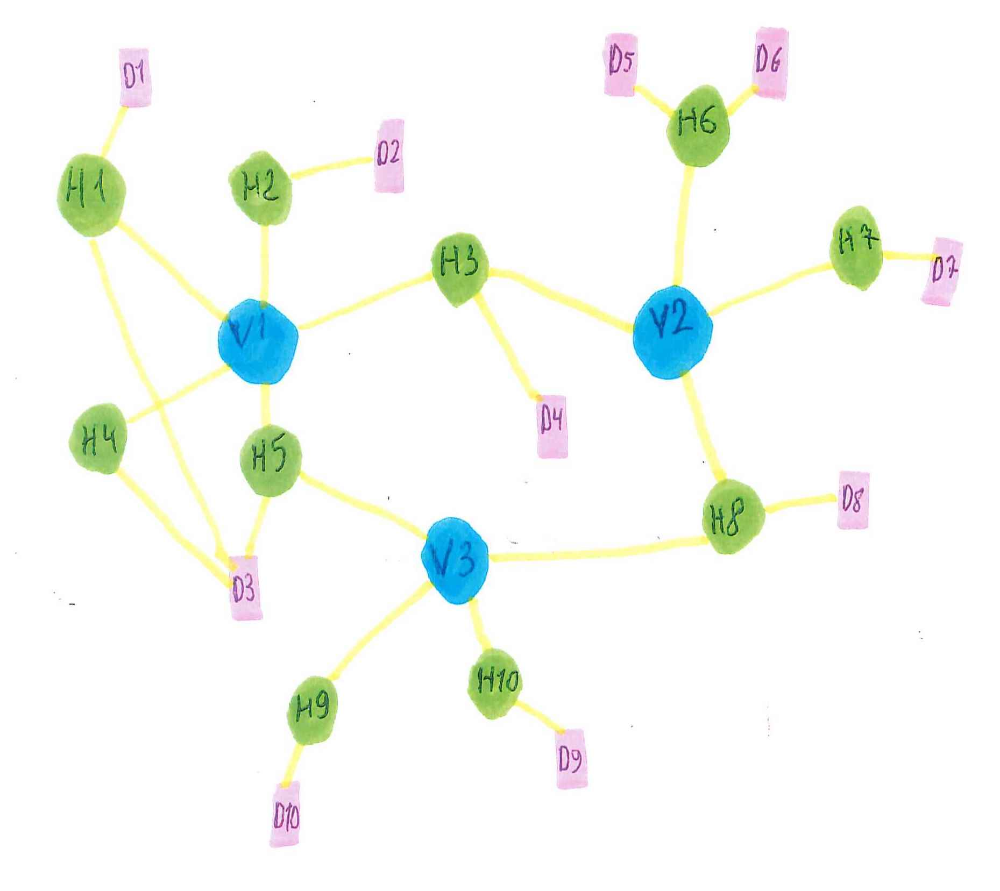
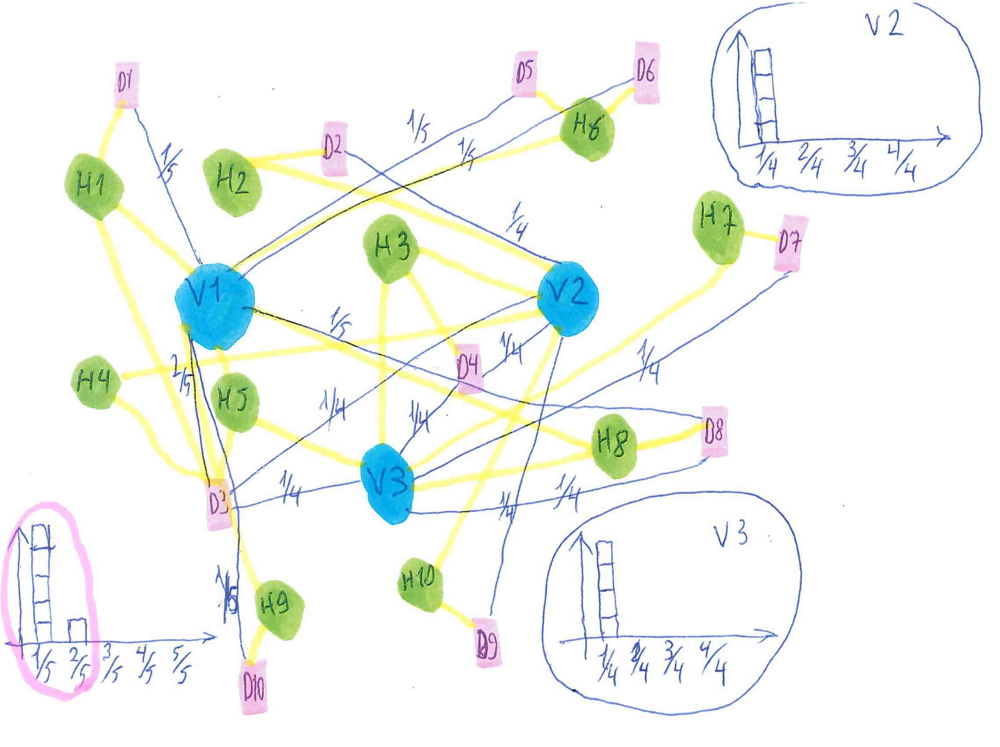
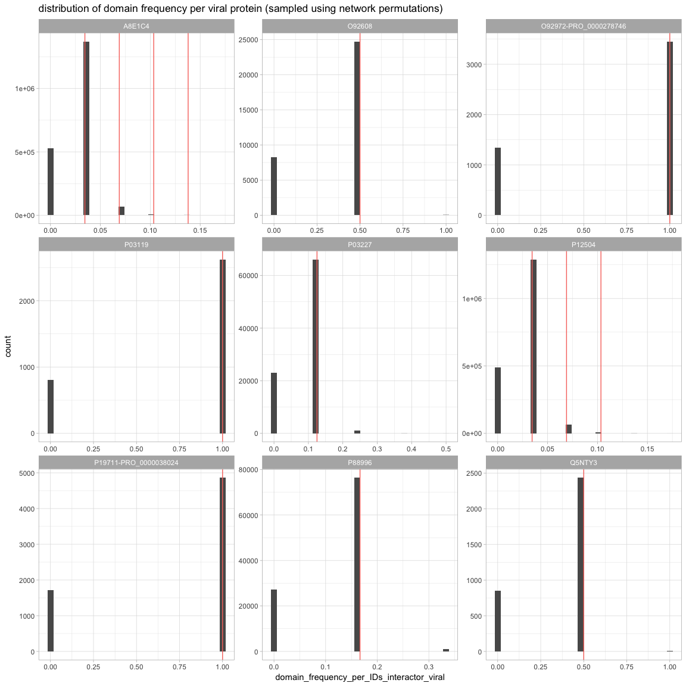
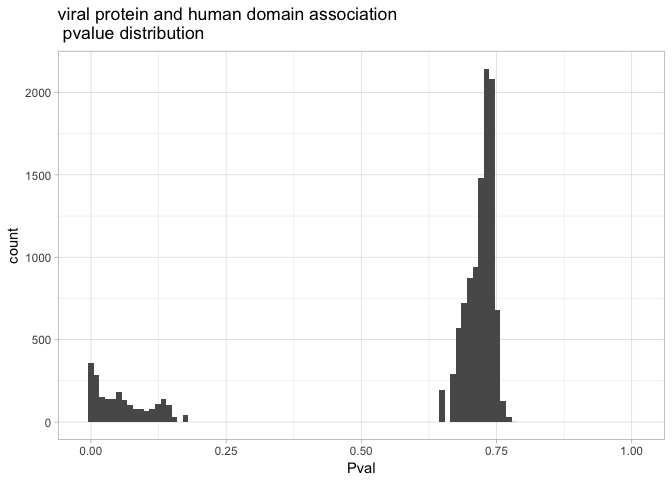
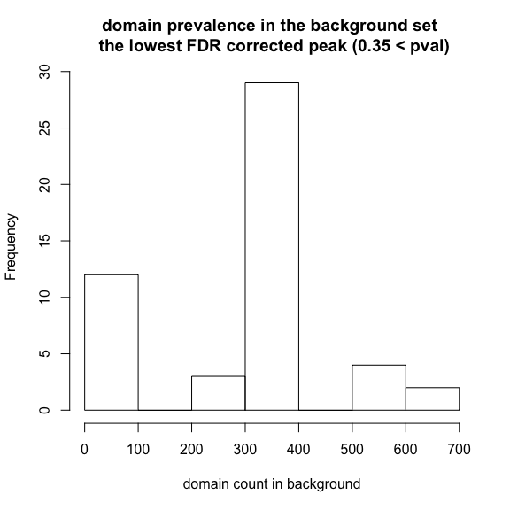
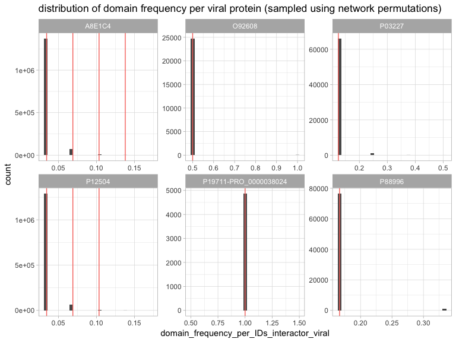
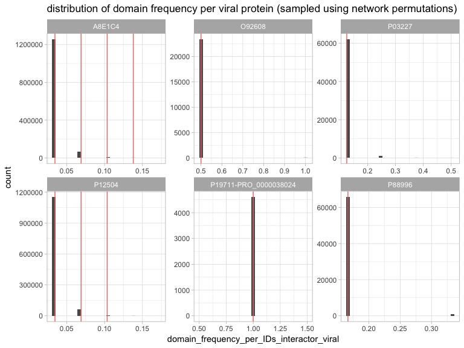
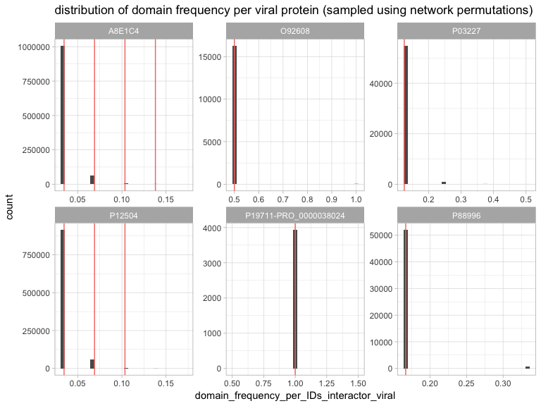
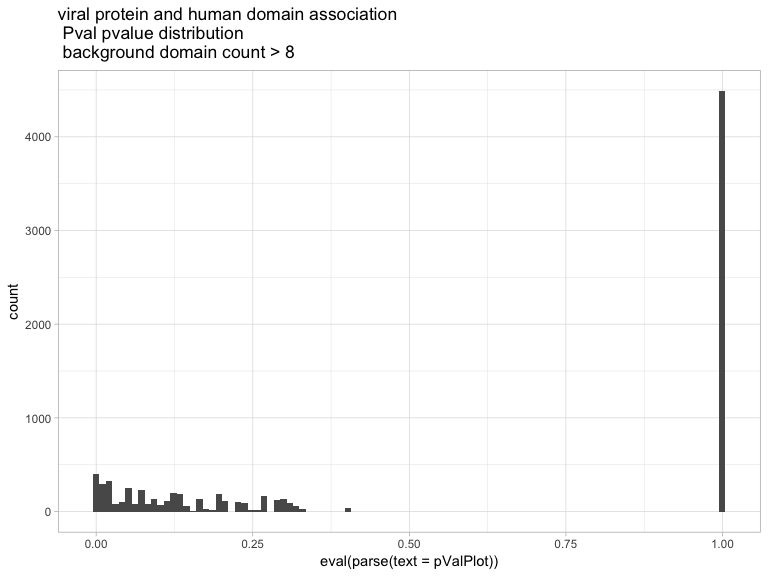
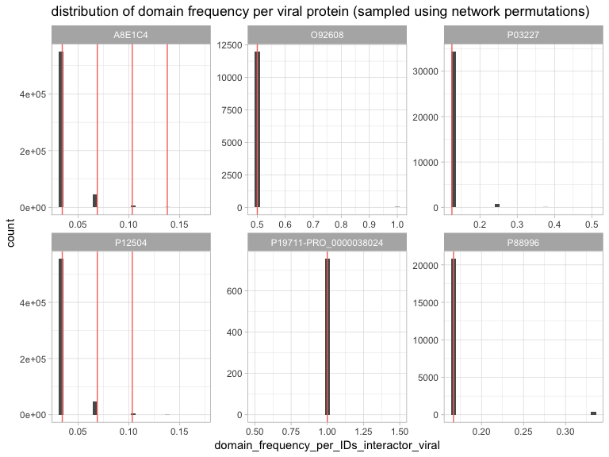

# Domain enrichment by permutation
Vitalii Kleshchevnikov  
25/07/2017  

2017-07-31

## Installing/loading packages


## Setting up how many cores to use for analysis and fold-enrichment vs freqency


```r
# cores to use for multiprocessing: is the number of cores is small -> we are not on a cluster -> use all; if the number of cores is large -> we are on cluster -> use only 15 or 7 cores
if(detectCores() <= 4) cores_to_use = detectCores() - 1
if(detectCores() > 4) cores_to_use = 15

# frequency in a set (of human interacting partners of viral protein) or fold_enrichment?
frequency = F 
```

## Null hypothesis description

## How often do we observe specific fold enrichment value among interactors of a viral protein

#### Probability distribution under the NULL hypothesis: How often specific domain fold enrichment among interactors of a specific viral protein (attribute of a pair viral_protein-human_domain) is observed as compared to any domain fold enrichment among interactors of that viral protein (attribute of a viral_protein, distribution), the latter is derived from permutation mimicking as if viral protein was binding to a different set of human proteins  
Using fold enrichent as a statistic accounts for domain frequency in the background distribution. Background distribution of domain frequency in based on all human proteins with known PPI. 


One of the ways to describe the problem of finding domains that are likely to mediate interaction of human proteins with viral proteins is by drawing a network which has 3 types of elements: viral proteins (V1, V2, V3), human proteins (H1-10) and human domains (D1-10).

```r

```


First, we compute the fraction of human interacting partners of V2 that contain domain D6. Then, we compute the fold enrichment by dividing this fraction by the domain frequency among all proteins in the network.

```r
knitr::include_graphics("./images/net_start_calc.jpg")
```


Next, we can calculate the frequency of the fraction of human interacting partners of V2 that contain domain D6 (for every viral protein and every human domain).

```r
knitr::include_graphics("./images/net_start_fraq.jpg")
```


Next, we permute which human proteins interact with V1, V2 and V3, keeping the number of interaction per both viral and human proteins as well as number of edges (interactions) constant

```r
knitr::include_graphics("./images/net_scram.jpg")
```


and compute the fraction of new random human interacting partners of V2 that contain any domain

```r

```


Finally, we compare each real fold enrichment value to the distribution of fold enrichment of randomly associated domains. For each human domain-viral protein value we calculate the fraction of the (random) distribution that is as high or higher than the real value. We repeat this procedure 1000-5000 times averaging out the fraction which gives us the probability of specific human domain - specific viral protein co-occurence if the domain and the protein were unrelated.  

```r
knitr::include_graphics("./images/net_start_fraq_plot.jpg")
```


```r
knitr::include_graphics("./images/net_scram_fraq_plot.jpg")
```


## Load network 

Network is save by "Map_domains_to_network.Rmd" script where details of how the network was obtained are specified.


```r
viral_human_net_w_domains_d = fread("./processed_data_files/viral_human_net_w_domains", sep = "\t", stringsAsFactors = F)

# generate minimal information tables
viral_human_net = unique(viral_human_net_w_domains_d[,.(IDs_interactor_viral, IDs_interactor_human, IDs_interactor_viral_degree)])

domains_proteins = unique(viral_human_net_w_domains_d[,.(IDs_interactor_human, IDs_domain_human, domain_frequency)])

viral_human_net_w_domains = unique(viral_human_net_w_domains_d[,.(IDs_interactor_viral, IDs_interactor_human, IDs_domain_human, domain_frequency_per_IDs_interactor_viral, fold_enrichment)])
```

## Calculate fold enrichment distribution of each viral protein in any domain and plot a few examples


```r
if(!file.exists("./large_processed_data_files/viral_foldEnrichDist.tsv.gz")){
    # calculate fold enrichment distribution
    viral_foldEnrichDist = foldEnrichmentDist(net = viral_human_net, 
                                              protein_annot = domains_proteins, 
                                              N = 5000, cores = cores_to_use, seed = 1, frequency = frequency)
    fwrite(viral_foldEnrichDist, "./large_processed_data_files/viral_foldEnrichDist.tsv", sep = "\t")
    gzip("./large_processed_data_files/viral_foldEnrichDist.tsv", remove = T)
}
gunzip("./large_processed_data_files/viral_foldEnrichDist.tsv.gz", remove = F)
viral_foldEnrichDist = fread("./large_processed_data_files/viral_foldEnrichDist.tsv", sep = "\t", stringsAsFactors = F)
```

```
## 
Read 0.0% of 51210281 rows
Read 18.3% of 51210281 rows
Read 36.6% of 51210281 rows
Read 55.1% of 51210281 rows
Read 72.8% of 51210281 rows
Read 91.4% of 51210281 rows
Read 51210281 rows and 2 (of 2) columns from 1.181 GB file in 00:00:08
```

```r
unlink("./large_processed_data_files/viral_foldEnrichDist.tsv")

# sanity check: calculate fold enrichment distribution again and compare if results match!
viral_foldEnrichDist2 = foldEnrichmentDist(net = viral_human_net, 
                                           protein_annot = domains_proteins, 
                                           N = 5000, cores = cores_to_use, seed = 1, frequency = frequency)
all.equal(viral_foldEnrichDist,  viral_foldEnrichDist2)
```

```
## [1] TRUE
```

```r
viral_foldEnrichDist; viral_foldEnrichDist2
```

```
##           IDs_interactor_viral sampled_fold_enrichment
##        1:           A0A0C7TUY8                506.8182
##        2:           A0A0C7TUY8                206.4815
##        3:           A0A0C7TUY8                218.6275
##        4:           A0A0C7TUY8               2787.5000
##        5:           A0A0C7TUY8              11150.0000
##       ---                                             
## 51210277:               X5HMX4                  0.0000
## 51210278:               X5HMX4                359.6774
## 51210279:               X5HMX4                  0.0000
## 51210280:               X5HMX4                137.6543
## 51210281:               X5HMX4               1858.3333
```

```
##           IDs_interactor_viral sampled_fold_enrichment
##        1:           A0A0C7TUY8                506.8182
##        2:           A0A0C7TUY8                206.4815
##        3:           A0A0C7TUY8                218.6275
##        4:           A0A0C7TUY8               2787.5000
##        5:           A0A0C7TUY8              11150.0000
##       ---                                             
## 51210277:               X5HMX4                  0.0000
## 51210278:               X5HMX4                359.6774
## 51210279:               X5HMX4                  0.0000
## 51210280:               X5HMX4                137.6543
## 51210281:               X5HMX4               1858.3333
```

```r
rm(viral_foldEnrichDist2)

# plot a few random cases
set.seed(1)
plotFoldEnrichmentDist(proteinID = sample(unique(viral_human_net$IDs_interactor_viral), 9), 
                       fold_enrichment_dist = viral_foldEnrichDist, 
                       data = viral_human_net_w_domains, text_lab = F, frequency = frequency)
```

```
## `stat_bin()` using `bins = 30`. Pick better value with `binwidth`.
```

<!-- -->

## Calculate P value for each viral protein and each human domain association


```r
if(!file.exists("./processed_data_files/viralProtein_humanDomain_pval.tsv")){
    # calculate pvalue
    Pvals = foldEnrichmentPval(fold_enrichment_dist = viral_foldEnrichDist, 
                               data = viral_human_net_w_domains, cores = cores_to_use, frequency = frequency)
    fwrite(Pvals, "./processed_data_files/viralProtein_humanDomain_pval.tsv", sep = "\t")
}
rm(viral_foldEnrichDist)
Pvals = fread("./processed_data_files/viralProtein_humanDomain_pval.tsv", sep = "\t", stringsAsFactors = F)

# plot pvalue distribution
ggplot(Pvals, aes(x = Pval)) + geom_histogram(bins = 100) + ggtitle("viral protein and human domain association \n pvalue distribution") + theme_light() + xlim(0,1)
```

<!-- -->

```r
# calculate fdr adjusted pvalue
Pvals[, Pval_fdr := p.adjust(Pval, method = "fdr")]
ggplot(Pvals, aes(x = Pval_fdr)) + geom_histogram(bins = 100) + ggtitle("viral protein and human domain association \n FDR adjusted pvalue distribution") + theme_light() + xlim(0,1)
```

<!-- -->

```r
# calculate q-value
Pvals_qvalue = Pvals[, qvalue(Pval)]
Pvals[, Qval := qvalue(Pval)$qvalues]
ggplot((Pvals), aes(x = Qval)) + geom_histogram(bins = 100) + ggtitle("viral protein and human domain association \n qvalue adjusted pvalue distribution") + theme_light() + xlim(0,1)
```

<!-- -->

```r
# plot fold enrichment vs pvalue
ggplot(Pvals, aes(x = fold_enrichment, y = Pval)) + geom_bin2d() + ggtitle("viral protein and human domain association \n fold enrichment vs p-value") + ylab("p-value") + xlab("fold enrichment") + scale_x_log10()
```

```
## Warning: Transformation introduced infinite values in continuous x-axis
```

```
## Warning: Removed 483 rows containing non-finite values (stat_bin2d).
```

<!-- -->

## Relationships between pvalue statistic and protein/domain properties


```r
# merge results to original data
viral_human_net_w_domains_d2 = viral_human_net_w_domains_d[Pvals, on = c("IDs_interactor_viral", "IDs_domain_human", "fold_enrichment")]

# function to accomodate ggplot2::geom_bin2d in GGally::ggpairs, taken from http://ggobi.github.io/ggally/#custom_functions
d2_bin <- function(data, mapping, ..., low = "#132B43", high = "#56B1F7") {
    ggplot(data = data, mapping = mapping) +
        geom_bin2d(...) +
        scale_fill_gradient(low = low, high = high) +
        scale_y_log10() + scale_x_log10()
}

log10_density = function(data, mapping, ...){
    ggplot(data = data, mapping = mapping) +
        geom_density(...) +
        scale_x_log10()
}

GGally::ggpairs(viral_human_net_w_domains_d2[IDs_domain_human != "",.(domain_count, domain_frequency, 
                                               Taxid_interactor_viral,
                                               IDs_interactor_viral_degree, 
                                               IDs_interactor_human_degree, 
                                               domain_count_per_IDs_interactor_viral,
                                               domain_frequency_per_IDs_interactor_viral,
                                               fold_enrichment,
                                               Pval, Pval_fdr, Qval)], 
                lower = list(continuous = d2_bin), 
                diag = list(continuous = log10_density)) +
    theme_light() +
    theme(strip.text.y = element_text(angle = 0, size = 10),
          strip.text.x = element_text(angle = 90, size = 10))
```

<!-- -->

```r
hist(viral_human_net_w_domains_d2[Pval_fdr < 0.35, domain_count_per_IDs_interactor_viral], main = "number of human proteins with specific domain per viral protein \n the lowest FDR corrected peak (0.35 < pval)", xlab = "how many times domain is repeated")
```

<!-- -->

```r
hist(viral_human_net_w_domains_d2[Pval_fdr < 0.35, domain_count], main = "domain prevalence in the background set \n the lowest FDR corrected peak (0.35 < pval)", xlab = "domain count in background")
```

<!-- -->

## Try deleting domains with low background counts


```r
# recalculate using all domains
    d0 = domainEnrichment(backgr_domain_count = 0, 
                          net = viral_human_net,
                          protein_annot = domains_proteins, 
                          data = viral_human_net_w_domains,
                          N = 5000, cores = cores_to_use, seed = 1, 
                          all.data = viral_human_net_w_domains_d, frequency = frequency)
# sanity check whether pipeline above gives the same result as the domainEnrichment function
    d0$Pvals; Pvals
```

```
##        IDs_interactor_viral IDs_domain_human fold_enrichment       Pval
##     1:           A0A0K1LEV0        IPR000795       557.50000 0.30040221
##     2:           A0A0K1LEV0        IPR031157      3716.66667 0.06473102
##     3:           A0A0K1LEV0        IPR009000     11150.00000 0.03871292
##     4:           A0A0K1LEV0        IPR009001      1238.88889 0.19444444
##     5:               A0MPS7        IPR015030      3716.66667 0.03814059
##    ---                                                                 
## 12358:               U5TQE9        IPR000719        20.88015 0.68064689
## 12359:               U5TQE9        IPR011029       109.31373 0.47268823
## 12360:               W6AVY5        IPR003103       309.72222 0.16096474
## 12361:               W6AVY5        IPR001623        29.49735 0.55100275
## 12362:               W6AVY5        IPR019734        13.97243 0.67602569
##         Pval_fdr       Qval
##     1: 0.5834643 0.17813432
##     2: 0.3555165 0.10854082
##     3: 0.3247257 0.09914024
##     4: 0.4904756 0.14974445
##     5: 0.3247257 0.09914024
##    ---                     
## 12358: 0.8163324 0.24923001
## 12359: 0.7157610 0.21852511
## 12360: 0.4564985 0.13937108
## 12361: 0.7536686 0.23009846
## 12362: 0.8147449 0.24874533
```

```
##        IDs_interactor_viral IDs_domain_human fold_enrichment       Pval
##     1:           A0A0C7TUY8                          0.00000 1.00000000
##     2:           A0A0K1LEV0        IPR000795       557.50000 0.30040221
##     3:           A0A0K1LEV0        IPR031157      3716.66667 0.06473102
##     4:           A0A0K1LEV0        IPR009000     11150.00000 0.03871292
##     5:           A0A0K1LEV0        IPR009001      1238.88889 0.19444444
##    ---                                                                 
## 12841:               W6AVY5        IPR003103       309.72222 0.16096474
## 12842:               W6AVY5                          0.00000 1.00000000
## 12843:               W6AVY5        IPR001623        29.49735 0.55100275
## 12844:               W6AVY5        IPR019734        13.97243 0.67602569
## 12845:               X5HMX4                          0.00000 1.00000000
##         Pval_fdr      Qval
##     1: 1.0000000 0.7517588
##     2: 0.6062611 0.4557621
##     3: 0.3694070 0.2777050
##     4: 0.3374132 0.2536533
##     5: 0.5096392 0.3831257
##    ---                    
## 12841: 0.4743345 0.3565852
## 12842: 1.0000000 0.7517588
## 12843: 0.7831155 0.5887139
## 12844: 0.8465781 0.6364225
## 12845: 1.0000000 0.7517588
```

```r
    all.equal(d0$Pvals, Pvals)
```

```
## [1] "Different number of rows"
```

```r
if(!file.exists("./large_processed_data_files/minus_low_background_counts")){
    # recalculate using all domains
    d0 = domainEnrichment(backgr_domain_count = 0, 
                          net = viral_human_net,
                          protein_annot = domains_proteins, 
                          data = viral_human_net_w_domains,
                          N = 1000, cores = cores_to_use, seed = 1, 
                          all.data = viral_human_net_w_domains_d, frequency = frequency)
    
    # delete domains with background count <= 1
    d1 = domainEnrichment(backgr_domain_count = 1, 
                          net = viral_human_net,
                          protein_annot = domains_proteins, 
                          data = viral_human_net_w_domains,
                          N = 1000, cores = cores_to_use, seed = 1, 
                          all.data = viral_human_net_w_domains_d, frequency = frequency)
    
    # delete domains with background count <= 2
    d2 = domainEnrichment(backgr_domain_count = 2, 
                          net = viral_human_net,
                          protein_annot = domains_proteins, 
                          data = viral_human_net_w_domains,
                          N = 1000, cores = cores_to_use, seed = 1, 
                          all.data = viral_human_net_w_domains_d, frequency = frequency)

    # delete domain with background count <= 4
    d4 = domainEnrichment(backgr_domain_count = 4, 
                          net = viral_human_net,
                          protein_annot = domains_proteins, 
                          data = viral_human_net_w_domains,
                          N = 1000, cores = cores_to_use, seed = 1, 
                          all.data = viral_human_net_w_domains_d, frequency = frequency)

    # delete domains with background count <= 8
    d8 = domainEnrichment(backgr_domain_count = 8, 
                          net = viral_human_net,
                          protein_annot = domains_proteins, 
                          data = viral_human_net_w_domains,
                          N = 1000, cores = cores_to_use, seed = 1, 
                          all.data = viral_human_net_w_domains_d, frequency = frequency)

    # delete domains with background count <= 16
    d16 = domainEnrichment(backgr_domain_count = 16, 
                           net = viral_human_net,
                           protein_annot = domains_proteins, 
                           data = viral_human_net_w_domains,
                           N = 1000, cores = cores_to_use, seed = 1, 
                           all.data = viral_human_net_w_domains_d, frequency = frequency)
    
    save(d0, d1, d2, d4, d8, d16, file = "./large_processed_data_files/minus_low_background_counts")
}
```


## Deleting domains with low background frequency counts leads to ...


```r
load(file = "./large_processed_data_files/minus_low_background_counts")
# show p-value distributions and sampled fold_enrichment or frequency distributions
d0$PvalPlot
```

<!-- -->

```r
d0$distPlot
```

```
## `stat_bin()` using `bins = 30`. Pick better value with `binwidth`.
```

<!-- -->

```r
d1$PvalPlot
```

<!-- -->

```r
d1$distPlot
```

```
## `stat_bin()` using `bins = 30`. Pick better value with `binwidth`.
```

<!-- -->

```r
d2$PvalPlot
```

<!-- -->

```r
d2$distPlot
```

```
## `stat_bin()` using `bins = 30`. Pick better value with `binwidth`.
```

<!-- -->

```r
d4$PvalPlot
```

<!-- -->

```r
d4$distPlot
```

```
## `stat_bin()` using `bins = 30`. Pick better value with `binwidth`.
```

<!-- -->

```r
d8$PvalPlot
```

<!-- -->

```r
d8$distPlot
```

```
## `stat_bin()` using `bins = 30`. Pick better value with `binwidth`.
```

<!-- -->

```r
d16$PvalPlot
```

<!-- -->

```r
d16$distPlot
```

```
## `stat_bin()` using `bins = 30`. Pick better value with `binwidth`.
```

<!-- -->

## R session information


```r
Sys.Date()
```

```
## [1] "2017-07-31"
```

```r
sessionInfo()
```

```
## R version 3.4.0 (2017-04-21)
## Platform: x86_64-apple-darwin15.6.0 (64-bit)
## Running under: macOS Sierra 10.12.6
## 
## Matrix products: default
## BLAS: /Library/Frameworks/R.framework/Versions/3.4/Resources/lib/libRblas.0.dylib
## LAPACK: /Library/Frameworks/R.framework/Versions/3.4/Resources/lib/libRlapack.dylib
## 
## locale:
## [1] en_GB.UTF-8/en_GB.UTF-8/en_GB.UTF-8/C/en_GB.UTF-8/en_GB.UTF-8
## 
## attached base packages:
## [1] stats4    parallel  stats     graphics  grDevices utils     datasets 
## [8] methods   base     
## 
## other attached packages:
##  [1] GGally_1.3.1        qvalue_2.8.0        MItools_0.1.4      
##  [4] Biostrings_2.44.1   XVector_0.16.0      PSICQUIC_1.14.0    
##  [7] plyr_1.8.4          httr_1.2.1          biomaRt_2.32.1     
## [10] IRanges_2.10.2      S4Vectors_0.14.3    BiocGenerics_0.22.0
## [13] ggplot2_2.2.1       R.utils_2.5.0       R.oo_1.21.0        
## [16] R.methodsS3_1.7.1   data.table_1.10.4  
## 
## loaded via a namespace (and not attached):
##  [1] Rcpp_0.12.11               lattice_0.20-35           
##  [3] Rsamtools_1.28.0           rprojroot_1.2             
##  [5] digest_0.6.12              R6_2.2.2                  
##  [7] GenomeInfoDb_1.12.2        backports_1.1.0           
##  [9] RSQLite_2.0                evaluate_0.10             
## [11] zlibbioc_1.22.0            rlang_0.1.1               
## [13] lazyeval_0.2.0             blob_1.1.0                
## [15] Matrix_1.2-10              rmarkdown_1.6             
## [17] gsubfn_0.6-6               labeling_0.3              
## [19] proto_1.0.0                splines_3.4.0             
## [21] BiocParallel_1.10.1        stringr_1.2.0             
## [23] RCurl_1.95-4.8             bit_1.1-12                
## [25] munsell_0.4.3              DelayedArray_0.2.7        
## [27] compiler_3.4.0             rtracklayer_1.36.3        
## [29] htmltools_0.3.6            SummarizedExperiment_1.6.3
## [31] tibble_1.3.3               GenomeInfoDbData_0.99.0   
## [33] matrixStats_0.52.2         XML_3.98-1.9              
## [35] reshape_0.8.6              GenomicAlignments_1.12.1  
## [37] bitops_1.0-6               grid_3.4.0                
## [39] gtable_0.2.0               DBI_0.7                   
## [41] magrittr_1.5               scales_0.4.1              
## [43] stringi_1.1.5              reshape2_1.4.2            
## [45] RColorBrewer_1.1-2         tools_3.4.0               
## [47] bit64_0.9-7                Biobase_2.36.2            
## [49] yaml_2.1.14                AnnotationDbi_1.38.1      
## [51] colorspace_1.3-2           GenomicRanges_1.28.3      
## [53] memoise_1.1.0              knitr_1.16
```
