# Domain enrichment by permutation
Vitalii Kleshchevnikov  
25/07/2017  

2017-08-03

## Installing/loading packages


## Setting up how many cores to use for analysis and fold-enrichment vs freqency


```r
# cores to use for multiprocessing: is the number of cores is small -> we are not on a cluster -> use all; if the number of cores is large -> we are on cluster -> use only 15 or 7 cores
if(detectCores() <= 4) cores_to_use = detectCores() - 1
if(detectCores() > 4) cores_to_use = 15

# Choose statistic for permutations:
# frequency in a set (of human interacting partners of viral protein) or fold_enrichment? frequency is used if TRUE 
frequency = FALSE
# Do I remove proteins with missing domains before p-value calculation and calculate qvalue (won't work if there are a lot of zeros)?
remove_zeros = TRUE
calculate_qval = remove_zeros
# how many permutations?
N_permut = 1000
```

## Null hypothesis description

## How often do we observe specific fold enrichment value among interactors of a viral protein

### Summary:
- **statistic:** fold enrichment of a domain among interacting partners of viral protein  
- **data:** viral protein - human protein interactions; human protein - human domain interactions  
- **inference method:** permutations along viral protein - human protein interface  
- **results plotted:** permutation-derived distribution of a statistic; pvalue distribution; pvalue vs statistic  
- **proteins with missing domains:** inlcude for permutations, remove from permutation-derived distribution before calculating p-value  

#### Probability of actual fold enrichment under the NULL distribution: How often specific domain fold enrichment among interactors of a specific viral protein (attribute of a viral_protein-human_domain pair) is observed as compared to any domain fold enrichment among interactors of that viral protein (attribute of a viral_protein, NULL distribution), the latter is derived from permutation mimicking as if viral protein was binding to a different set of human proteins   

Using fold enrichent as a statistic accounts for domain frequency in the background distribution. Background distribution of domain frequency in based on all human proteins with known PPI.   

Luckily, the network that we have is a bipartite undirected network (viral proteins - human proteins or human proteins - human domains). That means that we can shuffle interactions (links, edges) on the interface between viral and human proteins which is algorithmically quite fast even for large networks as compared to randomising conventional unipartite undirected networks.  

One of the ways to describe the problem of finding domains that are likely to mediate interaction of human proteins with viral proteins is by drawing a network which has 3 types of elements: viral proteins (V1, V2, V3), human proteins (H1-10) and human domains (D1-10).

```r
knitr::include_graphics("./images/net_start.jpg")
```


First, we compute the fraction of human interacting partners of V2 that contain domain D6. Then, we compute the fold enrichment by dividing this fraction by the domain frequency among all proteins in the network. **Alternatively, we use the domain frequency as a statistic**

```r
knitr::include_graphics("./images/net_start_calc.jpg")
```


Next, we permute which human proteins interact with V1, V2 and V3, keeping the number of interaction per both viral and human proteins as well as number of edges (interactions) constant

```r
knitr::include_graphics("./images/net_scram.jpg")
```


Finally, we repeat this procedure 1000-5000 times which gives us the probability of specific human domain - specific viral protein co-occurence if the domain and the protein were unrelated.  

We calculate this by comparing real fold enrichment value to the distribution of fold enrichment of randomly associated domains. For each human domain-viral protein value we calculate the fraction of the (random, NULL) distribution that is as high or higher than the real value.  


```r
knitr::include_graphics("./images/net_start_fraq.jpg")
```


```r
knitr::include_graphics("./images/net_scram_fraq.jpg")
```


## Load network 

Network is saved by "Map_domains_to_network.Rmd" script which describes how the network and domain data were obtained.


```r
viral_human_net_w_domains_d = fread("./processed_data_files/viral_human_net_w_domains", sep = "\t", stringsAsFactors = F)

# generate minimal information tables
viral_human_net = unique(viral_human_net_w_domains_d[,.(IDs_interactor_viral, IDs_interactor_human, IDs_interactor_viral_degree)])

domains_proteins = unique(viral_human_net_w_domains_d[,.(IDs_interactor_human, IDs_domain_human, domain_frequency)])

viral_human_net_w_domains = unique(viral_human_net_w_domains_d[,.(IDs_interactor_viral, IDs_interactor_human, IDs_domain_human, domain_frequency_per_IDs_interactor_viral, fold_enrichment)])

# remove viral proteins with no corresponding human domains from this version of the data: we can't calculate the probability of viral protein - human domain interaction if there isn't any. However, permutations of viral-human interaction network are performed on all interactions including the one's when human partner doesn't have any domains, viral_human_net contains all interactions.
viral_human_net_w_domains = viral_human_net_w_domains[IDs_domain_human != "",]
```

## Calculate fold enrichment distribution of each viral protein in any domain and plot a few examples


```r
# generate filename for fold enrichment / frequency results
if(frequency) filename.gz = paste0("./large_processed_data_files/viral_domainFrequency_remove_zeros",remove_zeros,".tsv.gz")
if(!frequency) filename.gz = paste0("./large_processed_data_files/viral_domainfoldEnrichDist_remove_zeros",remove_zeros,".tsv.gz")
filename = substr(filename.gz, 1, nchar(filename.gz) -3)

if(!file.exists(filename.gz)){
    # calculate fold enrichment distribution
    viral_foldEnrichDist = foldEnrichmentDist(net = viral_human_net, 
                                              protein_annot = domains_proteins, 
                                              N = N_permut, cores = cores_to_use, seed = 1, frequency = frequency)
    fwrite(viral_foldEnrichDist, filename, sep = "\t")
    gzip(filename, remove = T)
}
gunzip(filename.gz, remove = F)
viral_foldEnrichDist = fread(filename, sep = "\t", stringsAsFactors = F)
```

```
## 
Read 78.3% of 19255176 rows
Read 19255176 rows and 2 (of 2) columns from 0.382 GB file in 00:00:03
```

```r
unlink(filename)
dim(viral_foldEnrichDist)
```

```
## [1] 19255176        2
```

```r
# in how many cases fold enrichment or frequency is 0?
if(frequency) viral_foldEnrichDist[, mean(sampled_domain_frequency_per_set == 0)]
if(!frequency) viral_foldEnrichDist[, mean(sampled_fold_enrichment == 0)]
```

```
## [1] 0.2847763
```

```r
# plot a few random cases
set.seed(1)
plotFoldEnrichmentDist(proteinID = sample(unique(viral_human_net_w_domains$IDs_interactor_viral), 9), 
                       fold_enrichment_dist = viral_foldEnrichDist, 
                       data = viral_human_net_w_domains, text_lab = F, frequency = frequency)
```

```
## `stat_bin()` using `bins = 30`. Pick better value with `binwidth`.
```

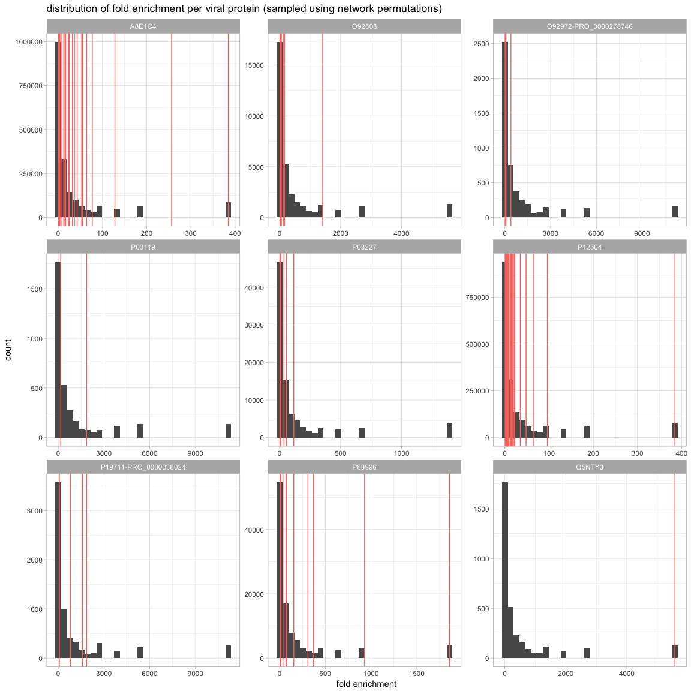<!-- -->

## P value for each viral protein and each human domain association: effect of zero domain proteins


```r
# generate filename for pvalue (incl. corrected) results
filename = paste0("./processed_data_files/viralProtein_humanDomain_pval_remove_zeros",remove_zeros,"frequency",frequency,".tsv")

if(!file.exists(filename)){
    proctime = proc.time()
    # calculate pvalue
    Pvals = foldEnrichmentPval(fold_enrichment_dist = viral_foldEnrichDist, 
                               data = viral_human_net_w_domains, cores = cores_to_use, frequency = frequency)
    proctime = proc.time() - proctime
    fwrite(Pvals, filename, sep = "\t")
    proctime
}
```

```
##    user  system elapsed 
##  10.536   6.368 226.657
```

```r
Pvals = fread(filename, sep = "\t", stringsAsFactors = F)

# plot pvalue distribution
ggplot(Pvals, aes(x = Pval)) + geom_histogram(bins = 100) + ggtitle("viral protein and human domain association \n pvalue distribution") + theme_light() + xlim(-0.01,1.01)
```

```
## Warning: Removed 1 rows containing missing values (geom_bar).
```

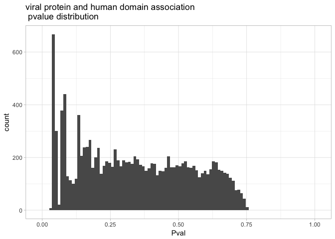<!-- -->

```r
# qvalue adjustment procedure fails because of weird p-value distribution
if(frequency) Pvals_nozeros = foldEnrichmentPval(fold_enrichment_dist = viral_foldEnrichDist[sampled_domain_frequency_per_set != 0,], 
                               data = viral_human_net_w_domains, cores = cores_to_use, frequency = frequency)
if(!frequency) Pvals_nozeros = foldEnrichmentPval(fold_enrichment_dist = viral_foldEnrichDist[sampled_fold_enrichment != 0,], 
                               data = viral_human_net_w_domains, cores = cores_to_use, frequency = frequency)
# plot pvalue distribution - no zero domain proteins
ggplot(Pvals_nozeros, aes(x = Pval)) + geom_histogram(bins = 100) + ggtitle("viral protein and human domain association \n pvalue distribution, zero domain proteins discarded") + theme_light() + xlim(-0.01,1.01)
```

```
## Warning: Removed 1 rows containing missing values (geom_bar).
```

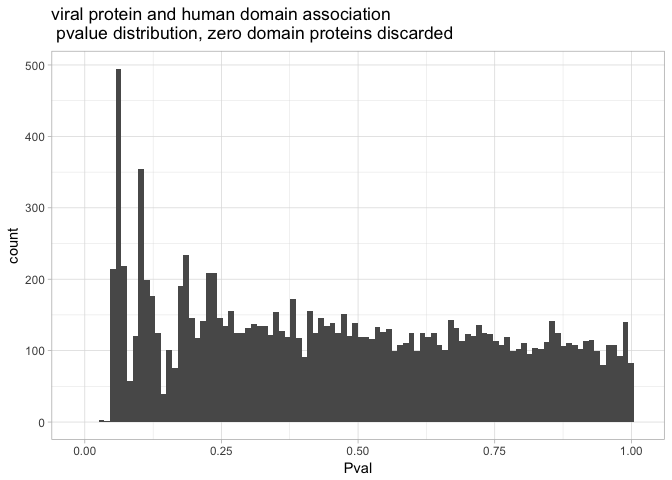<!-- -->

```r
# discard zero domain proteins for downstream analyses
Pvals = Pvals_nozeros
rm(viral_foldEnrichDist)
```

## P value distribution after multiple hypothesis testing adjustment


```r
# calculate fdr adjusted pvalue
Pvals[, Pval_fdr := p.adjust(Pval, method = "fdr")]
ggplot(Pvals, aes(x = Pval_fdr)) + geom_histogram(bins = 100) + ggtitle("viral protein and human domain association \n FDR adjusted pvalue distribution") + theme_light() + xlim(-0.01,1.01)
```

```
## Warning: Removed 1 rows containing missing values (geom_bar).
```

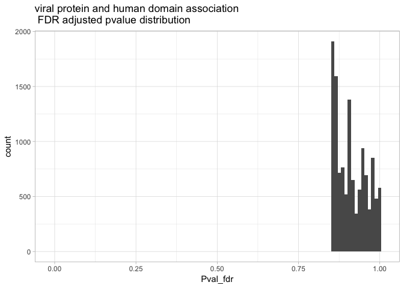<!-- -->

```r
# calculate q-value
Pvals_qvalue = Pvals[, qvalue(Pval)]
Pvals[, Qval := qvalue(Pval)$qvalues]
ggplot((Pvals), aes(x = Qval)) + geom_histogram(bins = 100) + ggtitle("viral protein and human domain association \n qvalue adjusted pvalue distribution") + theme_light() + xlim(-0.01,1.01)
```

```
## Warning: Removed 1 rows containing missing values (geom_bar).
```

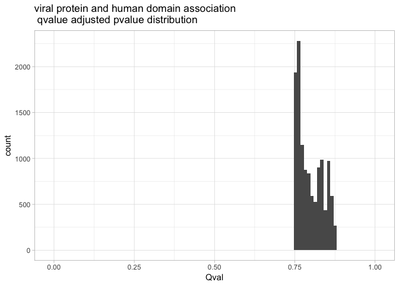<!-- -->

## relationship of P value and statistic


```r
# plot fold enrichment (or domain_frequency_per_IDs_interactor_viral) vs pvalue
if(frequency) ggplot(Pvals, aes(x = domain_frequency_per_IDs_interactor_viral, y = Pval)) + geom_bin2d() + ggtitle("viral protein and human domain association \n domain frequency per viral protein vs p-value") + ylab("p-value") + scale_x_log10() + xlab(if(frequency) "frequency" else "fold enrichment")
if(!frequency) ggplot(Pvals, aes(x = fold_enrichment, y = Pval)) + geom_bin2d() + ggtitle("viral protein and human domain association \n fold enrichment vs p-value") + ylab("p-value") + xlab(if(frequency) "frequency" else "fold enrichment") + scale_x_log10()
```

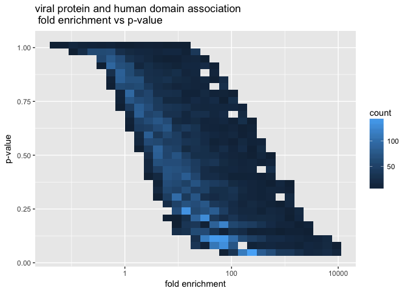<!-- -->

```r
# merge results to original data
if(frequency) viral_human_net_w_domains_d2 = viral_human_net_w_domains_d[Pvals, on = c("IDs_interactor_viral", "IDs_domain_human", "domain_frequency_per_IDs_interactor_viral")]
if(!frequency) viral_human_net_w_domains_d2 = viral_human_net_w_domains_d[Pvals, on = c("IDs_interactor_viral", "IDs_domain_human", "fold_enrichment")]
```


## Top-50 p-value hits: domain count per viral proteins and background domain frequency


```r
# domain count 
top50 = viral_human_net_w_domains_d2[,order(Pval,decreasing = F)[1:50]]
hist(viral_human_net_w_domains_d2[top50, domain_count_per_IDs_interactor_viral], main = "number of human proteins with specific domain per viral protein \n the lowest FDR corrected peak (0.35 < pval)", xlab = "how many times domain is repeated")
```

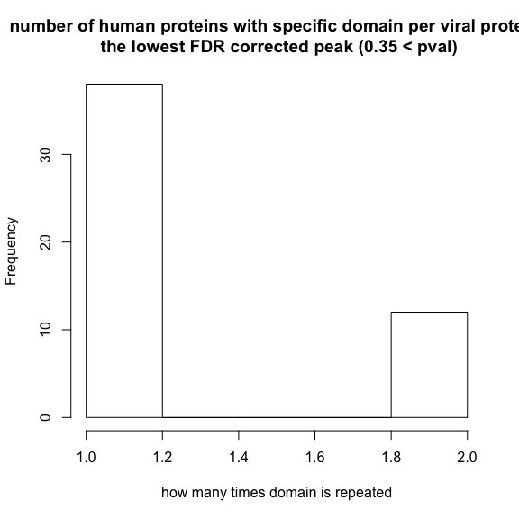<!-- -->

```r
hist(viral_human_net_w_domains_d2[top50, domain_count], main = "domain prevalence in the background set \n the lowest FDR corrected peak (0.35 < pval)", xlab = "domain count in background")
```

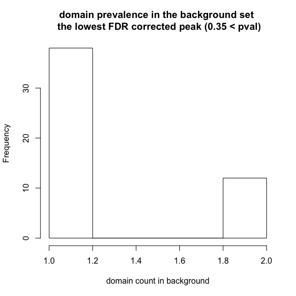<!-- -->

## Calculating the effect of deleting domains with low background counts


```r
set.seed(1)
selected_protein_IDs = sample(unique(viral_human_net_w_domains$IDs_interactor_viral), 6)
# create a function which requires to specify only variable parameter: domain count in the background
remove_rare_domains = function(backgr_domain_count){
    domainEnrichment(backgr_domain_count = backgr_domain_count, 
                     all.data = viral_human_net_w_domains_d, 
                     net = viral_human_net,
                     protein_annot = domains_proteins, 
                     data = viral_human_net_w_domains,
                     N = N_permut, cores = NULL, seed = 1, frequency = frequency,
                     proteinID = selected_protein_IDs,
                     pValPlot = "Pval", remove_zeros = remove_zeros, calculate_qval = calculate_qval)
}

# generate filename for results excluding low_background_counts
filename = paste0("./large_processed_data_files/domEnrich_minus_low_background_counts_remove_zeros",remove_zeros,"frequency",frequency)

if(!file.exists(filename)){

    # recalculate using all domains
    d0 = remove_rare_domains(backgr_domain_count = 0)
    
    # delete domains with background count <= 1
    d1 = remove_rare_domains(backgr_domain_count = 1)
    
    # delete domains with background count <= 2
    d2 = remove_rare_domains(backgr_domain_count = 2)

    # delete domain with background count <= 4
    d4 = remove_rare_domains(backgr_domain_count = 4)

    # delete domains with background count <= 8
    d8 = remove_rare_domains(backgr_domain_count = 8)

    # delete domains with background count <= 16
    d16 = remove_rare_domains(backgr_domain_count = 16)
    
    save(d0, d1, d2, d4, d8, d16, file = filename)
}
```


## Deleting domains with low background frequency counts changes statistic distribution (per each viral protein) and p-value distribution.


```r
load(file = filename)
# show p-value distributions and sampled fold_enrichment or frequency distributions
d0$PvalPlot
```

```
## Warning: Removed 1 rows containing missing values (geom_bar).
```

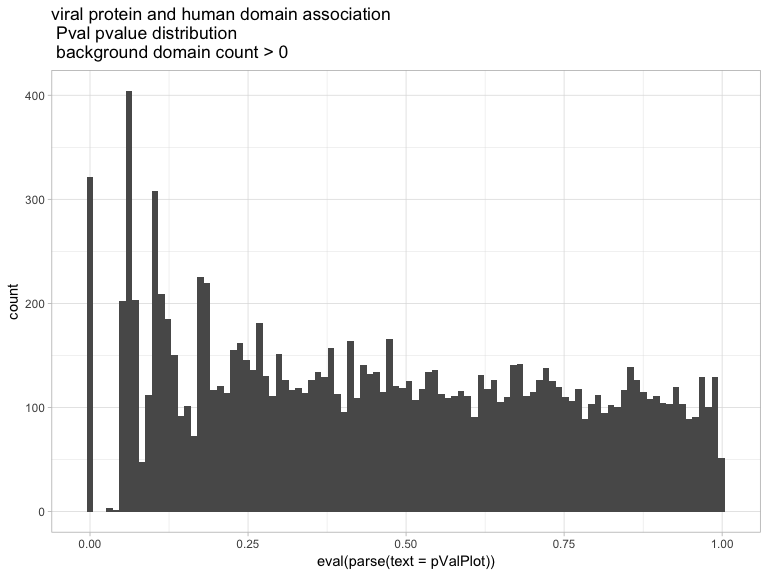<!-- -->

```r
d0$distPlot
```

```
## `stat_bin()` using `bins = 30`. Pick better value with `binwidth`.
```

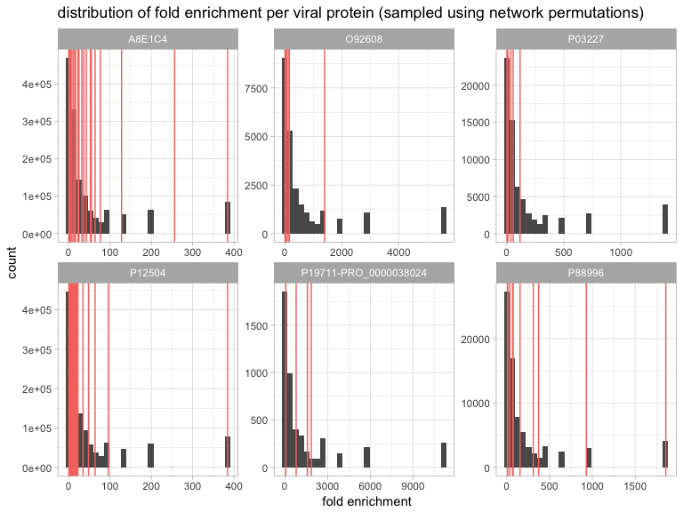<!-- -->

```r
d1$PvalPlot
```

```
## Warning: Removed 1 rows containing missing values (geom_bar).
```

<!-- -->

```r
d1$distPlot
```

```
## `stat_bin()` using `bins = 30`. Pick better value with `binwidth`.
```

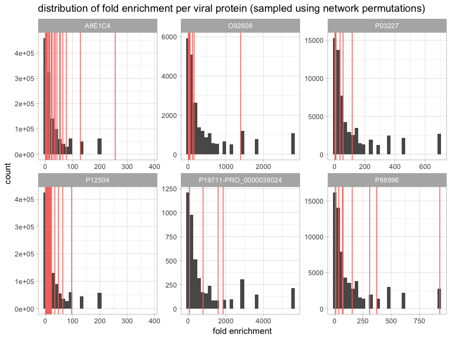<!-- -->

```r
d2$PvalPlot
```

```
## Warning: Removed 1 rows containing missing values (geom_bar).
```

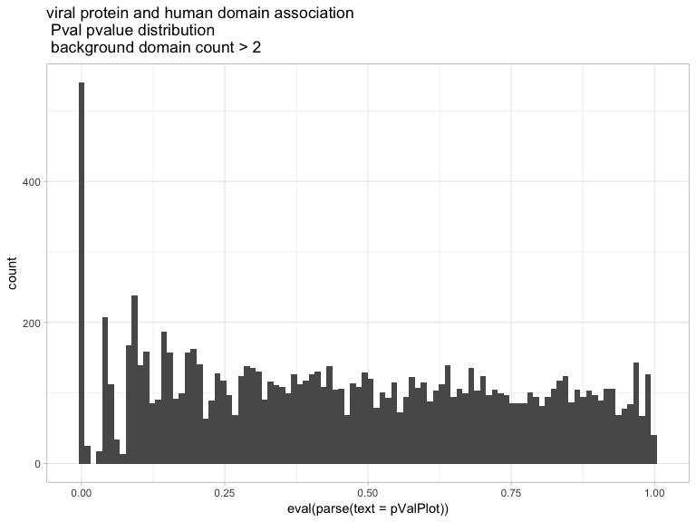<!-- -->

```r
d2$distPlot
```

```
## `stat_bin()` using `bins = 30`. Pick better value with `binwidth`.
```

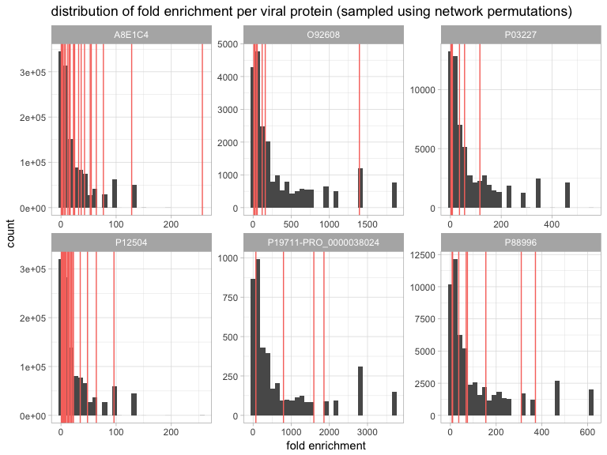<!-- -->

```r
d4$PvalPlot
```

```
## Warning: Removed 1 rows containing missing values (geom_bar).
```

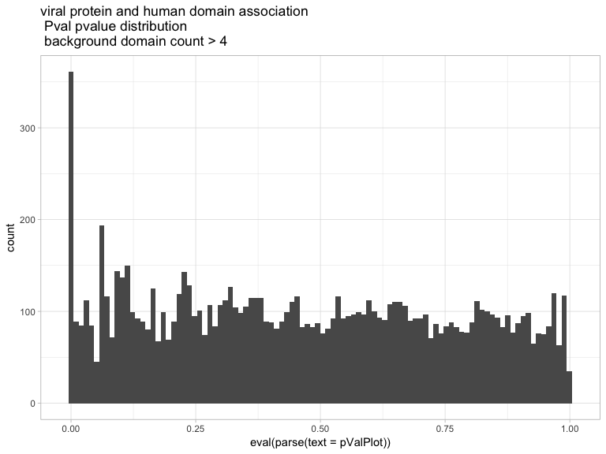<!-- -->

```r
d4$distPlot
```

```
## `stat_bin()` using `bins = 30`. Pick better value with `binwidth`.
```

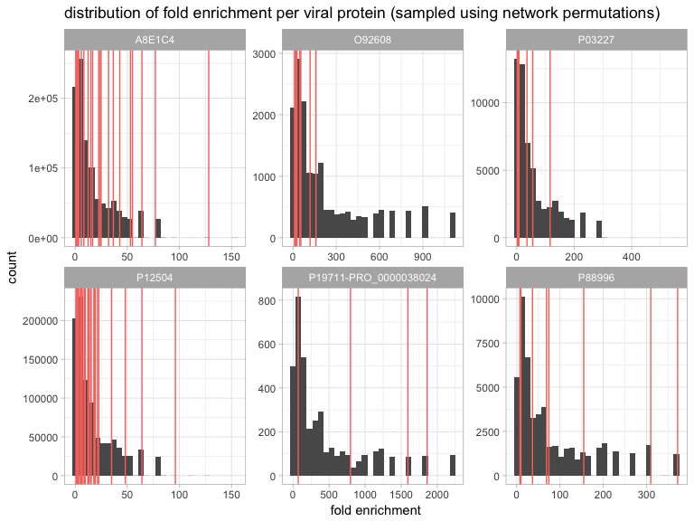<!-- -->

```r
d8$PvalPlot
```

```
## Warning: Removed 1 rows containing missing values (geom_bar).
```

<!-- -->

```r
d8$distPlot
```

```
## `stat_bin()` using `bins = 30`. Pick better value with `binwidth`.
```

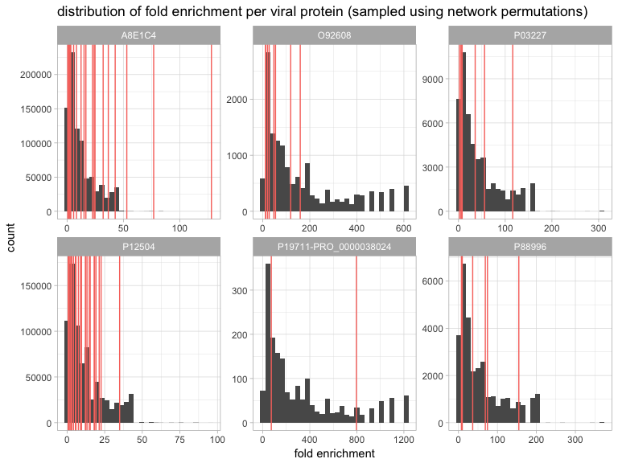<!-- -->

```r
d16$PvalPlot
```

```
## Warning: Removed 1 rows containing missing values (geom_bar).
```

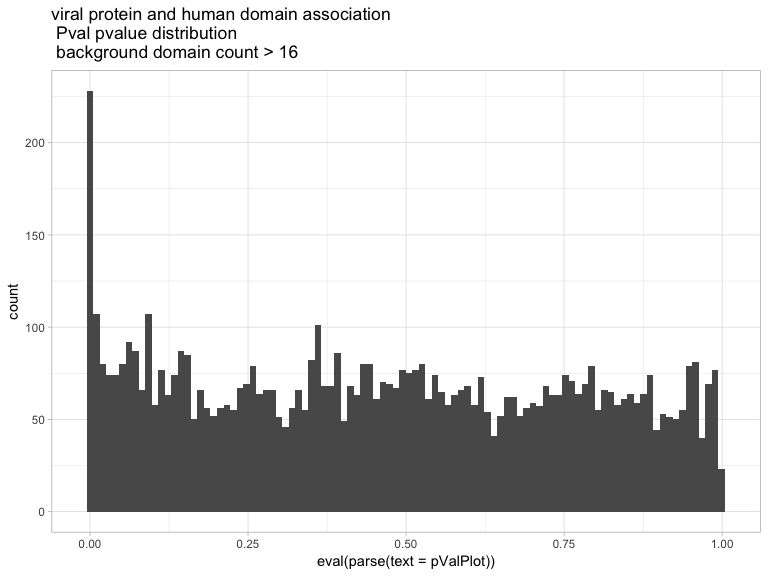<!-- -->

```r
d16$distPlot
```

```
## `stat_bin()` using `bins = 30`. Pick better value with `binwidth`.
```

<!-- -->

## How does my permutation pvalue distribution compare to generic fisher-test based enrichment test?

This can help to evaluate how weird is the obtained distribution.


```r
# read all domain annotations: 
protein_domain_pair = fread("./processed_data_files/protein_domain_pair", sep = "\t", stringsAsFactors = F)
enriched = clusterProfiler::enricher(gene = viral_human_net$IDs_interactor_human,
                          pvalueCutoff = 1, pAdjustMethod = "BH", 
                          universe = protein_domain_pair$IDs_protein,
                          minGSSize = 10, maxGSSize = 500, qvalueCutoff = 1, 
                          TERM2GENE = protein_domain_pair[,.(IDs_domain, IDs_protein)], 
                          TERM2NAME = NA)

ggplot(as.data.frame(enriched), aes(x = pvalue)) + geom_histogram(bins = 100) + ggtitle("human domains enriched in viral-interacting human proteins \n Fisher test (clusterProfiler) pvalue distribution") + theme_light() + xlim(-0.01,1.01)
```

```
## Warning: Removed 1 rows containing missing values (geom_bar).
```

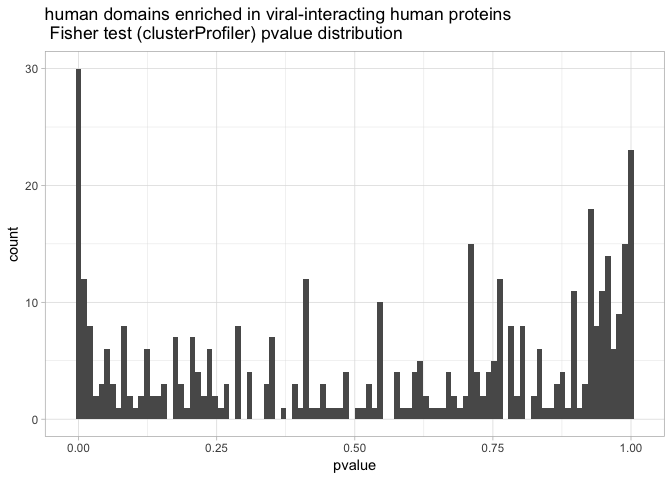<!-- -->

## R session information


```r
rm(list = ls())
gc()
```

```
##           used  (Mb) gc trigger   (Mb)   max used    (Mb)
## Ncells 5090297 271.9   12002346  641.0   12002346   641.0
## Vcells 6004573  45.9 1075012486 8201.7 1679673706 12814.9
```

```r
Sys.Date()
```

```
## [1] "2017-08-03"
```

```r
sessionInfo()
```

```
## R version 3.4.0 (2017-04-21)
## Platform: x86_64-apple-darwin15.6.0 (64-bit)
## Running under: macOS Sierra 10.12.6
## 
## Matrix products: default
## BLAS: /System/Library/Frameworks/Accelerate.framework/Versions/A/Frameworks/vecLib.framework/Versions/A/libBLAS.dylib
## LAPACK: /Library/Frameworks/R.framework/Versions/3.4/Resources/lib/libRlapack.dylib
## 
## locale:
## [1] en_GB.UTF-8/en_GB.UTF-8/en_GB.UTF-8/C/en_GB.UTF-8/en_GB.UTF-8
## 
## attached base packages:
## [1] stats4    parallel  stats     graphics  grDevices utils     datasets 
## [8] methods   base     
## 
## other attached packages:
##  [1] GGally_1.3.1        qvalue_2.8.0        MItools_0.1.10     
##  [4] Biostrings_2.44.1   XVector_0.16.0      PSICQUIC_1.14.0    
##  [7] plyr_1.8.4          httr_1.2.1          biomaRt_2.32.1     
## [10] IRanges_2.10.2      S4Vectors_0.14.3    BiocGenerics_0.22.0
## [13] ggplot2_2.2.1       R.utils_2.5.0       R.oo_1.21.0        
## [16] R.methodsS3_1.7.1   data.table_1.10.4   rmarkdown_1.6      
## 
## loaded via a namespace (and not attached):
##  [1] Biobase_2.36.2             tidyr_0.6.3               
##  [3] bit64_0.9-7                splines_3.4.0             
##  [5] gsubfn_0.6-6               DO.db_2.9                 
##  [7] rvcheck_0.0.9              blob_1.1.0                
##  [9] GenomeInfoDbData_0.99.0    Rsamtools_1.28.0          
## [11] yaml_2.1.14                RSQLite_2.0               
## [13] backports_1.1.0            lattice_0.20-35           
## [15] digest_0.6.12              GenomicRanges_1.28.3      
## [17] RColorBrewer_1.1-2         colorspace_1.3-2          
## [19] htmltools_0.3.6            Matrix_1.2-10             
## [21] XML_3.98-1.9               pkgconfig_2.0.1           
## [23] devtools_1.13.3            clusterProfiler_3.5.2     
## [25] zlibbioc_1.22.0            GO.db_3.4.1               
## [27] scales_0.4.1               BiocParallel_1.10.1       
## [29] tibble_1.3.3               withr_2.0.0               
## [31] SummarizedExperiment_1.6.3 lazyeval_0.2.0            
## [33] proto_1.0.0                magrittr_1.5              
## [35] memoise_1.1.0              DOSE_3.3.0                
## [37] evaluate_0.10.1            MASS_7.3-47               
## [39] tools_3.4.0                matrixStats_0.52.2        
## [41] stringr_1.2.0              munsell_0.4.3             
## [43] DelayedArray_0.2.7         AnnotationDbi_1.38.1      
## [45] vcd_1.4-3                  compiler_3.4.0            
## [47] GenomeInfoDb_1.12.2        caTools_1.17.1            
## [49] rlang_0.1.1                grid_3.4.0                
## [51] RCurl_1.95-4.8             igraph_1.1.2              
## [53] bitops_1.0-6               labeling_0.3              
## [55] gtable_0.2.0               DBI_0.7                   
## [57] reshape_0.8.6              reshape2_1.4.2            
## [59] R6_2.2.2                   zoo_1.8-0                 
## [61] GenomicAlignments_1.12.1   gridExtra_2.2.1           
## [63] knitr_1.16                 rtracklayer_1.36.3        
## [65] bit_1.1-12                 fastmatch_1.1-0           
## [67] fgsea_1.2.1                rprojroot_1.2             
## [69] GOSemSim_2.3.0             stringi_1.1.5             
## [71] Rcpp_0.12.12               lmtest_0.9-35
```
