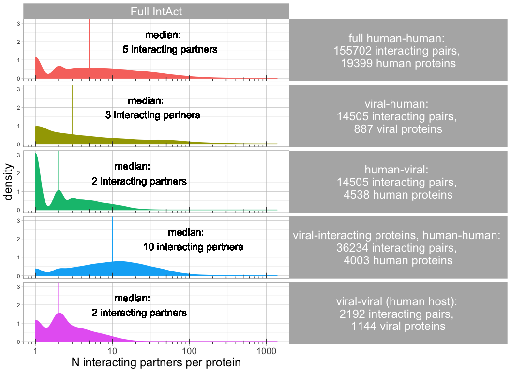
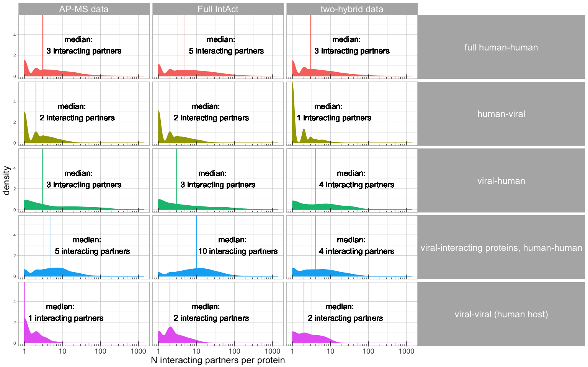
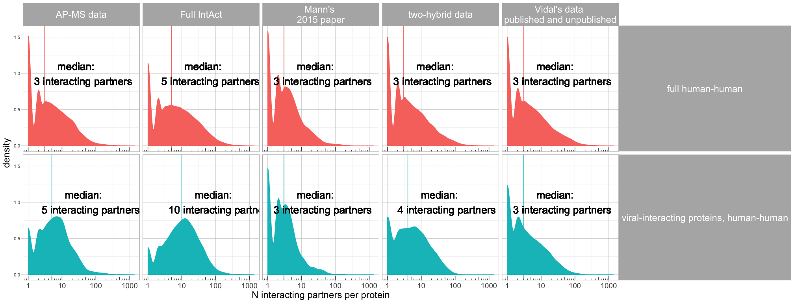

# Degree distribution in the human-human, human-viral and viral-viral network
Vitalii Kleshchevnikov  
04/09/2017  


### Load PPI data and show degree distribution


```r
# Load data.
HumanViralPPI = loadHumanViralPPI(directory = "./data_files/")
```

```
## ... looking for the date of the latest IntAct release ...
## ... looking for the date of the latest IntAct release ...
```

```
## ... loading local copy ...
```

```
## 
Read 0.0% of 785947 rows
Read 5.1% of 785947 rows
Read 11.5% of 785947 rows
Read 17.8% of 785947 rows
Read 25.4% of 785947 rows
Read 30.5% of 785947 rows
Read 36.9% of 785947 rows
Read 44.5% of 785947 rows
Read 47.1% of 785947 rows
Read 53.4% of 785947 rows
Read 61.1% of 785947 rows
Read 67.4% of 785947 rows
Read 72.5% of 785947 rows
Read 78.9% of 785947 rows
Read 85.2% of 785947 rows
Read 92.9% of 785947 rows
Read 99.2% of 785947 rows
Read 785947 rows and 42 (of 42) columns from 2.940 GB file in 00:00:34
```

```
## ... looking for the date of the latest IntAct release ...
```

```
## ... looking for the date of the latest IntAct release ...
```

```
## ... loading local copy ...
```

```
## 
Read 0.0% of 785947 rows
Read 7.6% of 785947 rows
Read 16.5% of 785947 rows
Read 21.6% of 785947 rows
Read 22.9% of 785947 rows
Read 30.5% of 785947 rows
Read 38.2% of 785947 rows
Read 45.8% of 785947 rows
Read 52.2% of 785947 rows
Read 58.5% of 785947 rows
Read 66.2% of 785947 rows
Read 72.5% of 785947 rows
Read 80.2% of 785947 rows
Read 81.4% of 785947 rows
Read 90.3% of 785947 rows
Read 98.0% of 785947 rows
Read 785947 rows and 42 (of 42) columns from 2.940 GB file in 00:00:24
```

```
## ... looking for the date of the latest IntAct release ...
```

```
## ... looking for the date of the latest IntAct release ...
```

```
## ... loading local copy ...
```

```
## 
Read 0.0% of 785947 rows
Read 7.6% of 785947 rows
Read 16.5% of 785947 rows
Read 24.2% of 785947 rows
Read 33.1% of 785947 rows
Read 40.7% of 785947 rows
Read 48.3% of 785947 rows
Read 50.9% of 785947 rows
Read 57.3% of 785947 rows
Read 64.9% of 785947 rows
Read 67.4% of 785947 rows
Read 75.1% of 785947 rows
Read 82.7% of 785947 rows
Read 91.6% of 785947 rows
Read 94.2% of 785947 rows
Read 785947 rows and 42 (of 42) columns from 2.940 GB file in 00:00:24
```

```r
plotHumanViralDegree = function(degree_distributions, y_text = 2, median_text_size = 5.5){
    ggplot(degree_distributions, aes(x = N, fill = legend, color = legend)) + geom_density() + facet_grid(legend ~ data_name) + theme_light() +
        theme(strip.text.y = element_text(size = 18,angle = 0),
              strip.text.x = element_text(size = 18,angle = 0),
              panel.grid.major =  element_line(color = 'grey', size = 0.2, linetype = 'solid'),
              panel.background = element_rect(fill = '#FFFFFF', colour = 'grey'),
              legend.position = "none",
              axis.title = element_text(size = 18),
              axis.text.x = element_text(size = 14)) +
        scale_x_log10(breaks = c(1, 10, 100, 1000),
                      labels = c(1, 10, 100, 1000)) +
        xlab("N interacting partners per protein")+
        geom_vline(aes(xintercept = medianN, color = legend)) + 
        geom_text(aes(x = medianN*9.5,label = medianN_lab, y = y_text), color = "black", size = median_text_size)+
        annotation_logticks(sides = "b", color = "#444444")
}

degree_distributions_all = humanViralDegree(data = HumanViralPPI,
  directory = "./data_files/", data_name = "Full IntAct")
```

```
## loading local copy of MI ontology
```

```
## loading local copy of MI ontology
## loading local copy of MI ontology
```

```r
plotHumanViralDegree(degree_distributions_all)
```

<!-- -->

#### Degree distribution based on all data, two-hybrid or affinity purification - mass spectrometry


```r
degree_distributions_two = humanViralDegree(data = HumanViralPPI,
  directory = "./data_files/", Interaction_detection_methods = "MI:0018",
  data_name = "two-hybrid data")
```

```
## loading local copy of MI ontology
## loading local copy of MI ontology
## loading local copy of MI ontology
```

```r
degree_distributionsAPMS = humanViralDegree(data = HumanViralPPI,
  directory = "./data_files/", Interaction_detection_methods = "MI:0004",
  Identification_method = "MI:0433", PMIDs = NULL, inverse_filter = F,
  data_name = "AP-MS data")
```

```
## loading local copy of MI ontology
## loading local copy of MI ontology
## loading local copy of MI ontology
```

```r
degree_distributions = rbind(degree_distributions_all,degree_distributions_two,degree_distributionsAPMS)
degree_distributions[, legend := gsub(":.+$","",legend)]
p1 = plotHumanViralDegree(degree_distributions, y_text = 3)
p1
```

<!-- -->

#### Degree distribution within human network based on specific datasets (Vidal's and Mann's)


```r
degree_distributionsVidal = humanViralDegree(data = HumanViralPPI,
  directory = "./data_files/", PMIDs = c("25416956", "unassigned1304"),
  data_name = "Vidal's data \npublished and unpublished")
```

```
## loading local copy of MI ontology
## loading local copy of MI ontology
## loading local copy of MI ontology
```

```r
degree_distributionsMann = humanViralDegree(data = HumanViralPPI,
  directory = "./data_files/", PMIDs = "26496610",
  data_name = "Mann's \n2015 paper")
```

```
## loading local copy of MI ontology
## loading local copy of MI ontology
## loading local copy of MI ontology
```

```r
degree_distributions = rbind(degree_distributions,degree_distributionsVidal,degree_distributionsMann)
degree_distributions[, legend := gsub(":.+$","",legend)]
degree_distributions = degree_distributions[legend %in% c("full human-human", "viral-interacting proteins, human-human"),]
p4 = plotHumanViralDegree(degree_distributions, y_text = 1, median_text_size = 7)
p4
```

<!-- -->
