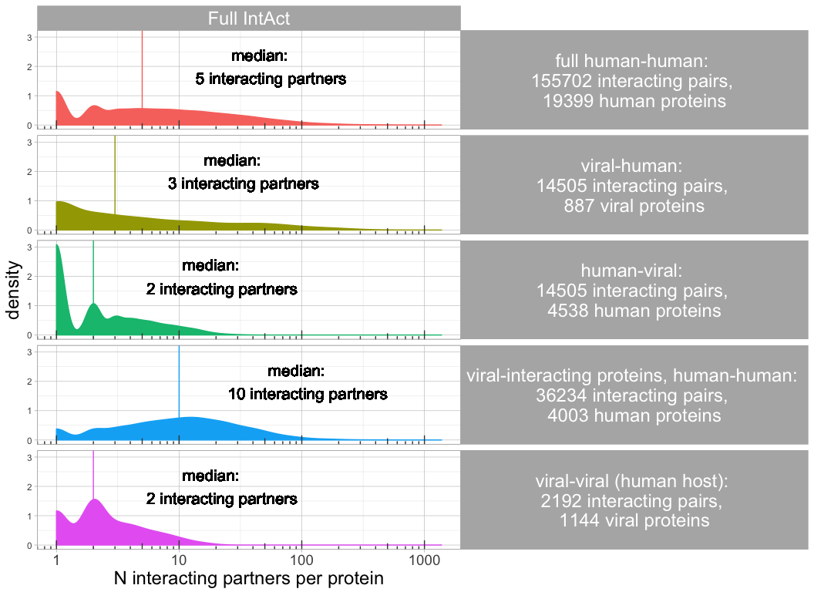
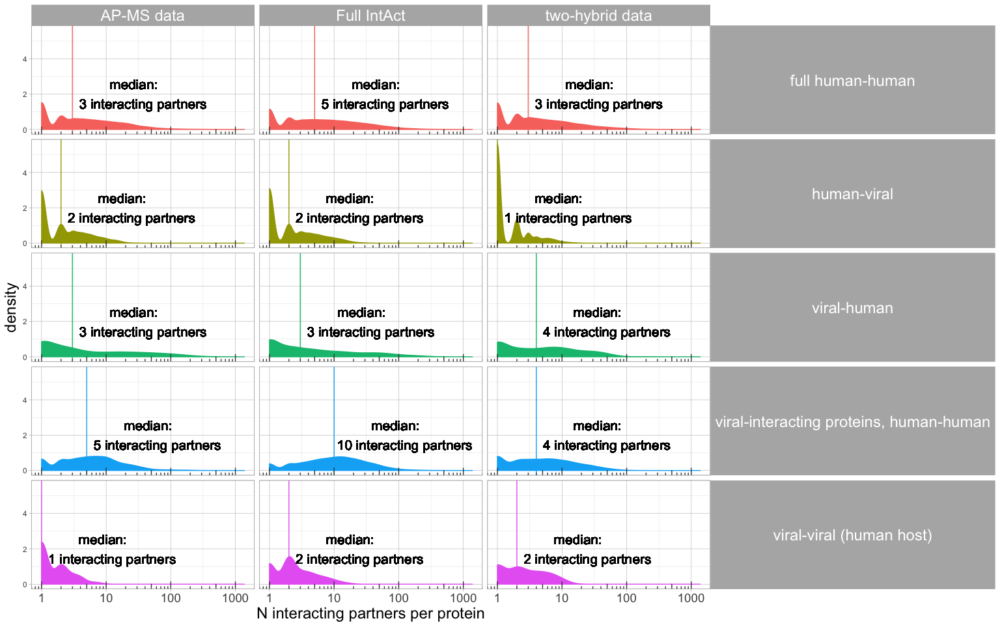
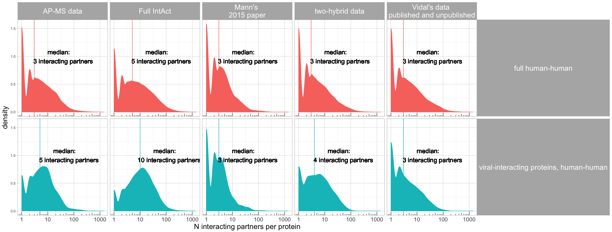

# QSLIMFinder: domain instances, human to search, viral to filter
Vitalii Kleshchevnikov  
04/09/2017  


## use all the interacting partners of human proteins with significant domains to seach for motifs and their viral interactors to filter

QSLIMfinder: 
- seqin - all the interacting partners of human proteins with significant domains (including viral proteins); FASTA sequences
- query - the viral interacting partners of human proteins with significant domains; names of the FASTA sequences in seqin
- resdir - directory where to store all results
- resfile - file where to write
- dismask - mask disordered regions using IUPRED
- consmask - relative conservation masking
- probcut - FDR-corrected probability cutoff
- qregion - Mask all but the region of the query from (and including) residue X to residue Y [0,-1] (useful for regions sufficient/necessary to interact)


### Load PPI data and show degree distribution


```r
# load the domain analysis results
load("./processed_data_files/what_we_find_VS_ELM_clust.RData")
domain_res = res
rm(list = ls()[ls() != "domain_res"])

# Load data.
HumanViralPPI = loadHumanViralPPI(directory = "./data_files/")
```

```
## ... looking for the date of the latest IntAct release ...
## ... looking for the date of the latest IntAct release ...
```

```
## ... loading local copy ...
```

```
## 
Read 0.0% of 785947 rows
Read 6.4% of 785947 rows
Read 15.3% of 785947 rows
Read 16.5% of 785947 rows
Read 24.2% of 785947 rows
Read 31.8% of 785947 rows
Read 36.9% of 785947 rows
Read 39.4% of 785947 rows
Read 45.8% of 785947 rows
Read 50.9% of 785947 rows
Read 56.0% of 785947 rows
Read 61.1% of 785947 rows
Read 67.4% of 785947 rows
Read 72.5% of 785947 rows
Read 78.9% of 785947 rows
Read 86.5% of 785947 rows
Read 94.2% of 785947 rows
Read 98.0% of 785947 rows
Read 785947 rows and 42 (of 42) columns from 2.940 GB file in 00:00:40
```

```
## ... looking for the date of the latest IntAct release ...
```

```
## ... looking for the date of the latest IntAct release ...
```

```
## ... loading local copy ...
```

```
## 
Read 0.0% of 785947 rows
Read 8.9% of 785947 rows
Read 15.3% of 785947 rows
Read 22.9% of 785947 rows
Read 31.8% of 785947 rows
Read 39.4% of 785947 rows
Read 47.1% of 785947 rows
Read 54.7% of 785947 rows
Read 62.3% of 785947 rows
Read 70.0% of 785947 rows
Read 77.6% of 785947 rows
Read 86.5% of 785947 rows
Read 95.4% of 785947 rows
Read 785947 rows and 42 (of 42) columns from 2.940 GB file in 00:00:23
```

```
## ... looking for the date of the latest IntAct release ...
```

```
## ... looking for the date of the latest IntAct release ...
```

```
## ... loading local copy ...
```

```
## 
Read 0.0% of 785947 rows
Read 10.2% of 785947 rows
Read 19.1% of 785947 rows
Read 28.0% of 785947 rows
Read 35.6% of 785947 rows
Read 43.3% of 785947 rows
Read 47.1% of 785947 rows
Read 54.7% of 785947 rows
Read 62.3% of 785947 rows
Read 70.0% of 785947 rows
Read 77.6% of 785947 rows
Read 86.5% of 785947 rows
Read 96.7% of 785947 rows
Read 785947 rows and 42 (of 42) columns from 2.940 GB file in 00:00:24
```

```r
plotHumanViralDegree = function(degree_distributions, y_text = 2){
    ggplot(degree_distributions, aes(x = N, fill = legend, color = legend)) + geom_density() + facet_grid(legend ~ data_name) + theme_light() +
        theme(strip.text.y = element_text(size = 18,angle = 0),
              strip.text.x = element_text(size = 18,angle = 0),
              panel.grid.major =  element_line(color = 'grey', size = 0.2, linetype = 'solid'),
              panel.background = element_rect(fill = '#FFFFFF', colour = 'grey'),
              legend.position = "none",
              axis.title = element_text(size = 18),
              axis.text.x = element_text(size = 14)) +
        scale_x_log10(breaks = c(1, 10, 100, 1000),
                      labels = c(1, 10, 100, 1000)) +
        xlab("N interacting partners per protein")+
        geom_vline(aes(xintercept = medianN, color = legend)) + 
        geom_text(aes(x = medianN*9.5,label = medianN_lab, y = y_text), color = "black", size = 5.5)+
        annotation_logticks(sides = "b", color = "#444444")
}

degree_distributions_all = humanViralDegree(data = HumanViralPPI,
  directory = "./data_files/", data_name = "Full IntAct")
```

```
## loading local copy of MI ontology
```

```
## loading local copy of MI ontology
## loading local copy of MI ontology
```

```r
plotHumanViralDegree(degree_distributions_all)
```

<!-- -->

#### Degree distribution based on all data, two-hybrid or affinity purification - mass spectrometry


```r
degree_distributions_two = humanViralDegree(data = HumanViralPPI,
  directory = "./data_files/", Interaction_detection_methods = "MI:0018",
  data_name = "two-hybrid data")
```

```
## loading local copy of MI ontology
## loading local copy of MI ontology
## loading local copy of MI ontology
```

```r
degree_distributionsAPMS = humanViralDegree(data = HumanViralPPI,
  directory = "./data_files/", Interaction_detection_methods = "MI:0004",
  Identification_method = "MI:0433", PMIDs = NULL, inverse_filter = F,
  data_name = "AP-MS data")
```

```
## loading local copy of MI ontology
## loading local copy of MI ontology
## loading local copy of MI ontology
```

```r
degree_distributions = rbind(degree_distributions_all,degree_distributions_two,degree_distributionsAPMS)
degree_distributions[, legend := gsub(":.+$","",legend)]
p1 = plotHumanViralDegree(degree_distributions)
p1
```

<!-- -->

#### Degree distribution within human network based on specific datasets (Vidal's and Mann's)


```r
degree_distributionsVidal = humanViralDegree(data = HumanViralPPI,
  directory = "./data_files/", PMIDs = c("25416956", "unassigned1304"),
  data_name = "Vidal's data \npublished and unpublished")
```

```
## loading local copy of MI ontology
## loading local copy of MI ontology
## loading local copy of MI ontology
```

```r
degree_distributionsMann = humanViralDegree(data = HumanViralPPI,
  directory = "./data_files/", PMIDs = "26496610",
  data_name = "Mann's \n2015 paper")
```

```
## loading local copy of MI ontology
## loading local copy of MI ontology
## loading local copy of MI ontology
```

```r
degree_distributions = rbind(degree_distributions,degree_distributionsVidal,degree_distributionsMann)
degree_distributions[, legend := gsub(":.+$","",legend)]
degree_distributions = degree_distributions[legend %in% c("full human-human", "viral-interacting proteins, human-human"),]
p4 = plotHumanViralDegree(degree_distributions, y_text = 1)
p4
```

<!-- -->

### prepare sets of protein sequences and instructions for SLIMFinder


```r
# load FASTA
all.fasta = unique(readAAStringSet(filepath = "./data_files/all_human_viral_proteins.fasta", format = "fasta"))

recodeFASTA = function(fasta, mapping = NULL, i = NULL){
    if(is.null(mapping)){
        old_names = names(fasta)
        new_names = paste0("P",seq_along(old_names))
        names(fasta) = new_names
        names_mapping = data.table(old_names = old_names, new_names = new_names)
        return(list(fasta = fasta, names_mapping = names_mapping))
    } else {
        if(class(fasta) == "interactionSubsetFASTA"){
            if(!is.null(i)){
                names(fasta$fasta_subset_list[[i]]) = mapping$old_names[match(names(fasta$fasta_subset_list[[i]]), mapping$new_names)]
                return(fasta)
            } else stop("i not provided")
        } else stop("fasta is not interactionSubsetFASTA")
    }
}

# choose pvalue cutoff:
plot(domain_res)
proteins_w_signif_domains = unique(domain_res$data_with_pval[p.value < 0.4, IDs_interactor_human])

subset2setsBy1ID = function(interaction_set1, interaction_set2, seed_id){
    if(length(seed_id) != 1) warning("WARNING: multiple ids may not be meaningful")
    from_set1 = subsetMITABbyID(interaction_set1, ID_seed = seed_id,
                                within_seed = F, only_seed2nonseed = T)
    from_set2 = subsetMITABbyID(interaction_set2, ID_seed = seed_id,
                                within_seed = F, only_seed2nonseed = T)
    length_set1 = length(unique(from_set1$data$pair_id))
    length_set2 = length(unique(from_set2$data$pair_id))
    
    if(length_set1 > 0) ids_set1 = unique(unlist(from_set1$data[,IDs_interactor_B])) else ids_set1 = "NULL"
    if(length_set2 > 0) ids_set2 = unique(unlist(from_set2$data[,IDs_interactor_B])) else ids_set2 = "NULL"
    
    if(length_set1 > 0) {
        if(length_set2 > 0) ids_all = c(ids_set1, ids_set2) else ids_all = c(ids_set1)} else {
            if(length_set2 > 0) ids_all = c(ids_set2) else stop(paste0("seed_id (",seed_id,") has no interactions is both interaction_set1 and interaction_set2"))
        }
    
    combined = rbind(from_set1$data, from_set2$data)
    res = list(name = seed_id,combined_MITAB = combined, ids_all = ids_all,
               ids_set1 = ids_set1, ids_set2 = ids_set2,
               length_set1 = length_set1, length_set2 = length_set2,
               description = paste0("Interacting partners of seed_id (",seed_id,") from interaction_set1 (", match.call()[["interaction_set1"]],") and interaction_set2 (", match.call()[["interaction_set2"]],")."))
    class(res) = "interaction_subset_from_2_sets"
    return(res)
}

print.interaction_subset_from_2_sets = function(data){
    cat("\n\n")
    cat(data$description)
    cat("\n\n This format is useful for preparing data for QSLIMFinder where one set is the search set and the other set is the query set. \n\n")
    cat(paste0("set 1 identifiers (length ",data$length_set1,"): \n"))
    print(data$ids_set1)
    cat(paste0("set 2 identifiers (length ",data$length_set2,"): \n"))
    print(data$ids_set2)
    cat("\n data in MITAB format is at $combined_MITAB (data.table)")
    cat(paste0("\n object class (S3): ",class(data)))
}

#subset = subsetByIdANDcombine(interaction_set1 = all_human_interaction, 
#                              interaction_set2 = all_viral_interaction, 
#                              seed_id = proteins_w_signif_domains[2])

interactionSubsetMapID = function(subset, mapping) {
    subset$ids_all_old = subset$ids_all
    subset$ids_all = unique(mapping[old_names %in% subset$ids_all_old, new_names])
    return(subset)
}

#subset = interactionSubsetMapID(subset, all.fasta$names_mapping)

interactionSubsetFASTA = function(int_subset, fasta){
    if(class(int_subset) != "interaction_subset_from_2_sets") stop("Invalid input, int_subset should be the output of subsetByIdANDcombine function")
    if(class(fasta) != "AAStringSet") stop(" fasta should be of class AAStringSet (Biostrings) ")
    match(int_subset$ids_all,names(fasta))
    fasta_subset = fasta[int_subset$ids_all]
    fasta_subset_list = AAStringSetList(fasta_subset)
    names(fasta_subset_list) = paste0("interactors_of.",int_subset$name,".")
    int_subset_list = list(int_subset)
    names(int_subset_list) = paste0("interactors_of.",int_subset$name,".")
    res = list(fasta_subset_list = fasta_subset_list, interaction_subset = int_subset_list)
    class(res) = "interactionSubsetFASTA"
    return(res)
}

#subset_fasta = interactionSubsetFASTA(int_subset = subset, fasta = all.fasta$fasta)
#subset_fasta = recodeFASTA(subset_fasta, all.fasta$names_mapping, i = 1)
# all.fasta["Q77M19"] for some reason this name doesn't work for subsetting

mInteractionSubsetFASTA = function(interaction_set1, interaction_set2, seed_id_vect, fasta) {
    
    seed_id_vect = seed_id_vect[seed_id_vect %in% names(fasta)]
    subset1 = subsetByIdANDcombine(interaction_set1 = interaction_set1, 
                                   interaction_set2 = interaction_set2, 
                                   seed_id = seed_id_vect[1])
    fasta = recodeFASTA(fasta)
    subset1 = interactionSubsetMapID(subset1, fasta$names_mapping)
    subset1_fasta = interactionSubsetFASTA(int_subset = subset1, fasta = fasta$fasta)
    subset1_fasta = recodeFASTA(subset1_fasta, fasta$names_mapping, i = 1)
    for (seed_id in seed_id_vect[2:length(seed_id_vect)]) {
        subset = subsetByIdANDcombine(interaction_set1 = interaction_set1, 
                                      interaction_set2 = interaction_set2, 
                                      seed_id = seed_id)
        subset = interactionSubsetMapID(subset, fasta$names_mapping)
        subset_fasta = interactionSubsetFASTA(int_subset = subset, fasta = fasta$fasta)
        subset_fasta = recodeFASTA(subset_fasta, fasta$names_mapping, i = 1)
        subset1_fasta$fasta_subset_list = c(subset1_fasta$fasta_subset_list, subset_fasta$fasta_subset_list)
        subset1_fasta$interaction_subset = c(subset1_fasta$interaction_subset, subset_fasta$interaction_subset)
    }
    subset1_fasta$length = length(subset1_fasta$fasta_subset_list)
    class(subset1_fasta) = "InteractionSubsetFASTA_list"
    return(subset1_fasta)
}

forSLIMFinder = mInteractionSubsetFASTA(interaction_set1 = all_human_interaction, 
                                        interaction_set2 = all_viral_interaction, 
                                        seed_id_vect = proteins_w_signif_domains,
                                        fasta = all.fasta)

filterInteractionSubsetFASTA_list = function(interactionFASTA_list, length_set1_lim = 0, length_set2_lim = 0) {
    select_both = sapply(1:interactionFASTA_list$length, function(i){
        select_set1 = interactionFASTA_list$interaction_subset[[i]]$length_set1 >= length_set1_lim
        select_set2 = interactionFASTA_list$interaction_subset[[i]]$length_set2 >= length_set2_lim
        select_both = select_set1 & select_set2
        return(select_both)
    })
    interactionFASTA_list$fasta_subset_list = interactionFASTA_list$fasta_subset_list[select_both]
    interactionFASTA_list$interaction_subset = interactionFASTA_list$interaction_subset[select_both]
    interactionFASTA_list$length = length(interactionFASTA_list$fasta_subset_list)
    return(interactionFASTA_list)
}

forSLIMFinder_Ready = filterInteractionSubsetFASTA_list(forSLIMFinder,  length_set1_lim = 3, length_set2_lim = 1)

saveInteractionSubsetFASTA_list = function(interactionFASTA_list, dir = "./SLIMFinder/"){
    input_dir = paste0(dir, "input/")
    input_fasta_dir = paste0(input_dir, "fasta/")
    input_query_dir = paste0(input_dir, "query/")
    output_dir = paste0(dir, "output/")
    
    if(!dir.exists(input_dir)) dir.create(input_dir)
    if(!dir.exists(input_fasta_dir)) dir.create(input_fasta_dir)
    if(!dir.exists(input_query_dir)) dir.create(input_query_dir)
    if(!dir.exists(output_dir)) dir.create(output_dir)
    
    file_list = data.table(fastafile = character(), queryfile = character(),
                           outputdir = character(), outputfile = character())
    
    for (i in 1:length(interactionFASTA_list$fasta_subset_list)) {
        name = names(interactionFASTA_list$fasta_subset_list[i])
        fastafile = paste0(input_fasta_dir, name,"fas")
        queryfile = paste0(input_query_dir, name,"fas")
        outputdir = paste0(output_dir, name, "/")
        outputfile = paste0(outputdir, "main_result")
        
        temp_list = data.table(fastafile = fastafile, queryfile = queryfile,
                               outputdir = outputdir, outputfile = outputfile)
        file_list = rbind(file_list, temp_list)
        
        writeXStringSet(interactionFASTA_list$fasta_subset_list[[i]],
                        file = fastafile,
                        format="fasta")
        fwrite(list(interactionFASTA_list$interaction_subset[[i]]$ids_set2), queryfile)
    }
    return(file_list)
}

forSLIMFinder_file_list = saveInteractionSubsetFASTA_list(interactionFASTA_list = forSLIMFinder_Ready,
                                                          dir = "./SLIMFinder/")

runQSLIMFinder = function(file_list, 
                          slimpath = "python ../software/slimsuite/tools/qslimfinder.py", 
                          blast = "blast+path=../software/ncbi_blast_2.6.0/bin/", 
                          iupred = "iupath=../software/iupred/iupred",
                          options = "dismask=T consmask=F cloudfix=F probcut=0.1")
{
    dirs = file_list[1,]
    #Sys.setenv()
    dirs_command = paste0("resdir=",dirs$outputdir," resfile=",dirs$outputfile," seqin=",dirs$fastafile," query=",dirs$queryfile," ")
    command = paste(slimpath, blast, iupred, options, dirs_command)
    system(command)
}

#runQSLIMFinder(file_list = forSLIMFinder_file_list)

runQSLIMFinder = function(file_list, 
                          slimpath = "python ../software/slimsuite/tools/qslimfinder.py", 
                          blast = "blast+path=../software/ncbi_blast_2.6.0/bin/", 
                          iupred = "iupath=../software/iupred/iupred",
                          options = "dismask=T consmask=F cloudfix=F probcut=0.5")
{
    dirs = file_list[1,]
    runQSLIMFinder(file_list = dirs, slimpath = slimpath,
                   blast = blast, iupred = iupred, options = options)
}

SLIMFinder_dir = "./SLIMFinder/"
if(!dir.exists(SLIMFinder_dir)) dir.create(SLIMFinder_dir)
fwrite(fread("./SLIMFinder/filelist.txt"), "./SLIMFinder/filelist.txt", sep = "\t")
```

## Run QSLIMFinder 


```bash
software_PATH="../software/"
SLIM_PATH=$software_PATH"slimsuite/tools/"
QSLIMFinder=$SLIM_PATH"qslimfinder.py"
IUPred_PATH=$software_PATH"iupred/iupred"
BLAST_PATH=$software_PATH"ncbi_blast_2.6.0/bin/"

res_dir="./SLIMFinder/QSLIMFinder/"
res_path=$res_dir"res.csv"
echo $QSLIMFinder
echo $IUPred_PATH
#python $QSLIMFinder 

#QSLIMFinder
while IFS=$'\t' read -r data query;
do
python $QSLIMFinder blast+path=$BLAST_PATH iupath=$IUPred_PATH resdir=$res_dir resfile=$res_path seqin=$data query=$query dismask=T consmask=T cloudfix=F probcut=1
done < ./SLIMFinder/filelist.txt

res_dir="./SLIMFinder/QSLIMFinder/"
res_path=$res_dir"SLIMFinder_res.csv"
SLIMFinder=$SLIM_PATH"slimfinder.py"
#SLIMFinder
while IFS=$'\t' read -r data query;
do
python $SLIMFinder blast+path=$BLAST_PATH iupath=$IUPred_PATH resdir=$res_dir resfile=$res_path seqin=$data dismask=T cloudfix=F probcut=1
done < ./SLIMFinder/filelist.txt
```


