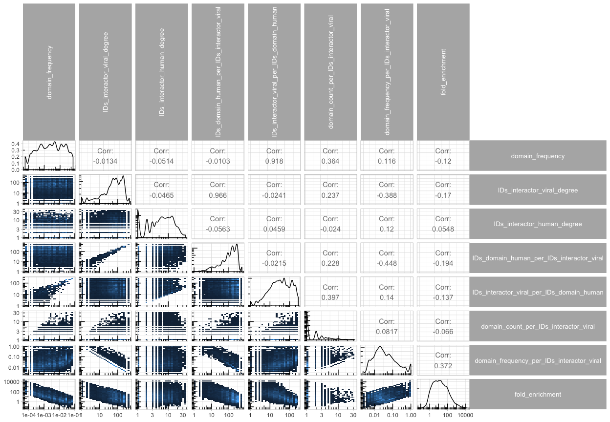

Date: 2018-08-21 10:34:35

## Map domain information on the protein interaction network

I read interaction data and clean this data to make it more useble. Then, I filter and keep only human-viral interactions. All done by the interSpeciesInteractome function.  


```r
# load protein-domain mapping
protein_domain_pair = fread(file = "./processed_data_files/protein_domain_pair", stringsAsFactors = F, sep = "\t")
# load PPI data
all_human_interaction = fullInteractome(taxid = 9606, database = "IntActFTP", format = "tab27",
                                        clean = TRUE, protein_only = TRUE, directory = "./data_files/")
```

```
## ... looking for the date of the latest IntAct release ...
## ... looking for the date of the latest IntAct release ...
```

```
## ... loading local copy ...
```

```
## Warning in fread(file_name, header = T, stringsAsFactors = F): Found
## and resolved improper quoting out-of-sample. First healed line 25381:
## <<uniprotkb:P16054 uniprotkb:Q05769 intact:EBI-298451 intact:EBI-298933|
## uniprotkb:Q543K3 psi-mi:kpce_mouse(display_long)|uniprotkb:Prkce(gene
## name)|psi-mi:Prkce(display_short)|uniprotkb:Pkce(gene name synonym)|
## uniprotkb:Pkcea(gene name synonym)|uniprotkb:nPKC-epsilon(gene name
## synonym) psi-mi:pgh2_mouse(display_long)|uniprotkb:Ptgs2(gene name)|
## psi-mi:Ptgs2(display_short)|uniprotkb:Cox-2(gene name synonym)|
## uniprotkb:Cox2(gene name synonym)|uniprotkb:Pghs-b(gene name synonym)|
## uniprotkb:Tis10(gene na>>. If the fields are not quoted (e.g. field
## separator does not appear within any field), try quote="" to avoid this
## warning.
```

```r
all_viral_interaction = interSpeciesInteractome(taxid1 = 9606, taxid2 = 10239, database = "IntActFTP", format = "tab27",
                                        clean = TRUE, protein_only = TRUE, directory = "./data_files/")
```

```
## ... looking for the date of the latest IntAct release ...
```

```
## ... looking for the date of the latest IntAct release ...
```

```
## ... loading local copy ...
```

```
## Warning in fread(file_name, header = T, stringsAsFactors = F): Found
## and resolved improper quoting out-of-sample. First healed line 25381:
## <<uniprotkb:P16054 uniprotkb:Q05769 intact:EBI-298451 intact:EBI-298933|
## uniprotkb:Q543K3 psi-mi:kpce_mouse(display_long)|uniprotkb:Prkce(gene
## name)|psi-mi:Prkce(display_short)|uniprotkb:Pkce(gene name synonym)|
## uniprotkb:Pkcea(gene name synonym)|uniprotkb:nPKC-epsilon(gene name
## synonym) psi-mi:pgh2_mouse(display_long)|uniprotkb:Ptgs2(gene name)|
## psi-mi:Ptgs2(display_short)|uniprotkb:Cox-2(gene name synonym)|
## uniprotkb:Cox2(gene name synonym)|uniprotkb:Pghs-b(gene name synonym)|
## uniprotkb:Tis10(gene na>>. If the fields are not quoted (e.g. field
## separator does not appear within any field), try quote="" to avoid this
## warning.
```

```
## Warning in fread(filename): Found and resolved improper quoting out-of-
## sample. First healed line 5390: <<542959 Bpp1virus "BPP-1-like viruses";
## BPP-1-like phages; Bpp-1-like viruses; Bppunalikevirus Genus Viruses; dsDNA
## viruses, no RNA stage; Caudovirales; Podoviridae 10744 >>. If the fields
## are not quoted (e.g. field separator does not appear within any field), try
## quote="" to avoid this warning.

## Warning in fread(filename): Found and resolved improper quoting out-of-
## sample. First healed line 5390: <<542959 Bpp1virus "BPP-1-like viruses";
## BPP-1-like phages; Bpp-1-like viruses; Bppunalikevirus Genus Viruses; dsDNA
## viruses, no RNA stage; Caudovirales; Podoviridae 10744 >>. If the fields
## are not quoted (e.g. field separator does not appear within any field), try
## quote="" to avoid this warning.
```

```r
all_within_viral_interaction = fullInteractome(taxid = 10239, database = "IntActFTP", format = "tab27",
                                        clean = TRUE, protein_only = TRUE, directory = "./data_files/")
```

```
## ... looking for the date of the latest IntAct release ...
```

```
## ... looking for the date of the latest IntAct release ...
```

```
## ... loading local copy ...
```

```
## Warning in fread(file_name, header = T, stringsAsFactors = F): Found
## and resolved improper quoting out-of-sample. First healed line 25381:
## <<uniprotkb:P16054 uniprotkb:Q05769 intact:EBI-298451 intact:EBI-298933|
## uniprotkb:Q543K3 psi-mi:kpce_mouse(display_long)|uniprotkb:Prkce(gene
## name)|psi-mi:Prkce(display_short)|uniprotkb:Pkce(gene name synonym)|
## uniprotkb:Pkcea(gene name synonym)|uniprotkb:nPKC-epsilon(gene name
## synonym) psi-mi:pgh2_mouse(display_long)|uniprotkb:Ptgs2(gene name)|
## psi-mi:Ptgs2(display_short)|uniprotkb:Cox-2(gene name synonym)|
## uniprotkb:Cox2(gene name synonym)|uniprotkb:Pghs-b(gene name synonym)|
## uniprotkb:Tis10(gene na>>. If the fields are not quoted (e.g. field
## separator does not appear within any field), try quote="" to avoid this
## warning.

## Warning in fread(file_name, header = T, stringsAsFactors = F): Found and
## resolved improper quoting out-of-sample. First healed line 5390: <<542959
## Bpp1virus "BPP-1-like viruses"; BPP-1-like phages; Bpp-1-like viruses;
## Bppunalikevirus Genus Viruses; dsDNA viruses, no RNA stage; Caudovirales;
## Podoviridae 10744 >>. If the fields are not quoted (e.g. field separator
## does not appear within any field), try quote="" to avoid this warning.
```

```r
all_within_viral_interaction = subsetMITABbyID(MITABdata = all_within_viral_interaction, ID_seed = unique(all_viral_interaction$data$IDs_interactor_B), within_seed = T, only_seed2nonseed = F)
BioPlex3 = loadBioplex(dir = "./data_files/",
                       url = "http://bioplex.hms.harvard.edu/data/BioPlex_2.3_interactionList.tsv")
```

```
## ... loading local copy ...
```

```r
# N domains
protein_domain_pair[IDs_protein %in% unique(all_viral_interaction$data$IDs_interactor_A), uniqueN(IDs_domain)]
```

```
## [1] 2859
```

```r
# Pfam domains 
protein_domain_pair[IDs_protein %in% unique(all_viral_interaction$data$IDs_interactor_A) & grepl("PF",all_IDs_domain), uniqueN(IDs_domain)]
```

```
## [1] 1962
```

```r
qplot(protein_domain_pair[IDs_protein %in% unique(all_viral_interaction$data$IDs_interactor_A)][, .(N = uniqueN(IDs_domain)), by = IDs_protein]$N, main = "number of domains per protein", xlab = "number of domains per protein", geom = "histogram") + scale_x_log10() + theme_light()
```

```
## `stat_bin()` using `bins = 30`. Pick better value with `binwidth`.
```

<!-- -->

```r
qplot(protein_domain_pair[IDs_protein %in% unique(all_viral_interaction$data$IDs_interactor_A)][, .(N = .N), by = IDs_domain]$N, main = "domain occurence", xlab = "number of proteins per domain", geom = "histogram") + scale_x_log10() + theme_light()
```

```
## `stat_bin()` using `bins = 30`. Pick better value with `binwidth`.
```

<!-- -->

Viral proteins have 14522 known interacting pairs with human proteins while only 241 with other viral proteins.  

Both the interaction network table and the domain data contain more information than necessary for identifying domains likely to mediate interaction. Selecting only what's necessary: viral_protein_UniprotID - human_protein_UniprotID - human_domain_InterProID.  


```r
all_viral_interaction_simp = unique(all_viral_interaction$data[,.(IDs_interactor_human = IDs_interactor_A,
                                                                  IDs_interactor_viral = IDs_interactor_B,
                                                                  Taxid_interactor_human = Taxid_interactor_A,
                                                                  Taxid_interactor_viral = Taxid_interactor_B)])
# human interactions need simplyfying
all_human_interaction_simp = unique(all_human_interaction$data[,.(Taxid_interactor_human_A = Taxid_interactor_A,
                                                                  Taxid_interactor_human_B = Taxid_interactor_B,
                                                                  pair_id = pair_id)])
# but also expanding into directional network (both A -> B and B -> A)
all_human_interaction_simp[, c("IDs_interactor_human_A", "IDs_interactor_human_B") := tstrsplit(pair_id, "\\|")]
all_human_interaction_simp = rbind(all_human_interaction_simp,
                                   all_human_interaction_simp[,.(IDs_interactor_human_A = IDs_interactor_human_B,
                                                                 IDs_interactor_human_B = IDs_interactor_human_A,
                                                                 Taxid_interactor_human_A = Taxid_interactor_human_B,
                                                                  Taxid_interactor_human_B = Taxid_interactor_human_A,
                                                                  pair_id = pair_id)])
all_human_interaction_simp[, pair_id := NULL]
all_human_interaction_simp = unique(all_human_interaction_simp)

# Human interactions from BioPlex3 BioPlex3
BioPlex3_human_interaction_simp = unique(BioPlex3$data[,.(Taxid_interactor_human_A = Taxid_interactor_A,
                                                                  Taxid_interactor_human_B = Taxid_interactor_B,
                                                                  pair_id = pair_id)])
# but also expanding into directional network (both A -> B and B -> A)
BioPlex3_human_interaction_simp[, c("IDs_interactor_human_A", "IDs_interactor_human_B") := tstrsplit(pair_id, "\\|")]
BioPlex3_human_interaction_simp = rbind(BioPlex3_human_interaction_simp,
                                   BioPlex3_human_interaction_simp[,.(IDs_interactor_human_A = IDs_interactor_human_B,
                                                                 IDs_interactor_human_B = IDs_interactor_human_A,
                                                                 Taxid_interactor_human_A = Taxid_interactor_human_B,
                                                                  Taxid_interactor_human_B = Taxid_interactor_human_A,
                                                                  pair_id = pair_id)])
BioPlex3_human_interaction_simp[, pair_id := NULL]
BioPlex3_human_interaction_simp = unique(BioPlex3_human_interaction_simp)
```

Next, the frequency of each domain is calculated and simplified domain information (IDs_protein, IDs_domain, domain_type) is integrated with the simplified network data described above.  


```r
protein_domain_pair_temp = copy(protein_domain_pair)[, IDs_interactor_human := IDs_protein][, IDs_protein := NULL][, IDs_domain_human := IDs_domain][, IDs_domain := NULL]

# calculate total number of human proteins
protein_domain_pair_temp[, N_prot_w_interactors := length(unique(IDs_interactor_human))]
# calculate domain count and frequency
protein_domain_pair_temp[, domain_count := length(unique(IDs_interactor_human)), by = IDs_domain_human]
protein_domain_pair_temp[, domain_frequency := domain_count / N_prot_w_interactors]

# calculate network descriptive stats
# viral protein degree
all_viral_interaction_simp[, IDs_interactor_viral_degree := length(unique(IDs_interactor_human)), by = IDs_interactor_viral]
# human protein degree
all_viral_interaction_simp[, IDs_interactor_human_degree := length(unique(IDs_interactor_viral)), by = IDs_interactor_human]

# I keep all interactions even if a human protein has no known domain (all.x = F, all.y = T)
viral_human_w_domains = merge(protein_domain_pair_temp, all_viral_interaction_simp, all.x = F, all.y = T, by = "IDs_interactor_human", allow.cartesian = T)

# human domains per viral protein
viral_human_w_domains[, IDs_domain_human_per_IDs_interactor_viral := length(unique(IDs_domain_human)), by = IDs_interactor_viral]
# viral protein per human domain
viral_human_w_domains[, IDs_interactor_viral_per_IDs_domain_human := length(unique(IDs_interactor_viral)), by = IDs_domain_human]

# domain count but per viral protein human domain instances (how many proteins the domain is located in) per viral protein (ID) and human domain (ID)
viral_human_w_domains[, domain_count_per_IDs_interactor_viral := length(unique(IDs_interactor_human)), by = .(IDs_interactor_viral, IDs_domain_human)]
viral_human_w_domains[is.na(IDs_domain_human), domain_count_per_IDs_interactor_viral := 0]
# domain frequency but per viral protein
viral_human_w_domains[, domain_frequency_per_IDs_interactor_viral := domain_count_per_IDs_interactor_viral / IDs_interactor_viral_degree, by = IDs_interactor_viral]
viral_human_w_domains[is.na(IDs_domain_human), domain_frequency_per_IDs_interactor_viral := 0]
# fold enrichment
viral_human_w_domains[, fold_enrichment := domain_frequency_per_IDs_interactor_viral / domain_frequency]
viral_human_w_domains[is.na(IDs_domain_human), fold_enrichment := 0]


# save resulting network
fwrite(viral_human_w_domains, file = "./processed_data_files/viral_human_net_w_domains", sep = "\t")
```


```r
protein_domain_pair_temp = copy(protein_domain_pair)[, IDs_interactor_human_B := IDs_protein][, IDs_protein := NULL][, IDs_domain_human_B := IDs_domain][, IDs_domain := NULL]

# calculate total number of human proteins
protein_domain_pair_temp[, N_prot_w_interactors := length(unique(IDs_interactor_human_B))]
# calculate domain count and frequency
protein_domain_pair_temp[, domain_count := length(unique(IDs_interactor_human_B)), by = IDs_domain_human_B]
protein_domain_pair_temp[, domain_frequency := domain_count / N_prot_w_interactors]

# calculate network descriptive stats
# viral protein degree
all_human_interaction_simp[, IDs_interactor_human_A_degree := length(unique(IDs_interactor_human_B)), by = IDs_interactor_human_A]
# human protein degree
all_human_interaction_simp[, IDs_interactor_human_B_degree := length(unique(IDs_interactor_human_A)), by = IDs_interactor_human_B]

# I keep all interactions even if a human protein has no known domain (all.x = F, all.y = T)
human_w_domains = merge(protein_domain_pair_temp, all_human_interaction_simp, all.x = F, all.y = T, by = "IDs_interactor_human_B", allow.cartesian = T)

# human domains per viral protein
human_w_domains[, IDs_domain_human_B_per_IDs_interactor_human_A := length(unique(IDs_domain_human_B)), by = IDs_interactor_human_A]
# viral protein per human domain
human_w_domains[, IDs_interactor_human_A_per_IDs_domain_human_B := length(unique(IDs_interactor_human_A)), by = IDs_domain_human_B]

# domain count but per viral protein human domain instances (how many proteins the domain is located in) per viral protein (ID) and human domain (ID)
human_w_domains[, domain_count_per_IDs_interactor_human_A := length(unique(IDs_interactor_human_B)), by = .(IDs_interactor_human_A, IDs_domain_human_B)]
human_w_domains[is.na(IDs_domain_human_B), domain_count_per_IDs_interactor_human_A := 0]
# domain frequency but per viral protein
human_w_domains[, domain_frequency_per_IDs_interactor_human_A := domain_count_per_IDs_interactor_human_A / IDs_interactor_human_A_degree, by = IDs_interactor_human_A]
human_w_domains[is.na(IDs_domain_human_B), domain_frequency_per_IDs_interactor_human_A := 0]
# fold enrichment
human_w_domains[, fold_enrichment := domain_frequency_per_IDs_interactor_human_A / domain_frequency]
human_w_domains[is.na(IDs_domain_human_B), fold_enrichment := 0]


# save resulting network
fwrite(human_w_domains, file = "./processed_data_files/human_net_w_domains", sep = "\t")
gzip("./processed_data_files/human_net_w_domains", remove = T, overwrite = T)
```

```
## Warning in file.remove(filename): cannot remove file './
## processed_data_files/human_net_w_domains', reason 'No such file or
## directory'
```


```r
# calculate network descriptive stats
# viral protein degree
BioPlex3_human_interaction_simp[, IDs_interactor_human_A_degree := length(unique(IDs_interactor_human_B)), by = IDs_interactor_human_A]
# human protein degree
BioPlex3_human_interaction_simp[, IDs_interactor_human_B_degree := length(unique(IDs_interactor_human_A)), by = IDs_interactor_human_B]

# I keep all interactions even if a human protein has no known domain (all.x = F, all.y = T)
BioPlex3human_w_domains = merge(protein_domain_pair_temp, BioPlex3_human_interaction_simp, all.x = F, all.y = T, by = "IDs_interactor_human_B", allow.cartesian = T)

# human domains per viral protein
BioPlex3human_w_domains[, IDs_domain_human_B_per_IDs_interactor_human_A := length(unique(IDs_domain_human_B)), by = IDs_interactor_human_A]
# viral protein per human domain
BioPlex3human_w_domains[, IDs_interactor_human_A_per_IDs_domain_human_B := length(unique(IDs_interactor_human_A)), by = IDs_domain_human_B]

# domain count but per viral protein human domain instances (how many proteins the domain is located in) per viral protein (ID) and human domain (ID)
BioPlex3human_w_domains[, domain_count_per_IDs_interactor_human_A := length(unique(IDs_interactor_human_B)), by = .(IDs_interactor_human_A, IDs_domain_human_B)]
BioPlex3human_w_domains[is.na(IDs_domain_human_B), domain_count_per_IDs_interactor_human_A := 0]
# domain frequency but per viral protein
BioPlex3human_w_domains[, domain_frequency_per_IDs_interactor_human_A := domain_count_per_IDs_interactor_human_A / IDs_interactor_human_A_degree, by = IDs_interactor_human_A]
BioPlex3human_w_domains[is.na(IDs_domain_human_B), domain_frequency_per_IDs_interactor_human_A := 0]
# fold enrichment
BioPlex3human_w_domains[, fold_enrichment := domain_frequency_per_IDs_interactor_human_A / domain_frequency]
BioPlex3human_w_domains[is.na(IDs_domain_human_B), fold_enrichment := 0]


# save resulting network
fwrite(BioPlex3human_w_domains, file = "./processed_data_files/BioPlex3human_net_w_domains", sep = "\t")
gzip("./processed_data_files/BioPlex3human_net_w_domains", remove = T, overwrite = T)
```

## Summary of the viral-human network

The plot below show the relationships (2D histogram), distribution density (on the diagonal) and pearson correlation for a number of parameters characterising human domains, viral proteins or it's interactions:

1. domain_frequency is the number of human proteins with a particular domain divided by the total number of human proteins (the attribute of a human domain)
2. IDs_interactor_viral_degree is the number of interactions each viral protein has (the attribute of a viral protein)
3. IDs_interactor_human_degree is the number of interactions each human protein has (the attribute of a human protein)
4. IDs_domain_human_per_IDs_interactor_viral is the number of domain types that are present in proteins which a particular viral protein interacts with (the attribute of a viral protein)


```r
# function to accomodate ggplot2::geom_bin2d in GGally::ggpairs, taken from http://ggobi.github.io/ggally/#custom_functions
d2_bin <- function(data, mapping, ..., low = "#132B43", high = "#56B1F7") {
    ggplot(data = data, mapping = mapping) +
        geom_bin2d(...) +
        scale_fill_gradient(low = low, high = high) +
        scale_y_log10() + scale_x_log10() + annotation_logticks()
}

log10_density = function(data, mapping, ...){
    ggplot(data = data, mapping = mapping) +
        geom_density(...) +
        scale_x_log10() + annotation_logticks()
}

d2_bin_plot = GGally::ggpairs(viral_human_w_domains[!is.na(IDs_domain_human),.(domain_frequency, 
                                                                 IDs_interactor_viral_degree, 
                                                                 IDs_interactor_human_degree, 
                                                                 IDs_domain_human_per_IDs_interactor_viral, 
                                                                 IDs_interactor_viral_per_IDs_domain_human,
                                                                 domain_count_per_IDs_interactor_viral,
                                                                 domain_frequency_per_IDs_interactor_viral,
                                                                 fold_enrichment)], 
                lower = list(continuous = d2_bin), 
                diag = list(continuous = log10_density)) +
    theme_light() +
    theme(strip.text.y = element_text(angle = 0, size = 10),
          strip.text.x = element_text(angle = 90, size = 10))
d2_bin_plot
```

<!-- -->

## Summary of the viral-human network

## R session information


```r
save(list = ls(), file="./processed_data_files/map_domains_to_human_viral_network_clust.RData")
R.utils::gzip(filename = "./processed_data_files/map_domains_to_human_viral_network_clust.RData",
              destname = "./processed_data_files/map_domains_to_human_viral_network_clust.RData.gz",
              remove = T, overwrite = T)

Sys.Date()
```

```
## [1] "2018-08-21"
```

```r
sessionInfo()
```

```
## R version 3.5.1 (2018-07-02)
## Platform: x86_64-apple-darwin15.6.0 (64-bit)
## Running under: macOS Sierra 10.12.6
## 
## Matrix products: default
## BLAS: /Library/Frameworks/R.framework/Versions/3.5/Resources/lib/libRblas.0.dylib
## LAPACK: /Library/Frameworks/R.framework/Versions/3.5/Resources/lib/libRlapack.dylib
## 
## locale:
## [1] en_GB.UTF-8/en_GB.UTF-8/en_GB.UTF-8/C/en_GB.UTF-8/en_GB.UTF-8
## 
## attached base packages:
## [1] stats4    parallel  stats     graphics  grDevices utils     datasets 
## [8] methods   base     
## 
## other attached packages:
##  [1] GGally_1.4.0         MItools_0.1.38       Biostrings_2.48.0   
##  [4] XVector_0.20.0       rtracklayer_1.40.4   GenomicRanges_1.32.6
##  [7] GenomeInfoDb_1.16.0  ggplot2_3.0.0        PSICQUIC_1.18.1     
## [10] plyr_1.8.4           httr_1.3.1           biomaRt_2.36.1      
## [13] IRanges_2.14.10      S4Vectors_0.18.3     UniProt.ws_2.20.2   
## [16] BiocGenerics_0.26.0  RCurl_1.95-4.11      bitops_1.0-6        
## [19] RSQLite_2.1.1        R.utils_2.6.0        R.oo_1.22.0         
## [22] R.methodsS3_1.7.1    downloader_0.4       data.table_1.11.4   
## 
## loaded via a namespace (and not attached):
##  [1] matrixStats_0.54.0          bit64_0.9-7                
##  [3] RColorBrewer_1.1-2          progress_1.2.0             
##  [5] rprojroot_1.3-2             tools_3.5.1                
##  [7] backports_1.1.2             R6_2.2.2                   
##  [9] DT_0.4                      KernSmooth_2.23-15         
## [11] DBI_1.0.0                   lazyeval_0.2.1             
## [13] colorspace_1.3-2            withr_2.1.2                
## [15] tidyselect_0.2.4            prettyunits_1.0.2          
## [17] ontologyIndex_2.4           bit_1.1-14                 
## [19] curl_3.2                    compiler_3.5.1             
## [21] Biobase_2.40.0              DelayedArray_0.6.4         
## [23] labeling_0.3                caTools_1.17.1.1           
## [25] scales_1.0.0                rappdirs_0.3.1             
## [27] stringr_1.3.1               digest_0.6.15              
## [29] Rsamtools_1.32.2            rmarkdown_1.10             
## [31] pkgconfig_2.0.1             htmltools_0.3.6            
## [33] dbplyr_1.2.2                htmlwidgets_1.2            
## [35] rlang_0.2.1                 bindr_0.1.1                
## [37] jsonlite_1.5                BiocParallel_1.14.2        
## [39] gtools_3.8.1                dplyr_0.7.6                
## [41] magrittr_1.5                GenomeInfoDbData_1.1.0     
## [43] Matrix_1.2-14               Rcpp_0.12.18               
## [45] munsell_0.5.0               proto_1.0.0                
## [47] stringi_1.2.4               yaml_2.2.0                 
## [49] SummarizedExperiment_1.10.1 zlibbioc_1.26.0            
## [51] gplots_3.0.1                qvalue_2.12.0              
## [53] BiocFileCache_1.4.0         grid_3.5.1                 
## [55] blob_1.1.1                  gdata_2.18.0               
## [57] crayon_1.3.4                lattice_0.20-35            
## [59] splines_3.5.1               hms_0.4.2                  
## [61] knitr_1.20                  pillar_1.3.0               
## [63] reshape2_1.4.3              XML_3.98-1.15              
## [65] glue_1.3.0                  evaluate_0.11              
## [67] gtable_0.2.0                purrr_0.2.5                
## [69] reshape_0.8.7               assertthat_0.2.0           
## [71] gsubfn_0.7                  tibble_1.4.2               
## [73] GenomicAlignments_1.16.0    AnnotationDbi_1.42.1       
## [75] memoise_1.1.0               bindrcpp_0.2.2             
## [77] ROCR_1.0-7
```
