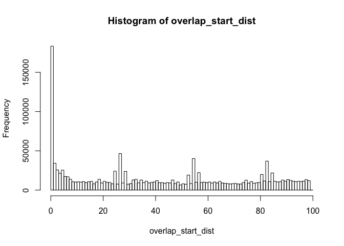
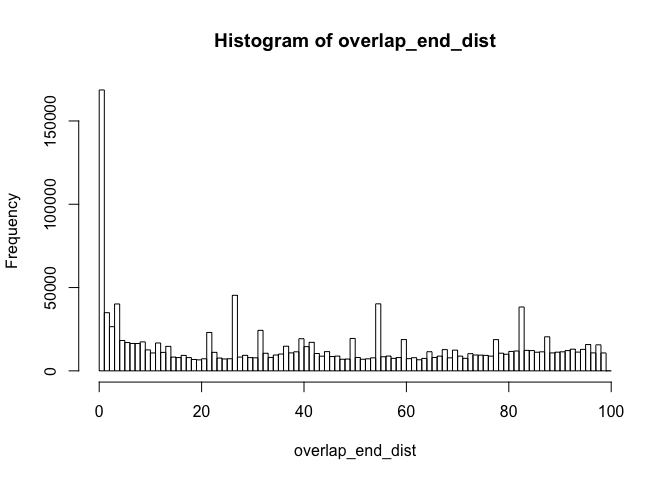
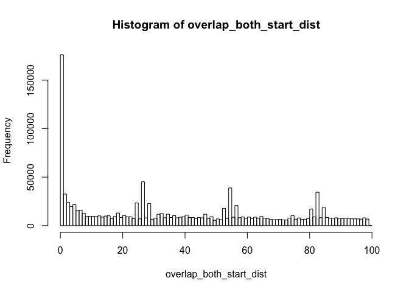
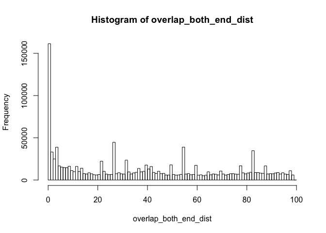
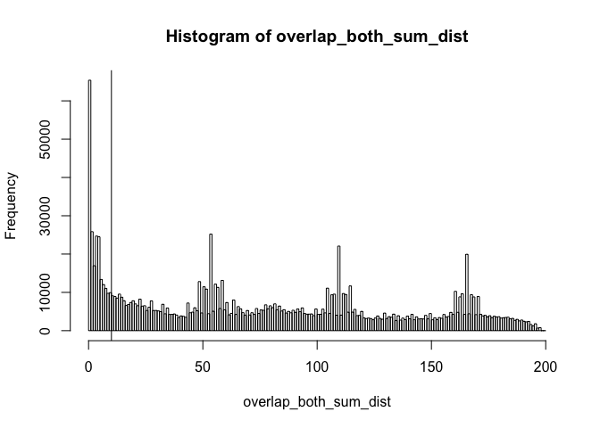
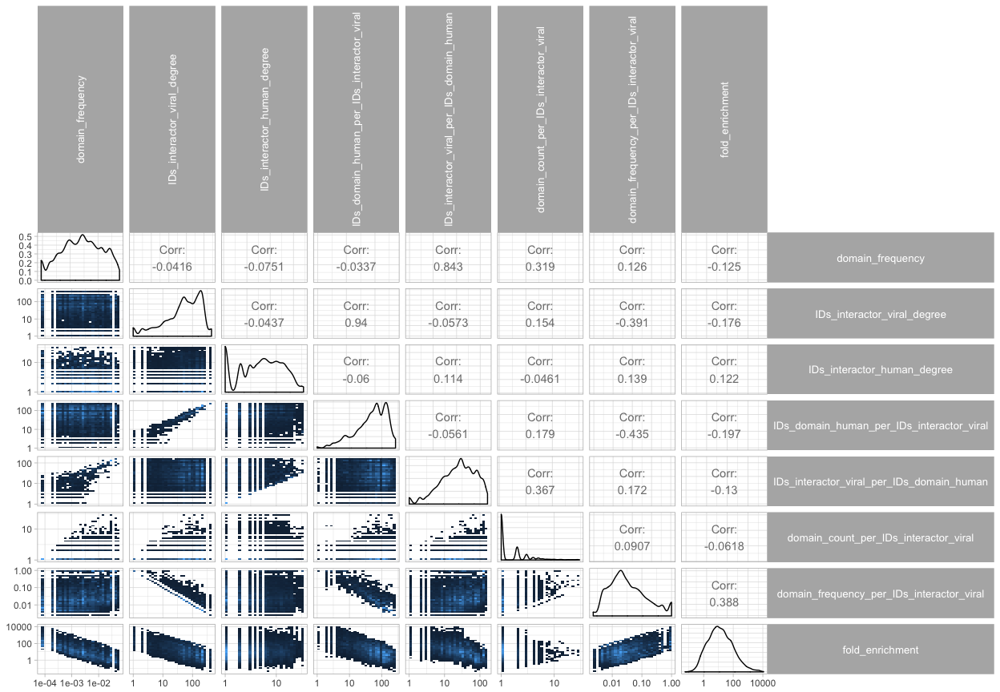

# Mapping domains to the protein interaction network
Vitalii Kleshchevnikov  
29/06/2017  


Date: 2017-07-31 11:10:59

## Read InterProScan result and filter for "Domain", "Active_site", "Binding_site", "Conserved_site", "PTM" signatures

I read InterProScan result and the InterPro_entry_types file. InterProScan output format description: https://github.com/ebi-pf-team/interproscan/wiki/OutputFormats  


```r
# ungzip and read InterProScan result
gunzip("./processed_data_files/all_human_viral_protein_domains.gff3.gz", remove = F)
InterProScan_result = import(con = "./processed_data_files/all_human_viral_protein_domains.gff3", format = "gff3")
unlink("./processed_data_files/all_human_viral_protein_domains.gff3")
# clean InterPro ID in the Dbxref column
InterProScan_result$Dbxref = gsub("InterPro:","", InterProScan_result$Dbxref)
InterProScan_result$Dbxref = gsub("\"","", InterProScan_result$Dbxref)
InterProScan_result$Ontology_term = gsub("\"","", InterProScan_result$Ontology_term)
# read InterPro_entry_types mapping table
if(!file.exists("./processed_data_files/entry.list")) download("ftp://ftp.ebi.ac.uk/pub/databases/interpro/entry.list", "./processed_data_files/entry.list")
InterPro_entry_types = fread("./processed_data_files/entry.list", stringsAsFactors = F)
# find matching signatures
matching_signatures = match(as.character(InterProScan_result$Dbxref), InterPro_entry_types$ENTRY_AC)
# add signature type information to the gff2 file
InterProScan_result$ENTRY_TYPE = InterPro_entry_types$ENTRY_TYPE[matching_signatures]
# add names metadata to allow subsetting with a character
names(InterProScan_result) = seqnames(InterProScan_result)

# import seqence length information correctly into the GRanges object format
# find seqence length
seq_length = end(InterProScan_result)[InterProScan_result$type == "polypeptide"]
# name the vector
names(seq_length) = seqnames(InterProScan_result)[InterProScan_result$type == "polypeptide"]
# match names in the vector and in the GRanges seqlengths slot
seqlengths(InterProScan_result) = seq_length[match(names(seqlengths(InterProScan_result)),names(seq_length))]
# sanity check
seqlengths(InterProScan_result)[c("P69713", "P06748-3", "P06821", "O00562", "O15230")] == end(InterProScan_result[c("P69713", "P06748-3", "P06821", "O00562", "O15230")])
```

```
##   P69713 P06748-3   P06821   O00562   O15230 
##     TRUE     TRUE     TRUE     TRUE     TRUE
```

```r
# create a subset that contains "Domain", "Active_site", "Binding_site", "Conserved_site", "PTM" signatures
InterProScan_domains = InterProScan_result[InterProScan_result$ENTRY_TYPE %in% c("Domain", "Active_site", "Binding_site", "Conserved_site", "PTM", "Repeat")]
```

## Remove redundancy in the identified domains (signatures of the same domain from different InterPro member databases)


```r
# generate Granges which contain feature start
domain_start = resize(InterProScan_domains, width = 1, fix="start", use.names=TRUE)
# generate Granges which contain feature end
domain_end = resize(InterProScan_domains, width = 1, fix="end", use.names=TRUE)

# find features with overlapping start (including feature with itself)
overlap_start = findOverlaps(query = domain_start, maxgap = 100)
# find features with overlapping end (including feature with itself)
overlap_end = findOverlaps(query = domain_end, maxgap = 100)

# remove overlapping start of feature with itself
overlap_start = overlap_start[(queryHits(overlap_start) != subjectHits(overlap_start))]
# remove overlapping end of feature with itself
overlap_end = overlap_end[(queryHits(overlap_end) != subjectHits(overlap_end))]

# calculate the distance between positions of overlapping start features
overlap_start_dist = distance(domain_start[queryHits(overlap_start)], domain_start[subjectHits(overlap_start)])
hist(overlap_start_dist, breaks = seq(0,100,1))
```

<!-- -->

```r
# calculate the distance between positions of overlapping end features
overlap_end_dist = distance(domain_end[queryHits(overlap_end)], domain_end[subjectHits(overlap_end)])
hist(overlap_end_dist, breaks = seq(0,100,1))
```

<!-- -->

```r
# find features in which both the start and the end overlap
overlap_start_n_end = intersect(overlap_start, overlap_end)

# calculate the distance between positions of overlapping start features
overlap_both_start_dist = distance(domain_start[queryHits(overlap_start_n_end)], domain_start[subjectHits(overlap_start_n_end)])
hist(overlap_both_start_dist, breaks = seq(0,100,1))
```

<!-- -->

```r
# calculate the distance between positions of overlapping end features
overlap_both_end_dist = distance(domain_end[queryHits(overlap_start_n_end)], domain_end[subjectHits(overlap_start_n_end)])
hist(overlap_both_end_dist, breaks = seq(0,100,1))
```

<!-- -->

```r
# sum these distances
overlap_both_sum_dist = overlap_both_start_dist + overlap_both_end_dist
hist(overlap_both_sum_dist, breaks = seq(0,200,1))
abline(v=10)
```

<!-- -->

```r
# select distance difference cutoff
overlap_start_n_end = overlap_start_n_end[overlap_both_sum_dist < 10]
# generate non-redundant domain annotatations by keeping only the first domain signature among overlapping signatures
overlap_start_n_end_nonred = overlap_start_n_end[queryHits(overlap_start_n_end) < subjectHits(overlap_start_n_end)]
InterProScan_domains_nonred = InterProScan_domains[unique(queryHits(overlap_start_n_end_nonred))]
# save results
export(InterProScan_domains_nonred, con = "./processed_data_files/InterProScan_domains_nonredundant.gff3", format = "gff3")

# take protein-domain pair discarding range information
protein_domain_pair = unique(data.table(IDs_protein = as.character(seqnames(InterProScan_domains_nonred)), IDs_domain = as.character(InterProScan_domains_nonred$Dbxref), domain_type = InterProScan_domains_nonred$ENTRY_TYPE))
```

## Map domain information on the protein interaction network

I read interaction data and clean this data to make it more useble. Then, I filter and keep only human-viral interactions.


```r
all_viral_interaction = fread("./data_files/viral_interactions.txt", stringsAsFactors = F)
all_viral_interaction = cleanMITAB(all_viral_interaction)
# pick proteins only
all_viral_interaction = all_viral_interaction[interactor_IDs_databases_A == "uniprotkb" & interactor_IDs_databases_B == "uniprotkb", ]
```

Both the network and the domain data contain more information than necessary for identifying domains likely to mediate interaction. Selecting only what's necessary: viral_protein_UniprotID - human_protein_UniprotID - human_domain_InterProID.  
  
First, we need to rearrange interactions so that one column contains viral proteins and the other contains human proteins (in the database some interactions are stored viral-human order and some in human-viral order).   


```r
all_viral_interaction_ab = all_viral_interaction[Taxid_interactor_A == "9606" & Taxid_interactor_B != "9606",
                                                 .(IDs_interactor_human = IDs_interactor_A, 
                                                   IDs_interactor_viral = IDs_interactor_B, 
                                                   Taxid_interactor_human = Taxid_interactor_A, 
                                                   Taxid_interactor_viral = Taxid_interactor_B)]
all_viral_interaction_ba = all_viral_interaction[Taxid_interactor_A != "9606" & Taxid_interactor_B == "9606",
                                                 .(IDs_interactor_human = IDs_interactor_B,
                                                   IDs_interactor_viral = IDs_interactor_A,
                                                   Taxid_interactor_human = Taxid_interactor_B,
                                                   Taxid_interactor_viral = Taxid_interactor_A)]
all_viral_interaction_simp = unique(rbind(all_viral_interaction_ab, all_viral_interaction_ba))
```

Next, the frequency of each domain is calculated and simplified domain information (IDs_protein, IDs_domain, domain_type) is integrated with the simplified network data described above.  


```r
protein_domain_pair_temp = copy(protein_domain_pair)[, IDs_interactor_human := IDs_protein][, IDs_protein := NULL][, IDs_domain_human := IDs_domain][, IDs_domain := NULL]
# calculate domain count and frequency
protein_domain_pair_temp[, domain_count := length(unique(IDs_interactor_human)), by = IDs_domain_human]
protein_domain_pair_temp[, domain_frequency := domain_count / length(unique(IDs_interactor_human))]

# calculate network descriptive stats
# viral protein degree
all_viral_interaction_simp[, IDs_interactor_viral_degree := length(unique(IDs_interactor_human)), by = IDs_interactor_viral]
# human protein degree
all_viral_interaction_simp[, IDs_interactor_human_degree := length(unique(IDs_interactor_viral)), by = IDs_interactor_human]

# I keep all interactions even if a human protein has no known domain
viral_human_w_domains = merge(protein_domain_pair_temp, all_viral_interaction_simp, all.x = F, all.y = T, by = "IDs_interactor_human", allow.cartesian = T)

# human domains per viral protein
viral_human_w_domains[, IDs_domain_human_per_IDs_interactor_viral := length(unique(IDs_domain_human)), by = IDs_interactor_viral]
# viral protein per human domain
viral_human_w_domains[, IDs_interactor_viral_per_IDs_domain_human := length(unique(IDs_interactor_viral)), by = IDs_domain_human]

# domain count but per viral protein human domain instances (how many proteins the domain is located in) per viral protein (ID) and human domain (ID)
viral_human_w_domains[, domain_count_per_IDs_interactor_viral := length(unique(IDs_interactor_human)), by = .(IDs_interactor_viral, IDs_domain_human)]
viral_human_w_domains[is.na(IDs_domain_human), domain_count_per_IDs_interactor_viral := 0]
# domain frequency but per viral protein
viral_human_w_domains[, domain_frequency_per_IDs_interactor_viral := domain_count_per_IDs_interactor_viral / IDs_interactor_viral_degree, by = IDs_interactor_viral]
viral_human_w_domains[is.na(IDs_domain_human), domain_frequency_per_IDs_interactor_viral := 0]
# fold enrichment
viral_human_w_domains[, fold_enrichment := domain_frequency_per_IDs_interactor_viral / domain_frequency]
viral_human_w_domains[is.na(IDs_domain_human), fold_enrichment := 0]

# save resulting network
fwrite(viral_human_w_domains, file = "./processed_data_files/viral_human_net_w_domains", sep = "\t")
```

## Summary of the network

The plot below show the relationships (2D histogram), distribution density (on the diagonal) and pearson correlation for a number of parameters characterising human domains, viral proteins or it's interactions:

1. domain_frequency is the number of human proteins with a particular domain divided by the total number of human proteins (the attribute of a human domain)
2. IDs_interactor_viral_degree is the number of interactions each viral protein has (the attribute of a viral protein)
3. IDs_interactor_human_degree is the number of interactions each human protein has (the attribute of a human protein)
4. IDs_domain_human_per_IDs_interactor_viral is the number of domain types that are present in proteins which a particular viral protein interacts with (the attribute of a viral protein)


```r
# function to accomodate ggplot2::geom_bin2d in GGally::ggpairs, taken from http://ggobi.github.io/ggally/#custom_functions
d2_bin <- function(data, mapping, ..., low = "#132B43", high = "#56B1F7") {
    ggplot(data = data, mapping = mapping) +
        geom_bin2d(...) +
        scale_fill_gradient(low = low, high = high) +
        scale_y_log10() + scale_x_log10()
}

log10_density = function(data, mapping, ...){
    ggplot(data = data, mapping = mapping) +
        geom_density(...) +
        scale_x_log10()
}

GGally::ggpairs(viral_human_w_domains[!is.na(IDs_domain_human),.(domain_frequency, 
                                         IDs_interactor_viral_degree, 
                                         IDs_interactor_human_degree, 
                                         IDs_domain_human_per_IDs_interactor_viral, 
                                         IDs_interactor_viral_per_IDs_domain_human,
                                         domain_count_per_IDs_interactor_viral,
                                         domain_frequency_per_IDs_interactor_viral,
                                         fold_enrichment)], 
                lower = list(continuous = d2_bin), 
                diag = list(continuous = log10_density)) +
    theme_light() +
    theme(strip.text.y = element_text(angle = 0, size = 10),
          strip.text.x = element_text(angle = 90, size = 10))
```

<!-- -->
