# Identify if the domains we have identified tend to bind linear motifs (the domains we have identified are enriched in domains known to bind linear motifs)
Vitalii Kleshchevnikov  
17/08/2017  


## Setting up how many cores to use for analysis and fold-enrichment vs freqency


```r
# cores to use for multiprocessing: is the number of cores is small -> we are not on a cluster -> use all; if the number of cores is large -> we are on cluster -> use only 15 or 7 or 31 cores (n requested-1)
if(detectCores() <= 4) cores_to_use = detectCores() - 1
if(detectCores() > 4) cores_to_use = 31

# how many permutations?
N_permut = 5
```

# How many of the domains identified using our approach are in the ELM database (as compared to the population of all domains we tested)?

## Calculate empirical pvalues using either frequency of a domain among interacting partners of viral protein or Fisher test p-value


```r
data = fread("./processed_data_files/viral_human_net_w_domains", sep = "\t", stringsAsFactors = F)
# frequency function: set up standard parameters
permuteFrequency = function(data, select_nodes = NULL, also_permuteYZ = F){
    res = permutationPval(interactions2permute = IDs_interactor_viral ~ IDs_interactor_human, # first set of interacting pairs (XY) that are to be permuted
                          associations2test = IDs_interactor_viral ~ IDs_domain_human, # set of interacting pairs to be tested (XZ), YZ interactions are assumed
                          node_attr = list(IDs_interactor_viral ~ IDs_interactor_viral_degree,
                                           IDs_domain_human ~ domain_count,
                                           IDs_interactor_viral + IDs_domain_human ~ domain_frequency_per_IDs_interactor_viral),
                          data = data,
                          statistic = IDs_interactor_viral + IDs_domain_human ~ .N / IDs_interactor_viral_degree,
                          select_nodes = select_nodes,
                          N = N_permut,
                          cores = cores_to_use, seed = 2, also_permuteYZ = also_permuteYZ)
    return(res)
}

# frequency: all proteins and domains - # permute IDs_interactor_viral ~ IDs_interactor_human
time = proc.time()
res = permuteFrequency(data, select_nodes = NULL)
proc.time() - time
```

```
##    user  system elapsed 
##   2.360   0.640  17.039
```

```r
plot(res, main = "frequency: all proteins and domains")
```

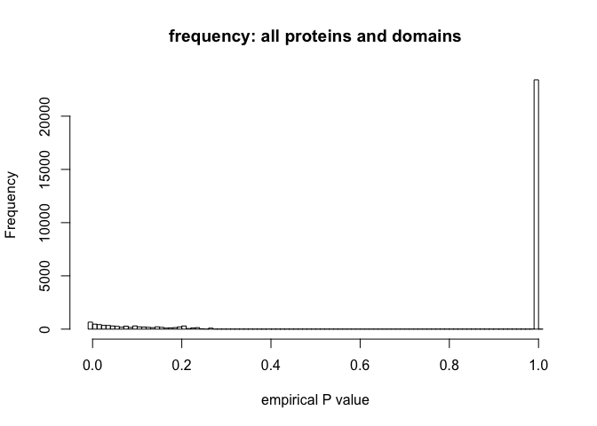<!-- -->

```r
# permute BOTH IDs_interactor_viral ~ IDs_interactor_human AND IDs_interactor_human ~ IDs_domain_human
time = proc.time()
res_both = permuteFrequency(data, select_nodes = NULL, also_permuteYZ = T)
proc.time() - time
```

```
##    user  system elapsed 
##   1.595   0.259  15.992
```

```r
plot(res_both, main = "frequency: all proteins and domains")
```

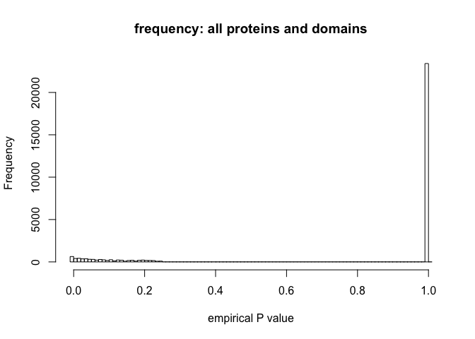<!-- -->

```r
# frequency: no low background count domains
res_low_back = permuteFrequency(data, select_nodes = IDs_domain_human ~ domain_count >= 3)
#res_low_back_alt = permuteFrequency(data[domain_count >= 3,])
#all.equal(res_low_back$data_with_pval[complete.cases(res_low_back$data_with_pval),p.value], res_low_back_alt$data_with_pval[complete.cases(res_low_back_alt$data_with_pval),p.value])
plot(res_low_back, main = "frequency: no low background count domains (>= 3)")
```

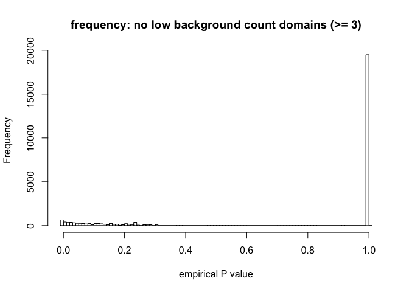<!-- -->

```r
# frequency: not considering (fixing interactions, degree of every node in the network stays the same, but only high degree proteins are taken into account, equivalent to  permuting only interactions of protein with the degree higher than 1) viral proteins with the degree of 1 - removing viral proteins with the degree of 1
res_low_deg = permuteFrequency(data, select_nodes = IDs_interactor_viral ~ IDs_interactor_viral_degree >= 2)
#res_low_deg_alt = permuteFrequency(data[IDs_interactor_viral_degree >= 2,])
#all.equal(res_low_deg$data_with_pval[complete.cases(res_low_deg$data_with_pval),p.value], res_low_deg_alt$data_with_pval[complete.cases(res_low_deg_alt$data_with_pval),p.value])

plot(res_low_deg, main = "frequency: not considering viral proteins with the degree of 1")
```

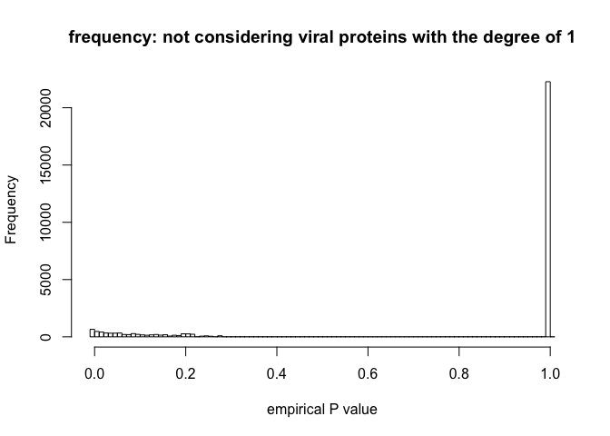<!-- -->

```r
# frequency: BOTH no low background count domains AND removing viral proteins with the degree of 1

res_low_deg_back = permuteFrequency(data, select_nodes = list(IDs_domain_human ~ domain_count >= 3,
                                                              IDs_interactor_viral ~ IDs_interactor_viral_degree >= 2))
#res_low_deg_back_alt = permuteFrequency(data[domain_count >= 3 & IDs_interactor_viral_degree >= 2,])
#all.equal(res_low_deg_back$data_with_pval[complete.cases(res_low_deg_back$data_with_pval),p.value], res_low_deg_back_alt$data_with_pval[complete.cases(res_low_deg_back_alt$data_with_pval),p.value])
plot(res_low_deg_back, main = "frequency: no low background count domains (>= 3)\nAND not considering viral proteins with the degree of 1")
```

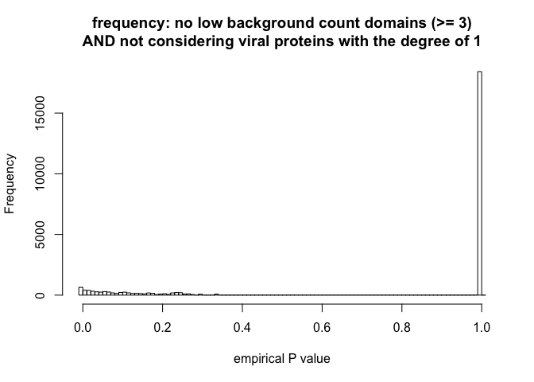<!-- -->

```r
save(res, file="./processed_data_files/what_we_find_VS_ELM_output_freq.RData")
```


```r
# count function: set up standard parameters
permuteCount = function(data, select_nodes = NULL, also_permuteYZ = F){
    res = permutationPval(interactions2permute = IDs_interactor_viral ~ IDs_interactor_human, # first set of interacting pairs (XY) that are to be permuted
                          associations2test = IDs_interactor_viral ~ IDs_domain_human, # set of interacting pairs to be tested (XZ), YZ interactions are assumed
                          node_attr = list(IDs_interactor_viral ~ IDs_interactor_viral_degree,
                                           IDs_domain_human ~ domain_count,
                                           IDs_interactor_viral + IDs_domain_human ~ domain_frequency_per_IDs_interactor_viral),
                          data = data,
                          statistic = IDs_interactor_viral + IDs_domain_human ~ .N,
                          select_nodes = select_nodes,
                          N = N_permut,
                          cores = cores_to_use, seed = 2, also_permuteYZ = also_permuteYZ)
    return(res)
}
# count: all proteins and domains - # permute IDs_interactor_viral ~ IDs_interactor_human
time = proc.time()
res_count = permuteCount(data, select_nodes = NULL)
proc.time() - time
```

```
##    user  system elapsed 
##   1.159   0.573  15.614
```

```r
plot(res_count, main = "count: all proteins and domains")
```

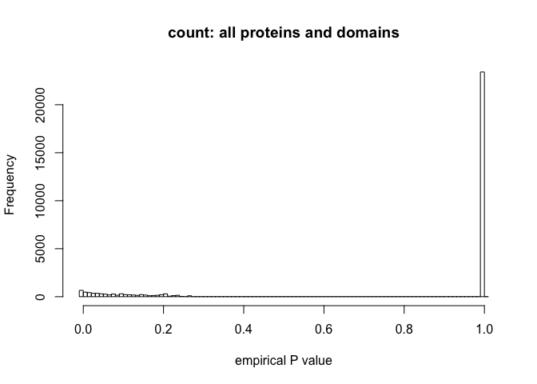<!-- -->

```r
save(list = ls(), file="./processed_data_files/what_we_find_VS_ELM_clust.RData")
```


```r
# Fisher test: set up standard parameters
permuteFisherTest = function(data, select_nodes = NULL, also_permuteYZ = F){
    resFISHER = permutationPval(interactions2permute = IDs_interactor_viral ~ IDs_interactor_human, # first set of interacting pairs (XY) that are to be permuted
                                associations2test = IDs_interactor_viral ~ IDs_domain_human, # set of interacting pairs to be tested (XZ), YZ interactions are assumed
                                node_attr = list(IDs_interactor_viral ~ IDs_interactor_viral_degree, # attribute of X
                                                 IDs_domain_human ~ domain_count + N_prot_w_interactors, # attributes of Z
                                                 IDs_interactor_viral + IDs_domain_human ~ domain_count_per_IDs_interactor_viral), # attribute of both X and Z
                                data = data, # data.table containing data
                                statistic = IDs_interactor_viral + IDs_domain_human ~ fisher.test(
                                    matrix(c(domain_count_per_IDs_interactor_viral[1], 
                                             IDs_interactor_viral_degree[1] - domain_count_per_IDs_interactor_viral[1],
                                             domain_count[1], 
                                             N_prot_w_interactors[1] - domain_count[1]),
                                           2,2), 
                                    alternative = "greater", conf.int = F)$p.value, # formula to calculate statisic by evaluating right-hand-side expression for each X and Z pair, right-hand-side expression is what is normally put in j in data.table DT[i, j, by], left-hand-side expression contains column names of X and Z which are used in by in data.table
                                select_nodes = select_nodes, # select a subset of the data, only nodes 
                                N = N_permut, # number of permutations
                                cores = cores_to_use, seed = 1, also_permuteYZ = also_permuteYZ)
    # permutationPval returns the number of cases when permuted statitic is higher than the observed statistic (right tail of the distribution), in this case we are interested in the reverse - the lower tail, when p-values from permuted distribution that are lower than the observed p-value
    resFISHER$data_with_pval[, p.value := 1 - p.value]
    return(resFISHER)
}

# contingency matrix:
matrix(c("domain_count_per_IDs_interactor_viral[1]", 
         "IDs_interactor_viral_degree[1] - domain_count_per_IDs_interactor_viral[1]",
         "domain_count[1]", 
         "N_prot_w_interactors[1] - domain_count[1]"),2,2)
```

```
##      [,1]                                                                       
## [1,] "domain_count_per_IDs_interactor_viral[1]"                                 
## [2,] "IDs_interactor_viral_degree[1] - domain_count_per_IDs_interactor_viral[1]"
##      [,2]                                       
## [1,] "domain_count[1]"                          
## [2,] "N_prot_w_interactors[1] - domain_count[1]"
```

```r
# permute IDs_interactor_viral ~ IDs_interactor_human
time = proc.time()
resFISHER = permuteFisherTest(data, select_nodes = NULL)
proc.time() - time
```

```
##    user  system elapsed 
##   6.695   0.150  18.513
```

```r
plot(resFISHER, main = "Fisher test P-value: all proteins and domains")
```

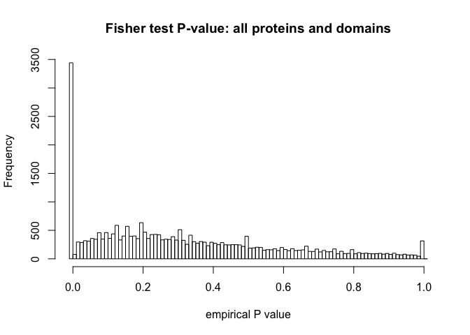<!-- -->

```r
# permute BOTH IDs_interactor_viral ~ IDs_interactor_human AND IDs_interactor_human ~ IDs_domain_human
time = proc.time()
resFISHER_both = permuteFisherTest(data, select_nodes = NULL, also_permuteYZ = T)
proc.time() - time
```

```
##    user  system elapsed 
##   7.932   0.176  21.402
```

```r
plot(resFISHER_both, main = "Fisher test P-value: all proteins and domains \npermute BOTH IDs_interactor_viral ~ IDs_interactor_human AND IDs_interactor_human ~ IDs_domain_human")
```

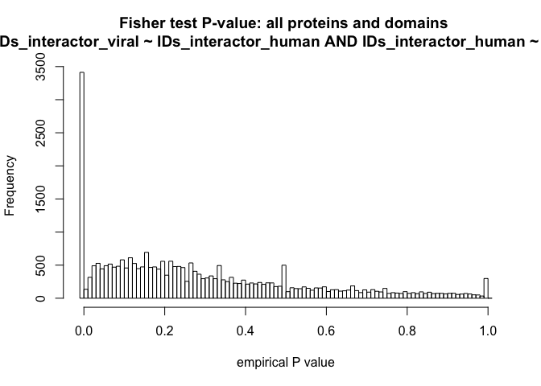<!-- -->

```r
save(resFISHER, file="./processed_data_files/what_we_find_VS_ELM_output_FISHER.RData")
```


```r
# frequency function: set up standard parameters
permuteFrequencyRev = function(data, select_nodes = NULL, also_permuteYZ = F){
    res = permutationPval(interactions2permute = IDs_domain_human ~ IDs_interactor_human, # first set of interacting pairs (XY) that are to be permuted
                          associations2test = IDs_domain_human ~ IDs_interactor_viral, # set of interacting pairs to be tested (XZ), YZ interactions are assumed
                          node_attr = list(IDs_interactor_viral ~ IDs_interactor_viral_degree,
                                           IDs_domain_human ~ domain_count,
                                           IDs_interactor_viral + IDs_domain_human ~ domain_frequency_per_IDs_interactor_viral),
                          data = data,
                          statistic = IDs_interactor_viral + IDs_domain_human ~ .N / domain_count,
                          select_nodes = select_nodes,
                          N = N_permut,
                          cores = cores_to_use, seed = 2, also_permuteYZ = also_permuteYZ)
    return(res)
}

# frequency: all proteins and domains - # permute IDs_domain_human ~ IDs_interactor_human
time = proc.time()
resRev = permuteFrequencyRev(data, select_nodes = NULL)
proc.time() - time
```

```
##    user  system elapsed 
##   1.244   0.120  13.230
```

```r
plot(resRev, main = "frequency reverse: viral protein frequency among proteins with a domain")
```

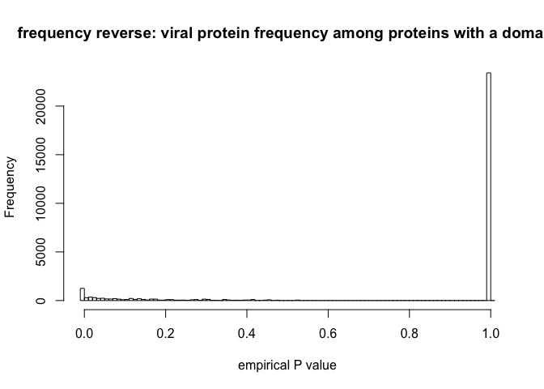<!-- -->

```r
# multiply one way and the reverse-way probabilities
mix = resRev
mix$data_with_pval = resRev$data_with_pval[res$data_with_pval, on = c("IDs_domain_human", "IDs_interactor_viral", "IDs_interactor_human", "domain_type", "N_prot_w_interactors", "domain_count", "domain_frequency", "Taxid_interactor_human", "Taxid_interactor_viral", "IDs_interactor_viral_degree", "domain_frequency_per_IDs_interactor_viral", "fold_enrichment", "IDs_interactor_viral_per_IDs_domain_human", "domain_count_per_IDs_interactor_viral", "IDs_interactor_human_degree", "IDs_domain_human_per_IDs_interactor_viral")]
mix$data_with_pval[, p.value := p.value * i.p.value]
plot(mix, main = "frequency mix: p-val viral protein-domain * p-val domain-viral protein")
```

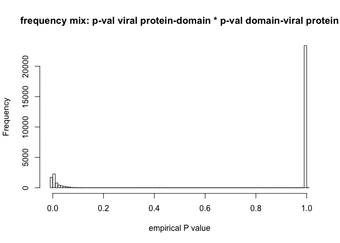<!-- -->

```r
save(mix, file="./processed_data_files/what_we_find_VS_ELM_output_freq_mix.RData")
```

## Viral protein degree and the background domain count of top-scoring proteins


```r
# function to accomodate ggplot2::geom_bin2d in GGally::ggpairs, taken from http://ggobi.github.io/ggally/#custom_functions
d2_bin_log10 <- function(data, mapping, ..., low = "#132B43", high = "#56B1F7") {
    ggplot(data = data, mapping = mapping) +
        geom_bin2d(...) +
        scale_fill_gradient(low = low, high = high) +
        scale_y_log10() + scale_x_log10() + annotation_logticks()
}

log10_density = function(data, mapping, ...){
    ggplot(data = data, mapping = mapping) +
        geom_density(...) +
        scale_x_log10()
}

PermutResult2D = function(res, N){
    res_temp = unique(res$data_with_pval[,.(IDs_interactor_viral, IDs_domain_human,
                                            domain_count, 
                                            IDs_interactor_viral_degree, 
                                            domain_count_per_IDs_interactor_viral,
                                            p.value)])
    GGally::ggpairs(res_temp[order(p.value, decreasing = F)[1:N],],
                    columns = c("domain_count", 
                                "IDs_interactor_viral_degree", 
                                "domain_count_per_IDs_interactor_viral",
                                "p.value"),
                    lower = list(continuous = d2_bin_log10)#, 
                    #diag = list(continuous = geom_density)
    ) +
        theme_light() +
        theme(strip.text.y = element_text(angle = 0, size = 10),
              strip.text.x = element_text(angle = 90, size = 10))
}

# frequency
PermutResult2D(res = res, N = 250) +
    ggtitle("2D-bin plots of 250 top-scoring viral protein - human domain pairs, \n statistic: frequency of a domain among interacting partners of a viral protein (viral-domain)")
```

```
## Warning in cor(x, y, method = method, use = use): the standard deviation is
## zero

## Warning in cor(x, y, method = method, use = use): the standard deviation is
## zero

## Warning in cor(x, y, method = method, use = use): the standard deviation is
## zero
```

```
## Warning: Transformation introduced infinite values in continuous y-axis
```

```
## Warning: Removed 250 rows containing non-finite values (stat_bin2d).
```

```
## Warning: Transformation introduced infinite values in continuous y-axis
```

```
## Warning: Removed 250 rows containing non-finite values (stat_bin2d).
```

```
## Warning: Transformation introduced infinite values in continuous y-axis
```

```
## Warning: Removed 250 rows containing non-finite values (stat_bin2d).
```

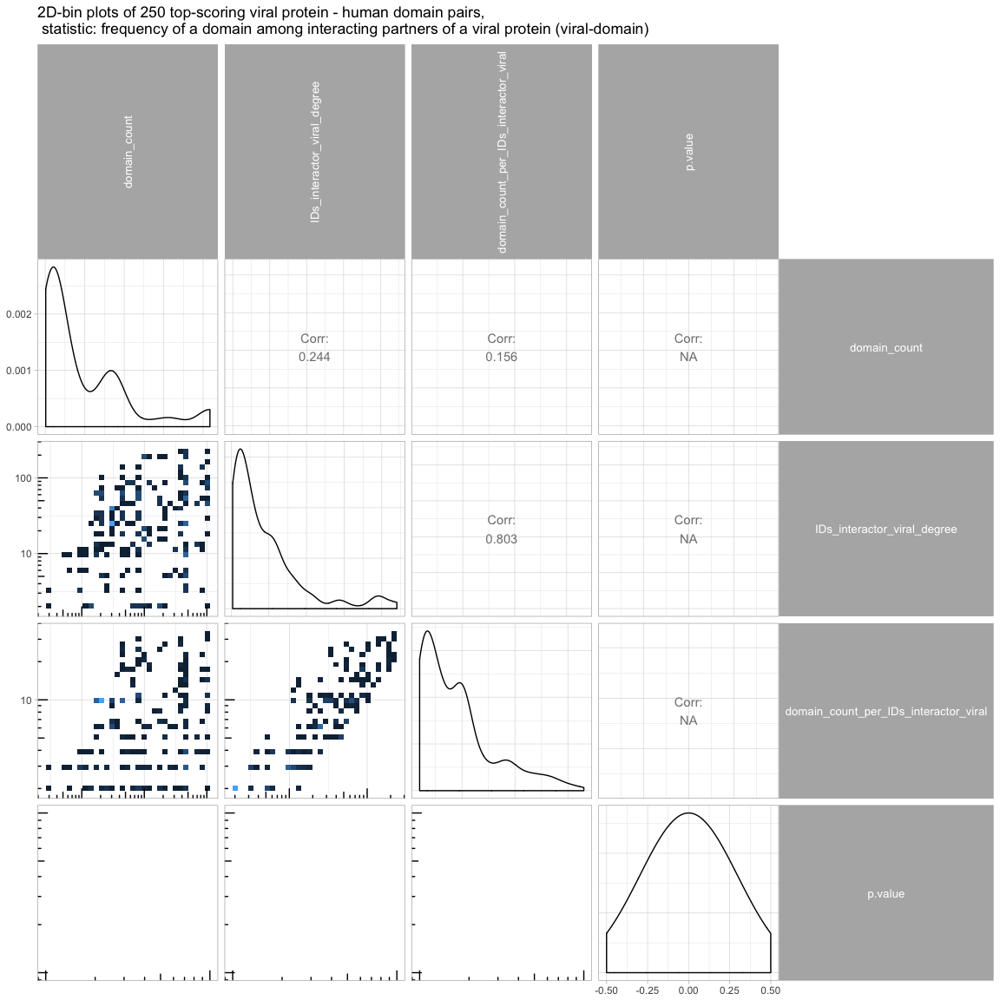<!-- -->

```r
PermutResult2D(res = res_both, N = 250) +
    ggtitle("2D-bin plots of 250 top-scoring viral protein - human domain pairs, \n statistic: frequency of a domain among interacting partners of a viral protein \n permute BOTH IDs_interactor_viral ~ IDs_interactor_human AND IDs_interactor_human ~ IDs_domain_human")
```

```
## Warning in cor(x, y, method = method, use = use): the standard deviation is
## zero
```

```
## Warning in cor(x, y, method = method, use = use): the standard deviation is
## zero

## Warning in cor(x, y, method = method, use = use): the standard deviation is
## zero
```

```
## Warning: Transformation introduced infinite values in continuous y-axis
```

```
## Warning: Removed 250 rows containing non-finite values (stat_bin2d).
```

```
## Warning: Transformation introduced infinite values in continuous y-axis
```

```
## Warning: Removed 250 rows containing non-finite values (stat_bin2d).
```

```
## Warning: Transformation introduced infinite values in continuous y-axis
```

```
## Warning: Removed 250 rows containing non-finite values (stat_bin2d).
```

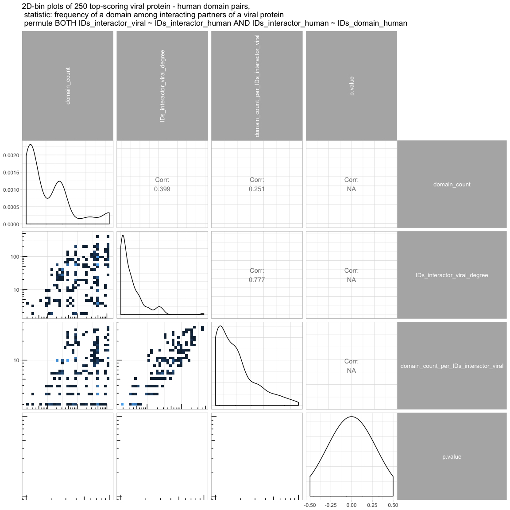<!-- -->

```r
PermutResult2D(res = res_low_back, N = 250) +
    ggtitle("2D-bin plots of 250 top-scoring viral protein - human domain pairs, \n statistic: frequency of a domain among interacting partners of a viral protein \n no low background count domains")
```

```
## Warning in cor(x, y, method = method, use = use): the standard deviation is
## zero
```

```
## Warning in cor(x, y, method = method, use = use): the standard deviation is
## zero

## Warning in cor(x, y, method = method, use = use): the standard deviation is
## zero
```

```
## Warning: Transformation introduced infinite values in continuous y-axis
```

```
## Warning: Removed 250 rows containing non-finite values (stat_bin2d).
```

```
## Warning: Transformation introduced infinite values in continuous y-axis
```

```
## Warning: Removed 250 rows containing non-finite values (stat_bin2d).
```

```
## Warning: Transformation introduced infinite values in continuous y-axis
```

```
## Warning: Removed 250 rows containing non-finite values (stat_bin2d).
```

<!-- -->

```r
PermutResult2D(res = res_low_deg, N = 250) +
    ggtitle("2D-bin plots of 250 top-scoring viral protein - human domain pairs, \n statistic: frequency of a domain among interacting partners of a viral protein \n no viral proteins with the degree of 1")
```

```
## Warning in cor(x, y, method = method, use = use): the standard deviation is
## zero
```

```
## Warning in cor(x, y, method = method, use = use): the standard deviation is
## zero

## Warning in cor(x, y, method = method, use = use): the standard deviation is
## zero
```

```
## Warning: Transformation introduced infinite values in continuous y-axis
```

```
## Warning: Removed 250 rows containing non-finite values (stat_bin2d).
```

```
## Warning: Transformation introduced infinite values in continuous y-axis
```

```
## Warning: Removed 250 rows containing non-finite values (stat_bin2d).
```

```
## Warning: Transformation introduced infinite values in continuous y-axis
```

```
## Warning: Removed 250 rows containing non-finite values (stat_bin2d).
```

<!-- -->

```r
PermutResult2D(res = res_low_deg_back, N = 250) +
    ggtitle("2D-bin plots of 250 top-scoring viral protein - human domain pairs, \n statistic: frequency of a domain among interacting partners of a viral protein \n no low background count domains \nAND no viral proteins with the degree of 1")
```

```
## Warning in cor(x, y, method = method, use = use): the standard deviation is
## zero
```

```
## Warning in cor(x, y, method = method, use = use): the standard deviation is
## zero

## Warning in cor(x, y, method = method, use = use): the standard deviation is
## zero
```

```
## Warning: Transformation introduced infinite values in continuous y-axis
```

```
## Warning: Removed 250 rows containing non-finite values (stat_bin2d).
```

```
## Warning: Transformation introduced infinite values in continuous y-axis
```

```
## Warning: Removed 250 rows containing non-finite values (stat_bin2d).
```

```
## Warning: Transformation introduced infinite values in continuous y-axis
```

```
## Warning: Removed 250 rows containing non-finite values (stat_bin2d).
```

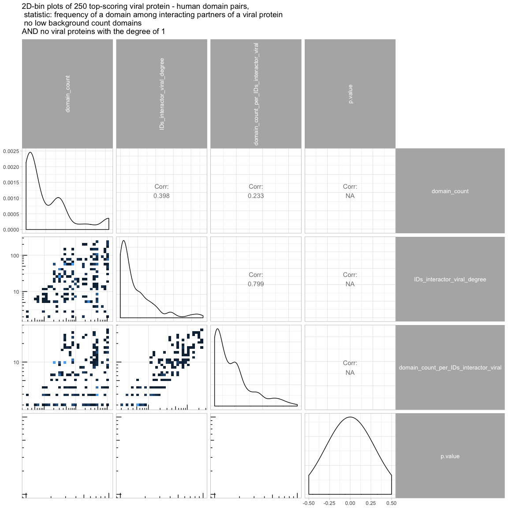<!-- -->

```r
# count
PermutResult2D(res = res_count, N = 250) +
    ggtitle("2D-bin plots of 250 top-scoring viral protein - human domain pairs, \n statistic: count of a domain among interacting partners of a viral protein")
```

```
## Warning in cor(x, y, method = method, use = use): the standard deviation is
## zero
```

```
## Warning in cor(x, y, method = method, use = use): the standard deviation is
## zero

## Warning in cor(x, y, method = method, use = use): the standard deviation is
## zero
```

```
## Warning: Transformation introduced infinite values in continuous y-axis
```

```
## Warning: Removed 250 rows containing non-finite values (stat_bin2d).
```

```
## Warning: Transformation introduced infinite values in continuous y-axis
```

```
## Warning: Removed 250 rows containing non-finite values (stat_bin2d).
```

```
## Warning: Transformation introduced infinite values in continuous y-axis
```

```
## Warning: Removed 250 rows containing non-finite values (stat_bin2d).
```

<!-- -->

```r
# reverse frequency
PermutResult2D(res = res, N = 250) +
    ggtitle("2D-bin plots of 250 top-scoring viral protein - human domain pairs, \n statistic: viral protein frequency among proteins with a domain")
```

```
## Warning in cor(x, y, method = method, use = use): the standard deviation is
## zero
```

```
## Warning in cor(x, y, method = method, use = use): the standard deviation is
## zero

## Warning in cor(x, y, method = method, use = use): the standard deviation is
## zero
```

```
## Warning: Transformation introduced infinite values in continuous y-axis
```

```
## Warning: Removed 250 rows containing non-finite values (stat_bin2d).
```

```
## Warning: Transformation introduced infinite values in continuous y-axis
```

```
## Warning: Removed 250 rows containing non-finite values (stat_bin2d).
```

```
## Warning: Transformation introduced infinite values in continuous y-axis
```

```
## Warning: Removed 250 rows containing non-finite values (stat_bin2d).
```

<!-- -->

```r
PermutResult2D(res = mix, N = 250) +
    ggtitle("2D-bin plots of 250 top-scoring viral protein - human domain pairs, \n statistic: frequency p-val viral protein-domain * frequency p-val domain-viral protein")
```

```
## Warning in cor(x, y, method = method, use = use): the standard deviation is
## zero
```

```
## Warning in cor(x, y, method = method, use = use): the standard deviation is
## zero

## Warning in cor(x, y, method = method, use = use): the standard deviation is
## zero
```

```
## Warning: Transformation introduced infinite values in continuous y-axis
```

```
## Warning: Removed 250 rows containing non-finite values (stat_bin2d).
```

```
## Warning: Transformation introduced infinite values in continuous y-axis
```

```
## Warning: Removed 250 rows containing non-finite values (stat_bin2d).
```

```
## Warning: Transformation introduced infinite values in continuous y-axis
```

```
## Warning: Removed 250 rows containing non-finite values (stat_bin2d).
```

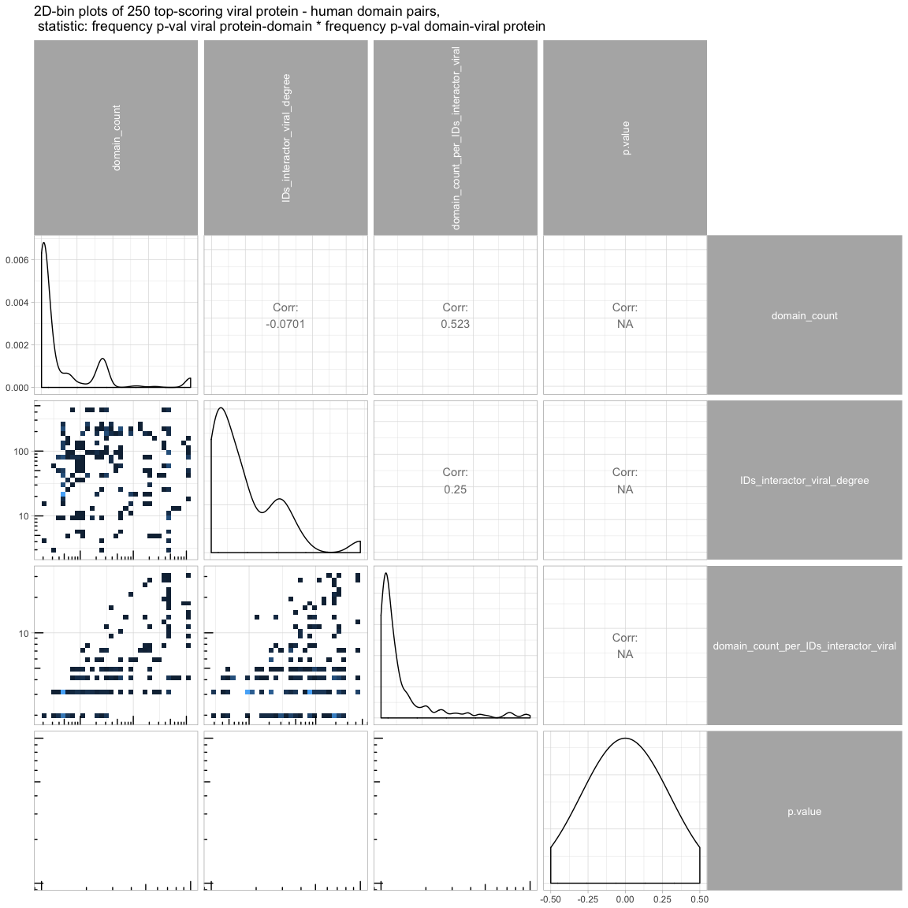<!-- -->

```r
# Fisher test p-value
PermutResult2D(res = resFISHER, N = 250) + 
    ggtitle("2D-bin plots of 250 top-scoring viral protein - human domain pairs, \n statistic: Fisher test p-value")
```

```
## Warning in cor(x, y, method = method, use = use): the standard deviation is
## zero
```

```
## Warning in cor(x, y, method = method, use = use): the standard deviation is
## zero

## Warning in cor(x, y, method = method, use = use): the standard deviation is
## zero
```

```
## Warning: Transformation introduced infinite values in continuous y-axis
```

```
## Warning: Removed 250 rows containing non-finite values (stat_bin2d).
```

```
## Warning: Transformation introduced infinite values in continuous y-axis
```

```
## Warning: Removed 250 rows containing non-finite values (stat_bin2d).
```

```
## Warning: Transformation introduced infinite values in continuous y-axis
```

```
## Warning: Removed 250 rows containing non-finite values (stat_bin2d).
```

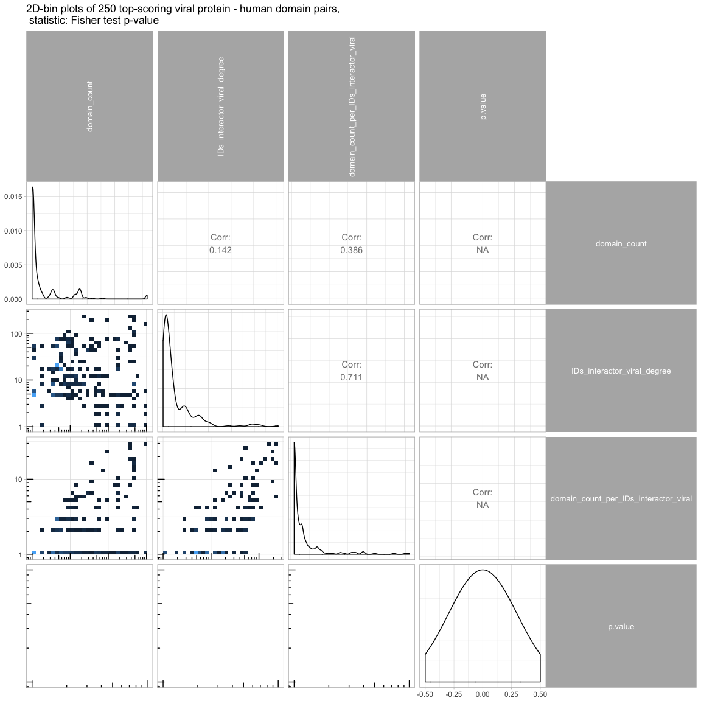<!-- -->

```r
PermutResult2D(res = resFISHER_both, N = 250) + 
    ggtitle("2D-bin plots of 250 top-scoring viral protein - human domain pairs, \n statistic: Fisher test p-value \n permute BOTH IDs_interactor_viral ~ IDs_interactor_human AND IDs_interactor_human ~ IDs_domain_human")
```

```
## Warning in cor(x, y, method = method, use = use): the standard deviation is
## zero
```

```
## Warning in cor(x, y, method = method, use = use): the standard deviation is
## zero

## Warning in cor(x, y, method = method, use = use): the standard deviation is
## zero
```

```
## Warning: Transformation introduced infinite values in continuous y-axis
```

```
## Warning: Removed 250 rows containing non-finite values (stat_bin2d).
```

```
## Warning: Transformation introduced infinite values in continuous y-axis
```

```
## Warning: Removed 250 rows containing non-finite values (stat_bin2d).
```

```
## Warning: Transformation introduced infinite values in continuous y-axis
```

```
## Warning: Removed 250 rows containing non-finite values (stat_bin2d).
```

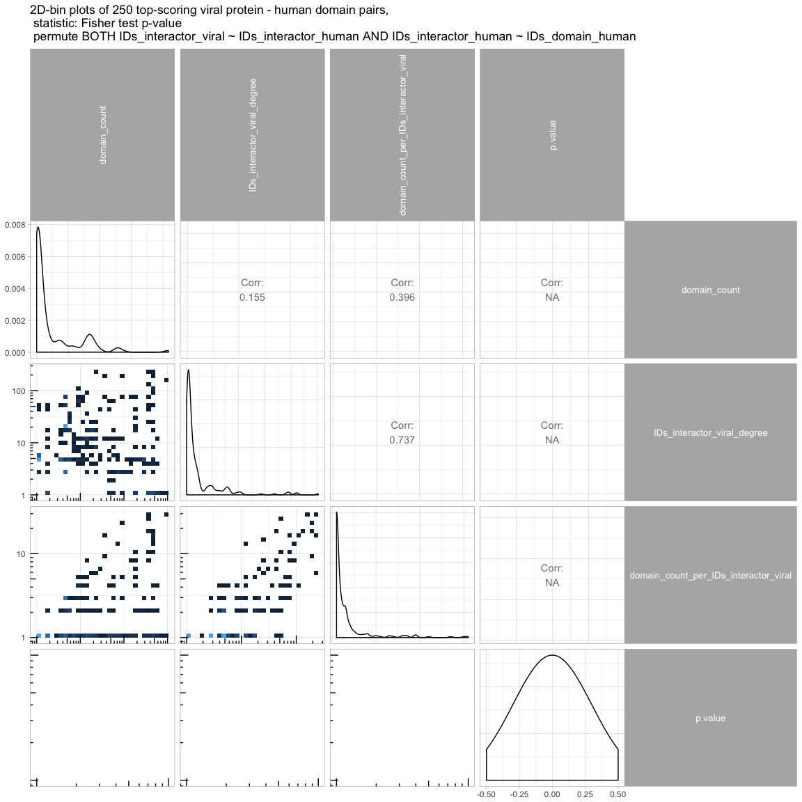<!-- -->

## Map domains known to interact with linear motifs from ELM to the domains we found


```r
interactiondomains = fread("http://elm.eu.org/interactiondomains.tsv")
interactiondomains[, pfam_id := `Interaction Domain Id`]

domains_known = interactiondomains[, unique(pfam_id)]

InterProScan_domains = readInterProGFF3("../viral_project/processed_data_files/all_human_viral_protein_domains.gff3.gz")
# get InterProID to member database ID mapping
InterPro2memberDB = getInterPro2memberDB(InterProScan_domains)
InterPro2memberDB = InterPro2memberDB[complete.cases(InterPro2memberDB)]
domains_known_mapped = unique(InterPro2memberDB[memberDBID %in% domains_known | InterProID %in% domains_known, InterProID])
domains_not_mapped = unique(domains_known[!(domains_known %in% InterPro2memberDB$memberDBID | domains_known %in% InterPro2memberDB$InterProID)])
```

I did Fisher test to evaluate if the domains that we find are enriched in domains known to interact with linear motifs (from ELM). I have picked some number of viral protein - human domain associations from the top (by p-value). Then I counted how many known domains we have found and did Fisher test. I decided to compare two statistic choices (frequency of a domain among interacting partners of a viral protein or Fisher test p-value) on how many of the known domains we tend to find. Finally, I was choosing different cutoffs (different number of top p-value pairs). 


```r
testEnrichment = function(N, res, domains_known_mapped, random = F, name = ""){
    if(random) {
        res$data_pval = unique(res$data_with_pval[,.(IDs_interactor_viral, IDs_domain_human, p.value, domain_type, domain_count, IDs_interactor_viral_degree)])
        domains_found = res$data_pval[sample(1:nrow(res$data_with_pval), N), unique(IDs_domain_human)]
    } else {
        res$data_pval = unique(res$data_with_pval[,.(IDs_interactor_viral, IDs_domain_human, p.value, domain_type, domain_count, IDs_interactor_viral_degree)])
        domains_found = res$data_pval[order(p.value, decreasing = F)[1:N], unique(IDs_domain_human)]
    }
    
    alldomains = res$data_with_pval[, unique(IDs_domain_human)]
    known = factor(alldomains %in% domains_known_mapped, levels = c("TRUE", "FALSE"))
    found = factor(alldomains %in% domains_found, levels = c("TRUE", "FALSE"))
    table_res = table(known, found)
    
    test = fisher.test(table(known, found), alternative = "greater", conf.int = T)
    
    return(c(pval = test$p.value, odds_ratio = as.vector(test$estimate), count = table_res["TRUE", "TRUE"], name = name))
}
runningTestEnrichment = function(res, name){
    enrichment = sapply(Ns, testEnrichment, res, domains_known_mapped, name = name)
colnames(enrichment) = Ns
return(enrichment)
}

Ns = seq(25, 500, 25)
# frequency
enrichment = runningTestEnrichment(res, name = "domain frequency among interactors of a viral protein")
enrichment_both = runningTestEnrichment(res_both, name = "domain frequency among interactors of a viral protein, permute both")
enrichment_low_back = runningTestEnrichment(res_low_back, name = "domain frequency: no low background")
enrichment_low_deg = runningTestEnrichment(res_low_deg, name = "domain frequency: no degree of 1")
enrichment_low_deg_back = runningTestEnrichment(res_low_deg_back, name = "domain frequency: no degree of 1 AND no low background")

# reverse frequency and mix
enrichmentRev = runningTestEnrichment(resRev, name = "viral protein frequency among proteins with a domain")
enrichmentMix = runningTestEnrichment(mix, name = "mix of viral protein -> domain and domain -> viral protein")

# count
enrichment_count = runningTestEnrichment(res_count, name = "domain count among interactors of a viral protein")

# Fisher test pval
enrichmentFISHER = runningTestEnrichment(resFISHER, name = "Fisher test pval: domain overrepresentation over the background")
enrichmentFISHER_both = runningTestEnrichment(resFISHER_both, name = "Fisher test pval: domain overrepresentation over the background, permute both")

random_domains = function(N = 100, seed = seed, Ns = seq(25, 500, 25)){
    set.seed(seed)
    
    quantiles = c(0.975, 0.75, 0.5, 0.25, 0.025)
    quantile_names = c("97.5% quantile", "75% quantile", "median", "25% quantile", "2.5% quantile")
    
    pval_temp = replicate(N, {
        enrichmentRANDOM = sapply(Ns, testEnrichment, res, domains_known_mapped, random = T, name = "N random proteins")[1,]
        names(enrichmentRANDOM) = Ns
        as.numeric(enrichmentRANDOM)
    })
    pval = apply(pval_temp, 1, quantile, probs = quantiles)
    rownames(pval) = quantile_names
    colnames(pval) = Ns
    
    odds_ratio_temp = replicate(N, {
        enrichmentRANDOM = sapply(Ns, testEnrichment, res, domains_known_mapped, random = T, name = "N random proteins")[2,]
        names(enrichmentRANDOM) = Ns
        as.numeric(enrichmentRANDOM)
    })
    odds_ratio = apply(odds_ratio_temp, 1, quantile, probs = quantiles)
    rownames(odds_ratio) = quantile_names
    colnames(odds_ratio) = Ns
    
    count_temp = replicate(N, {
        enrichmentRANDOM = sapply(Ns, testEnrichment, res, domains_known_mapped, random = T, name = "N random proteins")[3,]
        names(enrichmentRANDOM) = Ns
        as.numeric(enrichmentRANDOM)
    })
    count = apply(count_temp, 1, quantile, probs = quantiles)
    rownames(count) = quantile_names
    colnames(count) = Ns
    
    return(list(pval = pval, odds_ratio = odds_ratio, count = count))
}

enrichmentRANDOM = random_domains(10, 1)
save(list = ls(), file="./processed_data_files/what_we_find_VS_ELM_clust.RData")
```

## As we include more proteins, the number of known domains we find increases and then levels off (probably because some of the known domains do not interact with viral proteins).


```r
plotEnrichment = function(..., random_domains = NULL, domains_known_mapped, type = "count", plot_type = plot_type){
    
    res = list(...)
    typenum = match(type, c("pval", "odds_ratio", "count"))
    ngroups = length(res)
    
    if(type == "count") color = colorRampPalette(brewer.pal(7, "Dark2"))(ngroups + 1) else color = colorRampPalette(brewer.pal(7, "Dark2"))(ngroups)
    if(is.na(typenum)) stop("'type' should be one of “count”, “odds_ratio”, “pval”")
    
    leg_pos_y = max(sapply(res, function(x, typenum) max(as.numeric(x[typenum,])), typenum))
    if(!is.null(random_domains)) leg_pos_y = max(leg_pos_y, random_domains[typenum][[1]])
    if(type == "count") leg_pos_y = length(domains_known_mapped) - 1
    leg_pos_x = max(sapply(res, function(x) max(as.numeric(colnames(x))))) * 0.20
    
    if(type == "pval") {ylim = c(0, 1); ylab = "p-value"}
    if(type == "count") {ylim = c(0,length(domains_known_mapped)+1); ylab = "known domain found"}
    if(type == "odds_ratio") {ylim = c(0,leg_pos_y); ylab = "Fisher test odds ratio"}
    
    plot(colnames(res[[1]]),rep(0,ncol(res[[1]])), 
         ylab = ylab, xlab = "top N viral protein - domain pairs selected",
         type = plot_type, ylim = ylim, lwd = 0)
    # plot random domains quantiles
    if(!is.null(random_domains)){
        random_legend = c("97.5% quantile", "75% quantile", "median", "25% quantile", "2.5% quantile")
        random_cols = c("#DDDDDD", "#CCCCCC", "#AAAAAA", "#CCCCCC", "#DDDDDD")
        random_line_width = c(2,4,8,4,2)
        for (i in 1:5) {
            lines(x = colnames(random_domains[typenum][[1]]), y = random_domains[typenum][[1]][random_legend[i],], col = random_cols[i], lwd = random_line_width[i], type = plot_type)
        }
    }
    
    for (i in 1:ngroups) {
        lines(x = colnames(res[[i]]), y = res[[i]][typenum,], col = color[i], type = plot_type, lwd = 3)
    }
    
    if(type == "count") abline(h = length(domains_known_mapped), col = color[ngroups + 1])
    
    legend_names = c("statictic used in permutation test:")
    for(i in 1:ngroups){
        legend_names = c(legend_names, unique(res[[i]]["name",]))
    }
    
    if(type == "count") legend_names = c(legend_names, "domains known to interact with linear motifs")
    
    line_width = rep(3, length(color) + 1)
    
    if(!is.null(random_domains)){
        legend_names = c(legend_names, paste0("N random protein-domain pairs, ", random_legend))
        color = c(color, random_cols)
        line_width = c(line_width, random_line_width)
    }
    
    
    legend(x = leg_pos_x, y = leg_pos_y, legend_names, 
           col = c("white", color), lty = 1, lwd = line_width, merge = TRUE)
}

plotEnrichment(enrichment, enrichment_both, enrichment_low_back, enrichment_low_deg, enrichment_low_deg_back,
               enrichment_count, enrichmentRev, enrichmentMix, enrichmentFISHER, enrichmentFISHER_both,
               random_domains = enrichmentRANDOM, 
               domains_known_mapped = domains_known_mapped, type = "count", plot_type = "l")
```

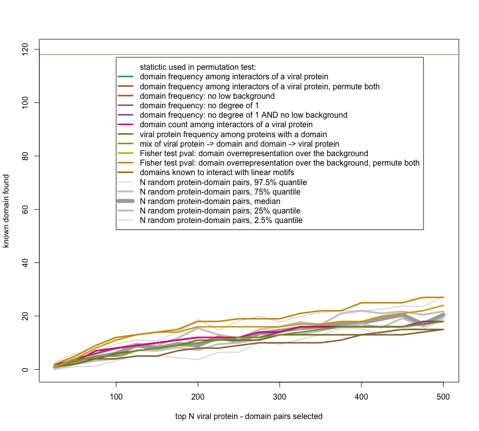<!-- -->

## As we include more proteins, the Fisher test odds ratio decreases (we add more stuff that is not known). Odds ratio measures how much more likely are we to find a domain using our procedure if it’s a known domain as compared to if it’s not a known domain.


```r
plotEnrichment(enrichment, enrichment_both, enrichment_low_back, enrichment_low_deg, enrichment_low_deg_back,
               enrichment_count, enrichmentRev, enrichmentMix, enrichmentFISHER, enrichmentFISHER_both,
               random_domains = enrichmentRANDOM, 
               domains_known_mapped = domains_known_mapped, type = "odds_ratio", plot_type = "l")
```

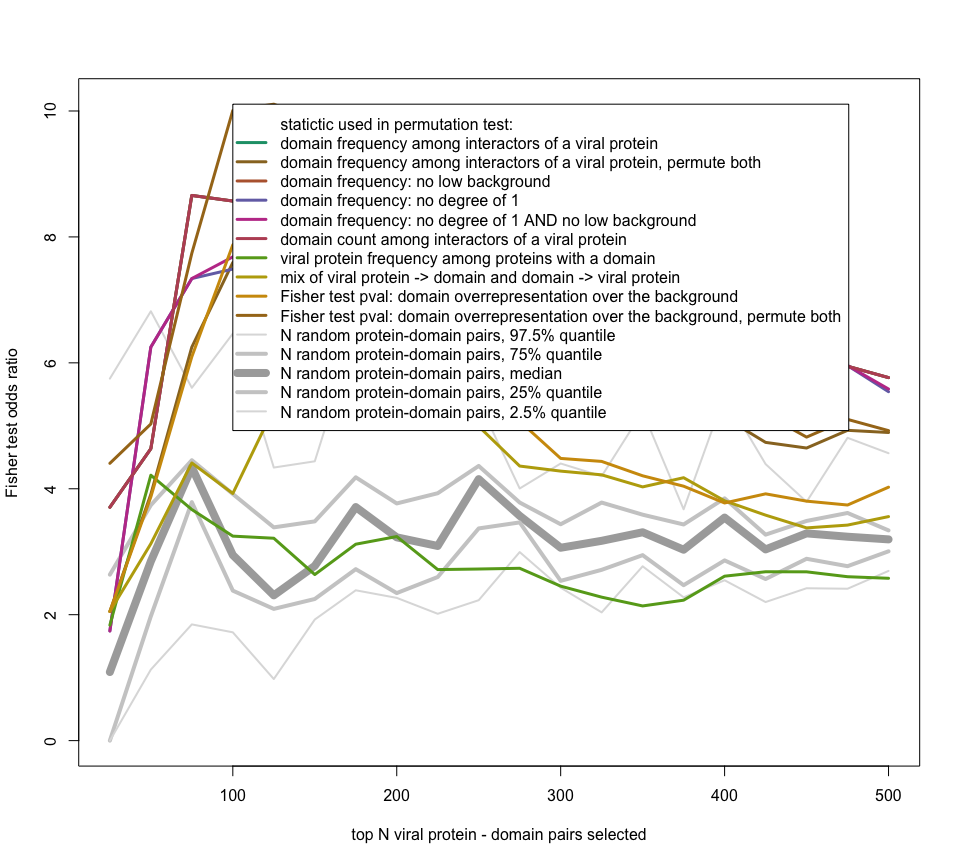<!-- -->

## corresponding P-values from the Fisher test 


```r
plotEnrichment(enrichment, enrichment_both, enrichment_low_back, enrichment_low_deg, enrichment_low_deg_back,
               enrichment_count, enrichmentRev, enrichmentMix, enrichmentFISHER, enrichmentFISHER_both,
               random_domains = enrichmentRANDOM, 
               domains_known_mapped = domains_known_mapped, type = "pval", plot_type = "l")
```

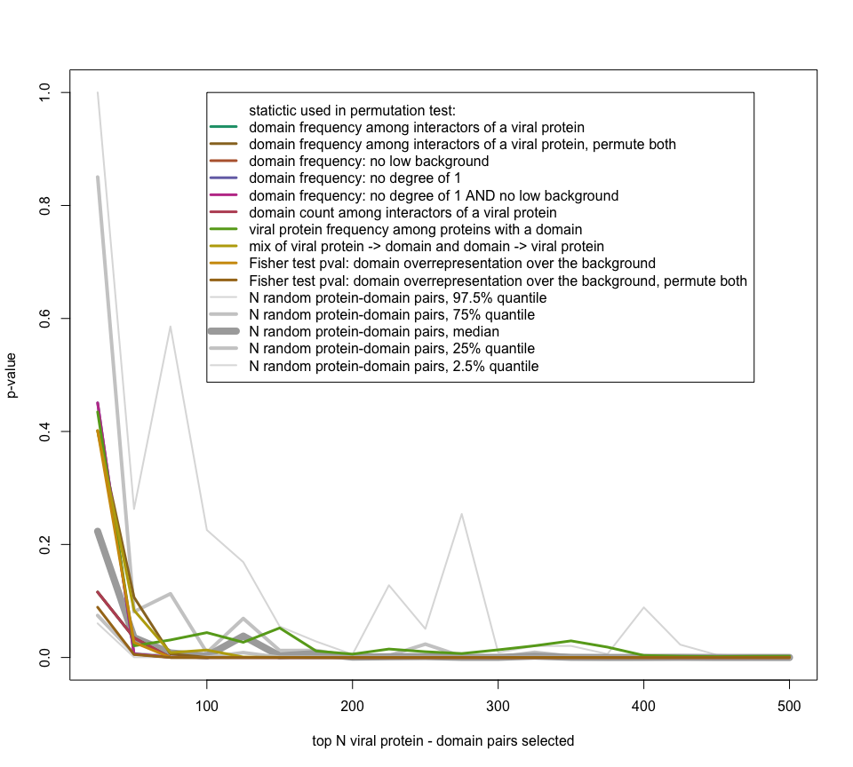<!-- -->

## How many viral proteins are known per each of the domain instances in top 200 protein-domain pairs?


```r
selectTopHits = function(res, N){
    res$data_pval = unique(res$data_with_pval[,.(IDs_interactor_viral, IDs_domain_human, p.value, domain_type, domain_count, IDs_interactor_viral_degree)])
    pairs200pval = res$data_pval[order(p.value, decreasing = F)[1:N], max(p.value)]
    
    restop100 = res
    restop100$data_with_pval = restop100$data_with_pval[p.value <= pairs200pval, ]
    restop100$data_with_pval[, N_viral_per_human_w_domain := length(unique(IDs_interactor_viral)), by = .(IDs_interactor_human, IDs_domain_human)]
    return(restop100)
}
restop100 = selectTopHits(res, N = 250)
plot(restop100, IDs_interactor_human ~ N_viral_per_human_w_domain)
```

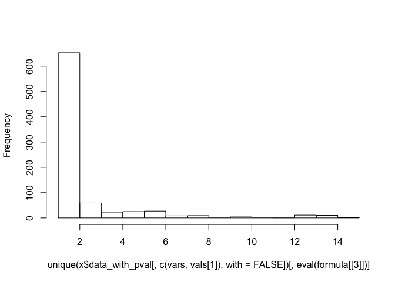<!-- -->

```r
plot(restop100)
```

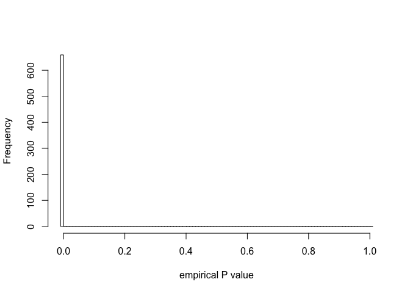<!-- -->

82 human proteins with enriched domains have 5 or more viral interacting partners.  
18 human proteins with enriched domains have 10 or more viral interacting partners.  

### what are those domains? are they known ELM-interacting domains? which proteins they are in? which viral taxons they interact with?


```r
restop100$data_with_pval[N_viral_per_human_w_domain >= 10, unique(IDs_domain_human)]
```

```
## [1] "IPR000504" "IPR007125" "IPR009072" "IPR032454" "IPR032458" "IPR001478"
```

```r
restop100$data_with_pval[N_viral_per_human_w_domain >= 10, unique(IDs_domain_human)] %in% domains_known_mapped
```

```
## [1]  TRUE FALSE FALSE FALSE FALSE  TRUE
```

```r
restop100$data_with_pval[N_viral_per_human_w_domain >= 10 & IDs_domain_human == "IPR000504", unique(IDs_interactor_human)]
```

```
## [1] "O43390" "P09651" "P22626" "P31943" "Q99729"
```

```r
restop100$data_with_pval[N_viral_per_human_w_domain >= 10 & IDs_domain_human == "IPR000504", unique(Taxid_interactor_viral)]
```

```
##  [1]  10254 380964  88776 130763 270485 211044  10377  10376  10298 680716
## [11]  28344 333284 128952 121791  10249  11097 796210
```

```r
DT::datatable(restop100$data_with_pval[N_viral_per_human_w_domain >= 10,])
```

<!--html_preserve--><div id="htmlwidget-75d09a4c02e21d70c8ae" style="width:100%;height:auto;" class="datatables html-widget"></div>
<script type="application/json" data-for="htmlwidget-75d09a4c02e21d70c8ae">{"x":{"filter":"none","data":[["1","2","3","4","5","6","7","8","9","10","11","12","13","14","15","16","17","18","19","20","21","22","23","24","25","26","27","28","29","30","31","32","33","34","35","36","37","38","39","40","41","42","43","44","45","46","47","48","49","50","51","52","53","54","55","56","57","58","59","60","61","62","63","64","65","66","67","68","69","70","71","72","73","74","75","76","77","78","79","80","81","82","83","84","85","86","87","88","89","90","91","92","93","94","95","96","97","98","99","100","101","102","103","104","105","106","107","108","109","110","111","112","113","114","115","116","117","118","119","120","121","122","123","124","125","126","127","128","129","130","131","132","133","134","135","136","137","138","139","140","141","142","143","144","145","146","147","148","149","150","151","152","153","154","155","156","157","158","159","160","161","162","163","164","165","166","167","168","169","170","171","172","173","174","175","176","177","178","179","180","181","182","183","184","185","186","187","188","189","190","191","192","193","194","195","196","197","198","199","200","201","202","203","204","205","206","207","208","209","210","211","212","213","214","215","216","217","218","219","220","221","222","223","224","225","226","227","228","229","230","231","232","233","234","235","236","237","238","239","240","241","242","243","244","245","246","247","248","249","250","251","252","253","254","255","256","257","258","259","260","261","262","263","264","265","266","267","268","269","270","271","272","273","274","275","276","277","278","279","280","281","282","283","284","285","286","287","288","289","290","291","292","293","294","295","296","297","298","299","300","301","302","303","304","305","306","307","308","309","310","311","312","313","314","315","316","317","318","319","320","321","322","323","324","325","326","327","328","329","330","331","332","333","334","335","336","337","338","339","340","341","342","343","344","345","346","347","348","349","350","351","352","353","354","355","356","357","358","359","360","361","362","363","364","365","366","367","368","369","370","371","372","373","374","375","376","377","378","379","380","381","382","383","384","385","386","387","388","389","390","391","392","393","394","395","396","397","398","399","400","401","402","403","404","405","406","407","408","409","410","411","412","413","414","415","416","417","418","419","420","421","422","423","424","425","426","427","428","429","430","431","432","433","434","435","436","437","438","439","440","441","442","443","444","445","446","447","448","449","450","451","452","453","454","455","456","457","458","459","460","461","462","463","464","465","466","467","468","469","470","471","472","473","474","475","476","477","478","479","480","481","482","483","484","485","486","487","488","489","490","491","492","493","494","495","496","497","498","499","500","501","502","503","504","505","506","507","508","509","510","511","512","513","514","515","516","517","518","519","520","521","522","523","524","525","526","527","528","529","530","531","532","533","534","535","536","537","538","539","540","541","542","543","544","545","546","547","548","549","550","551","552","553","554","555","556","557","558","559","560","561","562","563","564","565","566","567","568","569","570","571","572","573","574","575","576","577","578","579","580","581","582","583","584","585","586","587","588","589","590","591","592","593","594","595","596","597","598","599","600","601","602","603","604","605","606","607","608","609","610","611","612","613","614","615","616","617","618","619","620","621","622","623","624","625","626","627","628","629","630","631"],["P21605","Q9WPI5","Q99AU3","O56264","Q6PNE5","P03496","Q8AZK7","Q5MJ03","Q9J0X9","D1LN35","Q84940","P23057","Q05127","Q9WPI5","P0C1C7","P15059","Q9WMX2","Q997F2","Q0HD54","P0C1C6","P68466","O56264","P04487","P03495","Q84940","P23057","Q05127","Q9WPI5","P0C1C7","P15059","Q9WMX2","Q997F2","Q0HD54","P0C1C6","P68466","O56264","P04487","P03495","Q84940","P23057","Q05127","Q9WPI5","P0C1C7","P15059","Q9WMX2","Q997F2","Q0HD54","P0C1C6","P68466","O56264","P03495","Q84940","P23057","Q05127","Q9WPI5","P0C1C7","P15059","Q9WMX2","Q997F2","Q0HD54","P0C1C6","P68466","O56264","P03495","Q6QDQ4","P21605","Q9WPI5","Q99AU3","Q9WMX2","Q05127","Q8AZK7","Q5MJ03","P03496","O56264","D1LN35","Q84940","P23057","Q05127","Q9WPI5","P0C1C7","P15059","Q9WMX2","Q997F2","Q0HD54","P0C1C6","P68466","Q9DUM3","O56264","P04487","P03495","Q84940","P23057","Q05127","Q9WPI5","P0C1C7","P15059","Q9WMX2","Q997F2","Q0HD54","P0C1C6","P68466","Q9DUM3","O56264","P04487","P03495","Q84940","P23057","Q05127","Q9WPI5","P0C1C7","P15059","Q9WMX2","Q997F2","Q0HD54","P0C1C6","P68466","O56264","P03495","Q84940","P23057","Q05127","Q9WPI5","P0C1C7","P15059","Q9WMX2","Q997F2","Q0HD54","P0C1C6","P68466","O56264","P03495","Q84940","P23057","Q05127","Q9WPI5","Q9WMX2","Q997F2","Q0HD54","P68466","O56264","P04487","P0C1C7","P15059","P03495","P0C1C6","Q84940","P23057","Q05127","Q9WPI5","Q9WMX2","Q997F2","Q0HD54","P68466","O56264","P04487","P0C1C7","P15059","P03495","P0C1C6","Q84940","P23057","Q05127","Q9WPI5","Q9WMX2","Q997F2","Q0HD54","P68466","O56264","P0C1C7","P15059","P03495","P0C1C6","Q84940","P23057","Q05127","Q9WPI5","Q9WMX2","Q997F2","Q0HD54","P68466","O56264","P0C1C7","P15059","P03495","P0C1C6","Q6QDQ4","Q05127","Q9WPI5","Q99AU3","Q9WMX2","Q997F2","P68318","Q8AZK7","Q5MJ03","P03496","P21605","O56264","D1LN35","P19712-PRO_0000038050","Q6QDQ4","Q9WPI5","Q9WMX2","Q997F2","Q05127","Q8JPQ9","P03496","O56264","D1LN35","P19712-PRO_0000038050","Q84940","Q05127","Q9WPI5","Q9WMX2","Q997F2","P68466","O56264","P04487","P0C1C7","P15059","P35256","P03495","P0C1C6","P06463","P03126","P50804","P24835","P27228","P06427","P0C213","P16717","P06931","P03127","Q2PJP0","Q6DP93","P06427","P03126","P0C213","P27228","P24835","P16717","P50804","P06463","Q84940","Q9WPI5","Q9WMX2","Q997F2","P23057","Q05127","O56264","P04487","P0C1C7","P15059","P03495","Q0HD54","P0C1C6","P68466","Q84940","Q9WPI5","Q9WMX2","Q997F2","P23057","Q05127","O56264","P04487","P0C1C7","P15059","P03495","Q0HD54","P0C1C6","P68466","Q84940","Q9WPI5","Q9WMX2","Q997F2","P23057","Q05127","O56264","P0C1C7","P15059","P03495","Q0HD54","P0C1C6","P68466","Q84940","Q9WPI5","Q9WMX2","Q997F2","P23057","Q05127","O56264","P0C1C7","P15059","P03495","Q0HD54","P0C1C6","P68466","Q84940","Q9WPI5","Q9WMX2","Q997F2","P23057","Q05127","O56264","P04487","P0C1C7","P15059","P03495","Q0HD54","P0C1C6","P68466","Q84940","Q9WPI5","Q9WMX2","Q997F2","P23057","Q05127","O56264","P04487","P0C1C7","P15059","P03495","Q0HD54","P0C1C6","P68466","Q84940","Q9WPI5","Q9WMX2","Q997F2","P23057","Q05127","O56264","P0C1C7","P15059","P03495","Q0HD54","P0C1C6","P68466","Q84940","Q9WPI5","Q9WMX2","Q997F2","P23057","Q05127","O56264","P0C1C7","P15059","P03495","Q0HD54","P0C1C6","P68466","Q84940","Q9WPI5","Q9WMX2","Q997F2","P23057","Q05127","O56264","P04487","P0C1C7","P15059","P03495","Q0HD54","P0C1C6","P68466","Q84940","Q9WPI5","Q9WMX2","Q997F2","P23057","Q05127","O56264","P04487","P0C1C7","P15059","P03495","Q0HD54","P0C1C6","P68466","Q84940","Q9WPI5","Q9WMX2","Q997F2","P23057","Q05127","O56264","P0C1C7","P15059","P03495","Q0HD54","P0C1C6","P68466","Q84940","Q9WPI5","Q9WMX2","Q997F2","P23057","Q05127","O56264","P0C1C7","P15059","P03495","Q0HD54","P0C1C6","P68466","Q9WPI5","Q9WMX2","Q997F2","Q84940","P23057","Q05127","O56264","P04487","P0C1C7","P15059","P03495","Q0HD54","P0C1C6","P68466","Q9WPI5","Q9WMX2","Q997F2","Q84940","P23057","Q05127","O56264","P04487","P0C1C7","P15059","P03495","Q0HD54","P0C1C6","P68466","Q9WPI5","Q9WMX2","Q997F2","Q84940","P23057","Q05127","O56264","P0C1C7","P15059","P03495","Q0HD54","P0C1C6","P68466","Q9WPI5","Q9WMX2","Q997F2","Q84940","P23057","Q05127","O56264","P0C1C7","P15059","P03495","Q0HD54","P0C1C6","P68466","Q9WPI5","Q9WMX2","Q997F2","Q84940","P23057","Q05127","O56264","P04487","P0C1C7","P15059","P03495","Q0HD54","P0C1C6","P68466","Q9WPI5","Q9WMX2","Q997F2","Q84940","P23057","Q05127","O56264","P04487","P0C1C7","P15059","P03495","Q0HD54","P0C1C6","P68466","Q9WPI5","Q9WMX2","Q997F2","Q84940","P23057","Q05127","O56264","P0C1C7","P15059","P03495","Q0HD54","P0C1C6","P68466","Q9WPI5","Q9WMX2","Q997F2","Q84940","P23057","Q05127","O56264","P0C1C7","P15059","P03495","Q0HD54","P0C1C6","P68466","Q9WPI5","Q99AU3","Q997F2","P03496","P21605","O56264","Q05127","D1LN35","Q8AZK7","Q5MJ03","P19712-PRO_0000038050","Q9WPI5","Q9WMX2","Q84940","P23057","Q05127","O56264","P04487","P0C1C7","P15059","P03495","Q997F2","Q0HD54","P0C1C6","P68466","Q9WPI5","Q9WMX2","Q84940","P23057","Q05127","O56264","P04487","P0C1C7","P15059","P03495","Q997F2","Q0HD54","P0C1C6","P68466","Q9WPI5","Q9WMX2","Q84940","P23057","Q05127","O56264","P0C1C7","P15059","P03495","Q997F2","Q0HD54","P0C1C6","P68466","Q9WPI5","Q9WMX2","Q84940","P23057","Q05127","O56264","P0C1C7","P15059","P03495","Q997F2","Q0HD54","P0C1C6","P68466","Q9WPI5","Q9WMX2","Q84940","P23057","Q05127","O56264","P04487","P0C1C7","P15059","P03495","Q997F2","Q0HD54","P0C1C6","P68466","Q9WPI5","Q9WMX2","Q84940","P23057","Q05127","O56264","P04487","P0C1C7","P15059","P03495","Q997F2","Q0HD54","P0C1C6","P68466","Q9WPI5","Q9WMX2","Q84940","P23057","Q05127","O56264","P0C1C7","P15059","P03495","Q997F2","Q0HD54","P0C1C6","P68466","Q9WPI5","Q9WMX2","Q84940","P23057","Q05127","O56264","P0C1C7","P15059","P03495","Q997F2","Q0HD54","P0C1C6","P68466"],["IPR000504","IPR000504","IPR000504","IPR000504","IPR000504","IPR000504","IPR000504","IPR000504","IPR000504","IPR000504","IPR007125","IPR007125","IPR007125","IPR007125","IPR007125","IPR007125","IPR007125","IPR007125","IPR007125","IPR007125","IPR007125","IPR007125","IPR007125","IPR007125","IPR009072","IPR009072","IPR009072","IPR009072","IPR009072","IPR009072","IPR009072","IPR009072","IPR009072","IPR009072","IPR009072","IPR009072","IPR009072","IPR009072","IPR032454","IPR032454","IPR032454","IPR032454","IPR032454","IPR032454","IPR032454","IPR032454","IPR032454","IPR032454","IPR032454","IPR032454","IPR032454","IPR032458","IPR032458","IPR032458","IPR032458","IPR032458","IPR032458","IPR032458","IPR032458","IPR032458","IPR032458","IPR032458","IPR032458","IPR032458","IPR000504","IPR000504","IPR000504","IPR000504","IPR000504","IPR000504","IPR000504","IPR000504","IPR000504","IPR000504","IPR000504","IPR007125","IPR007125","IPR007125","IPR007125","IPR007125","IPR007125","IPR007125","IPR007125","IPR007125","IPR007125","IPR007125","IPR007125","IPR007125","IPR007125","IPR007125","IPR009072","IPR009072","IPR009072","IPR009072","IPR009072","IPR009072","IPR009072","IPR009072","IPR009072","IPR009072","IPR009072","IPR009072","IPR009072","IPR009072","IPR009072","IPR032454","IPR032454","IPR032454","IPR032454","IPR032454","IPR032454","IPR032454","IPR032454","IPR032454","IPR032454","IPR032454","IPR032454","IPR032454","IPR032458","IPR032458","IPR032458","IPR032458","IPR032458","IPR032458","IPR032458","IPR032458","IPR032458","IPR032458","IPR032458","IPR032458","IPR032458","IPR007125","IPR007125","IPR007125","IPR007125","IPR007125","IPR007125","IPR007125","IPR007125","IPR007125","IPR007125","IPR007125","IPR007125","IPR007125","IPR007125","IPR009072","IPR009072","IPR009072","IPR009072","IPR009072","IPR009072","IPR009072","IPR009072","IPR009072","IPR009072","IPR009072","IPR009072","IPR009072","IPR009072","IPR032454","IPR032454","IPR032454","IPR032454","IPR032454","IPR032454","IPR032454","IPR032454","IPR032454","IPR032454","IPR032454","IPR032454","IPR032454","IPR032458","IPR032458","IPR032458","IPR032458","IPR032458","IPR032458","IPR032458","IPR032458","IPR032458","IPR032458","IPR032458","IPR032458","IPR032458","IPR000504","IPR000504","IPR000504","IPR000504","IPR000504","IPR000504","IPR000504","IPR000504","IPR000504","IPR000504","IPR000504","IPR000504","IPR000504","IPR000504","IPR000504","IPR000504","IPR000504","IPR000504","IPR000504","IPR000504","IPR000504","IPR000504","IPR000504","IPR000504","IPR009072","IPR009072","IPR009072","IPR009072","IPR009072","IPR009072","IPR009072","IPR009072","IPR009072","IPR009072","IPR009072","IPR009072","IPR009072","IPR001478","IPR001478","IPR001478","IPR001478","IPR001478","IPR001478","IPR001478","IPR001478","IPR001478","IPR001478","IPR001478","IPR001478","IPR001478","IPR001478","IPR001478","IPR001478","IPR001478","IPR001478","IPR001478","IPR001478","IPR007125","IPR007125","IPR007125","IPR007125","IPR007125","IPR007125","IPR007125","IPR007125","IPR007125","IPR007125","IPR007125","IPR007125","IPR007125","IPR007125","IPR009072","IPR009072","IPR009072","IPR009072","IPR009072","IPR009072","IPR009072","IPR009072","IPR009072","IPR009072","IPR009072","IPR009072","IPR009072","IPR009072","IPR032454","IPR032454","IPR032454","IPR032454","IPR032454","IPR032454","IPR032454","IPR032454","IPR032454","IPR032454","IPR032454","IPR032454","IPR032454","IPR032458","IPR032458","IPR032458","IPR032458","IPR032458","IPR032458","IPR032458","IPR032458","IPR032458","IPR032458","IPR032458","IPR032458","IPR032458","IPR007125","IPR007125","IPR007125","IPR007125","IPR007125","IPR007125","IPR007125","IPR007125","IPR007125","IPR007125","IPR007125","IPR007125","IPR007125","IPR007125","IPR009072","IPR009072","IPR009072","IPR009072","IPR009072","IPR009072","IPR009072","IPR009072","IPR009072","IPR009072","IPR009072","IPR009072","IPR009072","IPR009072","IPR032454","IPR032454","IPR032454","IPR032454","IPR032454","IPR032454","IPR032454","IPR032454","IPR032454","IPR032454","IPR032454","IPR032454","IPR032454","IPR032458","IPR032458","IPR032458","IPR032458","IPR032458","IPR032458","IPR032458","IPR032458","IPR032458","IPR032458","IPR032458","IPR032458","IPR032458","IPR007125","IPR007125","IPR007125","IPR007125","IPR007125","IPR007125","IPR007125","IPR007125","IPR007125","IPR007125","IPR007125","IPR007125","IPR007125","IPR007125","IPR009072","IPR009072","IPR009072","IPR009072","IPR009072","IPR009072","IPR009072","IPR009072","IPR009072","IPR009072","IPR009072","IPR009072","IPR009072","IPR009072","IPR032454","IPR032454","IPR032454","IPR032454","IPR032454","IPR032454","IPR032454","IPR032454","IPR032454","IPR032454","IPR032454","IPR032454","IPR032454","IPR032458","IPR032458","IPR032458","IPR032458","IPR032458","IPR032458","IPR032458","IPR032458","IPR032458","IPR032458","IPR032458","IPR032458","IPR032458","IPR007125","IPR007125","IPR007125","IPR007125","IPR007125","IPR007125","IPR007125","IPR007125","IPR007125","IPR007125","IPR007125","IPR007125","IPR007125","IPR007125","IPR009072","IPR009072","IPR009072","IPR009072","IPR009072","IPR009072","IPR009072","IPR009072","IPR009072","IPR009072","IPR009072","IPR009072","IPR009072","IPR009072","IPR032454","IPR032454","IPR032454","IPR032454","IPR032454","IPR032454","IPR032454","IPR032454","IPR032454","IPR032454","IPR032454","IPR032454","IPR032454","IPR032458","IPR032458","IPR032458","IPR032458","IPR032458","IPR032458","IPR032458","IPR032458","IPR032458","IPR032458","IPR032458","IPR032458","IPR032458","IPR007125","IPR007125","IPR007125","IPR007125","IPR007125","IPR007125","IPR007125","IPR007125","IPR007125","IPR007125","IPR007125","IPR007125","IPR007125","IPR007125","IPR009072","IPR009072","IPR009072","IPR009072","IPR009072","IPR009072","IPR009072","IPR009072","IPR009072","IPR009072","IPR009072","IPR009072","IPR009072","IPR009072","IPR032454","IPR032454","IPR032454","IPR032454","IPR032454","IPR032454","IPR032454","IPR032454","IPR032454","IPR032454","IPR032454","IPR032454","IPR032454","IPR032458","IPR032458","IPR032458","IPR032458","IPR032458","IPR032458","IPR032458","IPR032458","IPR032458","IPR032458","IPR032458","IPR032458","IPR032458","IPR000504","IPR000504","IPR000504","IPR000504","IPR000504","IPR000504","IPR000504","IPR000504","IPR000504","IPR000504","IPR000504","IPR007125","IPR007125","IPR007125","IPR007125","IPR007125","IPR007125","IPR007125","IPR007125","IPR007125","IPR007125","IPR007125","IPR007125","IPR007125","IPR007125","IPR009072","IPR009072","IPR009072","IPR009072","IPR009072","IPR009072","IPR009072","IPR009072","IPR009072","IPR009072","IPR009072","IPR009072","IPR009072","IPR009072","IPR032454","IPR032454","IPR032454","IPR032454","IPR032454","IPR032454","IPR032454","IPR032454","IPR032454","IPR032454","IPR032454","IPR032454","IPR032454","IPR032458","IPR032458","IPR032458","IPR032458","IPR032458","IPR032458","IPR032458","IPR032458","IPR032458","IPR032458","IPR032458","IPR032458","IPR032458","IPR007125","IPR007125","IPR007125","IPR007125","IPR007125","IPR007125","IPR007125","IPR007125","IPR007125","IPR007125","IPR007125","IPR007125","IPR007125","IPR007125","IPR009072","IPR009072","IPR009072","IPR009072","IPR009072","IPR009072","IPR009072","IPR009072","IPR009072","IPR009072","IPR009072","IPR009072","IPR009072","IPR009072","IPR032454","IPR032454","IPR032454","IPR032454","IPR032454","IPR032454","IPR032454","IPR032454","IPR032454","IPR032454","IPR032454","IPR032454","IPR032454","IPR032458","IPR032458","IPR032458","IPR032458","IPR032458","IPR032458","IPR032458","IPR032458","IPR032458","IPR032458","IPR032458","IPR032458","IPR032458"],[0.214285714285714,0.233333333333333,0.478260869565217,0.252336448598131,0.4,0.14218009478673,0.115646258503401,0.470588235294118,0.235294117647059,0.463414634146341,0.526315789473684,0.833333333333333,0.416666666666667,0.166666666666667,0.344827586206897,0.638888888888889,0.163934426229508,0.294117647058824,0.142857142857143,0.339622641509434,0.357142857142857,0.224299065420561,0.194444444444444,0.327586206896552,0.578947368421053,0.833333333333333,0.433333333333333,0.183333333333333,0.379310344827586,0.666666666666667,0.180327868852459,0.323529411764706,0.142857142857143,0.358490566037736,0.392857142857143,0.233644859813084,0.201388888888889,0.344827586206897,0.526315789473684,0.833333333333333,0.166666666666667,0.166666666666667,0.344827586206897,0.277777777777778,0.163934426229508,0.294117647058824,0.142857142857143,0.188679245283019,0.357142857142857,0.0934579439252336,0.172413793103448,0.526315789473684,0.833333333333333,0.166666666666667,0.166666666666667,0.344827586206897,0.277777777777778,0.163934426229508,0.294117647058824,0.142857142857143,0.188679245283019,0.357142857142857,0.0934579439252336,0.172413793103448,0.482142857142857,0.214285714285714,0.233333333333333,0.478260869565217,0.114754098360656,0.166666666666667,0.115646258503401,0.470588235294118,0.14218009478673,0.252336448598131,0.463414634146341,0.526315789473684,0.833333333333333,0.416666666666667,0.166666666666667,0.344827586206897,0.638888888888889,0.163934426229508,0.294117647058824,0.142857142857143,0.339622641509434,0.357142857142857,0.666666666666667,0.224299065420561,0.194444444444444,0.327586206896552,0.578947368421053,0.833333333333333,0.433333333333333,0.183333333333333,0.379310344827586,0.666666666666667,0.180327868852459,0.323529411764706,0.142857142857143,0.358490566037736,0.392857142857143,0.666666666666667,0.233644859813084,0.201388888888889,0.344827586206897,0.526315789473684,0.833333333333333,0.166666666666667,0.166666666666667,0.344827586206897,0.277777777777778,0.163934426229508,0.294117647058824,0.142857142857143,0.188679245283019,0.357142857142857,0.0934579439252336,0.172413793103448,0.526315789473684,0.833333333333333,0.166666666666667,0.166666666666667,0.344827586206897,0.277777777777778,0.163934426229508,0.294117647058824,0.142857142857143,0.188679245283019,0.357142857142857,0.0934579439252336,0.172413793103448,0.526315789473684,0.833333333333333,0.416666666666667,0.166666666666667,0.163934426229508,0.294117647058824,0.142857142857143,0.357142857142857,0.224299065420561,0.194444444444444,0.344827586206897,0.638888888888889,0.327586206896552,0.339622641509434,0.578947368421053,0.833333333333333,0.433333333333333,0.183333333333333,0.180327868852459,0.323529411764706,0.142857142857143,0.392857142857143,0.233644859813084,0.201388888888889,0.379310344827586,0.666666666666667,0.344827586206897,0.358490566037736,0.526315789473684,0.833333333333333,0.166666666666667,0.166666666666667,0.163934426229508,0.294117647058824,0.142857142857143,0.357142857142857,0.0934579439252336,0.344827586206897,0.277777777777778,0.172413793103448,0.188679245283019,0.526315789473684,0.833333333333333,0.166666666666667,0.166666666666667,0.163934426229508,0.294117647058824,0.142857142857143,0.357142857142857,0.0934579439252336,0.344827586206897,0.277777777777778,0.172413793103448,0.188679245283019,0.482142857142857,0.166666666666667,0.233333333333333,0.478260869565217,0.114754098360656,0.176470588235294,1,0.115646258503401,0.470588235294118,0.14218009478673,0.214285714285714,0.252336448598131,0.463414634146341,0.16304347826087,0.482142857142857,0.233333333333333,0.114754098360656,0.176470588235294,0.166666666666667,0.0963855421686747,0.14218009478673,0.252336448598131,0.463414634146341,0.16304347826087,0.578947368421053,0.433333333333333,0.183333333333333,0.180327868852459,0.323529411764706,0.392857142857143,0.233644859813084,0.201388888888889,0.379310344827586,0.666666666666667,0.260869565217391,0.344827586206897,0.358490566037736,0.135802469135802,0.233333333333333,1,1,1,1,1,1,0.333333333333333,1,0.119047619047619,0.15625,1,0.233333333333333,1,1,1,1,1,0.135802469135802,0.526315789473684,0.166666666666667,0.163934426229508,0.294117647058824,0.833333333333333,0.416666666666667,0.224299065420561,0.194444444444444,0.344827586206897,0.638888888888889,0.327586206896552,0.142857142857143,0.339622641509434,0.357142857142857,0.578947368421053,0.183333333333333,0.180327868852459,0.323529411764706,0.833333333333333,0.433333333333333,0.233644859813084,0.201388888888889,0.379310344827586,0.666666666666667,0.344827586206897,0.142857142857143,0.358490566037736,0.392857142857143,0.526315789473684,0.166666666666667,0.163934426229508,0.294117647058824,0.833333333333333,0.166666666666667,0.0934579439252336,0.344827586206897,0.277777777777778,0.172413793103448,0.142857142857143,0.188679245283019,0.357142857142857,0.526315789473684,0.166666666666667,0.163934426229508,0.294117647058824,0.833333333333333,0.166666666666667,0.0934579439252336,0.344827586206897,0.277777777777778,0.172413793103448,0.142857142857143,0.188679245283019,0.357142857142857,0.526315789473684,0.166666666666667,0.163934426229508,0.294117647058824,0.833333333333333,0.416666666666667,0.224299065420561,0.194444444444444,0.344827586206897,0.638888888888889,0.327586206896552,0.142857142857143,0.339622641509434,0.357142857142857,0.578947368421053,0.183333333333333,0.180327868852459,0.323529411764706,0.833333333333333,0.433333333333333,0.233644859813084,0.201388888888889,0.379310344827586,0.666666666666667,0.344827586206897,0.142857142857143,0.358490566037736,0.392857142857143,0.526315789473684,0.166666666666667,0.163934426229508,0.294117647058824,0.833333333333333,0.166666666666667,0.0934579439252336,0.344827586206897,0.277777777777778,0.172413793103448,0.142857142857143,0.188679245283019,0.357142857142857,0.526315789473684,0.166666666666667,0.163934426229508,0.294117647058824,0.833333333333333,0.166666666666667,0.0934579439252336,0.344827586206897,0.277777777777778,0.172413793103448,0.142857142857143,0.188679245283019,0.357142857142857,0.526315789473684,0.166666666666667,0.163934426229508,0.294117647058824,0.833333333333333,0.416666666666667,0.224299065420561,0.194444444444444,0.344827586206897,0.638888888888889,0.327586206896552,0.142857142857143,0.339622641509434,0.357142857142857,0.578947368421053,0.183333333333333,0.180327868852459,0.323529411764706,0.833333333333333,0.433333333333333,0.233644859813084,0.201388888888889,0.379310344827586,0.666666666666667,0.344827586206897,0.142857142857143,0.358490566037736,0.392857142857143,0.526315789473684,0.166666666666667,0.163934426229508,0.294117647058824,0.833333333333333,0.166666666666667,0.0934579439252336,0.344827586206897,0.277777777777778,0.172413793103448,0.142857142857143,0.188679245283019,0.357142857142857,0.526315789473684,0.166666666666667,0.163934426229508,0.294117647058824,0.833333333333333,0.166666666666667,0.0934579439252336,0.344827586206897,0.277777777777778,0.172413793103448,0.142857142857143,0.188679245283019,0.357142857142857,0.166666666666667,0.163934426229508,0.294117647058824,0.526315789473684,0.833333333333333,0.416666666666667,0.224299065420561,0.194444444444444,0.344827586206897,0.638888888888889,0.327586206896552,0.142857142857143,0.339622641509434,0.357142857142857,0.183333333333333,0.180327868852459,0.323529411764706,0.578947368421053,0.833333333333333,0.433333333333333,0.233644859813084,0.201388888888889,0.379310344827586,0.666666666666667,0.344827586206897,0.142857142857143,0.358490566037736,0.392857142857143,0.166666666666667,0.163934426229508,0.294117647058824,0.526315789473684,0.833333333333333,0.166666666666667,0.0934579439252336,0.344827586206897,0.277777777777778,0.172413793103448,0.142857142857143,0.188679245283019,0.357142857142857,0.166666666666667,0.163934426229508,0.294117647058824,0.526315789473684,0.833333333333333,0.166666666666667,0.0934579439252336,0.344827586206897,0.277777777777778,0.172413793103448,0.142857142857143,0.188679245283019,0.357142857142857,0.166666666666667,0.163934426229508,0.294117647058824,0.526315789473684,0.833333333333333,0.416666666666667,0.224299065420561,0.194444444444444,0.344827586206897,0.638888888888889,0.327586206896552,0.142857142857143,0.339622641509434,0.357142857142857,0.183333333333333,0.180327868852459,0.323529411764706,0.578947368421053,0.833333333333333,0.433333333333333,0.233644859813084,0.201388888888889,0.379310344827586,0.666666666666667,0.344827586206897,0.142857142857143,0.358490566037736,0.392857142857143,0.166666666666667,0.163934426229508,0.294117647058824,0.526315789473684,0.833333333333333,0.166666666666667,0.0934579439252336,0.344827586206897,0.277777777777778,0.172413793103448,0.142857142857143,0.188679245283019,0.357142857142857,0.166666666666667,0.163934426229508,0.294117647058824,0.526315789473684,0.833333333333333,0.166666666666667,0.0934579439252336,0.344827586206897,0.277777777777778,0.172413793103448,0.142857142857143,0.188679245283019,0.357142857142857,0.233333333333333,0.478260869565217,0.176470588235294,0.14218009478673,0.214285714285714,0.252336448598131,0.166666666666667,0.463414634146341,0.115646258503401,0.470588235294118,0.16304347826087,0.166666666666667,0.163934426229508,0.526315789473684,0.833333333333333,0.416666666666667,0.224299065420561,0.194444444444444,0.344827586206897,0.638888888888889,0.327586206896552,0.294117647058824,0.142857142857143,0.339622641509434,0.357142857142857,0.183333333333333,0.180327868852459,0.578947368421053,0.833333333333333,0.433333333333333,0.233644859813084,0.201388888888889,0.379310344827586,0.666666666666667,0.344827586206897,0.323529411764706,0.142857142857143,0.358490566037736,0.392857142857143,0.166666666666667,0.163934426229508,0.526315789473684,0.833333333333333,0.166666666666667,0.0934579439252336,0.344827586206897,0.277777777777778,0.172413793103448,0.294117647058824,0.142857142857143,0.188679245283019,0.357142857142857,0.166666666666667,0.163934426229508,0.526315789473684,0.833333333333333,0.166666666666667,0.0934579439252336,0.344827586206897,0.277777777777778,0.172413793103448,0.294117647058824,0.142857142857143,0.188679245283019,0.357142857142857,0.166666666666667,0.163934426229508,0.526315789473684,0.833333333333333,0.416666666666667,0.224299065420561,0.194444444444444,0.344827586206897,0.638888888888889,0.327586206896552,0.294117647058824,0.142857142857143,0.339622641509434,0.357142857142857,0.183333333333333,0.180327868852459,0.578947368421053,0.833333333333333,0.433333333333333,0.233644859813084,0.201388888888889,0.379310344827586,0.666666666666667,0.344827586206897,0.323529411764706,0.142857142857143,0.358490566037736,0.392857142857143,0.166666666666667,0.163934426229508,0.526315789473684,0.833333333333333,0.166666666666667,0.0934579439252336,0.344827586206897,0.277777777777778,0.172413793103448,0.294117647058824,0.142857142857143,0.188679245283019,0.357142857142857,0.166666666666667,0.163934426229508,0.526315789473684,0.833333333333333,0.166666666666667,0.0934579439252336,0.344827586206897,0.277777777777778,0.172413793103448,0.294117647058824,0.142857142857143,0.188679245283019,0.357142857142857],[6,2,2,3,0,18,8,2,1,2,1,0,6,2,1,1,6,1,7,3,0,3,9,4,1,0,6,2,1,1,6,1,7,3,0,3,9,4,1,0,6,2,1,1,6,1,7,3,0,3,4,1,0,6,2,1,1,6,1,7,3,0,3,4,0,6,2,2,6,6,8,2,18,3,2,1,0,6,2,1,1,6,1,7,3,0,0,3,9,4,1,0,6,2,1,1,6,1,7,3,0,0,3,9,4,1,0,6,2,1,1,6,1,7,3,0,3,4,1,0,6,2,1,1,6,1,7,3,0,3,4,1,0,6,2,6,1,7,0,3,9,1,1,4,3,1,0,6,2,6,1,7,0,3,9,1,1,4,3,1,0,6,2,6,1,7,0,3,1,1,4,3,1,0,6,2,6,1,7,0,3,1,1,4,3,0,6,2,2,6,1,0,8,2,18,6,3,2,5,0,2,6,1,6,5,18,3,2,5,1,6,2,6,1,0,3,9,1,1,0,4,3,4,1,0,0,0,0,0,0,0,0,5,2,0,1,0,0,0,0,0,4,1,2,6,1,0,6,3,9,1,1,4,7,3,0,1,2,6,1,0,6,3,9,1,1,4,7,3,0,1,2,6,1,0,6,3,1,1,4,7,3,0,1,2,6,1,0,6,3,1,1,4,7,3,0,1,2,6,1,0,6,3,9,1,1,4,7,3,0,1,2,6,1,0,6,3,9,1,1,4,7,3,0,1,2,6,1,0,6,3,1,1,4,7,3,0,1,2,6,1,0,6,3,1,1,4,7,3,0,1,2,6,1,0,6,3,9,1,1,4,7,3,0,1,2,6,1,0,6,3,9,1,1,4,7,3,0,1,2,6,1,0,6,3,1,1,4,7,3,0,1,2,6,1,0,6,3,1,1,4,7,3,0,2,6,1,1,0,6,3,9,1,1,4,7,3,0,2,6,1,1,0,6,3,9,1,1,4,7,3,0,2,6,1,1,0,6,3,1,1,4,7,3,0,2,6,1,1,0,6,3,1,1,4,7,3,0,2,6,1,1,0,6,3,9,1,1,4,7,3,0,2,6,1,1,0,6,3,9,1,1,4,7,3,0,2,6,1,1,0,6,3,1,1,4,7,3,0,2,6,1,1,0,6,3,1,1,4,7,3,0,2,2,1,18,6,3,6,2,8,2,5,2,6,1,0,6,3,9,1,1,4,1,7,3,0,2,6,1,0,6,3,9,1,1,4,1,7,3,0,2,6,1,0,6,3,1,1,4,1,7,3,0,2,6,1,0,6,3,1,1,4,1,7,3,0,2,6,1,0,6,3,9,1,1,4,1,7,3,0,2,6,1,0,6,3,9,1,1,4,1,7,3,0,2,6,1,0,6,3,1,1,4,1,7,3,0,2,6,1,0,6,3,1,1,4,1,7,3,0],[0,0,0,0,0,0,0,0,0,0,0,0,0,0,0,0,0,0,0,0,0,0,0,0,0,0,0,0,0,0,0,0,0,0,0,0,0,0,0,0,0,0,0,0,0,0,0,0,0,0,0,0,0,0,0,0,0,0,0,0,0,0,0,0,0,0,0,0,0,0,0,0,0,0,0,0,0,0,0,0,0,0,0,0,0,0,0,0,0,0,0,0,0,0,0,0,0,0,0,0,0,0,0,0,0,0,0,0,0,0,0,0,0,0,0,0,0,0,0,0,0,0,0,0,0,0,0,0,0,0,0,0,0,0,0,0,0,0,0,0,0,0,0,0,0,0,0,0,0,0,0,0,0,0,0,0,0,0,0,0,0,0,0,0,0,0,0,0,0,0,0,0,0,0,0,0,0,0,0,0,0,0,0,0,0,0,0,0,0,0,0,0,0,0,0,0,0,0,0,0,0,0,0,0,0,0,0,0,0,0,0,0,0,0,0,0,0,0,0,0,0,0,0,0,0,0,0,0,0,0,0,0,0,0,0,0,0,0,0,0,0,0,0,0,0,0,0,0,0,0,0,0,0,0,0,0,0,0,0,0,0,0,0,0,0,0,0,0,0,0,0,0,0,0,0,0,0,0,0,0,0,0,0,0,0,0,0,0,0,0,0,0,0,0,0,0,0,0,0,0,0,0,0,0,0,0,0,0,0,0,0,0,0,0,0,0,0,0,0,0,0,0,0,0,0,0,0,0,0,0,0,0,0,0,0,0,0,0,0,0,0,0,0,0,0,0,0,0,0,0,0,0,0,0,0,0,0,0,0,0,0,0,0,0,0,0,0,0,0,0,0,0,0,0,0,0,0,0,0,0,0,0,0,0,0,0,0,0,0,0,0,0,0,0,0,0,0,0,0,0,0,0,0,0,0,0,0,0,0,0,0,0,0,0,0,0,0,0,0,0,0,0,0,0,0,0,0,0,0,0,0,0,0,0,0,0,0,0,0,0,0,0,0,0,0,0,0,0,0,0,0,0,0,0,0,0,0,0,0,0,0,0,0,0,0,0,0,0,0,0,0,0,0,0,0,0,0,0,0,0,0,0,0,0,0,0,0,0,0,0,0,0,0,0,0,0,0,0,0,0,0,0,0,0,0,0,0,0,0,0,0,0,0,0,0,0,0,0,0,0,0,0,0,0,0,0,0,0,0,0,0,0,0,0,0,0,0,0,0,0,0,0,0,0,0,0,0,0,0,0,0,0,0,0,0,0,0,0,0,0,0,0,0,0,0,0,0,0,0,0,0,0,0,0,0,0,0,0,0,0,0,0,0,0,0,0,0,0,0,0,0,0,0,0,0,0,0,0,0,0,0,0,0,0,0,0,0,0,0,0,0,0,0,0,0,0,0,0,0,0,0,0,0,0,0,0,0,0,0,0,0],[5481,11718,3905,32724,148,66360,27098,2032,1012,11001,2710,1980,19825,8370,4450,12374,7950,4410,9100,11826,3830,29088,44492,13376,2981,1980,20618,9207,4895,12912,8745,4851,9100,12483,4213,30300,46081,14080,2710,1980,7930,8370,4450,5380,7950,4410,9100,6570,3830,12120,7040,2710,1980,7930,8370,4450,5380,7950,4410,9100,6570,3830,12120,7040,19467,5481,11718,3905,5565,7930,27098,2032,66360,32724,11001,2710,1980,19825,8370,4450,12374,7950,4410,9100,11826,3830,98,29088,44492,13376,2981,1980,20618,9207,4895,12912,8745,4851,9100,12483,4213,98,30300,46081,14080,2710,1980,7930,8370,4450,5380,7950,4410,9100,6570,3830,12120,7040,2710,1980,7930,8370,4450,5380,7950,4410,9100,6570,3830,12120,7040,2710,1980,19825,8370,7950,4410,9100,3830,29088,44492,4450,12374,13376,11826,2981,1980,20618,9207,8745,4851,9100,4213,30300,46081,4895,12912,14080,12483,2710,1980,7930,8370,7950,4410,9100,3830,12120,4450,5380,7040,6570,2710,1980,7930,8370,7950,4410,9100,3830,12120,4450,5380,7040,6570,19467,7930,11718,3905,5565,2646,68,27098,2032,66360,5481,32724,11001,16785,19467,11718,5565,2646,7930,8096,66360,32724,11001,16785,2981,20618,9207,8745,4851,4213,30300,46081,4895,12912,2196,14080,12483,11638,2772,111,44,62,200,141,82,180,48,2930,2170,200,2772,141,62,44,82,111,11638,2710,8370,7950,4410,1980,19825,29088,44492,4450,12374,13376,9100,11826,3830,2981,9207,8745,4851,1980,20618,30300,46081,4895,12912,14080,9100,12483,4213,2710,8370,7950,4410,1980,7930,12120,4450,5380,7040,9100,6570,3830,2710,8370,7950,4410,1980,7930,12120,4450,5380,7040,9100,6570,3830,2710,8370,7950,4410,1980,19825,29088,44492,4450,12374,13376,9100,11826,3830,2981,9207,8745,4851,1980,20618,30300,46081,4895,12912,14080,9100,12483,4213,2710,8370,7950,4410,1980,7930,12120,4450,5380,7040,9100,6570,3830,2710,8370,7950,4410,1980,7930,12120,4450,5380,7040,9100,6570,3830,2710,8370,7950,4410,1980,19825,29088,44492,4450,12374,13376,9100,11826,3830,2981,9207,8745,4851,1980,20618,30300,46081,4895,12912,14080,9100,12483,4213,2710,8370,7950,4410,1980,7930,12120,4450,5380,7040,9100,6570,3830,2710,8370,7950,4410,1980,7930,12120,4450,5380,7040,9100,6570,3830,8370,7950,4410,2710,1980,19825,29088,44492,4450,12374,13376,9100,11826,3830,9207,8745,4851,2981,1980,20618,30300,46081,4895,12912,14080,9100,12483,4213,8370,7950,4410,2710,1980,7930,12120,4450,5380,7040,9100,6570,3830,8370,7950,4410,2710,1980,7930,12120,4450,5380,7040,9100,6570,3830,8370,7950,4410,2710,1980,19825,29088,44492,4450,12374,13376,9100,11826,3830,9207,8745,4851,2981,1980,20618,30300,46081,4895,12912,14080,9100,12483,4213,8370,7950,4410,2710,1980,7930,12120,4450,5380,7040,9100,6570,3830,8370,7950,4410,2710,1980,7930,12120,4450,5380,7040,9100,6570,3830,11718,3905,2646,66360,5481,32724,7930,11001,27098,2032,16785,8370,7950,2710,1980,19825,29088,44492,4450,12374,13376,4410,9100,11826,3830,9207,8745,2981,1980,20618,30300,46081,4895,12912,14080,4851,9100,12483,4213,8370,7950,2710,1980,7930,12120,4450,5380,7040,4410,9100,6570,3830,8370,7950,2710,1980,7930,12120,4450,5380,7040,4410,9100,6570,3830,8370,7950,2710,1980,19825,29088,44492,4450,12374,13376,4410,9100,11826,3830,9207,8745,2981,1980,20618,30300,46081,4895,12912,14080,4851,9100,12483,4213,8370,7950,2710,1980,7930,12120,4450,5380,7040,4410,9100,6570,3830,8370,7950,2710,1980,7930,12120,4450,5380,7040,4410,9100,6570,3830],[0,0,0,0,0,0,0,0,0,0,0,0,0,0,0,0,0,0,0,0,0,0,0,0,0,0,0,0,0,0,0,0,0,0,0,0,0,0,0,0,0,0,0,0,0,0,0,0,0,0,0,0,0,0,0,0,0,0,0,0,0,0,0,0,0,0,0,0,0,0,0,0,0,0,0,0,0,0,0,0,0,0,0,0,0,0,0,0,0,0,0,0,0,0,0,0,0,0,0,0,0,0,0,0,0,0,0,0,0,0,0,0,0,0,0,0,0,0,0,0,0,0,0,0,0,0,0,0,0,0,0,0,0,0,0,0,0,0,0,0,0,0,0,0,0,0,0,0,0,0,0,0,0,0,0,0,0,0,0,0,0,0,0,0,0,0,0,0,0,0,0,0,0,0,0,0,0,0,0,0,0,0,0,0,0,0,0,0,0,0,0,0,0,0,0,0,0,0,0,0,0,0,0,0,0,0,0,0,0,0,0,0,0,0,0,0,0,0,0,0,0,0,0,0,0,0,0,0,0,0,0,0,0,0,0,0,0,0,0,0,0,0,0,0,0,0,0,0,0,0,0,0,0,0,0,0,0,0,0,0,0,0,0,0,0,0,0,0,0,0,0,0,0,0,0,0,0,0,0,0,0,0,0,0,0,0,0,0,0,0,0,0,0,0,0,0,0,0,0,0,0,0,0,0,0,0,0,0,0,0,0,0,0,0,0,0,0,0,0,0,0,0,0,0,0,0,0,0,0,0,0,0,0,0,0,0,0,0,0,0,0,0,0,0,0,0,0,0,0,0,0,0,0,0,0,0,0,0,0,0,0,0,0,0,0,0,0,0,0,0,0,0,0,0,0,0,0,0,0,0,0,0,0,0,0,0,0,0,0,0,0,0,0,0,0,0,0,0,0,0,0,0,0,0,0,0,0,0,0,0,0,0,0,0,0,0,0,0,0,0,0,0,0,0,0,0,0,0,0,0,0,0,0,0,0,0,0,0,0,0,0,0,0,0,0,0,0,0,0,0,0,0,0,0,0,0,0,0,0,0,0,0,0,0,0,0,0,0,0,0,0,0,0,0,0,0,0,0,0,0,0,0,0,0,0,0,0,0,0,0,0,0,0,0,0,0,0,0,0,0,0,0,0,0,0,0,0,0,0,0,0,0,0,0,0,0,0,0,0,0,0,0,0,0,0,0,0,0,0,0,0,0,0,0,0,0,0,0,0,0,0,0,0,0,0,0,0,0,0,0,0,0,0,0,0,0,0,0,0,0,0,0,0,0,0,0,0,0,0,0,0,0,0,0,0,0,0,0,0,0,0,0,0,0,0,0,0,0,0,0,0,0,0,0,0,0,0,0,0,0,0,0,0,0,0,0,0,0,0,0,0,0,0,0,0,0,0,0,0,0,0,0,0,0,0,0,0,0,0,0,0],["O43390","O43390","O43390","O43390","O43390","O43390","O43390","O43390","O43390","O43390","P04908","P04908","P04908","P04908","P04908","P04908","P04908","P04908","P04908","P04908","P04908","P04908","P04908","P04908","P04908","P04908","P04908","P04908","P04908","P04908","P04908","P04908","P04908","P04908","P04908","P04908","P04908","P04908","P04908","P04908","P04908","P04908","P04908","P04908","P04908","P04908","P04908","P04908","P04908","P04908","P04908","P04908","P04908","P04908","P04908","P04908","P04908","P04908","P04908","P04908","P04908","P04908","P04908","P04908","P09651","P09651","P09651","P09651","P09651","P09651","P09651","P09651","P09651","P09651","P09651","P0C0S8","P0C0S8","P0C0S8","P0C0S8","P0C0S8","P0C0S8","P0C0S8","P0C0S8","P0C0S8","P0C0S8","P0C0S8","P0C0S8","P0C0S8","P0C0S8","P0C0S8","P0C0S8","P0C0S8","P0C0S8","P0C0S8","P0C0S8","P0C0S8","P0C0S8","P0C0S8","P0C0S8","P0C0S8","P0C0S8","P0C0S8","P0C0S8","P0C0S8","P0C0S8","P0C0S8","P0C0S8","P0C0S8","P0C0S8","P0C0S8","P0C0S8","P0C0S8","P0C0S8","P0C0S8","P0C0S8","P0C0S8","P0C0S8","P0C0S8","P0C0S8","P0C0S8","P0C0S8","P0C0S8","P0C0S8","P0C0S8","P0C0S8","P0C0S8","P0C0S8","P0C0S8","P0C0S8","P0C0S8","P0C0S8","P20671","P20671","P20671","P20671","P20671","P20671","P20671","P20671","P20671","P20671","P20671","P20671","P20671","P20671","P20671","P20671","P20671","P20671","P20671","P20671","P20671","P20671","P20671","P20671","P20671","P20671","P20671","P20671","P20671","P20671","P20671","P20671","P20671","P20671","P20671","P20671","P20671","P20671","P20671","P20671","P20671","P20671","P20671","P20671","P20671","P20671","P20671","P20671","P20671","P20671","P20671","P20671","P20671","P20671","P22626","P22626","P22626","P22626","P22626","P22626","P22626","P22626","P22626","P22626","P22626","P22626","P22626","P22626","P31943","P31943","P31943","P31943","P31943","P31943","P31943","P31943","P31943","P31943","P62805","P62805","P62805","P62805","P62805","P62805","P62805","P62805","P62805","P62805","P62805","P62805","P62805","Q12959","Q12959","Q12959","Q12959","Q12959","Q12959","Q12959","Q12959","Q12959","Q12959","Q14160","Q14160","Q14160","Q14160","Q14160","Q14160","Q14160","Q14160","Q14160","Q14160","Q16777","Q16777","Q16777","Q16777","Q16777","Q16777","Q16777","Q16777","Q16777","Q16777","Q16777","Q16777","Q16777","Q16777","Q16777","Q16777","Q16777","Q16777","Q16777","Q16777","Q16777","Q16777","Q16777","Q16777","Q16777","Q16777","Q16777","Q16777","Q16777","Q16777","Q16777","Q16777","Q16777","Q16777","Q16777","Q16777","Q16777","Q16777","Q16777","Q16777","Q16777","Q16777","Q16777","Q16777","Q16777","Q16777","Q16777","Q16777","Q16777","Q16777","Q16777","Q16777","Q16777","Q16777","Q6FI13","Q6FI13","Q6FI13","Q6FI13","Q6FI13","Q6FI13","Q6FI13","Q6FI13","Q6FI13","Q6FI13","Q6FI13","Q6FI13","Q6FI13","Q6FI13","Q6FI13","Q6FI13","Q6FI13","Q6FI13","Q6FI13","Q6FI13","Q6FI13","Q6FI13","Q6FI13","Q6FI13","Q6FI13","Q6FI13","Q6FI13","Q6FI13","Q6FI13","Q6FI13","Q6FI13","Q6FI13","Q6FI13","Q6FI13","Q6FI13","Q6FI13","Q6FI13","Q6FI13","Q6FI13","Q6FI13","Q6FI13","Q6FI13","Q6FI13","Q6FI13","Q6FI13","Q6FI13","Q6FI13","Q6FI13","Q6FI13","Q6FI13","Q6FI13","Q6FI13","Q6FI13","Q6FI13","Q7L7L0","Q7L7L0","Q7L7L0","Q7L7L0","Q7L7L0","Q7L7L0","Q7L7L0","Q7L7L0","Q7L7L0","Q7L7L0","Q7L7L0","Q7L7L0","Q7L7L0","Q7L7L0","Q7L7L0","Q7L7L0","Q7L7L0","Q7L7L0","Q7L7L0","Q7L7L0","Q7L7L0","Q7L7L0","Q7L7L0","Q7L7L0","Q7L7L0","Q7L7L0","Q7L7L0","Q7L7L0","Q7L7L0","Q7L7L0","Q7L7L0","Q7L7L0","Q7L7L0","Q7L7L0","Q7L7L0","Q7L7L0","Q7L7L0","Q7L7L0","Q7L7L0","Q7L7L0","Q7L7L0","Q7L7L0","Q7L7L0","Q7L7L0","Q7L7L0","Q7L7L0","Q7L7L0","Q7L7L0","Q7L7L0","Q7L7L0","Q7L7L0","Q7L7L0","Q7L7L0","Q7L7L0","Q93077","Q93077","Q93077","Q93077","Q93077","Q93077","Q93077","Q93077","Q93077","Q93077","Q93077","Q93077","Q93077","Q93077","Q93077","Q93077","Q93077","Q93077","Q93077","Q93077","Q93077","Q93077","Q93077","Q93077","Q93077","Q93077","Q93077","Q93077","Q93077","Q93077","Q93077","Q93077","Q93077","Q93077","Q93077","Q93077","Q93077","Q93077","Q93077","Q93077","Q93077","Q93077","Q93077","Q93077","Q93077","Q93077","Q93077","Q93077","Q93077","Q93077","Q93077","Q93077","Q93077","Q93077","Q96KK5","Q96KK5","Q96KK5","Q96KK5","Q96KK5","Q96KK5","Q96KK5","Q96KK5","Q96KK5","Q96KK5","Q96KK5","Q96KK5","Q96KK5","Q96KK5","Q96KK5","Q96KK5","Q96KK5","Q96KK5","Q96KK5","Q96KK5","Q96KK5","Q96KK5","Q96KK5","Q96KK5","Q96KK5","Q96KK5","Q96KK5","Q96KK5","Q96KK5","Q96KK5","Q96KK5","Q96KK5","Q96KK5","Q96KK5","Q96KK5","Q96KK5","Q96KK5","Q96KK5","Q96KK5","Q96KK5","Q96KK5","Q96KK5","Q96KK5","Q96KK5","Q96KK5","Q96KK5","Q96KK5","Q96KK5","Q96KK5","Q96KK5","Q96KK5","Q96KK5","Q96KK5","Q96KK5","Q99729","Q99729","Q99729","Q99729","Q99729","Q99729","Q99729","Q99729","Q99729","Q99729","Q99729","Q99878","Q99878","Q99878","Q99878","Q99878","Q99878","Q99878","Q99878","Q99878","Q99878","Q99878","Q99878","Q99878","Q99878","Q99878","Q99878","Q99878","Q99878","Q99878","Q99878","Q99878","Q99878","Q99878","Q99878","Q99878","Q99878","Q99878","Q99878","Q99878","Q99878","Q99878","Q99878","Q99878","Q99878","Q99878","Q99878","Q99878","Q99878","Q99878","Q99878","Q99878","Q99878","Q99878","Q99878","Q99878","Q99878","Q99878","Q99878","Q99878","Q99878","Q99878","Q99878","Q99878","Q99878","Q9BTM1","Q9BTM1","Q9BTM1","Q9BTM1","Q9BTM1","Q9BTM1","Q9BTM1","Q9BTM1","Q9BTM1","Q9BTM1","Q9BTM1","Q9BTM1","Q9BTM1","Q9BTM1","Q9BTM1","Q9BTM1","Q9BTM1","Q9BTM1","Q9BTM1","Q9BTM1","Q9BTM1","Q9BTM1","Q9BTM1","Q9BTM1","Q9BTM1","Q9BTM1","Q9BTM1","Q9BTM1","Q9BTM1","Q9BTM1","Q9BTM1","Q9BTM1","Q9BTM1","Q9BTM1","Q9BTM1","Q9BTM1","Q9BTM1","Q9BTM1","Q9BTM1","Q9BTM1","Q9BTM1","Q9BTM1","Q9BTM1","Q9BTM1","Q9BTM1","Q9BTM1","Q9BTM1","Q9BTM1","Q9BTM1","Q9BTM1","Q9BTM1","Q9BTM1","Q9BTM1","Q9BTM1"],["Domain","Domain","Domain","Domain","Domain","Domain","Domain","Domain","Domain","Domain","Domain","Domain","Domain","Domain","Domain","Domain","Domain","Domain","Domain","Domain","Domain","Domain","Domain","Domain","Domain","Domain","Domain","Domain","Domain","Domain","Domain","Domain","Domain","Domain","Domain","Domain","Domain","Domain","Domain","Domain","Domain","Domain","Domain","Domain","Domain","Domain","Domain","Domain","Domain","Domain","Domain","Conserved_site","Conserved_site","Conserved_site","Conserved_site","Conserved_site","Conserved_site","Conserved_site","Conserved_site","Conserved_site","Conserved_site","Conserved_site","Conserved_site","Conserved_site","Domain","Domain","Domain","Domain","Domain","Domain","Domain","Domain","Domain","Domain","Domain","Domain","Domain","Domain","Domain","Domain","Domain","Domain","Domain","Domain","Domain","Domain","Domain","Domain","Domain","Domain","Domain","Domain","Domain","Domain","Domain","Domain","Domain","Domain","Domain","Domain","Domain","Domain","Domain","Domain","Domain","Domain","Domain","Domain","Domain","Domain","Domain","Domain","Domain","Domain","Domain","Domain","Domain","Domain","Conserved_site","Conserved_site","Conserved_site","Conserved_site","Conserved_site","Conserved_site","Conserved_site","Conserved_site","Conserved_site","Conserved_site","Conserved_site","Conserved_site","Conserved_site","Domain","Domain","Domain","Domain","Domain","Domain","Domain","Domain","Domain","Domain","Domain","Domain","Domain","Domain","Domain","Domain","Domain","Domain","Domain","Domain","Domain","Domain","Domain","Domain","Domain","Domain","Domain","Domain","Domain","Domain","Domain","Domain","Domain","Domain","Domain","Domain","Domain","Domain","Domain","Domain","Domain","Conserved_site","Conserved_site","Conserved_site","Conserved_site","Conserved_site","Conserved_site","Conserved_site","Conserved_site","Conserved_site","Conserved_site","Conserved_site","Conserved_site","Conserved_site","Domain","Domain","Domain","Domain","Domain","Domain","Domain","Domain","Domain","Domain","Domain","Domain","Domain","Domain","Domain","Domain","Domain","Domain","Domain","Domain","Domain","Domain","Domain","Domain","Domain","Domain","Domain","Domain","Domain","Domain","Domain","Domain","Domain","Domain","Domain","Domain","Domain","Domain","Domain","Domain","Domain","Domain","Domain","Domain","Domain","Domain","Domain","Domain","Domain","Domain","Domain","Domain","Domain","Domain","Domain","Domain","Domain","Domain","Domain","Domain","Domain","Domain","Domain","Domain","Domain","Domain","Domain","Domain","Domain","Domain","Domain","Domain","Domain","Domain","Domain","Domain","Domain","Domain","Domain","Domain","Domain","Domain","Domain","Domain","Domain","Domain","Domain","Domain","Domain","Domain","Domain","Domain","Domain","Domain","Domain","Domain","Domain","Domain","Conserved_site","Conserved_site","Conserved_site","Conserved_site","Conserved_site","Conserved_site","Conserved_site","Conserved_site","Conserved_site","Conserved_site","Conserved_site","Conserved_site","Conserved_site","Domain","Domain","Domain","Domain","Domain","Domain","Domain","Domain","Domain","Domain","Domain","Domain","Domain","Domain","Domain","Domain","Domain","Domain","Domain","Domain","Domain","Domain","Domain","Domain","Domain","Domain","Domain","Domain","Domain","Domain","Domain","Domain","Domain","Domain","Domain","Domain","Domain","Domain","Domain","Domain","Domain","Conserved_site","Conserved_site","Conserved_site","Conserved_site","Conserved_site","Conserved_site","Conserved_site","Conserved_site","Conserved_site","Conserved_site","Conserved_site","Conserved_site","Conserved_site","Domain","Domain","Domain","Domain","Domain","Domain","Domain","Domain","Domain","Domain","Domain","Domain","Domain","Domain","Domain","Domain","Domain","Domain","Domain","Domain","Domain","Domain","Domain","Domain","Domain","Domain","Domain","Domain","Domain","Domain","Domain","Domain","Domain","Domain","Domain","Domain","Domain","Domain","Domain","Domain","Domain","Conserved_site","Conserved_site","Conserved_site","Conserved_site","Conserved_site","Conserved_site","Conserved_site","Conserved_site","Conserved_site","Conserved_site","Conserved_site","Conserved_site","Conserved_site","Domain","Domain","Domain","Domain","Domain","Domain","Domain","Domain","Domain","Domain","Domain","Domain","Domain","Domain","Domain","Domain","Domain","Domain","Domain","Domain","Domain","Domain","Domain","Domain","Domain","Domain","Domain","Domain","Domain","Domain","Domain","Domain","Domain","Domain","Domain","Domain","Domain","Domain","Domain","Domain","Domain","Conserved_site","Conserved_site","Conserved_site","Conserved_site","Conserved_site","Conserved_site","Conserved_site","Conserved_site","Conserved_site","Conserved_site","Conserved_site","Conserved_site","Conserved_site","Domain","Domain","Domain","Domain","Domain","Domain","Domain","Domain","Domain","Domain","Domain","Domain","Domain","Domain","Domain","Domain","Domain","Domain","Domain","Domain","Domain","Domain","Domain","Domain","Domain","Domain","Domain","Domain","Domain","Domain","Domain","Domain","Domain","Domain","Domain","Domain","Domain","Domain","Domain","Domain","Domain","Conserved_site","Conserved_site","Conserved_site","Conserved_site","Conserved_site","Conserved_site","Conserved_site","Conserved_site","Conserved_site","Conserved_site","Conserved_site","Conserved_site","Conserved_site","Domain","Domain","Domain","Domain","Domain","Domain","Domain","Domain","Domain","Domain","Domain","Domain","Domain","Domain","Domain","Domain","Domain","Domain","Domain","Domain","Domain","Domain","Domain","Domain","Domain","Domain","Domain","Domain","Domain","Domain","Domain","Domain","Domain","Domain","Domain","Domain","Domain","Domain","Domain","Domain","Domain","Domain","Domain","Domain","Domain","Domain","Domain","Domain","Domain","Domain","Domain","Domain","Conserved_site","Conserved_site","Conserved_site","Conserved_site","Conserved_site","Conserved_site","Conserved_site","Conserved_site","Conserved_site","Conserved_site","Conserved_site","Conserved_site","Conserved_site","Domain","Domain","Domain","Domain","Domain","Domain","Domain","Domain","Domain","Domain","Domain","Domain","Domain","Domain","Domain","Domain","Domain","Domain","Domain","Domain","Domain","Domain","Domain","Domain","Domain","Domain","Domain","Domain","Domain","Domain","Domain","Domain","Domain","Domain","Domain","Domain","Domain","Domain","Domain","Domain","Domain","Conserved_site","Conserved_site","Conserved_site","Conserved_site","Conserved_site","Conserved_site","Conserved_site","Conserved_site","Conserved_site","Conserved_site","Conserved_site","Conserved_site","Conserved_site"],[16064,16064,16064,16064,16064,16064,16064,16064,16064,16064,16064,16064,16064,16064,16064,16064,16064,16064,16064,16064,16064,16064,16064,16064,16064,16064,16064,16064,16064,16064,16064,16064,16064,16064,16064,16064,16064,16064,16064,16064,16064,16064,16064,16064,16064,16064,16064,16064,16064,16064,16064,16064,16064,16064,16064,16064,16064,16064,16064,16064,16064,16064,16064,16064,16064,16064,16064,16064,16064,16064,16064,16064,16064,16064,16064,16064,16064,16064,16064,16064,16064,16064,16064,16064,16064,16064,16064,16064,16064,16064,16064,16064,16064,16064,16064,16064,16064,16064,16064,16064,16064,16064,16064,16064,16064,16064,16064,16064,16064,16064,16064,16064,16064,16064,16064,16064,16064,16064,16064,16064,16064,16064,16064,16064,16064,16064,16064,16064,16064,16064,16064,16064,16064,16064,16064,16064,16064,16064,16064,16064,16064,16064,16064,16064,16064,16064,16064,16064,16064,16064,16064,16064,16064,16064,16064,16064,16064,16064,16064,16064,16064,16064,16064,16064,16064,16064,16064,16064,16064,16064,16064,16064,16064,16064,16064,16064,16064,16064,16064,16064,16064,16064,16064,16064,16064,16064,16064,16064,16064,16064,16064,16064,16064,16064,16064,16064,16064,16064,16064,16064,16064,16064,16064,16064,16064,16064,16064,16064,16064,16064,16064,16064,16064,16064,16064,16064,16064,16064,16064,16064,16064,16064,16064,16064,16064,16064,16064,16064,16064,16064,16064,16064,16064,16064,16064,16064,16064,16064,16064,16064,16064,16064,16064,16064,16064,16064,16064,16064,16064,16064,16064,16064,16064,16064,16064,16064,16064,16064,16064,16064,16064,16064,16064,16064,16064,16064,16064,16064,16064,16064,16064,16064,16064,16064,16064,16064,16064,16064,16064,16064,16064,16064,16064,16064,16064,16064,16064,16064,16064,16064,16064,16064,16064,16064,16064,16064,16064,16064,16064,16064,16064,16064,16064,16064,16064,16064,16064,16064,16064,16064,16064,16064,16064,16064,16064,16064,16064,16064,16064,16064,16064,16064,16064,16064,16064,16064,16064,16064,16064,16064,16064,16064,16064,16064,16064,16064,16064,16064,16064,16064,16064,16064,16064,16064,16064,16064,16064,16064,16064,16064,16064,16064,16064,16064,16064,16064,16064,16064,16064,16064,16064,16064,16064,16064,16064,16064,16064,16064,16064,16064,16064,16064,16064,16064,16064,16064,16064,16064,16064,16064,16064,16064,16064,16064,16064,16064,16064,16064,16064,16064,16064,16064,16064,16064,16064,16064,16064,16064,16064,16064,16064,16064,16064,16064,16064,16064,16064,16064,16064,16064,16064,16064,16064,16064,16064,16064,16064,16064,16064,16064,16064,16064,16064,16064,16064,16064,16064,16064,16064,16064,16064,16064,16064,16064,16064,16064,16064,16064,16064,16064,16064,16064,16064,16064,16064,16064,16064,16064,16064,16064,16064,16064,16064,16064,16064,16064,16064,16064,16064,16064,16064,16064,16064,16064,16064,16064,16064,16064,16064,16064,16064,16064,16064,16064,16064,16064,16064,16064,16064,16064,16064,16064,16064,16064,16064,16064,16064,16064,16064,16064,16064,16064,16064,16064,16064,16064,16064,16064,16064,16064,16064,16064,16064,16064,16064,16064,16064,16064,16064,16064,16064,16064,16064,16064,16064,16064,16064,16064,16064,16064,16064,16064,16064,16064,16064,16064,16064,16064,16064,16064,16064,16064,16064,16064,16064,16064,16064,16064,16064,16064,16064,16064,16064,16064,16064,16064,16064,16064,16064,16064,16064,16064,16064,16064,16064,16064,16064,16064,16064,16064,16064,16064,16064,16064,16064,16064,16064,16064,16064,16064,16064,16064,16064,16064,16064,16064,16064,16064,16064,16064,16064,16064,16064,16064,16064,16064,16064,16064,16064,16064,16064,16064,16064,16064,16064,16064,16064,16064,16064,16064,16064,16064,16064,16064,16064,16064,16064,16064,16064,16064,16064,16064,16064,16064,16064,16064,16064,16064,16064,16064,16064,16064,16064,16064,16064,16064,16064,16064,16064,16064,16064],[387,387,387,387,387,387,387,387,387,387,48,48,48,48,48,48,48,48,48,48,48,48,48,48,80,80,80,80,80,80,80,80,80,80,80,80,80,80,20,20,20,20,20,20,20,20,20,20,20,20,20,16,16,16,16,16,16,16,16,16,16,16,16,16,387,387,387,387,387,387,387,387,387,387,387,48,48,48,48,48,48,48,48,48,48,48,48,48,48,48,80,80,80,80,80,80,80,80,80,80,80,80,80,80,80,20,20,20,20,20,20,20,20,20,20,20,20,20,16,16,16,16,16,16,16,16,16,16,16,16,16,48,48,48,48,48,48,48,48,48,48,48,48,48,48,80,80,80,80,80,80,80,80,80,80,80,80,80,80,20,20,20,20,20,20,20,20,20,20,20,20,20,16,16,16,16,16,16,16,16,16,16,16,16,16,387,387,387,387,387,387,387,387,387,387,387,387,387,387,387,387,387,387,387,387,387,387,387,387,80,80,80,80,80,80,80,80,80,80,80,80,80,202,202,202,202,202,202,202,202,202,202,202,202,202,202,202,202,202,202,202,202,48,48,48,48,48,48,48,48,48,48,48,48,48,48,80,80,80,80,80,80,80,80,80,80,80,80,80,80,20,20,20,20,20,20,20,20,20,20,20,20,20,16,16,16,16,16,16,16,16,16,16,16,16,16,48,48,48,48,48,48,48,48,48,48,48,48,48,48,80,80,80,80,80,80,80,80,80,80,80,80,80,80,20,20,20,20,20,20,20,20,20,20,20,20,20,16,16,16,16,16,16,16,16,16,16,16,16,16,48,48,48,48,48,48,48,48,48,48,48,48,48,48,80,80,80,80,80,80,80,80,80,80,80,80,80,80,20,20,20,20,20,20,20,20,20,20,20,20,20,16,16,16,16,16,16,16,16,16,16,16,16,16,48,48,48,48,48,48,48,48,48,48,48,48,48,48,80,80,80,80,80,80,80,80,80,80,80,80,80,80,20,20,20,20,20,20,20,20,20,20,20,20,20,16,16,16,16,16,16,16,16,16,16,16,16,16,48,48,48,48,48,48,48,48,48,48,48,48,48,48,80,80,80,80,80,80,80,80,80,80,80,80,80,80,20,20,20,20,20,20,20,20,20,20,20,20,20,16,16,16,16,16,16,16,16,16,16,16,16,16,387,387,387,387,387,387,387,387,387,387,387,48,48,48,48,48,48,48,48,48,48,48,48,48,48,80,80,80,80,80,80,80,80,80,80,80,80,80,80,20,20,20,20,20,20,20,20,20,20,20,20,20,16,16,16,16,16,16,16,16,16,16,16,16,16,48,48,48,48,48,48,48,48,48,48,48,48,48,48,80,80,80,80,80,80,80,80,80,80,80,80,80,80,20,20,20,20,20,20,20,20,20,20,20,20,20,16,16,16,16,16,16,16,16,16,16,16,16,16],[0.0240911354581673,0.0240911354581673,0.0240911354581673,0.0240911354581673,0.0240911354581673,0.0240911354581673,0.0240911354581673,0.0240911354581673,0.0240911354581673,0.0240911354581673,0.00298804780876494,0.00298804780876494,0.00298804780876494,0.00298804780876494,0.00298804780876494,0.00298804780876494,0.00298804780876494,0.00298804780876494,0.00298804780876494,0.00298804780876494,0.00298804780876494,0.00298804780876494,0.00298804780876494,0.00298804780876494,0.0049800796812749,0.0049800796812749,0.0049800796812749,0.0049800796812749,0.0049800796812749,0.0049800796812749,0.0049800796812749,0.0049800796812749,0.0049800796812749,0.0049800796812749,0.0049800796812749,0.0049800796812749,0.0049800796812749,0.0049800796812749,0.00124501992031873,0.00124501992031873,0.00124501992031873,0.00124501992031873,0.00124501992031873,0.00124501992031873,0.00124501992031873,0.00124501992031873,0.00124501992031873,0.00124501992031873,0.00124501992031873,0.00124501992031873,0.00124501992031873,0.00099601593625498,0.00099601593625498,0.00099601593625498,0.00099601593625498,0.00099601593625498,0.00099601593625498,0.00099601593625498,0.00099601593625498,0.00099601593625498,0.00099601593625498,0.00099601593625498,0.00099601593625498,0.00099601593625498,0.0240911354581673,0.0240911354581673,0.0240911354581673,0.0240911354581673,0.0240911354581673,0.0240911354581673,0.0240911354581673,0.0240911354581673,0.0240911354581673,0.0240911354581673,0.0240911354581673,0.00298804780876494,0.00298804780876494,0.00298804780876494,0.00298804780876494,0.00298804780876494,0.00298804780876494,0.00298804780876494,0.00298804780876494,0.00298804780876494,0.00298804780876494,0.00298804780876494,0.00298804780876494,0.00298804780876494,0.00298804780876494,0.00298804780876494,0.0049800796812749,0.0049800796812749,0.0049800796812749,0.0049800796812749,0.0049800796812749,0.0049800796812749,0.0049800796812749,0.0049800796812749,0.0049800796812749,0.0049800796812749,0.0049800796812749,0.0049800796812749,0.0049800796812749,0.0049800796812749,0.0049800796812749,0.00124501992031873,0.00124501992031873,0.00124501992031873,0.00124501992031873,0.00124501992031873,0.00124501992031873,0.00124501992031873,0.00124501992031873,0.00124501992031873,0.00124501992031873,0.00124501992031873,0.00124501992031873,0.00124501992031873,0.00099601593625498,0.00099601593625498,0.00099601593625498,0.00099601593625498,0.00099601593625498,0.00099601593625498,0.00099601593625498,0.00099601593625498,0.00099601593625498,0.00099601593625498,0.00099601593625498,0.00099601593625498,0.00099601593625498,0.00298804780876494,0.00298804780876494,0.00298804780876494,0.00298804780876494,0.00298804780876494,0.00298804780876494,0.00298804780876494,0.00298804780876494,0.00298804780876494,0.00298804780876494,0.00298804780876494,0.00298804780876494,0.00298804780876494,0.00298804780876494,0.0049800796812749,0.0049800796812749,0.0049800796812749,0.0049800796812749,0.0049800796812749,0.0049800796812749,0.0049800796812749,0.0049800796812749,0.0049800796812749,0.0049800796812749,0.0049800796812749,0.0049800796812749,0.0049800796812749,0.0049800796812749,0.00124501992031873,0.00124501992031873,0.00124501992031873,0.00124501992031873,0.00124501992031873,0.00124501992031873,0.00124501992031873,0.00124501992031873,0.00124501992031873,0.00124501992031873,0.00124501992031873,0.00124501992031873,0.00124501992031873,0.00099601593625498,0.00099601593625498,0.00099601593625498,0.00099601593625498,0.00099601593625498,0.00099601593625498,0.00099601593625498,0.00099601593625498,0.00099601593625498,0.00099601593625498,0.00099601593625498,0.00099601593625498,0.00099601593625498,0.0240911354581673,0.0240911354581673,0.0240911354581673,0.0240911354581673,0.0240911354581673,0.0240911354581673,0.0240911354581673,0.0240911354581673,0.0240911354581673,0.0240911354581673,0.0240911354581673,0.0240911354581673,0.0240911354581673,0.0240911354581673,0.0240911354581673,0.0240911354581673,0.0240911354581673,0.0240911354581673,0.0240911354581673,0.0240911354581673,0.0240911354581673,0.0240911354581673,0.0240911354581673,0.0240911354581673,0.0049800796812749,0.0049800796812749,0.0049800796812749,0.0049800796812749,0.0049800796812749,0.0049800796812749,0.0049800796812749,0.0049800796812749,0.0049800796812749,0.0049800796812749,0.0049800796812749,0.0049800796812749,0.0049800796812749,0.0125747011952191,0.0125747011952191,0.0125747011952191,0.0125747011952191,0.0125747011952191,0.0125747011952191,0.0125747011952191,0.0125747011952191,0.0125747011952191,0.0125747011952191,0.0125747011952191,0.0125747011952191,0.0125747011952191,0.0125747011952191,0.0125747011952191,0.0125747011952191,0.0125747011952191,0.0125747011952191,0.0125747011952191,0.0125747011952191,0.00298804780876494,0.00298804780876494,0.00298804780876494,0.00298804780876494,0.00298804780876494,0.00298804780876494,0.00298804780876494,0.00298804780876494,0.00298804780876494,0.00298804780876494,0.00298804780876494,0.00298804780876494,0.00298804780876494,0.00298804780876494,0.0049800796812749,0.0049800796812749,0.0049800796812749,0.0049800796812749,0.0049800796812749,0.0049800796812749,0.0049800796812749,0.0049800796812749,0.0049800796812749,0.0049800796812749,0.0049800796812749,0.0049800796812749,0.0049800796812749,0.0049800796812749,0.00124501992031873,0.00124501992031873,0.00124501992031873,0.00124501992031873,0.00124501992031873,0.00124501992031873,0.00124501992031873,0.00124501992031873,0.00124501992031873,0.00124501992031873,0.00124501992031873,0.00124501992031873,0.00124501992031873,0.00099601593625498,0.00099601593625498,0.00099601593625498,0.00099601593625498,0.00099601593625498,0.00099601593625498,0.00099601593625498,0.00099601593625498,0.00099601593625498,0.00099601593625498,0.00099601593625498,0.00099601593625498,0.00099601593625498,0.00298804780876494,0.00298804780876494,0.00298804780876494,0.00298804780876494,0.00298804780876494,0.00298804780876494,0.00298804780876494,0.00298804780876494,0.00298804780876494,0.00298804780876494,0.00298804780876494,0.00298804780876494,0.00298804780876494,0.00298804780876494,0.0049800796812749,0.0049800796812749,0.0049800796812749,0.0049800796812749,0.0049800796812749,0.0049800796812749,0.0049800796812749,0.0049800796812749,0.0049800796812749,0.0049800796812749,0.0049800796812749,0.0049800796812749,0.0049800796812749,0.0049800796812749,0.00124501992031873,0.00124501992031873,0.00124501992031873,0.00124501992031873,0.00124501992031873,0.00124501992031873,0.00124501992031873,0.00124501992031873,0.00124501992031873,0.00124501992031873,0.00124501992031873,0.00124501992031873,0.00124501992031873,0.00099601593625498,0.00099601593625498,0.00099601593625498,0.00099601593625498,0.00099601593625498,0.00099601593625498,0.00099601593625498,0.00099601593625498,0.00099601593625498,0.00099601593625498,0.00099601593625498,0.00099601593625498,0.00099601593625498,0.00298804780876494,0.00298804780876494,0.00298804780876494,0.00298804780876494,0.00298804780876494,0.00298804780876494,0.00298804780876494,0.00298804780876494,0.00298804780876494,0.00298804780876494,0.00298804780876494,0.00298804780876494,0.00298804780876494,0.00298804780876494,0.0049800796812749,0.0049800796812749,0.0049800796812749,0.0049800796812749,0.0049800796812749,0.0049800796812749,0.0049800796812749,0.0049800796812749,0.0049800796812749,0.0049800796812749,0.0049800796812749,0.0049800796812749,0.0049800796812749,0.0049800796812749,0.00124501992031873,0.00124501992031873,0.00124501992031873,0.00124501992031873,0.00124501992031873,0.00124501992031873,0.00124501992031873,0.00124501992031873,0.00124501992031873,0.00124501992031873,0.00124501992031873,0.00124501992031873,0.00124501992031873,0.00099601593625498,0.00099601593625498,0.00099601593625498,0.00099601593625498,0.00099601593625498,0.00099601593625498,0.00099601593625498,0.00099601593625498,0.00099601593625498,0.00099601593625498,0.00099601593625498,0.00099601593625498,0.00099601593625498,0.00298804780876494,0.00298804780876494,0.00298804780876494,0.00298804780876494,0.00298804780876494,0.00298804780876494,0.00298804780876494,0.00298804780876494,0.00298804780876494,0.00298804780876494,0.00298804780876494,0.00298804780876494,0.00298804780876494,0.00298804780876494,0.0049800796812749,0.0049800796812749,0.0049800796812749,0.0049800796812749,0.0049800796812749,0.0049800796812749,0.0049800796812749,0.0049800796812749,0.0049800796812749,0.0049800796812749,0.0049800796812749,0.0049800796812749,0.0049800796812749,0.0049800796812749,0.00124501992031873,0.00124501992031873,0.00124501992031873,0.00124501992031873,0.00124501992031873,0.00124501992031873,0.00124501992031873,0.00124501992031873,0.00124501992031873,0.00124501992031873,0.00124501992031873,0.00124501992031873,0.00124501992031873,0.00099601593625498,0.00099601593625498,0.00099601593625498,0.00099601593625498,0.00099601593625498,0.00099601593625498,0.00099601593625498,0.00099601593625498,0.00099601593625498,0.00099601593625498,0.00099601593625498,0.00099601593625498,0.00099601593625498,0.00298804780876494,0.00298804780876494,0.00298804780876494,0.00298804780876494,0.00298804780876494,0.00298804780876494,0.00298804780876494,0.00298804780876494,0.00298804780876494,0.00298804780876494,0.00298804780876494,0.00298804780876494,0.00298804780876494,0.00298804780876494,0.0049800796812749,0.0049800796812749,0.0049800796812749,0.0049800796812749,0.0049800796812749,0.0049800796812749,0.0049800796812749,0.0049800796812749,0.0049800796812749,0.0049800796812749,0.0049800796812749,0.0049800796812749,0.0049800796812749,0.0049800796812749,0.00124501992031873,0.00124501992031873,0.00124501992031873,0.00124501992031873,0.00124501992031873,0.00124501992031873,0.00124501992031873,0.00124501992031873,0.00124501992031873,0.00124501992031873,0.00124501992031873,0.00124501992031873,0.00124501992031873,0.00099601593625498,0.00099601593625498,0.00099601593625498,0.00099601593625498,0.00099601593625498,0.00099601593625498,0.00099601593625498,0.00099601593625498,0.00099601593625498,0.00099601593625498,0.00099601593625498,0.00099601593625498,0.00099601593625498,0.0240911354581673,0.0240911354581673,0.0240911354581673,0.0240911354581673,0.0240911354581673,0.0240911354581673,0.0240911354581673,0.0240911354581673,0.0240911354581673,0.0240911354581673,0.0240911354581673,0.00298804780876494,0.00298804780876494,0.00298804780876494,0.00298804780876494,0.00298804780876494,0.00298804780876494,0.00298804780876494,0.00298804780876494,0.00298804780876494,0.00298804780876494,0.00298804780876494,0.00298804780876494,0.00298804780876494,0.00298804780876494,0.0049800796812749,0.0049800796812749,0.0049800796812749,0.0049800796812749,0.0049800796812749,0.0049800796812749,0.0049800796812749,0.0049800796812749,0.0049800796812749,0.0049800796812749,0.0049800796812749,0.0049800796812749,0.0049800796812749,0.0049800796812749,0.00124501992031873,0.00124501992031873,0.00124501992031873,0.00124501992031873,0.00124501992031873,0.00124501992031873,0.00124501992031873,0.00124501992031873,0.00124501992031873,0.00124501992031873,0.00124501992031873,0.00124501992031873,0.00124501992031873,0.00099601593625498,0.00099601593625498,0.00099601593625498,0.00099601593625498,0.00099601593625498,0.00099601593625498,0.00099601593625498,0.00099601593625498,0.00099601593625498,0.00099601593625498,0.00099601593625498,0.00099601593625498,0.00099601593625498,0.00298804780876494,0.00298804780876494,0.00298804780876494,0.00298804780876494,0.00298804780876494,0.00298804780876494,0.00298804780876494,0.00298804780876494,0.00298804780876494,0.00298804780876494,0.00298804780876494,0.00298804780876494,0.00298804780876494,0.00298804780876494,0.0049800796812749,0.0049800796812749,0.0049800796812749,0.0049800796812749,0.0049800796812749,0.0049800796812749,0.0049800796812749,0.0049800796812749,0.0049800796812749,0.0049800796812749,0.0049800796812749,0.0049800796812749,0.0049800796812749,0.0049800796812749,0.00124501992031873,0.00124501992031873,0.00124501992031873,0.00124501992031873,0.00124501992031873,0.00124501992031873,0.00124501992031873,0.00124501992031873,0.00124501992031873,0.00124501992031873,0.00124501992031873,0.00124501992031873,0.00124501992031873,0.00099601593625498,0.00099601593625498,0.00099601593625498,0.00099601593625498,0.00099601593625498,0.00099601593625498,0.00099601593625498,0.00099601593625498,0.00099601593625498,0.00099601593625498,0.00099601593625498,0.00099601593625498,0.00099601593625498],[9606,9606,9606,9606,9606,9606,9606,9606,9606,9606,9606,9606,9606,9606,9606,9606,9606,9606,9606,9606,9606,9606,9606,9606,9606,9606,9606,9606,9606,9606,9606,9606,9606,9606,9606,9606,9606,9606,9606,9606,9606,9606,9606,9606,9606,9606,9606,9606,9606,9606,9606,9606,9606,9606,9606,9606,9606,9606,9606,9606,9606,9606,9606,9606,9606,9606,9606,9606,9606,9606,9606,9606,9606,9606,9606,9606,9606,9606,9606,9606,9606,9606,9606,9606,9606,9606,9606,9606,9606,9606,9606,9606,9606,9606,9606,9606,9606,9606,9606,9606,9606,9606,9606,9606,9606,9606,9606,9606,9606,9606,9606,9606,9606,9606,9606,9606,9606,9606,9606,9606,9606,9606,9606,9606,9606,9606,9606,9606,9606,9606,9606,9606,9606,9606,9606,9606,9606,9606,9606,9606,9606,9606,9606,9606,9606,9606,9606,9606,9606,9606,9606,9606,9606,9606,9606,9606,9606,9606,9606,9606,9606,9606,9606,9606,9606,9606,9606,9606,9606,9606,9606,9606,9606,9606,9606,9606,9606,9606,9606,9606,9606,9606,9606,9606,9606,9606,9606,9606,9606,9606,9606,9606,9606,9606,9606,9606,9606,9606,9606,9606,9606,9606,9606,9606,9606,9606,9606,9606,9606,9606,9606,9606,9606,9606,9606,9606,9606,9606,9606,9606,9606,9606,9606,9606,9606,9606,9606,9606,9606,9606,9606,9606,9606,9606,9606,9606,9606,9606,9606,9606,9606,9606,9606,9606,9606,9606,9606,9606,9606,9606,9606,9606,9606,9606,9606,9606,9606,9606,9606,9606,9606,9606,9606,9606,9606,9606,9606,9606,9606,9606,9606,9606,9606,9606,9606,9606,9606,9606,9606,9606,9606,9606,9606,9606,9606,9606,9606,9606,9606,9606,9606,9606,9606,9606,9606,9606,9606,9606,9606,9606,9606,9606,9606,9606,9606,9606,9606,9606,9606,9606,9606,9606,9606,9606,9606,9606,9606,9606,9606,9606,9606,9606,9606,9606,9606,9606,9606,9606,9606,9606,9606,9606,9606,9606,9606,9606,9606,9606,9606,9606,9606,9606,9606,9606,9606,9606,9606,9606,9606,9606,9606,9606,9606,9606,9606,9606,9606,9606,9606,9606,9606,9606,9606,9606,9606,9606,9606,9606,9606,9606,9606,9606,9606,9606,9606,9606,9606,9606,9606,9606,9606,9606,9606,9606,9606,9606,9606,9606,9606,9606,9606,9606,9606,9606,9606,9606,9606,9606,9606,9606,9606,9606,9606,9606,9606,9606,9606,9606,9606,9606,9606,9606,9606,9606,9606,9606,9606,9606,9606,9606,9606,9606,9606,9606,9606,9606,9606,9606,9606,9606,9606,9606,9606,9606,9606,9606,9606,9606,9606,9606,9606,9606,9606,9606,9606,9606,9606,9606,9606,9606,9606,9606,9606,9606,9606,9606,9606,9606,9606,9606,9606,9606,9606,9606,9606,9606,9606,9606,9606,9606,9606,9606,9606,9606,9606,9606,9606,9606,9606,9606,9606,9606,9606,9606,9606,9606,9606,9606,9606,9606,9606,9606,9606,9606,9606,9606,9606,9606,9606,9606,9606,9606,9606,9606,9606,9606,9606,9606,9606,9606,9606,9606,9606,9606,9606,9606,9606,9606,9606,9606,9606,9606,9606,9606,9606,9606,9606,9606,9606,9606,9606,9606,9606,9606,9606,9606,9606,9606,9606,9606,9606,9606,9606,9606,9606,9606,9606,9606,9606,9606,9606,9606,9606,9606,9606,9606,9606,9606,9606,9606,9606,9606,9606,9606,9606,9606,9606,9606,9606,9606,9606,9606,9606,9606,9606,9606,9606,9606,9606,9606,9606,9606,9606,9606,9606,9606,9606,9606,9606,9606,9606,9606,9606,9606,9606,9606,9606,9606,9606,9606,9606,9606,9606,9606,9606,9606,9606,9606,9606,9606,9606,9606,9606,9606,9606,9606,9606,9606,9606,9606,9606,9606,9606,9606,9606,9606,9606,9606,9606,9606,9606],[10254,380964,88776,130763,270485,211044,10377,10376,10298,680716,10915,11214,128952,380964,121791,10254,333284,121791,383543,928303,10254,130763,10299,381517,10915,11214,128952,380964,121791,10254,333284,121791,383543,928303,10254,130763,10299,381517,10915,11214,128952,380964,121791,10254,333284,121791,383543,928303,10254,130763,381517,10915,11214,128952,380964,121791,10254,333284,121791,383543,928303,10254,130763,381517,28344,10254,380964,88776,333284,128952,10377,10376,211044,130763,680716,10915,11214,128952,380964,121791,10254,333284,121791,383543,928303,10254,37296,130763,10299,381517,10915,11214,128952,380964,121791,10254,333284,121791,383543,928303,10254,37296,130763,10299,381517,10915,11214,128952,380964,121791,10254,333284,121791,383543,928303,10254,130763,381517,10915,11214,128952,380964,121791,10254,333284,121791,383543,928303,10254,130763,381517,10915,11214,128952,380964,333284,121791,383543,10254,130763,10299,121791,10254,381517,928303,10915,11214,128952,380964,333284,121791,383543,10254,130763,10299,121791,10254,381517,928303,10915,11214,128952,380964,333284,121791,383543,10254,130763,121791,10254,381517,928303,10915,11214,128952,380964,333284,121791,383543,10254,130763,121791,10254,381517,928303,28344,128952,380964,88776,333284,121791,10249,10377,10376,211044,10254,130763,680716,11097,28344,380964,333284,121791,128952,796210,211044,130763,680716,11097,10915,128952,380964,333284,121791,10254,130763,10299,121791,10254,33727,381517,928303,333761,333760,39457,10588,10587,10586,39015,10269,10559,31553,363744,644788,10586,333760,39015,10587,10588,10269,39457,333761,10915,380964,333284,121791,11214,128952,130763,10299,121791,10254,381517,383543,928303,10254,10915,380964,333284,121791,11214,128952,130763,10299,121791,10254,381517,383543,928303,10254,10915,380964,333284,121791,11214,128952,130763,121791,10254,381517,383543,928303,10254,10915,380964,333284,121791,11214,128952,130763,121791,10254,381517,383543,928303,10254,10915,380964,333284,121791,11214,128952,130763,10299,121791,10254,381517,383543,928303,10254,10915,380964,333284,121791,11214,128952,130763,10299,121791,10254,381517,383543,928303,10254,10915,380964,333284,121791,11214,128952,130763,121791,10254,381517,383543,928303,10254,10915,380964,333284,121791,11214,128952,130763,121791,10254,381517,383543,928303,10254,10915,380964,333284,121791,11214,128952,130763,10299,121791,10254,381517,383543,928303,10254,10915,380964,333284,121791,11214,128952,130763,10299,121791,10254,381517,383543,928303,10254,10915,380964,333284,121791,11214,128952,130763,121791,10254,381517,383543,928303,10254,10915,380964,333284,121791,11214,128952,130763,121791,10254,381517,383543,928303,10254,380964,333284,121791,10915,11214,128952,130763,10299,121791,10254,381517,383543,928303,10254,380964,333284,121791,10915,11214,128952,130763,10299,121791,10254,381517,383543,928303,10254,380964,333284,121791,10915,11214,128952,130763,121791,10254,381517,383543,928303,10254,380964,333284,121791,10915,11214,128952,130763,121791,10254,381517,383543,928303,10254,380964,333284,121791,10915,11214,128952,130763,10299,121791,10254,381517,383543,928303,10254,380964,333284,121791,10915,11214,128952,130763,10299,121791,10254,381517,383543,928303,10254,380964,333284,121791,10915,11214,128952,130763,121791,10254,381517,383543,928303,10254,380964,333284,121791,10915,11214,128952,130763,121791,10254,381517,383543,928303,10254,380964,88776,121791,211044,10254,130763,128952,680716,10377,10376,11097,380964,333284,10915,11214,128952,130763,10299,121791,10254,381517,121791,383543,928303,10254,380964,333284,10915,11214,128952,130763,10299,121791,10254,381517,121791,383543,928303,10254,380964,333284,10915,11214,128952,130763,121791,10254,381517,121791,383543,928303,10254,380964,333284,10915,11214,128952,130763,121791,10254,381517,121791,383543,928303,10254,380964,333284,10915,11214,128952,130763,10299,121791,10254,381517,121791,383543,928303,10254,380964,333284,10915,11214,128952,130763,10299,121791,10254,381517,121791,383543,928303,10254,380964,333284,10915,11214,128952,130763,121791,10254,381517,121791,383543,928303,10254,380964,333284,10915,11214,128952,130763,121791,10254,381517,121791,383543,928303,10254],[42,60,23,107,5,211,147,17,17,41,19,12,60,60,29,36,61,34,70,53,28,107,144,58,19,12,60,60,29,36,61,34,70,53,28,107,144,58,19,12,60,60,29,36,61,34,70,53,28,107,58,19,12,60,60,29,36,61,34,70,53,28,107,58,56,42,60,23,61,60,147,17,211,107,41,19,12,60,60,29,36,61,34,70,53,28,3,107,144,58,19,12,60,60,29,36,61,34,70,53,28,3,107,144,58,19,12,60,60,29,36,61,34,70,53,28,107,58,19,12,60,60,29,36,61,34,70,53,28,107,58,19,12,60,60,61,34,70,28,107,144,29,36,58,53,19,12,60,60,61,34,70,28,107,144,29,36,58,53,19,12,60,60,61,34,70,28,107,29,36,58,53,19,12,60,60,61,34,70,28,107,29,36,58,53,56,60,60,23,61,34,2,147,17,211,42,107,41,92,56,60,61,34,60,83,211,107,41,92,19,60,60,61,34,28,107,144,29,36,23,58,53,81,30,3,2,2,4,3,2,6,2,42,32,4,30,3,2,2,2,3,81,19,60,61,34,12,60,107,144,29,36,58,70,53,28,19,60,61,34,12,60,107,144,29,36,58,70,53,28,19,60,61,34,12,60,107,29,36,58,70,53,28,19,60,61,34,12,60,107,29,36,58,70,53,28,19,60,61,34,12,60,107,144,29,36,58,70,53,28,19,60,61,34,12,60,107,144,29,36,58,70,53,28,19,60,61,34,12,60,107,29,36,58,70,53,28,19,60,61,34,12,60,107,29,36,58,70,53,28,19,60,61,34,12,60,107,144,29,36,58,70,53,28,19,60,61,34,12,60,107,144,29,36,58,70,53,28,19,60,61,34,12,60,107,29,36,58,70,53,28,19,60,61,34,12,60,107,29,36,58,70,53,28,60,61,34,19,12,60,107,144,29,36,58,70,53,28,60,61,34,19,12,60,107,144,29,36,58,70,53,28,60,61,34,19,12,60,107,29,36,58,70,53,28,60,61,34,19,12,60,107,29,36,58,70,53,28,60,61,34,19,12,60,107,144,29,36,58,70,53,28,60,61,34,19,12,60,107,144,29,36,58,70,53,28,60,61,34,19,12,60,107,29,36,58,70,53,28,60,61,34,19,12,60,107,29,36,58,70,53,28,60,23,34,211,42,107,60,41,147,17,92,60,61,19,12,60,107,144,29,36,58,34,70,53,28,60,61,19,12,60,107,144,29,36,58,34,70,53,28,60,61,19,12,60,107,29,36,58,34,70,53,28,60,61,19,12,60,107,29,36,58,34,70,53,28,60,61,19,12,60,107,144,29,36,58,34,70,53,28,60,61,19,12,60,107,144,29,36,58,34,70,53,28,60,61,19,12,60,107,29,36,58,34,70,53,28,60,61,19,12,60,107,29,36,58,34,70,53,28],[12,12,12,12,12,12,12,12,12,12,14,14,14,14,14,14,14,14,14,14,14,14,14,14,14,14,14,14,14,14,14,14,14,14,14,14,14,14,14,14,14,14,14,14,14,14,14,14,14,14,14,14,14,14,14,14,14,14,14,14,14,14,14,14,14,14,14,14,14,14,14,14,14,14,14,15,15,15,15,15,15,15,15,15,15,15,15,15,15,15,15,15,15,15,15,15,15,15,15,15,15,15,15,15,15,15,15,15,15,15,15,15,15,15,15,15,15,15,15,15,15,15,15,15,15,15,15,15,15,15,15,15,15,15,15,15,15,15,15,15,15,15,15,15,15,15,15,15,15,15,15,15,15,15,15,15,15,15,15,15,15,15,15,15,15,15,15,15,15,15,15,15,15,15,15,15,15,15,15,15,15,15,15,15,15,16,16,16,16,16,16,16,16,16,16,16,16,16,16,14,14,14,14,14,14,14,14,14,14,19,19,19,19,19,19,19,19,19,19,19,19,19,33,33,33,33,33,33,33,33,33,33,22,22,22,22,22,22,22,22,22,22,14,14,14,14,14,14,14,14,14,14,14,14,14,14,14,14,14,14,14,14,14,14,14,14,14,14,14,14,14,14,14,14,14,14,14,14,14,14,14,14,14,14,14,14,14,14,14,14,14,14,14,14,14,14,14,14,14,14,14,14,14,14,14,14,14,14,14,14,14,14,14,14,14,14,14,14,14,14,14,14,14,14,14,14,14,14,14,14,14,14,14,14,14,14,14,14,14,14,14,14,14,14,14,14,14,14,14,14,15,15,15,15,15,15,15,15,15,15,15,15,15,15,15,15,15,15,15,15,15,15,15,15,15,15,15,15,15,15,15,15,15,15,15,15,15,15,15,15,15,15,15,15,15,15,15,15,15,15,15,15,15,15,15,15,15,15,15,15,15,15,15,15,15,15,15,15,15,15,15,15,15,15,15,15,15,15,15,15,15,15,15,15,15,15,15,15,15,15,15,15,15,15,15,15,15,15,15,15,15,15,15,15,15,15,15,15,14,14,14,14,14,14,14,14,14,14,14,14,14,14,14,14,14,14,14,14,14,14,14,14,14,14,14,14,14,14,14,14,14,14,14,14,14,14,14,14,14,14,14,14,14,14,14,14,14,14,14,14,14,14,11,11,11,11,11,11,11,11,11,11,11,14,14,14,14,14,14,14,14,14,14,14,14,14,14,14,14,14,14,14,14,14,14,14,14,14,14,14,14,14,14,14,14,14,14,14,14,14,14,14,14,14,14,14,14,14,14,14,14,14,14,14,14,14,14,14,14,14,14,14,14,14,14,14,14,14,14,14,14,14,14,14,14,14,14,14,14,14,14,14,14,14,14,14,14,14,14,14,14,14,14,14,14,14,14,14,14,14,14,14,14,14,14,14,14,14,14,14,14],[74,114,63,168,24,360,331,41,49,88,25,12,84,114,41,45,123,55,108,62,67,168,236,94,25,12,84,114,41,45,123,55,108,62,67,168,236,94,25,12,84,114,41,45,123,55,108,62,67,168,94,25,12,84,114,41,45,123,55,108,62,67,168,94,94,74,114,63,123,84,331,41,360,168,88,25,12,84,114,41,45,123,55,108,62,67,11,168,236,94,25,12,84,114,41,45,123,55,108,62,67,11,168,236,94,25,12,84,114,41,45,123,55,108,62,67,168,94,25,12,84,114,41,45,123,55,108,62,67,168,94,25,12,84,114,123,55,108,67,168,236,41,45,94,62,25,12,84,114,123,55,108,67,168,236,41,45,94,62,25,12,84,114,123,55,108,67,168,41,45,94,62,25,12,84,114,123,55,108,67,168,41,45,94,62,94,84,114,63,123,55,3,331,41,360,74,168,88,201,94,114,123,55,84,209,360,168,88,201,25,84,114,123,55,67,168,236,41,45,40,94,62,196,94,14,14,14,16,14,14,26,12,97,76,16,94,14,14,14,14,14,196,25,114,123,55,12,84,168,236,41,45,94,108,62,67,25,114,123,55,12,84,168,236,41,45,94,108,62,67,25,114,123,55,12,84,168,41,45,94,108,62,67,25,114,123,55,12,84,168,41,45,94,108,62,67,25,114,123,55,12,84,168,236,41,45,94,108,62,67,25,114,123,55,12,84,168,236,41,45,94,108,62,67,25,114,123,55,12,84,168,41,45,94,108,62,67,25,114,123,55,12,84,168,41,45,94,108,62,67,25,114,123,55,12,84,168,236,41,45,94,108,62,67,25,114,123,55,12,84,168,236,41,45,94,108,62,67,25,114,123,55,12,84,168,41,45,94,108,62,67,25,114,123,55,12,84,168,41,45,94,108,62,67,114,123,55,25,12,84,168,236,41,45,94,108,62,67,114,123,55,25,12,84,168,236,41,45,94,108,62,67,114,123,55,25,12,84,168,41,45,94,108,62,67,114,123,55,25,12,84,168,41,45,94,108,62,67,114,123,55,25,12,84,168,236,41,45,94,108,62,67,114,123,55,25,12,84,168,236,41,45,94,108,62,67,114,123,55,25,12,84,168,41,45,94,108,62,67,114,123,55,25,12,84,168,41,45,94,108,62,67,114,63,55,360,74,168,84,88,331,41,201,114,123,25,12,84,168,236,41,45,94,55,108,62,67,114,123,25,12,84,168,236,41,45,94,55,108,62,67,114,123,25,12,84,168,41,45,94,55,108,62,67,114,123,25,12,84,168,41,45,94,55,108,62,67,114,123,25,12,84,168,236,41,45,94,55,108,62,67,114,123,25,12,84,168,236,41,45,94,55,108,62,67,114,123,25,12,84,168,41,45,94,55,108,62,67,114,123,25,12,84,168,41,45,94,55,108,62,67],[136,136,136,136,136,136,136,136,136,136,22,22,22,22,22,22,22,22,22,22,22,22,22,22,37,37,37,37,37,37,37,37,37,37,37,37,37,37,18,18,18,18,18,18,18,18,18,18,18,18,18,18,18,18,18,18,18,18,18,18,18,18,18,18,136,136,136,136,136,136,136,136,136,136,136,22,22,22,22,22,22,22,22,22,22,22,22,22,22,22,37,37,37,37,37,37,37,37,37,37,37,37,37,37,37,18,18,18,18,18,18,18,18,18,18,18,18,18,18,18,18,18,18,18,18,18,18,18,18,18,18,22,22,22,22,22,22,22,22,22,22,22,22,22,22,37,37,37,37,37,37,37,37,37,37,37,37,37,37,18,18,18,18,18,18,18,18,18,18,18,18,18,18,18,18,18,18,18,18,18,18,18,18,18,18,136,136,136,136,136,136,136,136,136,136,136,136,136,136,136,136,136,136,136,136,136,136,136,136,37,37,37,37,37,37,37,37,37,37,37,37,37,132,132,132,132,132,132,132,132,132,132,132,132,132,132,132,132,132,132,132,132,22,22,22,22,22,22,22,22,22,22,22,22,22,22,37,37,37,37,37,37,37,37,37,37,37,37,37,37,18,18,18,18,18,18,18,18,18,18,18,18,18,18,18,18,18,18,18,18,18,18,18,18,18,18,22,22,22,22,22,22,22,22,22,22,22,22,22,22,37,37,37,37,37,37,37,37,37,37,37,37,37,37,18,18,18,18,18,18,18,18,18,18,18,18,18,18,18,18,18,18,18,18,18,18,18,18,18,18,22,22,22,22,22,22,22,22,22,22,22,22,22,22,37,37,37,37,37,37,37,37,37,37,37,37,37,37,18,18,18,18,18,18,18,18,18,18,18,18,18,18,18,18,18,18,18,18,18,18,18,18,18,18,22,22,22,22,22,22,22,22,22,22,22,22,22,22,37,37,37,37,37,37,37,37,37,37,37,37,37,37,18,18,18,18,18,18,18,18,18,18,18,18,18,18,18,18,18,18,18,18,18,18,18,18,18,18,22,22,22,22,22,22,22,22,22,22,22,22,22,22,37,37,37,37,37,37,37,37,37,37,37,37,37,37,18,18,18,18,18,18,18,18,18,18,18,18,18,18,18,18,18,18,18,18,18,18,18,18,18,18,136,136,136,136,136,136,136,136,136,136,136,22,22,22,22,22,22,22,22,22,22,22,22,22,22,37,37,37,37,37,37,37,37,37,37,37,37,37,37,18,18,18,18,18,18,18,18,18,18,18,18,18,18,18,18,18,18,18,18,18,18,18,18,18,18,22,22,22,22,22,22,22,22,22,22,22,22,22,22,37,37,37,37,37,37,37,37,37,37,37,37,37,37,18,18,18,18,18,18,18,18,18,18,18,18,18,18,18,18,18,18,18,18,18,18,18,18,18,18],[9,14,11,27,2,30,17,8,4,19,10,10,25,10,10,23,10,10,10,18,10,24,28,19,11,10,26,11,11,24,11,11,10,19,11,25,29,20,10,10,10,10,10,10,10,10,10,10,10,10,10,10,10,10,10,10,10,10,10,10,10,10,10,10,27,9,14,11,7,10,17,8,30,27,19,10,10,25,10,10,23,10,10,10,18,10,2,24,28,19,11,10,26,11,11,24,11,11,10,19,11,2,25,29,20,10,10,10,10,10,10,10,10,10,10,10,10,10,10,10,10,10,10,10,10,10,10,10,10,10,10,10,10,25,10,10,10,10,10,24,28,10,23,19,18,11,10,26,11,11,11,10,11,25,29,11,24,20,19,10,10,10,10,10,10,10,10,10,10,10,10,10,10,10,10,10,10,10,10,10,10,10,10,10,10,27,10,14,11,7,6,2,17,8,30,9,27,19,15,27,14,7,6,10,8,30,27,19,15,11,26,11,11,11,11,25,29,11,24,6,20,19,11,7,3,2,2,4,3,2,2,2,5,5,4,7,3,2,2,2,3,11,10,10,10,10,10,25,24,28,10,23,19,10,18,10,11,11,11,11,10,26,25,29,11,24,20,10,19,11,10,10,10,10,10,10,10,10,10,10,10,10,10,10,10,10,10,10,10,10,10,10,10,10,10,10,10,10,10,10,10,25,24,28,10,23,19,10,18,10,11,11,11,11,10,26,25,29,11,24,20,10,19,11,10,10,10,10,10,10,10,10,10,10,10,10,10,10,10,10,10,10,10,10,10,10,10,10,10,10,10,10,10,10,10,25,24,28,10,23,19,10,18,10,11,11,11,11,10,26,25,29,11,24,20,10,19,11,10,10,10,10,10,10,10,10,10,10,10,10,10,10,10,10,10,10,10,10,10,10,10,10,10,10,10,10,10,10,10,25,24,28,10,23,19,10,18,10,11,11,11,11,10,26,25,29,11,24,20,10,19,11,10,10,10,10,10,10,10,10,10,10,10,10,10,10,10,10,10,10,10,10,10,10,10,10,10,10,10,10,10,10,10,25,24,28,10,23,19,10,18,10,11,11,11,11,10,26,25,29,11,24,20,10,19,11,10,10,10,10,10,10,10,10,10,10,10,10,10,10,10,10,10,10,10,10,10,10,10,10,10,10,14,11,6,30,9,27,10,19,17,8,15,10,10,10,10,25,24,28,10,23,19,10,10,18,10,11,11,11,10,26,25,29,11,24,20,11,10,19,11,10,10,10,10,10,10,10,10,10,10,10,10,10,10,10,10,10,10,10,10,10,10,10,10,10,10,10,10,10,10,25,24,28,10,23,19,10,10,18,10,11,11,11,10,26,25,29,11,24,20,11,10,19,11,10,10,10,10,10,10,10,10,10,10,10,10,10,10,10,10,10,10,10,10,10,10,10,10,10,10],[0.214285714285714,0.233333333333333,0.478260869565217,0.252336448598131,0.4,0.14218009478673,0.115646258503401,0.470588235294118,0.235294117647059,0.463414634146342,0.526315789473684,0.833333333333333,0.416666666666667,0.166666666666667,0.344827586206897,0.638888888888889,0.163934426229508,0.294117647058824,0.142857142857143,0.339622641509434,0.357142857142857,0.224299065420561,0.194444444444444,0.327586206896552,0.578947368421053,0.833333333333333,0.433333333333333,0.183333333333333,0.379310344827586,0.666666666666667,0.180327868852459,0.323529411764706,0.142857142857143,0.358490566037736,0.392857142857143,0.233644859813084,0.201388888888889,0.344827586206897,0.526315789473684,0.833333333333333,0.166666666666667,0.166666666666667,0.344827586206897,0.277777777777778,0.163934426229508,0.294117647058824,0.142857142857143,0.188679245283019,0.357142857142857,0.0934579439252336,0.172413793103448,0.526315789473684,0.833333333333333,0.166666666666667,0.166666666666667,0.344827586206897,0.277777777777778,0.163934426229508,0.294117647058824,0.142857142857143,0.188679245283019,0.357142857142857,0.0934579439252336,0.172413793103448,0.482142857142857,0.214285714285714,0.233333333333333,0.478260869565217,0.114754098360656,0.166666666666667,0.115646258503401,0.470588235294118,0.14218009478673,0.252336448598131,0.463414634146342,0.526315789473684,0.833333333333333,0.416666666666667,0.166666666666667,0.344827586206897,0.638888888888889,0.163934426229508,0.294117647058824,0.142857142857143,0.339622641509434,0.357142857142857,0.666666666666667,0.224299065420561,0.194444444444444,0.327586206896552,0.578947368421053,0.833333333333333,0.433333333333333,0.183333333333333,0.379310344827586,0.666666666666667,0.180327868852459,0.323529411764706,0.142857142857143,0.358490566037736,0.392857142857143,0.666666666666667,0.233644859813084,0.201388888888889,0.344827586206897,0.526315789473684,0.833333333333333,0.166666666666667,0.166666666666667,0.344827586206897,0.277777777777778,0.163934426229508,0.294117647058824,0.142857142857143,0.188679245283019,0.357142857142857,0.0934579439252336,0.172413793103448,0.526315789473684,0.833333333333333,0.166666666666667,0.166666666666667,0.344827586206897,0.277777777777778,0.163934426229508,0.294117647058824,0.142857142857143,0.188679245283019,0.357142857142857,0.0934579439252336,0.172413793103448,0.526315789473684,0.833333333333333,0.416666666666667,0.166666666666667,0.163934426229508,0.294117647058824,0.142857142857143,0.357142857142857,0.224299065420561,0.194444444444444,0.344827586206897,0.638888888888889,0.327586206896552,0.339622641509434,0.578947368421053,0.833333333333333,0.433333333333333,0.183333333333333,0.180327868852459,0.323529411764706,0.142857142857143,0.392857142857143,0.233644859813084,0.201388888888889,0.379310344827586,0.666666666666667,0.344827586206897,0.358490566037736,0.526315789473684,0.833333333333333,0.166666666666667,0.166666666666667,0.163934426229508,0.294117647058824,0.142857142857143,0.357142857142857,0.0934579439252336,0.344827586206897,0.277777777777778,0.172413793103448,0.188679245283019,0.526315789473684,0.833333333333333,0.166666666666667,0.166666666666667,0.163934426229508,0.294117647058824,0.142857142857143,0.357142857142857,0.0934579439252336,0.344827586206897,0.277777777777778,0.172413793103448,0.188679245283019,0.482142857142857,0.166666666666667,0.233333333333333,0.478260869565217,0.114754098360656,0.176470588235294,1,0.115646258503401,0.470588235294118,0.14218009478673,0.214285714285714,0.252336448598131,0.463414634146342,0.16304347826087,0.482142857142857,0.233333333333333,0.114754098360656,0.176470588235294,0.166666666666667,0.0963855421686747,0.14218009478673,0.252336448598131,0.463414634146342,0.16304347826087,0.578947368421053,0.433333333333333,0.183333333333333,0.180327868852459,0.323529411764706,0.392857142857143,0.233644859813084,0.201388888888889,0.379310344827586,0.666666666666667,0.260869565217391,0.344827586206897,0.358490566037736,0.135802469135802,0.233333333333333,1,1,1,1,1,1,0.333333333333333,1,0.119047619047619,0.15625,1,0.233333333333333,1,1,1,1,1,0.135802469135802,0.526315789473684,0.166666666666667,0.163934426229508,0.294117647058824,0.833333333333333,0.416666666666667,0.224299065420561,0.194444444444444,0.344827586206897,0.638888888888889,0.327586206896552,0.142857142857143,0.339622641509434,0.357142857142857,0.578947368421053,0.183333333333333,0.180327868852459,0.323529411764706,0.833333333333333,0.433333333333333,0.233644859813084,0.201388888888889,0.379310344827586,0.666666666666667,0.344827586206897,0.142857142857143,0.358490566037736,0.392857142857143,0.526315789473684,0.166666666666667,0.163934426229508,0.294117647058824,0.833333333333333,0.166666666666667,0.0934579439252336,0.344827586206897,0.277777777777778,0.172413793103448,0.142857142857143,0.188679245283019,0.357142857142857,0.526315789473684,0.166666666666667,0.163934426229508,0.294117647058824,0.833333333333333,0.166666666666667,0.0934579439252336,0.344827586206897,0.277777777777778,0.172413793103448,0.142857142857143,0.188679245283019,0.357142857142857,0.526315789473684,0.166666666666667,0.163934426229508,0.294117647058824,0.833333333333333,0.416666666666667,0.224299065420561,0.194444444444444,0.344827586206897,0.638888888888889,0.327586206896552,0.142857142857143,0.339622641509434,0.357142857142857,0.578947368421053,0.183333333333333,0.180327868852459,0.323529411764706,0.833333333333333,0.433333333333333,0.233644859813084,0.201388888888889,0.379310344827586,0.666666666666667,0.344827586206897,0.142857142857143,0.358490566037736,0.392857142857143,0.526315789473684,0.166666666666667,0.163934426229508,0.294117647058824,0.833333333333333,0.166666666666667,0.0934579439252336,0.344827586206897,0.277777777777778,0.172413793103448,0.142857142857143,0.188679245283019,0.357142857142857,0.526315789473684,0.166666666666667,0.163934426229508,0.294117647058824,0.833333333333333,0.166666666666667,0.0934579439252336,0.344827586206897,0.277777777777778,0.172413793103448,0.142857142857143,0.188679245283019,0.357142857142857,0.526315789473684,0.166666666666667,0.163934426229508,0.294117647058824,0.833333333333333,0.416666666666667,0.224299065420561,0.194444444444444,0.344827586206897,0.638888888888889,0.327586206896552,0.142857142857143,0.339622641509434,0.357142857142857,0.578947368421053,0.183333333333333,0.180327868852459,0.323529411764706,0.833333333333333,0.433333333333333,0.233644859813084,0.201388888888889,0.379310344827586,0.666666666666667,0.344827586206897,0.142857142857143,0.358490566037736,0.392857142857143,0.526315789473684,0.166666666666667,0.163934426229508,0.294117647058824,0.833333333333333,0.166666666666667,0.0934579439252336,0.344827586206897,0.277777777777778,0.172413793103448,0.142857142857143,0.188679245283019,0.357142857142857,0.526315789473684,0.166666666666667,0.163934426229508,0.294117647058824,0.833333333333333,0.166666666666667,0.0934579439252336,0.344827586206897,0.277777777777778,0.172413793103448,0.142857142857143,0.188679245283019,0.357142857142857,0.166666666666667,0.163934426229508,0.294117647058824,0.526315789473684,0.833333333333333,0.416666666666667,0.224299065420561,0.194444444444444,0.344827586206897,0.638888888888889,0.327586206896552,0.142857142857143,0.339622641509434,0.357142857142857,0.183333333333333,0.180327868852459,0.323529411764706,0.578947368421053,0.833333333333333,0.433333333333333,0.233644859813084,0.201388888888889,0.379310344827586,0.666666666666667,0.344827586206897,0.142857142857143,0.358490566037736,0.392857142857143,0.166666666666667,0.163934426229508,0.294117647058824,0.526315789473684,0.833333333333333,0.166666666666667,0.0934579439252336,0.344827586206897,0.277777777777778,0.172413793103448,0.142857142857143,0.188679245283019,0.357142857142857,0.166666666666667,0.163934426229508,0.294117647058824,0.526315789473684,0.833333333333333,0.166666666666667,0.0934579439252336,0.344827586206897,0.277777777777778,0.172413793103448,0.142857142857143,0.188679245283019,0.357142857142857,0.166666666666667,0.163934426229508,0.294117647058824,0.526315789473684,0.833333333333333,0.416666666666667,0.224299065420561,0.194444444444444,0.344827586206897,0.638888888888889,0.327586206896552,0.142857142857143,0.339622641509434,0.357142857142857,0.183333333333333,0.180327868852459,0.323529411764706,0.578947368421053,0.833333333333333,0.433333333333333,0.233644859813084,0.201388888888889,0.379310344827586,0.666666666666667,0.344827586206897,0.142857142857143,0.358490566037736,0.392857142857143,0.166666666666667,0.163934426229508,0.294117647058824,0.526315789473684,0.833333333333333,0.166666666666667,0.0934579439252336,0.344827586206897,0.277777777777778,0.172413793103448,0.142857142857143,0.188679245283019,0.357142857142857,0.166666666666667,0.163934426229508,0.294117647058824,0.526315789473684,0.833333333333333,0.166666666666667,0.0934579439252336,0.344827586206897,0.277777777777778,0.172413793103448,0.142857142857143,0.188679245283019,0.357142857142857,0.233333333333333,0.478260869565217,0.176470588235294,0.14218009478673,0.214285714285714,0.252336448598131,0.166666666666667,0.463414634146342,0.115646258503401,0.470588235294118,0.16304347826087,0.166666666666667,0.163934426229508,0.526315789473684,0.833333333333333,0.416666666666667,0.224299065420561,0.194444444444444,0.344827586206897,0.638888888888889,0.327586206896552,0.294117647058824,0.142857142857143,0.339622641509434,0.357142857142857,0.183333333333333,0.180327868852459,0.578947368421053,0.833333333333333,0.433333333333333,0.233644859813084,0.201388888888889,0.379310344827586,0.666666666666667,0.344827586206897,0.323529411764706,0.142857142857143,0.358490566037736,0.392857142857143,0.166666666666667,0.163934426229508,0.526315789473684,0.833333333333333,0.166666666666667,0.0934579439252336,0.344827586206897,0.277777777777778,0.172413793103448,0.294117647058824,0.142857142857143,0.188679245283019,0.357142857142857,0.166666666666667,0.163934426229508,0.526315789473684,0.833333333333333,0.166666666666667,0.0934579439252336,0.344827586206897,0.277777777777778,0.172413793103448,0.294117647058824,0.142857142857143,0.188679245283019,0.357142857142857,0.166666666666667,0.163934426229508,0.526315789473684,0.833333333333333,0.416666666666667,0.224299065420561,0.194444444444444,0.344827586206897,0.638888888888889,0.327586206896552,0.294117647058824,0.142857142857143,0.339622641509434,0.357142857142857,0.183333333333333,0.180327868852459,0.578947368421053,0.833333333333333,0.433333333333333,0.233644859813084,0.201388888888889,0.379310344827586,0.666666666666667,0.344827586206897,0.323529411764706,0.142857142857143,0.358490566037736,0.392857142857143,0.166666666666667,0.163934426229508,0.526315789473684,0.833333333333333,0.166666666666667,0.0934579439252336,0.344827586206897,0.277777777777778,0.172413793103448,0.294117647058824,0.142857142857143,0.188679245283019,0.357142857142857,0.166666666666667,0.163934426229508,0.526315789473684,0.833333333333333,0.166666666666667,0.0934579439252336,0.344827586206897,0.277777777777778,0.172413793103448,0.294117647058824,0.142857142857143,0.188679245283019,0.357142857142857],[8.89479512735327,9.685443583118,19.852151443658,10.4742447294067,16.6036175710594,5.90175980013961,4.80036562428589,19.5336677306582,9.76683386532908,19.2358984054957,176.140350877193,278.888888888889,139.444444444444,55.7777777777778,115.402298850575,213.814814814815,54.8633879781421,98.4313725490196,47.8095238095238,113.660377358491,119.52380952381,75.0654205607477,65.0740740740741,109.632183908046,116.252631578947,167.333333333333,87.0133333333333,36.8133333333333,76.1655172413793,133.866666666667,36.2098360655738,64.964705882353,28.6857142857143,71.9849056603774,78.8857142857143,46.9158878504673,40.4388888888889,69.2413793103448,422.736842105263,669.333333333333,133.866666666667,133.866666666667,276.965517241379,223.111111111111,131.672131147541,236.235294117647,114.742857142857,151.547169811321,286.857142857143,75.0654205607477,138.48275862069,528.421052631579,836.666666666667,167.333333333333,167.333333333333,346.206896551724,278.888888888889,164.590163934426,295.294117647059,143.428571428571,189.433962264151,358.571428571429,93.8317757009346,173.103448275862,20.0132890365449,8.89479512735327,9.685443583118,19.852151443658,4.76333290973017,6.91817398794143,4.80036562428589,19.5336677306582,5.90175980013961,10.4742447294067,19.2358984054957,176.140350877193,278.888888888889,139.444444444444,55.7777777777778,115.402298850575,213.814814814815,54.8633879781421,98.4313725490196,47.8095238095238,113.660377358491,119.52380952381,223.111111111111,75.0654205607477,65.0740740740741,109.632183908046,116.252631578947,167.333333333333,87.0133333333333,36.8133333333333,76.1655172413793,133.866666666667,36.2098360655738,64.964705882353,28.6857142857143,71.9849056603774,78.8857142857143,133.866666666667,46.9158878504673,40.4388888888889,69.2413793103448,422.736842105263,669.333333333333,133.866666666667,133.866666666667,276.965517241379,223.111111111111,131.672131147541,236.235294117647,114.742857142857,151.547169811321,286.857142857143,75.0654205607477,138.48275862069,528.421052631579,836.666666666667,167.333333333333,167.333333333333,346.206896551724,278.888888888889,164.590163934426,295.294117647059,143.428571428571,189.433962264151,358.571428571429,93.8317757009346,173.103448275862,176.140350877193,278.888888888889,139.444444444444,55.7777777777778,54.8633879781421,98.4313725490196,47.8095238095238,119.52380952381,75.0654205607477,65.0740740740741,115.402298850575,213.814814814815,109.632183908046,113.660377358491,116.252631578947,167.333333333333,87.0133333333333,36.8133333333333,36.2098360655738,64.964705882353,28.6857142857143,78.8857142857143,46.9158878504673,40.4388888888889,76.1655172413793,133.866666666667,69.2413793103448,71.9849056603774,422.736842105263,669.333333333333,133.866666666667,133.866666666667,131.672131147541,236.235294117647,114.742857142857,286.857142857143,75.0654205607477,276.965517241379,223.111111111111,138.48275862069,151.547169811321,528.421052631579,836.666666666667,167.333333333333,167.333333333333,164.590163934426,295.294117647059,143.428571428571,358.571428571429,93.8317757009346,346.206896551724,278.888888888889,173.103448275862,189.433962264151,20.0132890365449,6.91817398794143,9.685443583118,19.852151443658,4.76333290973017,7.32512539899681,41.5090439276486,4.80036562428589,19.5336677306582,5.90175980013961,8.89479512735327,10.4742447294067,19.2358984054957,6.76777890124705,20.0132890365449,9.685443583118,4.76333290973017,7.32512539899681,6.91817398794143,4.00087170386974,5.90175980013961,10.4742447294067,19.2358984054957,6.76777890124705,116.252631578947,87.0133333333333,36.8133333333333,36.2098360655738,64.964705882353,78.8857142857143,46.9158878504673,40.4388888888889,76.1655172413793,133.866666666667,52.3826086956522,69.2413793103448,71.9849056603774,10.7996577435521,18.5557755775578,79.5247524752475,79.5247524752475,79.5247524752475,79.5247524752475,79.5247524752475,79.5247524752475,26.5082508250825,79.5247524752475,9.46723243752947,12.4257425742574,79.5247524752475,18.5557755775578,79.5247524752475,79.5247524752475,79.5247524752475,79.5247524752475,79.5247524752475,10.7996577435521,176.140350877193,55.7777777777778,54.8633879781421,98.4313725490196,278.888888888889,139.444444444444,75.0654205607477,65.0740740740741,115.402298850575,213.814814814815,109.632183908046,47.8095238095238,113.660377358491,119.52380952381,116.252631578947,36.8133333333333,36.2098360655738,64.964705882353,167.333333333333,87.0133333333333,46.9158878504673,40.4388888888889,76.1655172413793,133.866666666667,69.2413793103448,28.6857142857143,71.9849056603774,78.8857142857143,422.736842105263,133.866666666667,131.672131147541,236.235294117647,669.333333333333,133.866666666667,75.0654205607477,276.965517241379,223.111111111111,138.48275862069,114.742857142857,151.547169811321,286.857142857143,528.421052631579,167.333333333333,164.590163934426,295.294117647059,836.666666666667,167.333333333333,93.8317757009346,346.206896551724,278.888888888889,173.103448275862,143.428571428571,189.433962264151,358.571428571429,176.140350877193,55.7777777777778,54.8633879781421,98.4313725490196,278.888888888889,139.444444444444,75.0654205607477,65.0740740740741,115.402298850575,213.814814814815,109.632183908046,47.8095238095238,113.660377358491,119.52380952381,116.252631578947,36.8133333333333,36.2098360655738,64.964705882353,167.333333333333,87.0133333333333,46.9158878504673,40.4388888888889,76.1655172413793,133.866666666667,69.2413793103448,28.6857142857143,71.9849056603774,78.8857142857143,422.736842105263,133.866666666667,131.672131147541,236.235294117647,669.333333333333,133.866666666667,75.0654205607477,276.965517241379,223.111111111111,138.48275862069,114.742857142857,151.547169811321,286.857142857143,528.421052631579,167.333333333333,164.590163934426,295.294117647059,836.666666666667,167.333333333333,93.8317757009346,346.206896551724,278.888888888889,173.103448275862,143.428571428571,189.433962264151,358.571428571429,176.140350877193,55.7777777777778,54.8633879781421,98.4313725490196,278.888888888889,139.444444444444,75.0654205607477,65.0740740740741,115.402298850575,213.814814814815,109.632183908046,47.8095238095238,113.660377358491,119.52380952381,116.252631578947,36.8133333333333,36.2098360655738,64.964705882353,167.333333333333,87.0133333333333,46.9158878504673,40.4388888888889,76.1655172413793,133.866666666667,69.2413793103448,28.6857142857143,71.9849056603774,78.8857142857143,422.736842105263,133.866666666667,131.672131147541,236.235294117647,669.333333333333,133.866666666667,75.0654205607477,276.965517241379,223.111111111111,138.48275862069,114.742857142857,151.547169811321,286.857142857143,528.421052631579,167.333333333333,164.590163934426,295.294117647059,836.666666666667,167.333333333333,93.8317757009346,346.206896551724,278.888888888889,173.103448275862,143.428571428571,189.433962264151,358.571428571429,55.7777777777778,54.8633879781421,98.4313725490196,176.140350877193,278.888888888889,139.444444444444,75.0654205607477,65.0740740740741,115.402298850575,213.814814814815,109.632183908046,47.8095238095238,113.660377358491,119.52380952381,36.8133333333333,36.2098360655738,64.964705882353,116.252631578947,167.333333333333,87.0133333333333,46.9158878504673,40.4388888888889,76.1655172413793,133.866666666667,69.2413793103448,28.6857142857143,71.9849056603774,78.8857142857143,133.866666666667,131.672131147541,236.235294117647,422.736842105263,669.333333333333,133.866666666667,75.0654205607477,276.965517241379,223.111111111111,138.48275862069,114.742857142857,151.547169811321,286.857142857143,167.333333333333,164.590163934426,295.294117647059,528.421052631579,836.666666666667,167.333333333333,93.8317757009346,346.206896551724,278.888888888889,173.103448275862,143.428571428571,189.433962264151,358.571428571429,55.7777777777778,54.8633879781421,98.4313725490196,176.140350877193,278.888888888889,139.444444444444,75.0654205607477,65.0740740740741,115.402298850575,213.814814814815,109.632183908046,47.8095238095238,113.660377358491,119.52380952381,36.8133333333333,36.2098360655738,64.964705882353,116.252631578947,167.333333333333,87.0133333333333,46.9158878504673,40.4388888888889,76.1655172413793,133.866666666667,69.2413793103448,28.6857142857143,71.9849056603774,78.8857142857143,133.866666666667,131.672131147541,236.235294117647,422.736842105263,669.333333333333,133.866666666667,75.0654205607477,276.965517241379,223.111111111111,138.48275862069,114.742857142857,151.547169811321,286.857142857143,167.333333333333,164.590163934426,295.294117647059,528.421052631579,836.666666666667,167.333333333333,93.8317757009346,346.206896551724,278.888888888889,173.103448275862,143.428571428571,189.433962264151,358.571428571429,9.685443583118,19.852151443658,7.32512539899681,5.90175980013961,8.89479512735327,10.4742447294067,6.91817398794143,19.2358984054957,4.80036562428589,19.5336677306582,6.76777890124705,55.7777777777778,54.8633879781421,176.140350877193,278.888888888889,139.444444444444,75.0654205607477,65.0740740740741,115.402298850575,213.814814814815,109.632183908046,98.4313725490196,47.8095238095238,113.660377358491,119.52380952381,36.8133333333333,36.2098360655738,116.252631578947,167.333333333333,87.0133333333333,46.9158878504673,40.4388888888889,76.1655172413793,133.866666666667,69.2413793103448,64.964705882353,28.6857142857143,71.9849056603774,78.8857142857143,133.866666666667,131.672131147541,422.736842105263,669.333333333333,133.866666666667,75.0654205607477,276.965517241379,223.111111111111,138.48275862069,236.235294117647,114.742857142857,151.547169811321,286.857142857143,167.333333333333,164.590163934426,528.421052631579,836.666666666667,167.333333333333,93.8317757009346,346.206896551724,278.888888888889,173.103448275862,295.294117647059,143.428571428571,189.433962264151,358.571428571429,55.7777777777778,54.8633879781421,176.140350877193,278.888888888889,139.444444444444,75.0654205607477,65.0740740740741,115.402298850575,213.814814814815,109.632183908046,98.4313725490196,47.8095238095238,113.660377358491,119.52380952381,36.8133333333333,36.2098360655738,116.252631578947,167.333333333333,87.0133333333333,46.9158878504673,40.4388888888889,76.1655172413793,133.866666666667,69.2413793103448,64.964705882353,28.6857142857143,71.9849056603774,78.8857142857143,133.866666666667,131.672131147541,422.736842105263,669.333333333333,133.866666666667,75.0654205607477,276.965517241379,223.111111111111,138.48275862069,236.235294117647,114.742857142857,151.547169811321,286.857142857143,167.333333333333,164.590163934426,528.421052631579,836.666666666667,167.333333333333,93.8317757009346,346.206896551724,278.888888888889,173.103448275862,295.294117647059,143.428571428571,189.433962264151,358.571428571429],[10,10,10,10,10,10,10,10,10,10,14,14,14,14,14,14,14,14,14,14,14,14,14,14,14,14,14,14,14,14,14,14,14,14,14,14,14,14,13,13,13,13,13,13,13,13,13,13,13,13,13,13,13,13,13,13,13,13,13,13,13,13,13,13,11,11,11,11,11,11,11,11,11,11,11,15,15,15,15,15,15,15,15,15,15,15,15,15,15,15,15,15,15,15,15,15,15,15,15,15,15,15,15,15,15,13,13,13,13,13,13,13,13,13,13,13,13,13,13,13,13,13,13,13,13,13,13,13,13,13,13,14,14,14,14,14,14,14,14,14,14,14,14,14,14,14,14,14,14,14,14,14,14,14,14,14,14,14,14,13,13,13,13,13,13,13,13,13,13,13,13,13,13,13,13,13,13,13,13,13,13,13,13,13,13,14,14,14,14,14,14,14,14,14,14,14,14,14,14,10,10,10,10,10,10,10,10,10,10,13,13,13,13,13,13,13,13,13,13,13,13,13,10,10,10,10,10,10,10,10,10,10,10,10,10,10,10,10,10,10,10,10,14,14,14,14,14,14,14,14,14,14,14,14,14,14,14,14,14,14,14,14,14,14,14,14,14,14,14,14,13,13,13,13,13,13,13,13,13,13,13,13,13,13,13,13,13,13,13,13,13,13,13,13,13,13,14,14,14,14,14,14,14,14,14,14,14,14,14,14,14,14,14,14,14,14,14,14,14,14,14,14,14,14,13,13,13,13,13,13,13,13,13,13,13,13,13,13,13,13,13,13,13,13,13,13,13,13,13,13,14,14,14,14,14,14,14,14,14,14,14,14,14,14,14,14,14,14,14,14,14,14,14,14,14,14,14,14,13,13,13,13,13,13,13,13,13,13,13,13,13,13,13,13,13,13,13,13,13,13,13,13,13,13,14,14,14,14,14,14,14,14,14,14,14,14,14,14,14,14,14,14,14,14,14,14,14,14,14,14,14,14,13,13,13,13,13,13,13,13,13,13,13,13,13,13,13,13,13,13,13,13,13,13,13,13,13,13,14,14,14,14,14,14,14,14,14,14,14,14,14,14,14,14,14,14,14,14,14,14,14,14,14,14,14,14,13,13,13,13,13,13,13,13,13,13,13,13,13,13,13,13,13,13,13,13,13,13,13,13,13,13,11,11,11,11,11,11,11,11,11,11,11,14,14,14,14,14,14,14,14,14,14,14,14,14,14,14,14,14,14,14,14,14,14,14,14,14,14,14,14,13,13,13,13,13,13,13,13,13,13,13,13,13,13,13,13,13,13,13,13,13,13,13,13,13,13,14,14,14,14,14,14,14,14,14,14,14,14,14,14,14,14,14,14,14,14,14,14,14,14,14,14,14,14,13,13,13,13,13,13,13,13,13,13,13,13,13,13,13,13,13,13,13,13,13,13,13,13,13,13]],"container":"<table class=\"display\">\n  <thead>\n    <tr>\n      <th> <\/th>\n      <th>IDs_interactor_viral<\/th>\n      <th>IDs_domain_human<\/th>\n      <th>observed_statistic<\/th>\n      <th>YmissingZ_perX<\/th>\n      <th>higher_counts<\/th>\n      <th>not_missing<\/th>\n      <th>p.value<\/th>\n      <th>IDs_interactor_human<\/th>\n      <th>domain_type<\/th>\n      <th>N_prot_w_interactors<\/th>\n      <th>domain_count<\/th>\n      <th>domain_frequency<\/th>\n      <th>Taxid_interactor_human<\/th>\n      <th>Taxid_interactor_viral<\/th>\n      <th>IDs_interactor_viral_degree<\/th>\n      <th>IDs_interactor_human_degree<\/th>\n      <th>IDs_domain_human_per_IDs_interactor_viral<\/th>\n      <th>IDs_interactor_viral_per_IDs_domain_human<\/th>\n      <th>domain_count_per_IDs_interactor_viral<\/th>\n      <th>domain_frequency_per_IDs_interactor_viral<\/th>\n      <th>fold_enrichment<\/th>\n      <th>N_viral_per_human_w_domain<\/th>\n    <\/tr>\n  <\/thead>\n<\/table>","options":{"columnDefs":[{"className":"dt-right","targets":[3,4,5,6,7,10,11,12,13,14,15,16,17,18,19,20,21,22]},{"orderable":false,"targets":0}],"order":[],"autoWidth":false,"orderClasses":false}},"evals":[],"jsHooks":[]}</script><!--/html_preserve-->

## R session information


```r
save(list = ls(), file="./processed_data_files/what_we_find_VS_ELM_clust.RData")
R.utils::gzip(filename = "./processed_data_files/what_we_find_VS_ELM_clust.RData",
              destname = "./processed_data_files/what_we_find_VS_ELM_clust.RData.gz",
              remove = T, overwrite = T)
Sys.Date()
```

```
## [1] "2017-09-06"
```

```r
sessionInfo()
```

```
## R version 3.4.1 (2017-06-30)
## Platform: x86_64-apple-darwin15.6.0 (64-bit)
## Running under: macOS Sierra 10.12.6
## 
## Matrix products: default
## BLAS: /Library/Frameworks/R.framework/Versions/3.4/Resources/lib/libRblas.0.dylib
## LAPACK: /Library/Frameworks/R.framework/Versions/3.4/Resources/lib/libRlapack.dylib
## 
## locale:
## [1] en_GB.UTF-8/en_GB.UTF-8/en_GB.UTF-8/C/en_GB.UTF-8/en_GB.UTF-8
## 
## attached base packages:
## [1] stats4    parallel  stats     graphics  grDevices utils     datasets 
## [8] methods   base     
## 
## other attached packages:
##  [1] RColorBrewer_1.1-2   GGally_1.3.2         ggplot2_2.2.1       
##  [4] rtracklayer_1.36.4   GenomicRanges_1.28.4 GenomeInfoDb_1.12.2 
##  [7] MItools_0.1.15       Biostrings_2.44.2    XVector_0.16.0      
## [10] data.table_1.10.4    PSICQUIC_1.14.0      plyr_1.8.4          
## [13] httr_1.3.0           biomaRt_2.32.1       IRanges_2.10.2      
## [16] S4Vectors_0.14.3     BiocGenerics_0.22.0 
## 
## loaded via a namespace (and not attached):
##  [1] Rcpp_0.12.12               lattice_0.20-35           
##  [3] Rsamtools_1.28.0           rprojroot_1.2             
##  [5] digest_0.6.12              R6_2.2.2                  
##  [7] backports_1.1.0            RSQLite_2.0               
##  [9] evaluate_0.10.1            zlibbioc_1.22.0           
## [11] rlang_0.1.2                lazyeval_0.2.0            
## [13] blob_1.1.0                 R.utils_2.5.0             
## [15] R.oo_1.21.0                Matrix_1.2-11             
## [17] DT_0.2                     qvalue_2.8.0              
## [19] rmarkdown_1.6              gsubfn_0.6-6              
## [21] proto_1.0.0                labeling_0.3              
## [23] splines_3.4.1              BiocParallel_1.10.1       
## [25] stringr_1.2.0              htmlwidgets_0.9           
## [27] RCurl_1.95-4.8             bit_1.1-12                
## [29] munsell_0.4.3              DelayedArray_0.2.7        
## [31] compiler_3.4.1             htmltools_0.3.6           
## [33] SummarizedExperiment_1.6.3 tibble_1.3.3              
## [35] GenomeInfoDbData_0.99.0    matrixStats_0.52.2        
## [37] XML_3.98-1.9               reshape_0.8.7             
## [39] GenomicAlignments_1.12.1   bitops_1.0-6              
## [41] R.methodsS3_1.7.1          grid_3.4.1                
## [43] jsonlite_1.5               gtable_0.2.0              
## [45] DBI_0.7                    magrittr_1.5              
## [47] scales_0.4.1               stringi_1.1.5             
## [49] reshape2_1.4.2             tools_3.4.1               
## [51] bit64_0.9-7                Biobase_2.36.2            
## [53] yaml_2.1.14                AnnotationDbi_1.38.2      
## [55] colorspace_1.3-2           memoise_1.1.0             
## [57] knitr_1.17
```
